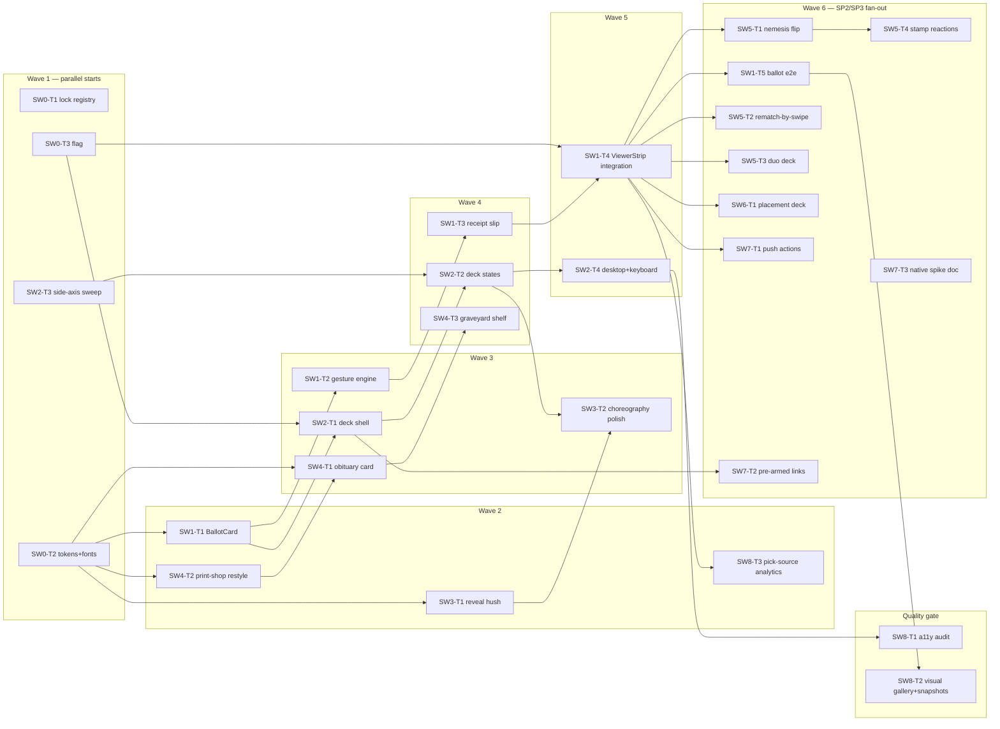

# Swipe UX plan — implementing "Swipe on Tomorrow" (SW workstreams)

**Rev:** 1 · **Date:** Jul 19, 2026 · **Status:** approved direction, ready to claim
**Mock:** `docs/mockups/swipe-ux.html` (published: https://claude.ai/code/artifact/c727f28d-65f9-4339-8f6f-ada866424da9)
**Parent specs:** `receipts-design-doc.md` (esp. §6.2, §9.2–9.3, §10, §4.6, §19.4), `receipts-prd.md` §8, `receipts-principles.md`.

This document is written like design-doc §19: **a task is implementable from its own
row plus the §1–§2 shared context here and the design-doc sections it lists.** Read
§1–§2, then your task. Follow §0.2 of the design doc for all workflow rules (branch
naming `feat/<task-id>-<slug>`, one task per PR, `pnpm verify`, contract-change PRs
for `packages/core`). Claim tasks through `scripts/workstream-lock.mjs` once SW0-T1
has registered them.

---

## 1. Decision record (locked — do not re-litigate per task)

Decisions gathered from the product owner on the mock's open questions:

| # | Decision | Ruling |
|---|---|---|
| D-SW1 | Color direction | **A1 "Ticket Noir, louder"** in-app: every existing token kept verbatim; add gold accent, side-glow states, deeper card shadows. **A3 "Print Shop"** light-paper palette for share cards / OG images only. A2 rejected. |
| D-SW2 | Display type | **Barlow Condensed** 500/700 for question headlines, stamps, display chrome. IBM Plex Mono numerals and Inter body unchanged. |
| D-SW3 | Product name | **Rename deferred.** Everything stays name-agnostic behind `PRODUCT_NAME` (`packages/core/src/config.ts`). No task may hardcode "Gambappe", "Receipts", or any candidate name in user-facing strings, template art, or file names. |
| D-SW4 | Home IA | **Full-screen deck.** On `/`, the ballot is the page on mobile (stage fills viewport); desktop centers the deck with keyboard hints. |
| D-SW5 | Sound | **No sound at all.** No audio assets, no audio tasks, no `<audio>`/WebAudio code anywhere. Haptics (`navigator.vibrate`, no-op where unsupported) are the only non-visual channel. |
| D-SW6 | Loser tone | **Full obituary.** Death-metaphor busted-streak artifact (dates, "survived", cause of death), profile graveyard shelf, "Bury it / Share the obituary" actions. Deadpan-affectionate; never mocks the user; no gore, no real-death references. |
| D-SW7 | Gesture guardrails | **Fade with experience.** Idle nudge once per session until the profile's first-ever throw; side rails full-strength for the first 5 picks then 40% opacity; hint arrows hidden after 5 picks; **tap wells always visible, permanently** (a11y is not a tutorial). |
| D-SW8 | Scope | **Full vision, one phased DAG.** Phases SP1 (core loop) → SP2 (modes) → SP3 (notifications). Lanes parallelize per §3. |
| D-SW9 | **The side axis rule** (owner mandate) | **The negative side lives on the left; the affirmative side lives on the right — everywhere, always.** Swiping left = against, and every paired yes/no UI places the against-control on the left so gesture and button agree. Normative detail in §2.2. |

**Adopted defaults** (from the mock, uncontested — treat as decided): four-ink stamp
system with gold foil reserved for called-it (§2.7); venue-word side labels
(`yes_label`/`no_label`) over bare YES/NO; rematch-by-swipe; placement as a swipe deck;
preset-only stamp reactions for nemesis trash talk; the under-card "tomorrow peek";
crowd hidden while open (§9.3 of the design doc — already law); undo stays 60s (§10.3).

**Mock errata** — three places the mock itself violates D-SW9; implement the rule, not
the pixels: (1) the ballot card's price row shows YES left — flip; (2) `CrowdBar`
renders the YES segment left — flip; (3) the §07 mini-cards likewise. The rails,
wells, hints, notification actions, and widget buttons in the mock already comply.

---

## 2. Design spec (the buildable detail)

### 2.1 Tokens & fonts

`packages/ui/src/tokens.ts` — **add** (never change existing values):

```ts
export const colors = {
  /* …existing eight tokens verbatim… */
  gold: '#FFC53D',        // streaks, called-it, ritual accents ONLY (§2.7 scarcity rule)
} as const;

export const glows = {   // the world-tint / rail gradients (D-SW1)
  sideA: 'rgba(59,130,246,0.42)',   // derived from sideA
  sideB: 'rgba(249,115,22,0.42)',   // derived from sideB
} as const;

export const motion = {  // ms — single source for CSS + JS (see §2.3 constants)
  armFlare: 120, fling: 300, snap: 400, print: 420, stamp: 450,
} as const;

export const cardShades = {
  deckShadow: '0 14px 34px rgba(0,0,0,0.5)',
  printShadow: '0 -10px 30px rgba(0,0,0,0.5)',
} as const;

export const fonts = {
  ui: 'Inter, system-ui, sans-serif',
  mono: '"IBM Plex Mono", ui-monospace, monospace',
  display: '"Barlow Condensed", "Arial Narrow", system-ui, sans-serif',  // NEW
} as const;
```

Tailwind (`packages/ui/tailwind.config.ts`): expose `gold`, `font-display`, and the
motion values as `transitionDuration`/`animationDuration` extensions. Web fonts load
via `next/font/google` in `apps/web/app/layout.tsx`: Barlow Condensed 500+700, IBM
Plex Mono 400+600, Inter variable — all `display: 'swap'`, subsets `['latin']`, wired
to CSS variables consumed by the Tailwind families. The satori renderer
(`apps/web/lib/og/render.tsx`) loads the same Barlow Condensed files for card
templates.

**A3 Print-Shop palette** (share cards / OG only; lives beside the OG templates, not
in `tokens.ts` — it is a card-stock, not an app theme):

```ts
export const printShop = {
  ground: '#EFEBDD', paper: '#FBF9F1', ink: '#1A1A1A', muted: '#8A8578',
  sideA: '#2456C9', sideB: '#D64B12',   // rubber-stamp blue / vermilion
  win: '#1D8A6B', loss: '#C22B49', gold: '#B8860B',
} as const;
```

### 2.2 The side axis rule (normative)

**Axis:** in every horizontally paired yes/no UI, the **NO/against element occupies
the left position and the YES/for element the right position.** "Left/right" are
*visual* (physical gesture space), not logical/RTL order — containers that lay out an
axis pair set `dir="ltr"` so RTL locales don't mirror the gesture semantics.

Applies to: swipe directions; tap wells; `PickButtons` order; the ballot card's price
row; `CrowdBar` segments (NO fills from the left edge, YES from the right); rail
labels and hint arrows; notification action buttons; widget buttons; keyboard mapping
(`←` = no, `→` = yes); the reveal crowd bar; OG/card templates that show a side pair.

Does **not** apply to person-axis pairs (you vs. nemesis, partner vs. partner) — those
are not yes/no pairs. Win/loss result displays are single-valued, not pairs.

Enforcement: `packages/ui/src/side-axis.ts` exports
`export const SIDE_ORDER = ['no', 'yes'] as const;` plus
`export function sideAxisPair<T>(no: T, yes: T): [T, T] { return [no, yes]; }` —
components render axis pairs by mapping over these, and unit tests assert DOM order
(first axis child carries `data-side="no"`). Reviewers treat a hand-ordered axis pair
as a correctness bug.

### 2.3 `SwipeBallot` — the gesture engine

`apps/web/components/SwipeBallot.tsx` (`'use client'`), no gesture library. Constants
in `packages/ui/src/swipe.ts` (presentation constants — **not** `packages/core`; no
contract-change PR needed):

| Constant | Value | Meaning |
|---|---|---|
| `COMMIT_THRESHOLD_RATIO` | `0.36` | commit at 36% of card width of horizontal drag |
| `MAX_TILT_DEG` | `12` | rotation clamp |
| `TILT_DEG_PER_PX` | `0.09` | rotation = clamp(dx × this) |
| `DRAG_Y_FACTOR` | `0.25` | vertical follow is damped |
| `STAMP_SCALE_FROM` | `1.4` | preview scales 1.4 → 1.0 as progress → 1 |
| `SNAP_MS` / `SNAP_EASE` | `400` / `cubic-bezier(.28,1.6,.5,1)` | early-release spring back |
| `FLING_MS` / `FLING_EASE` | `300` / `cubic-bezier(.3,.6,.4,1)` | commit exit |
| `PRINT_MS` / `PRINT_EASE` | `420` / `cubic-bezier(.22,1,.36,1)` | receipt print (§2.4) |
| `HAPTIC_ARM` / `HAPTIC_COMMIT` / `HAPTIC_UNDO` | `8` / `[12,40,18]` / `6` | `navigator.vibrate` args |
| `NUDGE_IDLE_MS` / `NUDGE_ANIM` | `3800` / `2.6s ease-in-out ×2` | §2.8 |
| `LEARNED_PICKS` | `5` | §2.8 rails/hints fade threshold |

**Interaction contract** (Pointer Events; card element has `touch-action: none`,
`user-select: none`):

1. `pointerdown` on the card: capture pointer; kill nudge; state → `dragging`.
2. `pointermove`: `transform: translate(dx, dy×0.25) rotate(clamp)`; progress
   `p = |dx| / (width × 0.36)`; stamp preview (`{SIDE_LABEL} @ {price}¢`, side = `dx>0
   ? yes : no`, price = the live price of that side at this render) opacity `min(1,p)`,
   scale `1.4 − 0.4×min(1,p)`; world-tint overlay opacity `0.85×min(1,p)` on the
   matching side only; far rail dims to 35%.
3. Crossing `p ≥ 1`: fire `HAPTIC_ARM` once; rail flare 120ms; state → `armed`.
   Dropping back below 1 disarms (no haptic).
4. `pointerup` with `p < 1`: spring back (`SNAP_MS`), clear tint/preview. **No pick.**
5. `pointerup` with `p ≥ 1`: **commit** — the client calls `onPick(side, ageAttested)`
   immediately (the *server* stamps the entry price at receipt, §6.2 of the design
   doc; the animation must never delay the POST). Card flings off (`FLING_MS`,
   `translate(±140%, −8%) rotate(±26°)`), `HAPTIC_COMMIT`, then the receipt prints
   (§2.4). On API error: receipt retracts if shown, card returns via `SNAP_MS`, error
   renders in the existing `viewer-strip-error` slot, state → idle.
6. **Age gate** (first pick, `ageGateRequired`): at release-past-threshold the card
   does NOT fling — it freezes at the threshold offset, and the attest line prints
   along the card's bottom edge inside the card:
   `copy.question.ageGatePrompt` + two mono links `[confirm — I'm 18+]`
   `[cancel]` (axis order: cancel left, confirm right; both ≥44px targets,
   focusable). Confirm → commit path with `ageAttested=true`. Cancel/`Esc` → spring
   back. Reuses existing `age-gate`, `age-gate-confirm`, `age-gate-cancel` testids.
7. **Fallback paths, always present:** tap wells under the stage (§2.5) call the same
   `onPick`; with the card focused, `←`/`→` trigger the well path; `u`/`Esc` maps to
   undo while the undo window is open. Wells are real `<button>`s and keep the
   existing `pick-no` / `pick-yes` testids (note the flipped DOM order per §2.2).
8. **Reduced motion** (`prefersReducedMotion()` from `@receipts/ui`): no nudge, no
   fling, no spring, no print animation — states swap instantly (opacity-only, ≤150ms
   fades allowed); drag still works but the card does not translate — instead the two
   rails act as press targets and the stamp preview appears statically at 60% drag.
   Simpler rule for implementers: when reduced motion is on, render `PickButtons`
   behavior with ballot visuals — zero transforms.
9. **A11y:** the card is `role="group"`, `tabindex=0`,
   `aria-label` = `"{headline}. Press right arrow to pick {yes_label}, left arrow to
   pick {no_label}."`; receipt container is `aria-live="polite"`; every interactive
   element keyboard-reachable; WCAG AA contrast on all new colors (gold on ink
   passes; gold on paper needs the darkened `#B8860B` print variant).

**Props contract** (supersedes `PickButtonsProps`, same semantics):

```ts
interface SwipeBallotProps {
  question: QuestionPublic;          // headline, labels, prices, slug, status
  ageGateRequired: boolean;
  disabled?: boolean;                // busy state: card ignores input, wells disabled
  pick: CachedPick | null;           // non-null → receipt state (§2.4)
  undoable: boolean;
  onPick(side: MarketSide, ageAttested: boolean): void;
  onUndo(): void;
}
```

### 2.4 `ReceiptSlip`

Part of the ballot (rendered by `SwipeBallot` when `pick != null`). Paper slip,
`TicketCard`-style perforation rows, printed content top-to-bottom:

```
RECEIPT — {handle}                    {HH:MM:SS ET}
[STAMP {SIDE_LABEL} @ {entry}¢]      undo · {n}s        ← mono underlined link
─ perforation ─
CROWD HIDDEN UNTIL LOCK · {lock ET}          {№ slug}
```

Prints upward from the stage's bottom edge (`translateY(112%) → 0`, `PRINT_MS`).
Undo link: visible while `undoable` (ViewerStrip's existing `canUndo` drives it, 60s
per §10.3); click → `HAPTIC_UNDO`, slip retracts (300ms), card returns to hand
(`SNAP_MS` enter), cache cleared by the existing `handleUndo`. Keeps testid
`undo-pick`. After expiry the link renders as static `locked ✓` (no control). Entry
price and timestamp come from the POST response (`pick.picked_at`, price echoed by
the API) — never from client clocks or client-observed prices.

### 2.5 The full-screen deck (home `/` and `/q/[slug]`)

Layout (mobile-first; flag `swipe_ballot` ON):

```
┌──────────────────────────────┐
│ topbar: date chip ·· streak  │  h-11, mono; streak flame chrome (always)
│ ┌─┐ stage                ┌─┐ │  stage = flex-1, position:relative
│ │N│   [under-card]       │Y│ │  rails: 26px gutters, glow gradients,
│ │O│   [BALLOT CARD]      │E│ │  vertical labels "← NO" / "YES →" in
│ │←│                      │S→│ │  side colors (venue words when short)
│ └─┘  ← hint ·· hint →    └─┘ │  hints: mono 11px inside stage bottom
│ wells: [✕ {no}]  [{yes} ✓]  │  h-12, always visible (D-SW7)
└──────────────────────────────┘
```

- Mobile (`<768px`): the stage fills `100dvh` minus topbar/wells/footer notice;
  page does not scroll while a question is `open`.
- Desktop: deck column max-width 420px centered vertically; keyboard hint line
  `← {no_label} · {yes_label} →` under the wells; drag works with mouse.
- **INV-10 split** (unchanged law): the stage, rails, under-card, and a *static*
  `BallotCard` render in the server shell (`QuestionStateView` v2) — viewer-free,
  byte-identical for all visitors, no cookies read. `ViewerStrip` hydrates the
  interactive `SwipeBallot` into a reserved absolutely-positioned slot over the
  static card (identical dimensions → no layout shift), marking the static card
  `aria-hidden` + `inert` on mount. The dual-render proof test extends to the v2
  shell.
- **Under-card:** tomorrow's `scheduled` question when published (headline hidden —
  shows only "TOMORROW · opens 9:00 ET"), else a blank slip. Never interactive.
- **States** map to §10.3 exactly: `scheduled` → deck shows countdown card (no
  rails/wells); `open` → ballot; after pick → receipt over stage (§2.4); `locked` →
  crowd bar (axis-flipped) + "you vs. crowd" line + reveal countdown in the stage;
  `revealed` → reveal v2 (§2.6) in the stage, thread below (page may scroll);
  `voided` → VOID punch-stamp card + explainer.
- Flag OFF renders today's build byte-identically (no dead chrome).

### 2.6 Reveal v2 (in-stage)

Keeps `RevealSequence`'s beats, order, and constants (stamp-slam 450ms → crowd fill
600ms → result flip 350ms → count-up 500ms; stagger 650ms). Additions:

- **F1 hush** (client-side, T−10s by local countdown): price ticker line freezes with
  a `FROZEN` gold chip; stage dims 8%; room count (`{n} in the room`) renders from a
  new lightweight field already derivable from the reveal/percentile cache — display
  is approximate by design ("drama, not accounting"); if unavailable, the hush shows
  without a count. No new endpoints; ride the existing 30s poll + jittered reveal
  fetch (§10.2).
- Crowd bar: axis-flipped (§2.2), fills NO-from-left / YES-from-right
  (`crowd-fill` keyframe gains a right-anchored variant).
- Result stamps: `WIN`/`LOSS` rubber inks; `CALLED IT` uses the gold-foil stamp
  (§2.7) — the only gold motion in the product.
- Obituary handoff: the sequence's final beat swaps the share affordance for the
  obituary card (§2.7) when a dead run is being mourned. **AMENDED** — the original
  trigger phrasing here ("when `viewer.streak` broke this reveal") is unimplementable:
  the §6.6 participation streak breaks by absence, never at a participated reveal.
  Authoritative semantics + tasks: `docs/plans/obituary-handoff.md` (SW9).
- No sound (D-SW5). Reduced motion: instant static layout, as today.

### 2.7 Stamps, gold scarcity, obituary, Print-Shop cards

**Four inks** (extend `Stamp`): `rubber` (existing WIN/LOSS/outcome), `foil` (gold
gradient — **only** `CALLED IT` and season-trophy moments), `tape` (mono label strip —
`STREAK FROZEN`, admin states), `punch` (outlined — `VOID`). Rotation −7° always;
`stamp-slam` 450ms; a stamp never animates twice in one view.

**Obituary card** (D-SW6). Variant of the busted-streak artifact (design doc §10.5
already mandates loss-parity; this styles it):

```
OBITUARY · STREAK                              № {slug}
Here lies a {n}-day streak.
b. {start date} — d. {end date}
Survived: {2–3 data facts: longest-odds hit, freezes used, hardest day}
Died holding {SIDE_LABEL} @ {entry}¢.
[BUSTED]                                    RIP {n}
```

Copy is data-generated from the pick log (P1: no user-authored text). Actions:
`Bury it` (left; archives to the profile graveyard shelf) / `Share the obituary`
(right; ShareSheet with the `busted-streak` card). The graveyard shelf on `/p/[handle]`
lists `RIP {n}` chips beside trophies. Tone rules: affectionate deadpan; the streak
dies, never the user; no imagery beyond the existing candle glyph; no real-world death
references in generated facts.

**Print-Shop templates:** all share/OG card templates (`question`, `result`,
`receipt` incl. `loss`/`busted-streak`, `matchup`, `profile`, `duo`) re-render on the
§2.1 `printShop` palette with Barlow Condensed headlines and mono numerals; QR + URL
strip unchanged (P9). Axis pairs in templates flip per §2.2. In-app dark surfaces do
NOT change (D-SW1: cards are the light face; the app is the dark room).

### 2.8 Guardrail logic (D-SW7)

Local, per-device, no API:

- `localStorage rcpt_thrown = '1'` — set on first-ever successful commit (any path).
- `sessionStorage rcpt_nudged = '1'` — set when a nudge plays.
- Nudge plays iff: question `open`, no drag yet, `!rcpt_thrown`, `!rcpt_nudged`,
  after `NUDGE_IDLE_MS`. One play per session, ever-silent after first throw.
- `localStorage rcpt_picks = <count>` — incremented per successful commit;
  at `>= LEARNED_PICKS (5)`: rails render at 40% opacity, hint arrows unmount.
  (Local count is deliberately approximate across devices; fine.)
- Wells: never hidden, never faded (a11y is permanent).

### 2.9 Nemesis & duo card states (SP2)

Both features are additive card states on existing mode surfaces; both respect their
feature flags (`nemesis`, `duo_queue`) and every sealed-information rule already in
the design doc (opponent/partner picks unseal only after *your* lock — never render,
fetch, or cache the other side's pick before the viewer's own pick exists).

- **Nemesis daily flip:** after the viewer's pick lands during an active nemesis week,
  the receipt slip gains a second section (dashed separator): opponent handle, their
  stamp (`{SIDE} @ {price}¢`), one engine-narrated line (from the existing narration
  system, §13.3 — copy via `copy.ts`), and the week tally (`SHE LEADS 2–1`).
- **Stamp reactions** (trash talk): preset-only set `SWEATING?` · `LUCKY` · `CALLED
  IT` · `RESPECT`, rendered as rotated stamp chips on the matchup page; one reaction
  per player per day; block/report unaffected. No free text (P1).
- **Rematch-by-swipe:** the Friday verdict card is itself a ballot —
  left = `NEW FATE` (engine deals a new nemesis), right = `RUN IT BACK` (rematch
  request, mutual-consent per PRD §4.2). Axis rule: the *affirmative* (rematch) is
  right. Wells mirror it. Uses `SwipeBallot` with a `variant="verdict"` that skips
  price/stamp chrome.
- **Duo shared deck:** during an active duo series the ballot's footer shows the
  partner chip — `▣ {partner} LOCKED · {n}h AGO` (sealed) before your pick; after
  your pick the receipt gains the tandem line: both stamps + `MATCHED` /
  `SPLIT — one of you is wrong` in gold mono. Chemistry math is untouched (engine
  owns it); this is presentation only.

### 2.10 Placement deck (SP2)

`/placement` reuses `SwipeBallot` over the existing placement items: a deck of 5
archival cards, top-left eyebrow `IT'S {month year} — CALL IT`, progress dots 1–5,
same gesture/wells/keyboard, no undo (placement picks are instant), fingerprint
teaser bars fill between cards (client-only flourish from the existing placement
response data). Completion hands off to the existing claim/nemesis-eligibility flow
untouched.

### 2.11 Notifications layer (SP3)

Honest platform scope (mock §03 truth table is the contract):

- **Web push actions** (flag `web_push`): the daily-open push carries two actions,
  axis-ordered `[✕ {no_label}] [{yes_label} ✓]`. The service worker handles
  `notificationclick` action events by POSTing the existing pick endpoint with the
  session cookie; success → confirmation notification with the printed-receipt line;
  failure/no-identity → deep link. Android/desktop Chrome only; iOS Safari web push
  gets no actions — its notification body ends with "tap to pick" and deep-links.
- **Pre-armed deep links:** any notification/unfurl URL may carry `?arm=1`; the deck
  mounts with rails at full strength and a single nudge regardless of guardrail
  counters (never auto-picks anything).
- **Native wrapper (Live Activity / widget / watch):** explicitly out of scope for
  the DAG; SW7-T3 delivers a written feasibility spike only (App Intents widget +
  Live Activity design mapped to the mock, cost estimate, no code).

### 2.12 Copy additions

All new strings live in `apps/web/lib/copy.ts` (single file, §10.6), money-word lint
(WS14-T3) applies, pinned strings untouched, everything references `PRODUCT_NAME` —
never a literal name (D-SW3). New families: `ballotCopy` (rail/hint/arm labels, age
gate line), `receiptCopy` (slip lines, undo states), `obituaryCopy` (templates with
`{n}`, `{dates}`, `{facts}`, `{side}@{price}` slots), `hushCopy`, `reactionStamps`
(the four presets), `placementCopy`, `pushCopy`.

### 2.13 Invariants restated (every task inherits these ACs)

1. **Zero engine/API changes.** A throw emits the existing `POST /api/v1/picks`;
   undo the existing `DELETE`. The only `packages/core` change in the whole plan is
   the `swipe_ballot` flag default (contract-change PR, SW0-T3).
2. **INV-10 holds:** server HTML on public pages stays viewer-free and byte-identical;
   the dual-render proof test must pass on the v2 shell.
3. **Flag-off is today's product,** byte-identical (INV-10 test run with flag off in
   CI for both states).
4. **Reduced-motion parity** for every animation added (§2.3.8).
5. **Side axis rule** (§2.2) on every touched surface; `dir="ltr"` on axis rows.
6. **No sound** (D-SW5). **No money words** (INV-8). **18+ gate** behavior preserved.
7. Existing `data-testid`s preserved wherever the same affordance survives
   (`pick-yes`, `pick-no`, `undo-pick`, `age-gate*`, `viewer-strip-*`,
   `question-state-*`, `reveal-*`).

---

## 3. Task DAG

### 3.1 Reading a task

Format mirrors design-doc §19.1: **ID · Title · Phase · Depends on · Spec · 
Deliverables · AC.** Phases: `SP1` core loop · `SP2` modes · `SP3` notifications ·
`SPQ` quality gate. A task is claimable when its dependencies are merged (claim via
`workstream-lock.mjs` once SW0-T1 lands). "Mock-start OK" = may start against the
constants/contracts in §2 before the dependency merges, but merges after it.
Every task additionally inherits §2.13.

### 3.2 The graph



Wave 1 has four independent starts; after SW1-T4 merges, seven SP2/SP3 tasks
parallelize at once. Max useful agent count ≈ 7.

### 3.3 Tasks

#### SW0 — Foundation

**SW0-T1 · Register SW tasks in the lock registry · SP1 · Depends: —**
Spec: `docs/workstream-locks.md`, `scripts/workstream-lock.mjs`.
Deliverables: an `add-tasks` subcommand for `workstream-lock.mjs` (reads a JSON file
of `{id: {title, depends_on[], phase}}`, merges into the registry with status
`available`, refuses to overwrite existing IDs; same fetch-edit-push-retry pattern as
existing mutations); `docs/swipe-ux-tasks.seed.json` containing every task in this
§3.3; run it.
AC: `list-ready` shows exactly the Wave-1 SW tasks as claimable; re-running the
command is a no-op with a clear message; existing WS task states untouched; unit test
for the merge/no-overwrite logic (the script already has a test pattern — follow it).

**SW0-T2 · Tokens, fonts, glow/motion scale · SP1 · Depends: —**
Spec: §2.1.
Deliverables: `tokens.ts` additions; tailwind config exposure; `next/font` wiring in
`layout.tsx` (Barlow Condensed 500/700, Plex Mono 400/600, Inter var, swap, latin);
satori font registration for Barlow Condensed in `lib/og/render.tsx`;
`packages/ui/src/side-axis.ts` (§2.2) and `packages/ui/src/swipe.ts` (§2.3 constants).
AC: existing token values byte-identical; `pnpm verify` green; a `dev/ui` gallery
tile renders `font-display` headline + gold stamp; no layout shift from font swap on
`/` (CLS check in the existing e2e is not exceeded); `side-axis.test.ts` asserts
`SIDE_ORDER` and `sideAxisPair`.

**SW0-T3 · `swipe_ballot` feature flag · SP1 · Depends: — · contract-change**
Spec: design doc §4.6; §2.13.3 here.
Deliverables: `swipe_ballot` (default off) in `core/flags.ts` + the §4.6 table row in
`receipts-design-doc.md` (same PR, labeled `contract-change`).
AC: flag readable server- and client-side the same way existing flags are; off by
default in all envs; doc table updated.

#### SW1 — The ballot

**SW1-T1 · `BallotCard` presentational component · SP1 · Depends: SW0-T2**
Spec: §2.3 (visual anatomy), §2.2, mock §01 rest-state frame.
Deliverables: `packages/ui/src/components/BallotCard.tsx` — pure props-in/DOM-out
(category eyebrow, `№ {slug}`, display-face headline, axis-ordered price row with
side dots, venue + lock footer, perforation rows reusing `TicketCard`'s pattern);
`UnderCard` variant (blank / "TOMORROW" slip). Storybook-style tiles in `/dev/ui`.
AC: pure/presentational (design doc §10.4 rule) so satori templates can share layout;
price row DOM order NO→YES with `data-side` attrs; headline uses `font-display`;
snapshot tests for open/scheduled variants; AA contrast.

**SW1-T2 · Gesture engine · SP1 · Depends: SW1-T1 (Mock-start OK)**
Spec: §2.3 complete; §2.8.
Deliverables: `apps/web/components/SwipeBallot.tsx` implementing the interaction
contract 1–9 (drag/arm/commit/snap, tint, stamp preview, age-gate-in-gesture,
haptics, keyboard, guardrail counters, reduced-motion mode); keyframes
(`card-spring`, `card-fling`, `rail-flare`, `nudge`) in `globals.css` — **rotation
stays on the persistent property; keyframes animate translate/scale only** (see the
existing comment block in `globals.css` for why).
AC: unit tests (vitest + jsdom PointerEvent shims) for: threshold math incl. exactly
36%, arm/disarm haptic firing once, early release = no `onPick`, commit calls
`onPick` before any animation timer, age-gate freeze path emits `ageAttested=true`
only via confirm, `←`/`→` parity with wells, guardrail storage transitions of §2.8;
reduced-motion renders zero `transform`s.

**SW1-T3 · `ReceiptSlip` + undo · SP1 · Depends: SW1-T2**
Spec: §2.4.
Deliverables: `ReceiptSlip` in `SwipeBallot.tsx` (or sibling file), print/retract
animations, undo wiring against the props contract; slip content from
`pick`/response data only.
AC: prints once per pick (never re-animates on re-render); undo click → `onUndo`,
retract, card re-enter; countdown driven by the caller's `undoable`/`nowMs` (no own
timers beyond display); after expiry renders `locked ✓` static; `undo-pick` testid
kept; `aria-live` announces "Receipt printed — {side} at {price}¢".

**SW1-T4 · ViewerStrip integration · SP1 · Depends: SW1-T3, SW0-T3**
Spec: §2.3 props contract, §2.5 INV-10 split; `ViewerStrip.tsx` as-is.
Deliverables: flag-gated branch in `ViewerStrip` — flag on: render `SwipeBallot`
(with `pick`, `undoable`, handlers from the existing `handlePick`/`handleUndo`,
error slot preserved); flag off: current `PickButtons`/receipt branches unchanged.
`PickButtons` itself survives as the wells' implementation core (axis order from
SW2-T3).
AC: with flag off, rendered HTML of `/` and `/q/[slug]` is byte-identical to `main`
(assert in the INV-10 test); with flag on, dual-render proof still passes (server
HTML has no viewer data); `ALREADY_PICKED` 409 recovery path (see
`handlePickError`) reprints the slip from the echoed pick; all §2.13.7 testids alive.

**SW1-T5 · Ballot e2e · SP1 · Depends: SW1-T4**
Spec: §2.3, §2.8; existing `e2e/question-page.spec.ts` patterns.
Deliverables: `e2e/swipe-ballot.spec.ts` (Playwright, flag on): mouse-drag commit
right→YES and left→NO (assert POST body side), early-release no-pick, keyboard-only
pick, wells pick, age-gate first-pick flow, undo within window, guardrail fade after
5 seeded picks, reduced-motion run (`page.emulateMedia`).
AC: suite green in CI both flag states (off state runs the existing spec).

#### SW2 — The stage

**SW2-T1 · Full-screen deck shell · SP1 · Depends: SW1-T1, SW0-T3 (Mock-start OK)**
Spec: §2.5 layout + INV-10 split.
Deliverables: `QuestionStateView` v2 branch behind the flag: stage/rails/under-card/
static `BallotCard`/reserved overlay slot; topbar (date chip, streak flame chrome
placeholder fed by the island); wells row (`PickButtons` restyled as wells); mobile
`100dvh` handling incl. iOS toolbar quirks (`dvh` with `svh` fallback).
AC: server shell stays viewer-free (type-level: no viewer field can flow — keep the
existing structural guarantee); no hydration layout shift (reserved slot dims equal
static card); flag off byte-identical; axis order on rails/wells/hints; footer 18+
notice still present (INV-9).

**SW2-T2 · Deck states · SP1 · Depends: SW2-T1, SW2-T3**
Spec: §2.5 states list; design doc §10.3 table.
Deliverables: `scheduled`/`locked`/`revealed`/`voided` stage presentations (countdown
card; crowd bar + "you vs. crowd" + reveal countdown; reveal slot; VOID punch card);
under-card "tomorrow" data plumbed from the existing archive/next-question source if
present, else blank slip (SPEC-GAP note if the source is missing).
AC: each `question-state-*` testid renders in the stage; §9.3 crowd-hidden-while-open
holds (no crowd data in any `open` render); locked crowd bar is axis-flipped;
countdown math via the existing server-offset pattern (no raw `Date.now()` drift).

**SW2-T3 · Side-axis sweep (flag-independent) · SP1 · Depends: — (Wave 1)**
Spec: §2.2 + D-SW9. **Applies to the CURRENT ui too — this is a correctness fix, not
part of the flag.**
Deliverables: flip `PickButtons` DOM order (NO first); flip `QuestionStateView`
`PriceTag` pair; flip `CrowdBar` segment order + right-anchored fill variant + all
call sites; flip axis pairs in OG/card templates (`lib/og/templates.tsx` etc.);
`dir="ltr"` on axis rows; migrate all of these to render via `sideAxisPair`.
AC: unit tests assert first axis child is `data-side="no"` in every touched
component; e2e updated (`pick-no` now left — selectors are testid-based so behavior
tests pass unchanged); OG snapshot fixtures regenerated; a grep-style test (mirror
the money-word lint pattern) fails on any new hand-ordered `['yes', 'no']` axis
array in JSX.

**SW2-T4 · Desktop + keyboard layer · SP1 · Depends: SW2-T2, SW1-T4**
Spec: §2.5 desktop; §2.3.7.
Deliverables: centered deck ≥768px, keyboard hint line, focus order audit
(topbar → card → wells → footer), `arm=1` param plumbing (consumed further in SW7-T2).
AC: keyboard-only pick e2e on desktop viewport; hint line hidden on touch devices
(`pointer: coarse`); no horizontal scroll at 320px width.

#### SW3 — Reveal v2

**SW3-T1 · The hush + room count · SP1 · Depends: SW0-T2 (Mock-start OK)**
Spec: §2.6.
Deliverables: pre-reveal hush in `RevealSequence`/stage (T−10s freeze chip, 8% dim,
optional room count from existing cached data; absent → hushes without count).
AC: no new endpoints; hush skipped entirely under reduced motion; fires at most once
(guard like the existing `play` flag); unit test on the T−10s trigger math using the
server-offset clock.

**SW3-T2 · Choreography polish + gold foil · SP1 · Depends: SW3-T1, SW2-T2, SW1-T1**
Spec: §2.6, §2.7 stamps.
Deliverables: `Stamp` gains `foil`/`tape`/`punch` variants (CSS only); `CALLED IT`
switches to foil; reveal beats re-timed only if needed to slot the hush (existing
constants stay unless a measured overlap forces ±100ms, documented in the PR);
obituary handoff hook (renders SW4-T1's card when streak broke, behind its
availability — degrade to today's busted-streak share if SW4-T1 unmerged).
AC: stamp variants in `/dev/ui` gallery; foil used nowhere except called-it (grep
test); reveal e2e still ≤2.6s to interactive share; reduced-motion static parity.
*(Shipped in PR #75 with the handoff descoped — its "when streak broke" trigger is
unimplementable against §6.6 semantics. The handoff is re-scoped as SW9: see
`docs/plans/obituary-handoff.md`.)*

#### SW4 — Artifacts

**SW4-T2 · Print-Shop restyle of card templates · SP1 · Depends: SW0-T2**
Spec: §2.1 printShop, §2.7; design doc §10.5 (dimensions, caching, hash guard —
unchanged).
Deliverables: `lib/og/print-shop.ts` palette; restyle all existing OG/card templates
onto it (Barlow Condensed headlines via satori fonts, mono numerals, paper ground,
rubber-stamp side colors, QR/URL strip untouched); axis flips per §2.2.
AC: all templates still 1200×630 / 1080×1920 / 1080×1080; content-hash caching and
`?v=` guard untouched; visual fixtures regenerated and committed; AA contrast on
paper (use `printShop` darkened accents, not app tokens); no `PRODUCT_NAME` literal
in template art (D-SW3 — the constant renders, the string never hardcodes).

**SW4-T1 · Obituary card + template · SP1 · Depends: SW4-T2**
Spec: §2.7 obituary block (layout, copy slots, tone rules).
Deliverables: in-app obituary card component (paper2 stock, BUSTED rubber stamp,
`Bury it`/`Share the obituary` axis-ordered actions); `busted-streak` card/OG
template upgraded to the obituary layout; `obituaryCopy` templates (data-slot
functions, no free text).
AC: renders only when previous streak ≥ 3 broke at this reveal (threshold in
`swipe.ts` as `OBITUARY_MIN_STREAK = 3`); "survived" facts derived exclusively from
the viewer's pick log fields already returned by the reveal payload (SPEC-GAP note
for any missing fact, degrade by omitting the line); share path reuses ShareSheet
`kind="receipt"` with the busted variant; money-word lint passes.

**SW4-T3 · Graveyard shelf · SP2 · Depends: SW4-T1**
Spec: §2.7; `/p/[handle]` (design doc §10.1 profile polish priority).
Deliverables: profile section listing broken streaks as `RIP {n}` chips (data from
the existing profile picks/streak history endpoint) beside `CALLED IT ×{n}`; empty
state (`No funerals yet.`).
AC: public page stays ISR-cacheable (no viewer data); chips link to the day's
question page; renders nothing (not an empty box) when history is empty and streak
history is unavailable.

#### SW5 — Modes (SP2; every task respects `nemesis`/`duo_queue` flags)

**SW5-T1 · Nemesis daily flip · SP2 · Depends: SW1-T4**
Spec: §2.9; existing `components/nemesis/*`, matchup data shapes.
Deliverables: receipt-slip second section during an active nemesis week (opponent
stamp + narration line + tally), fed by the existing matchup endpoint **called only
after the viewer's pick exists**.
AC: network log in the e2e proves no opponent-pick fetch before viewer pick; sealed
copy (`{name} · unsealed when you locked`); renders nothing when no active week;
flag off → untouched slip.

**SW5-T2 · Verdict cards + rematch-by-swipe · SP2 · Depends: SW1-T4**
Spec: §2.9; existing `RematchPanel`, `NemesisScoreboard`.
Deliverables: winner/loser verdict cards (loser card gets the richer copy, P3);
`SwipeBallot variant="verdict"` (no price row/stamp preview; stamps `NEW FATE` /
`RUN IT BACK`) wired to the existing rematch request/decline actions; wells mirror.
AC: right swipe = rematch request (affirmative-right per D-SW9); both cards share a
template with variant props; existing rematch e2e passes with the new UI; loser card
copy has at least one data-derived line (edge diff or streak-of-weeks).

**SW5-T3 · Duo shared deck states · SP2 · Depends: SW1-T4**
Spec: §2.9; existing `components/duo/*`.
Deliverables: sealed partner chip on the ballot footer during a series; tandem line
(both stamps + MATCHED/SPLIT) on the receipt after the viewer's pick.
AC: same sealed-fetch proof as SW5-T1 for partner picks; SPLIT renders in gold mono;
chemistry/ladder UI untouched; flags off → untouched.

**SW5-T4 · Stamp reactions · SP2 · Depends: SW5-T1**
Spec: §2.9; thread/reaction plumbing from WS7-T8.
Deliverables: the four preset stamps on matchup pages, one per player per day, using
the existing reactions API if it fits (SPEC-GAP + smallest additive migration if a
new reaction kind is needed — never a `packages/core` change without the
contract-change label).
AC: preset-only (no input field anywhere); ghosts see but can't send (claim prompt
per §11.3 triggers); block/report severs delivery both ways.

#### SW6 — Placement (SP2)

**SW6-T1 · Placement deck · SP2 · Depends: SW1-T4**
Spec: §2.10; existing `app/placement/*`, `e2e/placement.spec.ts`.
Deliverables: `PlacementClient` rebuilt on `SwipeBallot` (deck of 5, time-travel
eyebrow, progress dots, no undo, fingerprint teaser bars).
AC: placement submission payloads unchanged; completion routes to the same claim
offer; e2e updated to drag-based flow plus a keyboard-only run; reduced-motion run.

#### SW7 — Notifications (SP3; flag `web_push`)

**SW7-T1 · Web-push pick actions · SP3 · Depends: SW1-T4**
Spec: §2.11; design doc §13.2 (push plumbing).
Deliverables: service-worker `notificationclick` action handling (axis-ordered
actions `[✕ {no_label}] [{yes_label} ✓]`), POST via existing pick endpoint with
credentials, success/failure follow-up notifications, iOS-Safari no-actions fallback
copy.
AC: action POST carries no client-side price (server stamps, as always); unauthed
click deep-links to `/?arm=1`; double-click idempotent via the 409 recovery
semantics; works on Android Chrome + desktop Chrome (playwright SW test or documented
manual matrix if SW testing infra is absent — then add a SPEC-GAP note).

**SW7-T2 · Pre-armed deep links · SP3 · Depends: SW2-T1**
Spec: §2.11.
Deliverables: `?arm=1` handling (full rails + single nudge regardless of counters;
never auto-picks; strips itself from the URL after mount).
AC: unit test on guardrail override; share/OG URLs never carry `arm` (only
notification-minted links do).

**SW7-T3 · Native surface spike (doc only) · SP3 · Depends: —**
Spec: §2.11; mock §03 truth table.
Deliverables: `docs/plans/native-surfaces-spike.md` — iOS notification actions,
interactive widget (App Intents), Live Activity/Dynamic Island reveal, watch actions:
each mapped to the mock frame, with API constraints, wrapper options (Capacitor vs.
native shell), and a cost estimate. No code.
AC: every claim cites current platform documentation; ends with a go/no-go
recommendation and a proposed task list for a future plan rev.

#### SW8 — Quality gate (SPQ)

**SW8-T1 · A11y audit · SPQ · Depends: SW2-T4**
Deliverables: axe pass over `/`, `/q/[slug]`, `/placement` (flag on) wired into e2e;
keyboard matrix doc (`docs/runbooks/` style) covering every §2.3.7 path; contrast
report for gold/foil on both stocks.
AC: zero serious/critical axe violations; every interactive element reachable and
operable without pointer; screen-reader labels verified for card/receipt/age-gate.

**SW8-T2 · Visual gallery + snapshots · SPQ · Depends: SW1-T5**
Deliverables: `/dev/ui` tiles for every new component/state (ballot rest/drag/armed/
receipt, stamps ×4 inks, obituary, deck states, verdict variant); Playwright
screenshot snapshots of the gallery page.
AC: gallery is the review surface for all future styling PRs (README note); snapshot
diffs gate CI.

**SW8-T3 · Pick-source analytics · SPQ · Depends: SW1-T4**
Spec: design doc §5.6 analytics events (additive property only).
Deliverables: `source` property on the existing pick-placed client event:
`swipe | well | key | push | widget`; dashboard note in the metrics admin page if one
exists (else SPEC-GAP note).
AC: no schema/contract change beyond an additive event property; e2e asserts the
property on a swipe pick and a well pick; powers the PRD §10 activation metric
(>40% of spectator-page visitors take one throw) and a swipe-share-of-picks readout.

### 3.4 Suggested claiming order for a team of N agents

- **N=1:** waves in order, skipping SW7-T3 until idle time.
- **N=4 (sweet spot, SP1):** agent A: SW0-T2 → SW1 lane; agent B: SW0-T3 → SW2 lane;
  agent C: SW2-T3 → SW3 lane; agent D: SW0-T1 → SW4 lane. SP2/SP3 fan out after
  SW1-T4 merges.
- **N=7 (max):** add dedicated agents on SW5/SW6/SW7 lanes at Wave 6.

### 3.5 Definition of done for the plan

All SP1+SPQ tasks `done` in the lock registry; `swipe_ballot` flipped on in staging;
flag-off CI lane still green; the §10.3 state table walkable end-to-end by drag,
keys, and wells; activation instrumentation (SW8-T3) live so the >40% one-throw
target is measurable before the flag ships to prod.
