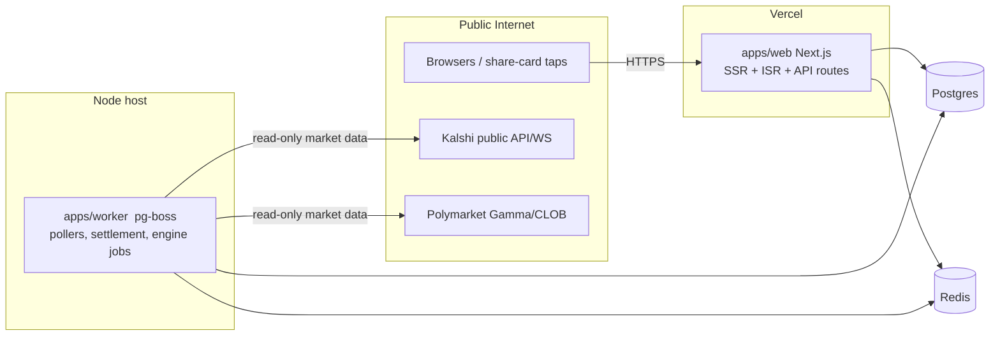
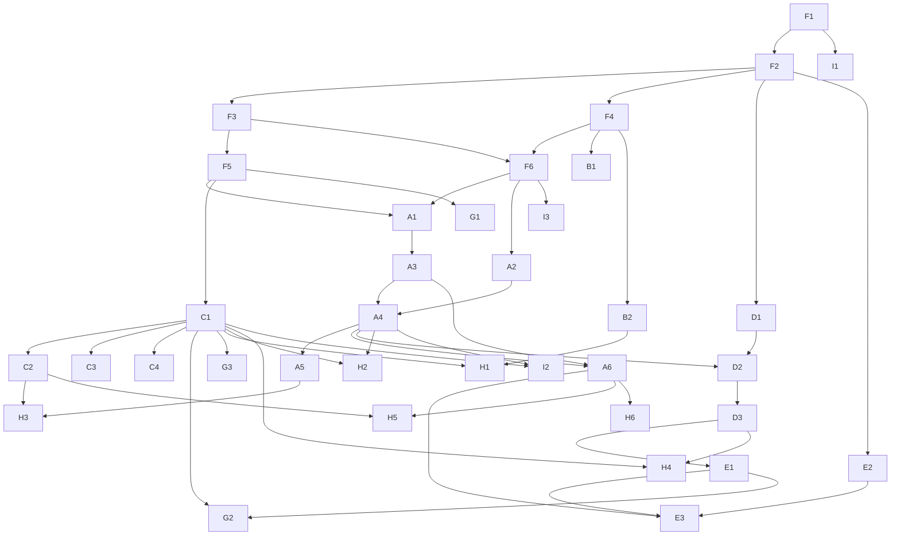

# Receipts — Technical Design Document

**Version:** 1.0 · **Date:** July 18, 2026 · **Status:** Ready for implementation
**Sources of truth:** `receipts-prd.md` (v0.1), `receipts-principles.md`
**Audience:** implementing agents and engineers. This document is deliberately over-specified so that an implementer can build any single work item **without reading the PRD, the principles doc, or any other work item's code**. Where the PRD was ambiguous, this document makes a binding decision and records it in §14.

---

## 0. How to use this document

1. Find your assigned task in the **Work Breakdown Structure (§12)**. Each task lists: the exact spec sections it implements, the directories it may touch, its dependencies, and its acceptance criteria.
2. Read the **Invariants (§1.3)** and the **Constants Registry (§2)** in full before writing any code. They apply to every task.
3. All cross-cutting contracts (types, zod schemas, DB schema, adapter interfaces) live in shared packages built in Phase 0 tasks (`F1`–`F4`). **Never redefine a shared type locally; import it.** If a contract seems wrong, stop and flag it — do not fork it.
4. Stay inside your task's **file-ownership boundary (§13.2)**. If you must touch another workstream's files, that is a dependency error — flag it rather than editing.
5. Anything marked **[P0]** is in the 48-hour build; **[V1]** weeks 1–3; **[V1.5]** weeks 4–6; **[S]** stretch. Build only your phase unless the task says otherwise.

---

## 1. Scope, non-goals, and invariants

### 1.1 What we are building

A mobile-first web application ("Receipts") that layers social competition on top of regulated prediction markets (Kalshi, Polymarket). Users take timestamped, price-stamped positions ("picks") on real markets and compete on prediction skill via three modes sharing one engine:

- **Daily Question** — one market/day, synchronized lock and reveal, streaks, share cards. [P0/V1]
- **Assigned Nemesis** — weekly matched 1v1 rivalry between strangers. [V1]
- **Duo Queue** — opt-in ranked 2v2 with matched strangers and a ladder. [V1.5]
- **Houses** — style-based permanent teams. [S] (design included; ships only per PRD §4.4 ship rule)

Non-logged-in users are first-class ("ghosts"); all artifacts have public spectator pages; signup is framed as *claiming* accrued value.

### 1.2 Non-goals (do not build, even partially)

- Any payment, deposit, balance, wallet-custody, order-routing, or trading functionality. There is no money anywhere in this codebase.
- Any collection or storage of third-party credentials: no Kalshi API keys from users, no exchange logins, no wallet private keys, no wallet transaction-approval flows.
- Native mobile apps. (Responsive web + PWA manifest only.)
- Odds-making or grading against our own opinions. Venue resolution feeds are the only ground truth; the manual override tool (§5.5) exists solely to mirror a venue's void/resolution when feeds fail, never to overrule them.
- KYC, phone verification, or government ID of any kind.
- Purchasable advantages of any kind (no store, no premium tier in scope).

### 1.3 System invariants (binding on every task)

| ID | Invariant |
|----|-----------|
| **INV-1** | No code path moves, holds, or references user money. No payment SDK appears in any lockfile. Real-money activity exists only as outbound `<a href>` links to venue pages (§5.7). |
| **INV-2** | No third-party credentials are ever accepted, transmitted, or stored. Wallet linking is exactly one flow: verify a signed nonce message (SIWE pattern, §7.13). The words "API key", "private key", "seed phrase" must never appear in any user-facing input. |
| **INV-3** | A pick is immutable after creation. Its identity fields (`question_id`, `user_id`, `side`, `entry_price`, `entry_price_at`, `picked_at`) are never updated. Only settlement-derived fields (`result`, `settled_at`) may be written, exactly once, by the settlement job. |
| **INV-4** | Ratings, fingerprints, streaks, and match scores are computed **only** from picks created in-app on in-app questions. Imported wallet history (§7.13) may seed the *initial* fingerprint and grant a badge; it never affects competitive scoring after the first real pick. |
| **INV-5** | Spectator/public pages never call venue APIs at request time. They render exclusively from our database/cache. Only the poller jobs (§9) talk to venues. |
| **INV-6** | Public API responses and public pages never include: email addresses, auth identifiers, IP addresses, device fingerprints, wallet addresses (unless that user opted in via `wallet_links.show_address`), or any `settings` content. A single serializer per entity (§8.1) enforces this; handlers must use it. |
| **INV-7** | Imported wallet position sizes are bucketed at ingestion (§7.13.4). Raw dollar/share amounts are never written to our database, logs, or analytics. |
| **INV-8** | All competitive/social copy pressures participation and pride, never money. No template, notification, or UI string may reference real-money amounts, suggest trading, or celebrate stake size. (Outbound "Trade this on [venue]" links are the sole, neutral exception — a link, not a nudge.) |
| **INV-9** | Every timestamp is stored as UTC (`timestamptz`). Product-schedule times are defined in ET (`America/New_York`) and converted at the scheduling layer only. No naive datetimes. |
| **INV-10** | All user-facing surfaces work with zero friends and zero prior context: no feature may require inviting, knowing, or arriving with another specific person. |
| **INV-11** | State-changing endpoints validate input with the shared zod schemas and are rate-limited (§7.15). No handler parses raw JSON ad hoc. |
| **INV-12** | 18+ attestation is required at claim time and blocking (§7.1.5). Ghosts are not age-gated (no data collected), but claiming is. |

---

## 2. Constants registry

Every magic number in the product lives here and in code at `packages/shared/src/constants.ts` as a single exported `CONSTANTS` object. **Do not inline these values anywhere else.** Changing a constant is a one-line change + this table.

| Key | Value | Meaning |
|-----|-------|---------|
| `QUESTION_OPEN_TIME_ET` | `09:00` | Daily Question opens (ET, single global schedule — see D-13) |
| `QUESTION_LOCK_TIME_ET` | `12:00` | Picks lock (ET) |
| `REVEAL_TARGET_TIME_ET` | `21:00` | Target reveal ceremony time if market settles earlier; if settlement is later, reveal fires within 5 min of settlement (see §5.6) |
| `LONGSHOT_THRESHOLD` | `0.20` | Entry price ≤ this mints a "Called it" card on a win |
| `CLAIM_PROMPT_STREAK` | `3` | Streak length that triggers the claim prompt |
| `CLAIM_PROMPT_PICKS` | `5` | Pick count that triggers the claim prompt |
| `NEMESIS_MIN_PICKS` | `5` | Resolved in-app picks required for nemesis eligibility |
| `DUO_MIN_PICKS` | `10` | Resolved in-app picks required for duo eligibility |
| `PLACEMENT_QUESTION_COUNT` | `5` | Historical questions in the placement flow |
| `GLICKO_DEFAULTS` | `rating 1500, RD 350, vol 0.06` | New-player Glicko-2 state |
| `GLICKO_TAU` | `0.5` | Glicko-2 system constant |
| `RATING_BAND_BASE` | `200` | Max rating gap for matchmaking: `max(200, RD_a + RD_b)` |
| `CATEGORY_OVERLAP_FLOOR` | `0.15` | Min cosine similarity of category-volume vectors for nemesis pairing |
| `NEMESIS_BONUS_MARKETS` | `3` | Bonus markets per nemesis week |
| `DUO_MATCH_QUESTIONS` | `6` | Shared markets per duo match (2/day × 3 days) |
| `DUO_MATCH_DAYS` | `3` | Duo match duration |
| `LADDER_TIERS` | `Bronze, Silver, Gold, Platinum, Diamond` | Duo ladder tiers, lowest→highest |
| `LADDER_PROMOTE_PCT` / `LADDER_RELEGATE_PCT` | `0.20` / `0.20` | Weekly promotion/relegation fractions per tier |
| `STREAK_FREEZE_EARN_DAYS` | `7` | Consecutive participation days to earn one freeze |
| `STREAK_FREEZE_CAP` | `2` | Max banked freezes |
| `PRICE_POLL_OPEN_WINDOW_SEC` | `30` | Poll cadence for the active question while open |
| `PRICE_POLL_REVEAL_WINDOW_SEC` | `5` | Poll/WS cadence during reveal window |
| `PRICE_STALENESS_WARN_SEC` | `120` | If cached price older than this at pick time, UI shows "as of" timestamp prominently; pick still allowed |
| `SPECTATOR_REVALIDATE_SEC` | `30` | ISR/CDN revalidation for public pages while a question is open/revealing; `3600` otherwise |
| `GHOST_MINT_LIMIT_PER_IP_DAY` | `20` | Ghost creations per IP per rolling 24h |
| `PICK_RATE_LIMIT` | `10/min per principal` | Pick attempts (placement flow needs >1/min) |
| `WRITE_RATE_LIMIT_DEFAULT` | `30/min per principal` | Default for other mutating endpoints |
| `AUTH_RATE_LIMIT` | `5/min per IP` | Login/claim attempts |
| `REPORT_AUTO_PAUSE_THRESHOLD` | `3` | Distinct-reporter reports in 30 days that auto-pause matchmaking pending review |
| `FINGERPRINT_ACTIVE_WINDOW_DAYS` | `90` | Trailing window for fingerprint normalization cohort |
| `FINGERPRINT_MIN_RESOLVED` | `5` | Min resolved picks to be in the normalization cohort |
| `PERCENTILE_WINDOW_DAYS` | `30` | Trailing window for displayed accuracy percentile |
| `SIWE_NONCE_TTL_SEC` | `300` | Wallet-link nonce validity |
| `SESSION_MAX_AGE_DAYS` | `90` | Auth session lifetime |
| `GHOST_COOKIE_MAX_AGE_DAYS` | `400` | Ghost cookie lifetime (browser max) |
| `WALLET_SIZE_BUCKETS` | `micro <$20, small $20–100, medium $100–1k, large >$1k` | Position-size buckets applied at ingestion; only the bucket label is stored (INV-7) |

---

## 3. Architecture overview

### 3.1 Stack (binding choices)

| Layer | Choice | Notes |
|-------|--------|-------|
| Language | TypeScript 5.x, `strict: true` everywhere | Single language across app, worker, packages |
| Web app | Next.js 15 (App Router), React 19 | SSR + ISR for spectator pages; route handlers for API |
| Styling | Tailwind CSS v4 + CSS variables for design tokens (§10.1) | No component library; bespoke ticket components |
| Database | PostgreSQL 16 | Single primary; no sharding at this scale |
| ORM / migrations | Drizzle ORM + drizzle-kit migrations | Schema lives in `packages/db` |
| Cache / rate limits | Redis (Upstash-compatible API) | Price cache, nonces, rate-limit counters |
| Background jobs | `pg-boss` (Postgres-backed queue + cron) in a dedicated `apps/worker` Node process | No extra infra beyond Postgres; at-least-once semantics — all job handlers must be idempotent (§9) |
| Auth | Auth.js v5: email magic link + Google OAuth [V1]; X OAuth + passkeys behind flags [V1.5] | DB session strategy (not JWT) so sessions are revocable |
| Ghost identity | Signed `httpOnly` cookie (HMAC-SHA256, server secret) carrying ghost UUID | §7.1.2 |
| OG/share images | `@vercel/og` (satori) route handlers | §7.8 |
| Wallet verify | `viem` — `verifyMessage` only; no wallet-connect transaction capability is ever imported | §7.13 |
| Validation | `zod` schemas in `packages/shared`, used by both client and server | INV-11 |
| Testing | Vitest (unit/integration), Playwright (e2e) | §11 |
| Error tracking | Sentry (server + client) | DSN via env |
| Hosting | Vercel (web) + any Node host for worker (Railway/Fly) + managed Postgres/Redis | §12 workstream I |

### 3.2 Monorepo layout

pnpm workspaces + turborepo. **This tree is the file-ownership map — see §13.2.**

```
receipts/
├── apps/
│   ├── web/                      # Next.js app (all UI + API route handlers)
│   │   ├── src/app/              # routes (see §8.3 for the route map)
│   │   ├── src/components/       # UI components
│   │   ├── src/server/           # server-only helpers: auth, serializers, rate-limit
│   │   └── src/lib/              # client-safe helpers
│   └── worker/                   # pg-boss job runner
│       └── src/jobs/             # one file per job (§9)
├── packages/
│   ├── shared/                   # zod schemas, types, CONSTANTS, pure utils. Zero runtime deps besides zod.
│   ├── db/                       # drizzle schema, migrations, query helpers
│   ├── engine/                   # PURE functions only: glicko2, scoring, fingerprint, matchmaking, narration templates. No I/O, no DB imports.
│   └── venues/                   # VenueAdapter interface + kalshi/, polymarket/, fake/ implementations. May use fetch; never imports db.
├── e2e/                          # Playwright tests
└── turbo.json, pnpm-workspace.yaml, .github/workflows/ci.yml
```

Dependency rule (enforced by convention + lint): `shared ← db ← (web, worker)`, `shared ← engine ← (web, worker)`, `shared ← venues ← worker` (web never imports `venues` directly — INV-5). `engine` and `venues` never import `db`.

### 3.3 Runtime topology



The web app **never** talks to venues (INV-5). The worker **only reads** public market data from venues — there is no authenticated venue call anywhere in the system.

---

## 4. Domain model and database schema

Schema lives in `packages/db/src/schema/*.ts` (Drizzle). Types below use Drizzle-ish notation; implement exactly, including indexes. All `id` columns are `uuid` defaulting to `gen_random_uuid()` unless noted. All tables get `created_at timestamptz default now()`.

### 4.1 Identity

**Design decision (D-1):** ghosts and claimed users share one `users` table. A ghost is a `users` row with `kind='ghost'`. **Claiming upgrades the same row in place** (`kind → 'claimed'`, auth identity attached), so picks, streaks, and fingerprints never migrate between rows. This is the mechanism behind "claiming migrates ghost data" — nothing moves; the row is promoted.

```
users
  id            uuid PK
  kind          enum('ghost','claimed')        not null
  handle        text unique not null           -- generated "fox-4821" style; claimed users may customize once [V1]
  handle_customized  boolean default false
  email         citext unique null             -- claimed only; NEVER serialized publicly (INV-6)
  tz            text null                      -- IANA tz, set from browser on first visit
  status        enum('active','paused_matchmaking','suspended','deleted') default 'active'
  age_attested_at   timestamptz null           -- set at claim (INV-12)
  claimed_at    timestamptz null
  deleted_at    timestamptz null
  settings      jsonb default '{}'             -- notification prefs, pseudonym prefs
  INDEX (kind), INDEX (status)
```

Auth.js tables (`accounts`, `sessions`, `verification_tokens`) are generated by the Auth.js Drizzle adapter in `packages/db/src/schema/auth.ts`, keyed to `users.id`.

```
ghost_devices                                   -- integrity signal only (§7.15)
  id uuid PK, user_id uuid FK->users, ip_hash text, ua_hash text, first_seen timestamptz, last_seen timestamptz
  INDEX (ip_hash)
```

`ip_hash`/`ua_hash` are HMAC-SHA256 with a server secret — raw IP/UA are never stored (INV-6 spirit).

### 4.2 Markets and questions

```
markets                                         -- mirror of venue catalog entries we care about
  id            uuid PK
  venue         enum('kalshi','polymarket','fake')  not null
  venue_market_id  text not null                -- venue's canonical ID (Kalshi ticker / Polymarket condition id)
  title         text not null
  category      enum('sports','politics','econ','culture','science','other') not null
  yes_label     text not null                   -- e.g. "Argentina wins"
  no_label      text not null
  close_time    timestamptz null                -- venue trading close
  status        enum('active','closed','settled','voided') default 'active'
  outcome       enum('yes','no','void') null    -- set by settlement job only
  settled_at    timestamptz null
  last_price_yes  numeric(6,5) null             -- probability of YES, 0..1, from our poller
  price_updated_at timestamptz null
  raw           jsonb                           -- last raw venue payload, for debugging
  UNIQUE (venue, venue_market_id)
  INDEX (status), INDEX (category)

market_prices                                   -- append-only price history (reveal charts, audit)
  id bigserial PK, market_id uuid FK, price_yes numeric(6,5), observed_at timestamptz
  INDEX (market_id, observed_at)

questions                                       -- an instance of a market served in-app
  id            uuid PK
  market_id     uuid FK->markets not null
  kind          enum('daily','nemesis_bonus','duo','placement') not null
  question_date date null                       -- set for kind='daily'; unique per date
  opens_at      timestamptz not null
  locks_at      timestamptz not null
  status        enum('draft','open','locked','revealed','voided') default 'draft'
  revealed_at   timestamptz null
  crowd_yes     integer default 0               -- denormalized counters, maintained transactionally with pick insert
  crowd_no      integer default 0
  headline      text not null                   -- editorial phrasing of the question
  UNIQUE (question_date) WHERE kind='daily'
  INDEX (status, locks_at), INDEX (kind)
```

**Question state machine** (transitions only via the lifecycle job §9, or admin tooling):

```
draft → open        (at opens_at)
open → locked       (at locks_at)
locked → revealed   (settlement graded + reveal fired)
any → voided        (market voided at venue; admin-confirmed)
```

### 4.3 Picks (the atomic unit — INV-3)

```
picks
  id            uuid PK
  question_id   uuid FK->questions not null
  user_id       uuid FK->users not null
  side          enum('yes','no') not null
  entry_price   numeric(6,5) not null           -- probability of the CHOSEN side at pick time (if side='no', 1 - last_price_yes)
  entry_price_at  timestamptz not null          -- price_updated_at of the quote used (staleness transparency)
  picked_at     timestamptz not null default now()
  result        enum('pending','win','loss','void') default 'pending'
  settled_at    timestamptz null
  is_import_seed boolean default false          -- always false; reserved (INV-4: imports never create picks; column exists so queries can assert it)
  UNIQUE (question_id, user_id)
  INDEX (user_id, picked_at), INDEX (question_id)
```

Pick creation is a single transaction: insert pick + increment `questions.crowd_yes/no`. Rejected when question is not `open`, when `now() >= locks_at`, or when a pick already exists (unique constraint is the final arbiter under concurrency; handler maps constraint violation to HTTP 409).

### 4.4 Streaks and records

```
user_stats                                      -- one row per user, updated by settlement/streak jobs only
  user_id       uuid PK FK->users
  participation_streak   integer default 0      -- consecutive daily-question days with a pick (D-4)
  best_participation_streak integer default 0
  win_streak    integer default 0
  best_win_streak integer default 0
  last_daily_pick_date  date null
  freezes_available     integer default 0       -- cap CONSTANTS.STREAK_FREEZE_CAP
  freeze_progress_days  integer default 0
  picks_total   integer default 0
  picks_resolved integer default 0
  wins          integer default 0
  edge_sum      numeric(12,6) default 0         -- Σ (result_value − entry_price) over resolved, non-void picks
  category_stats jsonb default '{}'             -- {category: {picks, wins}}
  updated_at    timestamptz
```

### 4.5 Engine outputs

```
fingerprints                                    -- rebuilt nightly; latest row per user is authoritative
  id uuid PK, user_id uuid FK unique, computed_at timestamptz
  n_resolved    integer
  accuracy      numeric(6,5)                    -- wins / resolved (see D-6 on Brier)
  edge          numeric(8,6)                    -- mean(result_value − entry_price)
  chalk_affinity numeric(6,5)                   -- mean entry_price of chosen sides (favorite-heavy → 1)
  contrarianism numeric(6,5)                    -- fraction of picks on the in-app minority side at lock
  category_profile jsonb                        -- {category: share_of_volume} normalized to sum 1
  category_accuracy jsonb                       -- {category: accuracy} (only categories with ≥3 resolved)
  timing        numeric(6,5)                    -- mean of (picked_at − opens_at)/(locks_at − opens_at); 0=early, 1=deadline
  calibration   jsonb null                      -- reserved for confidence slider [flagged off]
  style_vector  jsonb                           -- z-scored [chalk, contrarian, timing, cat_sports, cat_politics, cat_econ, cat_culture] (§7.9.3)
  provisional   boolean default true            -- true until n_resolved ≥ NEMESIS_MIN_PICKS

ratings
  user_id uuid PK FK->users
  rating numeric(8,4) default 1500, rd numeric(8,4) default 350, vol numeric(8,6) default 0.06
  updated_at timestamptz
  percentile_30d numeric(6,5) null              -- display-only (§7.9.4); not used in matchmaking
```

### 4.6 Nemesis

```
nemesis_seasons
  id uuid PK, name text, starts_on date, ends_on date       -- a season = a quarter; repeats forbidden within a season

nemesis_pairings
  id uuid PK
  season_id uuid FK->nemesis_seasons
  week_start date not null                       -- the Monday
  user_a uuid FK->users, user_b uuid FK->users   -- store with user_a < user_b (uuid ordering) to dedupe
  status enum('active','completed','cancelled') default 'active'
  score_a integer default 0, score_b integer default 0
  edge_a numeric(10,6) default 0, edge_b numeric(10,6) default 0   -- tiebreak accumulator
  winner enum('a','b','tie') null
  is_rematch boolean default false
  UNIQUE (week_start, user_a), UNIQUE (week_start, user_b)
  INDEX (season_id, user_a, user_b)

nemesis_bonus_questions
  pairing_id uuid FK->nemesis_pairings, question_id uuid FK->questions, PK (pairing_id, question_id)

rematch_requests
  id uuid PK, requester uuid FK->users, target uuid FK->users, season_id uuid FK, status enum('pending','accepted','declined') default 'pending'
  UNIQUE (requester, target, season_id)
```

### 4.7 Duo

```
duos
  id uuid PK
  user_a uuid FK->users, user_b uuid FK->users   -- user_a < user_b
  status enum('active','dissolved') default 'active'
  formed_at timestamptz
  rating numeric(8,4) default 1500, rd numeric(8,4) default 350, vol numeric(8,6) default 0.06
  tier enum('bronze','silver','gold','platinum','diamond') default 'bronze'
  matches_played integer default 0
  joint_correct integer default 0, joint_total integer default 0   -- chemistry numerator/denominator (§7.12.4)
  UNIQUE (user_a, user_b) WHERE status='active'

duo_queue
  user_id uuid PK FK->users, enqueued_at timestamptz, preferences jsonb default '{}'

duo_matches
  id uuid PK
  duo_x uuid FK->duos, duo_y uuid FK->duos
  window_start date, window_end date
  status enum('scheduled','active','completed','cancelled') default 'scheduled'
  score_x integer default 0, score_y integer default 0
  edge_x numeric(10,6) default 0, edge_y numeric(10,6) default 0
  winner enum('x','y','tie') null
  INDEX (status, window_start)

duo_match_questions
  match_id uuid FK->duo_matches, question_id uuid FK->questions, PK (match_id, question_id)
```

### 4.8 Wallet linking (§7.13)

```
wallet_links
  id uuid PK
  user_id uuid FK->users
  address text not null                          -- checksummed 0x…; public on-chain data, but display gated
  chain enum('polygon') default 'polygon'
  verified_at timestamptz not null
  show_address boolean default false             -- separate opt-in (PRD §6.2)
  import_status enum('pending','done','failed') default 'pending'
  UNIQUE (user_id, address), UNIQUE (address)    -- one account per wallet

wallet_import_stats                              -- derived enrichment; deleted on unlink
  wallet_link_id uuid PK FK->wallet_links ON DELETE CASCADE
  category_profile jsonb, chalk_affinity numeric(6,5), n_positions integer
  size_bucket_histogram jsonb                    -- {"micro": 12, "small": 4, ...} — buckets only (INV-7)
  computed_at timestamptz
```

### 4.9 Community, safety, sharing, ops

```
threads    id uuid PK, subject_type enum('question','nemesis_pairing','duo_match'), subject_id uuid, UNIQUE(subject_type, subject_id)
posts      id uuid PK, thread_id uuid FK, user_id uuid FK, body text (≤ 1000 chars), status enum('visible','removed') default 'visible', INDEX (thread_id, created_at)
reactions  user_id uuid FK, subject_type enum('post','pick','reveal'), subject_id uuid, emoji enum('fire','skull','trophy','clown'), PK (user_id, subject_type, subject_id)
blocks     blocker uuid FK, blocked uuid FK, PK (blocker, blocked)
reports    id uuid PK, reporter uuid FK, reported uuid FK, context enum('nemesis','duo','thread'), subject_id uuid null, reason text, status enum('open','actioned','dismissed') default 'open'
flags      key text PK, enabled boolean, payload jsonb default '{}'    -- feature flags (§7.16)
admin_audit id uuid PK, actor text, action text, subject jsonb, at timestamptz
events     id bigserial PK, name text, principal_id uuid null, anon_id text null, props jsonb, at timestamptz, INDEX (name, at)   -- product metrics (§7.17)
notifications id uuid PK, user_id uuid FK, kind text, payload jsonb, read_at timestamptz null, sent_at timestamptz null, INDEX (user_id, created_at)
push_subscriptions user_id uuid FK, endpoint text, keys jsonb, PK (user_id, endpoint)
```

### 4.10 Account deletion semantics (D-8)

"Delete my account" (claimed) or "forget this device" (ghost, client-side clear):

1. `users.status='deleted'`, `deleted_at=now()`, `email=null`, auth rows deleted, `handle` replaced with `deleted-{shortid}`.
2. Wallet links and `wallet_import_stats` hard-deleted.
3. Picks are **retained but anonymized**: they remain in crowd counters and aggregate stats (already anonymous), but all public serializers omit deleted users, and profile/leaderboard/matchup pages 404 or show "account deleted".
4. Active nemesis pairings/duos are cancelled; the counterpart gets a neutral "your opponent left" note (no drama templates on deletion).
5. Posts flip to `status='removed'`.

---

## 5. Core loop subsystems

### 5.1 Venue integration layer (`packages/venues`)

One interface, three implementations. **Only `apps/worker` may instantiate real adapters** (INV-5).

```ts
// packages/venues/src/types.ts  (built in F3; do not modify in feature tasks)
export interface VenueAdapter {
  readonly venue: 'kalshi' | 'polymarket' | 'fake';
  /** List candidate markets for curation. Filters are best-effort; caller re-filters. */
  listMarkets(opts: { closesWithinHours?: number; categories?: Category[] }): Promise<VenueMarket[]>;
  /** Fetch one market's current state. */
  getMarket(venueMarketId: string): Promise<VenueMarket | null>;
  /** Current YES probability, 0..1. */
  getPrice(venueMarketId: string): Promise<{ priceYes: number; observedAt: Date } | null>;
  /** Resolution if settled. `void` for cancelled/invalid markets. */
  getResolution(venueMarketId: string): Promise<{ outcome: 'yes' | 'no' | 'void'; settledAt: Date } | null>;
  /** Optional streaming; poller falls back to getPrice at the reveal cadence when absent. */
  subscribePrices?(venueMarketId: string, cb: (p: { priceYes: number; observedAt: Date }) => void): () => void;
}

export interface VenueMarket {
  venueMarketId: string; title: string; category: Category | null;
  yesLabel: string; noLabel: string; closeTime: Date | null;
  priceYes: number | null; liquidityUsd: number | null;   // liquidity used ONLY for curation filtering; never stored per-user
  url: string;                                            // outbound deep link to the venue's market page
}
```

- **Kalshi adapter:** public REST (`/trade-api/v2/markets`, `/markets/{ticker}`), no auth. Prices from `yes_bid/yes_ask` midpoint ÷ 100. WebSocket ticker feed for `subscribePrices` where available. Respect rate limits: token-bucket client capped at 5 req/s; poller batches. Use the demo environment via `KALSHI_BASE_URL` env in development.
- **Polymarket adapter:** Gamma API for catalog/metadata, CLOB midpoint for price. `outcome` mapped from resolution payload; treat disputed/unresolved as `null` (not `void`).
- **Fake adapter:** deterministic in-memory markets with scriptable price walks and settlement (`fake:will-it-rain` etc.). Used by all tests, local dev, and the e2e suite. Must implement the full interface including `subscribePrices`.
- Category mapping from venue taxonomies to our `Category` enum lives in each adapter (`mapCategory`), defaulting to `'other'`.
- All adapter fetches go through a shared `fetchWithRetry` (3 tries, exponential backoff 1s/2s/4s, 10s timeout) and never throw raw — they return `null`/empty and log.

### 5.2 Daily Question lifecycle

**Curation [P0: manual].** Admin picks a market via the admin panel (§8.4): searches venue catalogs (`listMarkets`), sets `headline`, `yes_label`/`no_label`, and `question_date`, creating a `draft` question with `opens_at = question_date 09:00 ET`, `locks_at = question_date 12:00 ET`. Curation rules (PRD §4.1) are a checklist in the admin UI at MVP, not code. [V1.5] adds a `candidate-scanner` job that suggests markets matching the rules.

**Lifecycle job** (`question-lifecycle`, every minute, §9): opens due drafts, locks due opens. Locking snapshots the final crowd split and freezes the price chart annotation.

**Voiding:** if the settlement job (§5.5) sees `outcome='void'`, it sets question `voided`, all picks `result='void'`, and streaks are **unaffected** (a voided day neither breaks nor extends streaks — the streak job skips voided dates as if the day didn't exist, D-5).

### 5.3 Picks and entry-price stamping

`POST /api/picks` (§8.2) — the most important handler in the product:

1. Resolve principal: session user, else ghost cookie, else **mint a ghost inline** (this is the one-tap spectator conversion; §7.1.2) — all within this request.
2. Validate: question exists, `status='open'`, `now() < locks_at` (checked in SQL `WHERE`, not just app code).
3. Read the current price **from our `markets` row** (`last_price_yes`, `price_updated_at`) — never from the venue at request time (INV-5). If `side='no'`, `entry_price = 1 − last_price_yes`. If `last_price_yes` is null (poller hasn't run), reject 503 — a pick without a price stamp is worthless (P4).
4. Insert pick + bump crowd counters in one transaction. Unique violation → 409 with the existing pick (idempotent double-tap).
5. Return the created pick + current crowd split. Client renders the "stamped" ticket animation.

Rate limit: `PICK_RATE_LIMIT`. Emit `pick_created` event.

### 5.4 Placement flow (`kind='placement'`) [V1]

Five historical questions (real past markets with known outcomes, hand-loaded as fixtures with `question_date=null`, `status='revealed'` from birth for the crowd, but served to the new user as a quiz). Placement picks are stored as regular picks on placement questions so the fingerprint job ingests them, **but**: they never count toward streaks, `picks_total` display, eligibility thresholds (`NEMESIS_MIN_PICKS` counts non-placement picks only), leaderboards, or ratings (INV-4 analog). Placement questions are excluded by `kind` in every scoring query — a shared query helper `resolvedCompetitivePicks(userId)` in `packages/db` is the only sanctioned way to fetch picks for scoring, and it filters `kind IN ('daily','nemesis_bonus','duo')`.

Placement seeds the fingerprint (`provisional=true`) with `n_resolved` still 0 for competitive purposes but style axes populated, and sets Glicko RD at maximum (350) — placement informs style, never skill rating.

### 5.5 Settlement and grading

`settlement-watcher` job (every 2 min): for each `locked` question, call `adapter.getResolution`. On resolution:

1. Transaction: set market `settled` + `outcome`; set all `pending` picks on that question to `win`/`loss` (`result_value = 1` if `pick.side === outcome` else `0`) or `void`; write `settled_at`.
2. Update `user_stats` for each affected user (wins, edge_sum, category_stats, streak fields per §5.8).
3. Set question `revealed` and `revealed_at` per the reveal timing rule (§5.6), then enqueue `reveal-fanout` (notifications + cache purge).
4. Emit `question_settled` event.

Idempotency: every step keyed on `question_id` with `WHERE result='pending'` guards; re-running is a no-op.

**Manual override (admin, [P0]):** the admin panel can set a market's outcome (`yes`/`no`/`void`) when the feed is late/wrong, writing an `admin_audit` row. This mirrors the venue's real-world resolution (it is the P0 "manual settlement" path) — it must display the venue's live page link beside the control so the operator grades from venue truth, per §1.2.

### 5.6 The reveal

Timing rule (D-7): if the venue settles **before** `REVEAL_TARGET_TIME_ET (21:00 ET)`, grading happens immediately (silently) and the public reveal fires at 21:00 ET sharp — one synchronized moment. If settlement lands **after** 21:00 ET, the reveal fires within 5 minutes of settlement. The question page shows a countdown to the known/expected reveal.

The reveal experience (client): outcome stamp animation → your result → crowd split bars → your percentile → streak update. Motion budget is spent here and only here (PRD §8). Reveal page is the same public question page, state-switched on `status='revealed'` — spectators see everything except the "your result" panel.

**Daily percentile (D-9):** displayed as "You beat X% of today's pickers." Ranking for the day: winners above losers; within winners, lower `entry_price` ranks higher (you took it when it was harder); within losers, higher `entry_price` ranks higher (least-wrong first). `X = (count of pickers ranked strictly below you) / (total pickers − 1)`, rendered as a percentage; if you're the only picker, show the crowd split instead. Computed at reveal time by the fanout job and cached on the pick row's serializer output (not stored — derived).

### 5.7 Outbound venue links

Every question/market surface renders "Trade this on Kalshi →" / "Trade this on Polymarket →" using `VenueMarket.url` + referral params from env (`KALSHI_REF_PARAM`, `POLYMARKET_REF_PARAM`, empty until programs approved). Plain link, `rel="noopener"`, neutral styling — never a CTA button, never in notification copy (INV-8).

### 5.8 Streaks, freezes, records

Definitions (D-4):

- **Participation streak:** consecutive `question_date`s (skipping voided dates) on which the user made a daily pick. Maintained by the `streak-roll` job at lock time each day: users with a pick today extend; users without a pick either consume a freeze (`freezes_available > 0` → decrement, streak preserved, notify "freeze used") or reset to 0.
- **Win streak:** consecutive resolved daily picks with `result='win'` (voids skipped). Updated at settlement.
- **Freeze accrual:** every `STREAK_FREEZE_EARN_DAYS` consecutive participation days adds one freeze up to `STREAK_FREEZE_CAP`. Never purchasable (hard line).
- Records surfaced on profile: best streaks, lifetime accuracy, lifetime edge, per-category accuracy, "Called it" count (wins with `entry_price ≤ LONGSHOT_THRESHOLD`).

---

## 6. (reserved)

Section intentionally unused — numbering aligns subsystem specs under §7 with the WBS references in §12.

## 7. Feature subsystems

### 7.1 Identity: ghosts, claiming, auth

#### 7.1.1 Principal resolution (server helper, `apps/web/src/server/principal.ts`)

Order: (1) Auth.js session → claimed user; (2) valid `receipts_ghost` cookie → ghost user; (3) none. A single `getPrincipal(req)` helper is the only sanctioned entry point; every handler uses it.

#### 7.1.2 Ghost minting

- Cookie `receipts_ghost` = `{uuid}.{hmac}` (HMAC-SHA256, `GHOST_COOKIE_SECRET`), `httpOnly`, `Secure`, `SameSite=Lax`, max-age 400 days. Invalid HMAC → treat as absent (never 500).
- Minting inserts a `users(kind='ghost')` row with a generated handle: `{animal}-{4 digits}` from a 256-animal wordlist; retry on collision. Also upserts `ghost_devices` with hashed IP/UA.
- Mint happens lazily: on first pick, first reaction, or explicit "pick your side" tap — never on passive page view (spectator pages stay cookie-free and cacheable, PRD §3).
- Rate limit `GHOST_MINT_LIMIT_PER_IP_DAY` per hashed IP (Redis counter). Over limit → 429 with friendly copy; existing ghosts unaffected.
- localStorage mirror of the ghost token for cookie-loss resilience; client re-sends it via header `x-receipts-ghost` and the server re-sets the cookie if valid.

#### 7.1.3 Claiming

`POST /api/claim/start` begins an Auth.js sign-in **with the ghost cookie present**. On successful auth callback:

- If the authing email/OAuth identity has **no existing user**: promote the ghost row in place (D-1): `kind='claimed'`, attach email/account rows, set `claimed_at`, require 18+ attestation checkbox in the claim form (`age_attested_at`) before the session is issued (INV-12). The claim screen states publicness in one sentence: *"Your picks, record, and rating are public. You can stay pseudonymous forever."* (hard line).
- If the identity **already has a user** (returning user on a new device with a ghost): keep the existing claimed account, and **merge the ghost into it** only if the ghost has picks on questions the claimed account hasn't answered; conflicting picks (both answered same question) keep the claimed account's pick. Merge = re-point `picks.user_id`, recompute `user_stats` from scratch, delete the ghost row. This is the one place picks change `user_id`; it runs in a single transaction in `apps/web/src/server/claim-merge.ts` with an `admin_audit` row.
- Claim prompts (UI): shown at `CLAIM_PROMPT_STREAK` and `CLAIM_PROMPT_PICKS` per PRD copy; dismissible; never blocks the daily loop.

#### 7.1.4 Sessions & handles

DB sessions, 90-day max age, rolling. Claimed users may customize their handle **once** ([V1], 3–20 chars, `[a-z0-9-]`, uniqueness enforced, profanity denylist in `packages/shared/src/handle-denylist.ts`). Changing display prefs never changes the user id in URLs (profiles are `/u/{handle}` but handle history keeps a redirect row — simpler: profiles are `/u/{handle}` with `handle` unique; the single allowed change updates in place and old handle 404s; acceptable at this scale, D-10).

#### 7.1.5 Age gate

Claim form includes an unchecked-by-default "I am 18 or older" checkbox; server rejects claim without it. Footer of every page: "18+ · Receipts never handles money."

### 7.8 Share artifacts, spectator pages, OG/embeds

*(Numbered to match WBS references; §7.2–7.7 are covered in §5 above.)*

- **Public pages (no auth, no cookie required to render):** `/q/{questionId}` (question/reveal), `/u/{handle}` (profile/track record), `/vs/{pairingId}` (nemesis matchup), `/duo/{duoId}` (duo page), `/ladder` (duo ladder), `/leaderboard/{category?}`. All are ISR pages revalidating per `SPECTATOR_REVALIDATE_SEC`, rendering purely from DB (INV-5), containing zero principal-specific markup at the server layer (personal panels hydrate client-side from `/api/me/*` so pages stay CDN-cacheable).
- **Every public page has one-tap participation** (P2/P9): open questions → "pick your side" buttons (mints ghost); revealed questions → "play tomorrow's question" CTA; matchup/profile pages → "start your streak" CTA.
- **OG images:** `/q/{id}/og.png`, `/u/{handle}/og.png`, `/vs/{id}/og.png`, `/pick/{pickId}/card.png` via satori. Ticket-styled per §10.1: monospace numerals, perforation edge, stamp motif, side + entry price + result/live probability + streak + handle + QR (to the live page). Rendered at 1200×630 (OG) and 1080×1920 (story) via `?format=story`.
- **Card taxonomy** (each is a satori template in `apps/web/src/components/cards/`): daily result (win), daily result (loss — equal design investment, P3), busted streak, "Called it" longshot, nemesis assignment, nemesis verdict (winner and loser variants), duo chemistry, claim-your-ghost. Loser cards must be visually equal-or-better than winner cards — this is a review checklist item, not a vibe.
- **Share flow:** native Web Share API with card image + URL; fallback copy-link + download card. Emits `card_shared` event with card type.
- **oEmbed** endpoint `/api/oembed?url=` returning rich type for question/profile URLs [V1.5]; standard OG/Twitter meta on all public pages [P0].
- **SEO:** question pages indexable with `headline`, crowd split, and outcome in SSR HTML; sitemap of questions/profiles [V1.5].

### 7.9 The engine — fingerprints, ratings, percentiles (`packages/engine`)

All engine code is **pure**: `(inputs) → outputs`, no I/O. The worker loads inputs via `packages/db` helpers and persists outputs. This makes every algorithm unit-testable with golden fixtures (§11).

#### 7.9.1 Inputs

`resolvedCompetitivePicks(userId)` (§5.4) joined with question + market metadata: side, entry_price, result, category, picked_at, opens_at, locks_at, crowd split at lock.

#### 7.9.2 Fingerprint axes (exact formulas)

Let `P` = user's resolved, non-void competitive picks; `n = |P|`; `r_i ∈ {0,1}` result value; `p_i` entry price (chosen side); `c_i` category; `m_i = 1` if pick was on the minority side of the in-app crowd at lock (strictly < 50% of pickers), `0.5` if exactly split, else `0`.

- `accuracy = Σ r_i / n`
- `edge = Σ (r_i − p_i) / n`  (positive = beat the price)
- `chalk_affinity = Σ p_i / n`
- `contrarianism = Σ m_i / n`
- `category_profile[c] = |{i : c_i = c}| / n`
- `category_accuracy[c] = accuracy within c` (only where count ≥ 3)
- `timing = Σ clamp((picked_at_i − opens_at_i)/(locks_at_i − opens_at_i), 0, 1) / n`
- **Brier note (D-6):** with one-tap binary picks (no confidence), Brier degenerates to `1 − accuracy`. We therefore store `accuracy` and reserve true Brier/calibration for the flagged confidence slider. The PRD's "Brier score" requirement is satisfied by this documented degeneracy.

#### 7.9.3 Style vector & normalization

`style_vector = z-scores of [chalk_affinity, contrarianism, timing, category_profile.sports, .politics, .econ, .culture]` computed against the **active cohort** (users with ≥ `FINGERPRINT_MIN_RESOLVED` resolved picks in the last `FINGERPRINT_ACTIVE_WINDOW_DAYS`). The nightly job computes cohort means/stddevs once, then all vectors. Stddev of 0 (degenerate axis) → z-score 0 for everyone on that axis. Style distance between users = cosine distance on style vectors, `d(u,v) = 1 − cos(su, sv)`; if either vector is all-zeros, define `d = 1` (neutral-maximal, keeps them matchable).

#### 7.9.4 Ratings

- **Glicko-2** implementation in `packages/engine/src/glicko2.ts` per Glickman's paper, `τ = GLICKO_TAU`, rating period = one processing batch. Must match published worked-example values to 4 decimal places (golden test).
- **Inputs:** completed nemesis weeks (win/loss/tie from §7.11.4) and completed duo matches (team result applied to the duo's team rating only; **individual ratings are updated only by nemesis results**, D-11 — duo performance feeds individual fingerprints but not individual Glicko, keeping the two ladders clean).
- **Percentile (display only):** `percentile_30d` = user's trailing-30-day daily accuracy percentile among the active cohort (min 5 resolved picks in window). Never used for matchmaking.
- Ratings and the full pick log are public (PRD §5.2); the profile page links "full record" to a paginated pick history.

### 7.10 (reserved — merged into 7.9)

### 7.11 Assigned Nemesis

#### 7.11.1 Eligibility & pool

Claimed users, `status='active'`, ≥ `NEMESIS_MIN_PICKS` resolved competitive picks, nemesis participation not paused, not auto-paused by reports. Pool snapshots Monday 08:00 ET.

#### 7.11.2 Matching algorithm (`packages/engine/src/matchmaking/nemesis.ts` — pure)

```
Input: candidates[{userId, rating, rd, styleVector, categoryProfile, tz, pastOpponents(seasonSet), blockedSet}]
1. Edges: for every unordered pair (u,v) where
     |rating_u − rating_v| ≤ max(RATING_BAND_BASE, rd_u + rd_v)          # fair fights (P12)
     cosineSim(categoryProfile_u, categoryProfile_v) ≥ CATEGORY_OVERLAP_FLOOR
     v ∉ pastOpponents_u (this season)  AND  no block either direction
   weight(u,v) = styleDistance(u,v) + 0.1 · tzAffinity(u,v)              # tzAffinity ∈ {0,1}: same reveal-friendly offset bucket
2. Greedy max-weight matching: sort edges desc, take if both unmatched.
3. Improvement pass (×3): for random matched pairs (a-b, c-d), swap to (a-c, b-d) or (a-d, b-c) if total weight strictly increases and constraints hold.
4. Mutual rematch_requests (both accepted) are forced pairs, removed from the pool first.
5. Unmatched leftovers (odd pool, constraint islands): pair best-effort ignoring the category floor (keep the rating band — never relax fairness, P12); if still unmatched, user gets a "bye week" notification and priority flag for next week.
Output: pairings[{userA, userB, isRematch}]
```

Determinism: the function takes an injected `seed` for the improvement pass's randomness so tests are reproducible.

#### 7.11.3 Week structure

`nemesis-assign` job Monday 09:00 ET: create pairings, create `NEMESIS_BONUS_MARKETS` bonus questions per pairing (engine-picked from the intersection of both users' top categories — D-12 resolves the PRD's open question: engine-picked, players never have to supply energy, P1). Bonus questions are `kind='nemesis_bonus'`, visible only to the two players (plus the public matchup page after lock), open Monday, lock at each market's close or Friday 12:00 ET, whichever is earlier. Assignment notification + "Meet your nemesis" card fan out at 09:00 ET.

#### 7.11.4 Scoring

Scored questions = that week's daily questions (Mon–Sun) + the pairing's bonus questions, counting only questions **both** players answered and that resolved non-void. Per question: correct = 1 point. Week winner = higher total; tie → higher summed edge `Σ(r_i − p_i)`; still tie → recorded as `tie` (Glicko draw). `nemesis-close` job Sunday 21:30 ET (after reveal) finalizes, writes verdict, updates both Glicko ratings (win/loss/draw), fans out verdict cards — **loser's card gets the narrative lead** (P3).

#### 7.11.5 Narration (D-14: deterministic templates at V1; no LLM dependency)

`packages/engine/src/narration/` — pure functions `(pairingContext) → {headline, body}` selecting from a template table keyed by trigger conditions, evaluated in priority order (first match wins): `sweep_in_progress` (3–0+), `comeback_live` (was down 2, now tied), `last_chance` (final scored question, trailing by 1), `streak_extends` (same winner 3+ weeks via history), `first_blood`, `default_scoreline`. Templates use only data fields (names, scores, categories, streaks) with mustache-style slots; copy bank lives beside the logic with ≥3 variants per trigger (rotated by pairing-id hash, not RNG). All copy obeys INV-8. An LLM-narration flag (`flags.llm_narration`) exists but defaults off and always falls back to templates on any error.

#### 7.11.6 Lifecycle & safety

Pause (settings) takes effect next Monday; current week completes. Block/report (§7.15) immediately cancels the pairing (`status='cancelled'`, no verdict, no rating change) and permanently forbids re-pairing. History page: lifetime record vs. each past nemesis; rematch request flow per §4.6.

### 7.12 Duo Queue

#### 7.12.1 Queueing & partner matching

`POST /api/duo/queue` (eligible: claimed, ≥ `DUO_MIN_PICKS`, not currently in an active duo, not auto-paused). `duo-pair` job every 15 min: candidates from `duo_queue`, pair by: rating band (same rule as nemesis) + **maximize complementarity** = `1 − cosineSim(categoryProfile)` weighted `0.6` + `|chalk_a + chalk_b − 1|` inverted weighted `0.4` (opposite chalk affinities score high), greedy + improvement identical to §7.11.2 (shared helper `weightedPairing()` in the engine). Paired users get a "Meet your partner" notification; either may dissolve the duo between matches (`status='dissolved'`, both may re-queue).

#### 7.12.2 Duo matches

`duo-schedule` job Mondays & Thursdays 09:00 ET: active duos not in a live match are matched duo-vs-duo on **team rating** (band rule), then `DUO_MATCH_QUESTIONS` shared questions are created (`kind='duo'`, 2/day over 3 days, engine-picked from the union of all four players' top categories). All four players pick independently; per question the duo scores the **sum of its two members' correct picks** (0–2). Match winner = higher total over the set; tie → summed edge; still tie → draw. `duo-close` finalizes, updates both duos' Glicko team ratings, fans out result cards.

#### 7.12.3 Ladder

Weekly window closes Sunday 21:30 ET: within each tier, rank duos by rating; top `LADDER_PROMOTE_PCT` promote, bottom `LADDER_RELEGATE_PCT` relegate (Bronze can't relegate; Diamond can't promote). `/ladder` public page shows tiers and movement arrows.

#### 7.12.4 Chemistry

`synergy = joint_accuracy − expected_accuracy`, where `joint_accuracy = joint_correct / joint_total` over duo-match questions (each member's pick counted separately), and `expected_accuracy = (accuracy_a + accuracy_b) / 2` from current fingerprints. Displayed as "You two hit {joint}% together — {sign} than expected." Realized synergy is written back to the duo row and added (weight `0.2`) to the partner-matching weight for future re-queues (PRD §5.4.3).

### 7.13 Wallet linking (Polymarket, read-only) [V1]

#### 7.13.1 Flow (SIWE pattern)

1. `POST /api/wallet/nonce` → server mints `{nonce, expiresAt}` in Redis (`SIWE_NONCE_TTL_SEC`), returns EIP-4361 message text: domain, address placeholder, statement *"Prove you control this wallet to link it to Receipts. This signature cannot move funds or approve anything."*, nonce, issuedAt.
2. Client obtains signature via injected wallet (`personal_sign` only — **no transaction methods are ever requested; the app requests no allowances, no approvals**).
3. `POST /api/wallet/verify {message, signature}` → server: parse EIP-4361, check domain + nonce (single-use: delete on read) + expiry, `viem.verifyMessage`. On success: insert `wallet_links`, enqueue `wallet-import`.
4. Failure modes: expired nonce → 410; wrong domain → 400; address already linked to another user → 409 with support copy.

#### 7.13.2 What the import reads

`wallet-import` job reads the address's public Polymarket position history (Gamma/data API + on-chain as fallback). It computes **only**: category profile, chalk affinity, position count, and a size-bucket histogram (bucket labels only, per `WALLET_SIZE_BUCKETS` — raw amounts are bucketed in memory and discarded, INV-7). Writes `wallet_import_stats`.

#### 7.13.3 What linking does and does not do

- Does: "Verified Polymarket record" badge on profile; seeds a stronger initial fingerprint (style axes only) and lets the user **skip placement**; address shown only if `show_address` opted in.
- Does not: affect ratings, streaks, eligibility thresholds beyond skipping placement, or any competitive scoring (INV-4). Never displays or stores dollar amounts (INV-7).
- Unlink (`DELETE /api/wallet/{id}`): hard-deletes link + import stats; fingerprint rebuild that night drops the enrichment.

### 7.14 Community: threads, reactions

- Every question, nemesis pairing, and duo match auto-creates a thread on first post attempt.
- **Read:** everyone (public pages). **React:** ghosts + claimed (ghost reactions limited to the 4-emoji set). **Post:** claimed only (PRD §3). Posts ≤ 1000 chars, plain text + auto-linked URLs (`rel="nofollow noopener"`), no images at V1.
- Moderation: post author or admin can remove; blocked users' posts are hidden from each other; report flow per §7.15. A minimal profanity/URL-spam heuristic gate (shared denylist) runs pre-insert; failures return a soft "try rephrasing" message.

### 7.15 Trust, safety, integrity

- **Rate limiting:** Redis token buckets keyed `{route}:{principalId|ipHash}` per the constants table. Implemented once in `apps/web/src/server/rate-limit.ts` and applied via a wrapper on every mutating route (INV-11).
- **Bot heuristics on ghosts:** ghost mint limit per IP; picks from ghosts with > 3 ghost siblings on the same `ip_hash` in 24h get `events` flag `bot_suspect` (scored, not blocked, at MVP); leaderboards exclude `bot_suspect`-flagged ghosts pending review. No CAPTCHA at MVP (friction kills the one-tap loop); flag `captcha_on_mint` reserved.
- **Blocks:** either party in any pairing context; effect per §7.11.6 / duo-equivalent; also hides threads content both ways.
- **Reports:** `REPORT_AUTO_PAUSE_THRESHOLD` distinct reporters in 30 days → `status='paused_matchmaking'` + admin review queue item. Admin resolves to reinstate or suspend.
- **One account per person:** policy, enforced best-effort: duplicate detection = same email domain+normalized local part (dots/plus), same wallet (hard: `UNIQUE(address)`), heavy `ip_hash` overlap; surfaced in admin, human-decided. Never auto-ban.
- **External trades never score (PRD §5.7):** guaranteed structurally — scoring reads only `picks` (INV-4); wallet imports write only `wallet_import_stats`.

### 7.16 Feature flags

`flags` table read through a 30s in-memory cache (`apps/web/src/server/flags.ts`, worker equivalent). Flags at launch: `confidence_slider` (off, PRD open question — D-15: prototype behind flag), `llm_narration` (off), `captcha_on_mint` (off), `houses` (off), `x_oauth` (off), `passkeys` (off), `duo_queue` (off until V1.5). Public pages must render correctly with every flag off.

### 7.17 Analytics & metrics (PRD §10)

`events` table via a single `track(name, principalId|anonId, props)` helper (fire-and-forget, never blocks a request). Event names (closed set in `packages/shared/src/events.ts`): `spectator_view`, `ghost_minted`, `pick_created`, `claim_prompt_shown`, `claim_completed`, `reveal_attended`, `card_shared`, `card_view`(with `ref` param on inbound), `nemesis_week_completed`, `duo_match_completed`, `report_filed`, `bot_suspect`. Funnel dashboards are SQL views in `packages/db/src/views/metrics.ts` computing: activation rate, ghost→claim conversion at each prompt, DAU/WAU, reveal attendance, K-factor chain (`card_view → ghost_minted(ref) → claim_completed`), completion rates. No third-party analytics at MVP (privacy posture + speed).

### 7.18 Notifications

Channels: web push (VAPID, opt-in prompt only after first claimed reveal) + transactional email (claim receipts, weekly nemesis verdict digest). All copy comes from the narration/template layer; every notification is a narrative beat tied to an artifact URL. Kinds: `reveal_ready`, `lock_reminder` (opt-in), `nemesis_assigned`, `nemesis_verdict`, `duo_partner_found`, `duo_match_result`, `streak_freeze_used`, `claim_nudge` (max 1/week). Quiet hours: no push 23:00–08:00 in the user's `tz` (queued until morning); `reveal_ready` is exempt only if the user enabled "wake me for reveals".

### 7.19 Houses [S — design only; do not build without the `houses` flag decision]

k-means (k=4) over style vectors at season boundaries (`packages/engine/src/houses.ts`, seeded/deterministic k-means++ so re-runs are stable); members re-sorted only at season start. House season score = Σ member edge with per-member contribution cap = P90 of member edge contributions. Consensus votes only for flagged "big events". Ships only when ≥ 60% of active users have non-provisional fingerprints (the PRD's ship rule, quantified).

---

## 8. API contract

### 8.1 Conventions

- All handlers in `apps/web/src/app/api/**` (route handlers). JSON in/out; zod schemas from `packages/shared/src/api/*` validate both directions.
- Errors: `{ error: { code: string, message: string } }` with proper HTTP status; codes in `packages/shared/src/api/errors.ts`.
- **Serializers** (`apps/web/src/server/serialize.ts`): `publicUser`, `publicPick`, `publicQuestion`, `publicPairing`, `publicDuo`, `meUser`, `mePick`. Public serializers are allowlists (explicit field picks), never spreads (INV-6). `publicUser = {handle, kind, createdAt, stats: {…}, badges}` — nothing else, ever.
- Auth annotations below: **pub** (none), **ghost+** (ghost or claimed; mints ghost if absent where noted), **user** (claimed), **admin** (claimed + `ADMIN_USER_IDS` env allowlist).

### 8.2 Routes

| Method & path | Auth | Purpose / notes |
|---|---|---|
| `GET /api/questions/today` | pub | Today's daily question + crowd split (post-lock only; pre-lock returns counts suppressed per D-16) + price-as-of |
| `GET /api/questions/{id}` | pub | Any question, serialized by status |
| `POST /api/picks` | ghost+ (mints) | §5.3. Body `{questionId, side}` |
| `GET /api/me` | ghost+ | Principal summary: user, stats, streaks, active prompts |
| `GET /api/me/picks?cursor` | ghost+ | Own pick history (incl. pending) |
| `GET /api/me/reveal/{questionId}` | ghost+ | Personal reveal payload: result, percentile, streak delta |
| `POST /api/claim/attest` | user | 18+ attestation + publicness ack during claim finalization |
| `GET /api/profiles/{handle}` | pub | Public profile + paginated public pick log |
| `GET /api/leaderboard?category&window` | pub | Weekly category leaderboards (claimed + unflagged ghosts) |
| `POST /api/placement/start` · `POST /api/placement/pick` | ghost+ | Placement flow (§5.4) |
| `GET /api/nemesis/current` | user | Active pairing, scores, narration beat |
| `GET /api/nemesis/history` | user | Past pairings + lifetime records |
| `POST /api/nemesis/pause` · `POST /api/nemesis/resume` | user | Takes effect next assignment |
| `POST /api/rematch` | user | Body `{targetHandle}`; §4.6 |
| `GET /api/vs/{pairingId}` | pub | Public matchup page data (post-lock picks only, D-16) |
| `POST /api/duo/queue` · `DELETE /api/duo/queue` | user | Join/leave queue (flag `duo_queue`) |
| `GET /api/duo/current` | user | Duo, match, chemistry |
| `POST /api/duo/dissolve` | user | Between matches only |
| `GET /api/duo/{duoId}` · `GET /api/ladder` | pub | Public duo + ladder pages |
| `POST /api/wallet/nonce` · `POST /api/wallet/verify` · `DELETE /api/wallet/{id}` | user | §7.13 |
| `GET /api/threads/{type}/{subjectId}` | pub | Thread + posts |
| `POST /api/posts` | user | `{threadSubjectType, subjectId, body}` |
| `POST /api/reactions` | ghost+ | `{subjectType, subjectId, emoji}` (toggle) |
| `POST /api/blocks` · `POST /api/reports` | user | §7.15 |
| `POST /api/push/subscribe` · `DELETE /api/push/subscribe` | user | Web push |
| `GET /api/oembed` | pub | [V1.5] |
| `POST /api/events` | pub | Client-side `track()` relay (allowlisted names only) |
| `GET/POST /api/admin/*` | admin | §8.4 |

**D-16 (information hygiene):** while a question is `open`, the crowd split and individual picks are hidden from all public surfaces (only "N players in" total count shows). Both are revealed at lock. Rationale: pre-lock splits let late pickers free-ride the crowd and corrupt `contrarianism` (which is measured against the split **at lock**). Nemesis/duo opponents' picks are likewise hidden until lock.

### 8.3 Page routes (`apps/web/src/app`)

`/` (today's question — the app), `/q/[id]`, `/u/[handle]`, `/vs/[id]`, `/duo/[id]`, `/ladder`, `/leaderboard`, `/nemesis` (own), `/duo` (own), `/claim`, `/settings`, `/placement`, `/about`, `/admin/*`. OG image routes per §7.8.

### 8.4 Admin panel (`/admin`, allowlisted)

Question curation (venue search → draft question), question calendar, manual settlement override (with venue-page link and audit trail, §5.5), report review queue, user lookup (status changes), flags editor, bot-suspect review. Server-rendered, no public caching, `noindex`.

---

## 9. Background jobs (`apps/worker`)

All jobs are pg-boss scheduled or enqueued; **every handler must be idempotent** (at-least-once delivery) and safe to run concurrently with itself (use `FOR UPDATE SKIP LOCKED` or keyed upserts). Cron in ET via explicit tz conversion (INV-9).

| Job | Schedule | Spec |
|---|---|---|
| `question-lifecycle` | * * * * * (every min) | §5.2: open/lock due questions; snapshot lock-time crowd split |
| `price-poller` | every 30s while any question open; every 5s (or WS) during reveal windows | Update `markets.last_price_yes` + append `market_prices` for markets bound to non-terminal questions only |
| `settlement-watcher` | every 2 min | §5.5 |
| `reveal-fanout` | enqueued | Percentiles, notifications, ISR revalidation (`res.revalidate` via web app's revalidate endpoint with shared secret), card cache warm |
| `streak-roll` | daily 12:01 ET | §5.8 participation streaks + freezes |
| `fingerprint-rebuild` | daily 03:00 ET | §7.9: cohort stats → all fingerprints → `percentile_30d` |
| `nemesis-assign` | Mon 09:00 ET | §7.11.3 |
| `nemesis-close` | Sun 21:30 ET | §7.11.4 + Glicko updates |
| `duo-pair` | every 15 min (flag `duo_queue`) | §7.12.1 |
| `duo-schedule` | Mon & Thu 09:00 ET | §7.12.2 |
| `duo-close` | daily 21:30 ET (closes matches whose window ended) | §7.12.2 + ladder Sunday |
| `wallet-import` | enqueued | §7.13.2 |
| `notification-sender` | every min | Drains `notifications` respecting quiet hours |
| `candidate-scanner` | daily 07:00 ET [V1.5] | Suggest curation candidates per PRD §4.1 rules |
| `data-retention` | daily 04:00 ET | Prune `market_prices` > 90 days (keep lock/settle snapshots), `events` > 180 days, orphaned ghosts (no picks, > 30 days) |

Failure policy: retry 5× with exponential backoff; on final failure write Sentry + `admin_audit`. `settlement-watcher` failures page the operator (Sentry alert rule) — settlement is the product's heartbeat.

---

## 10. Frontend spec

### 10.1 Design system ("the receipt")

Tokens in `apps/web/src/app/globals.css` as CSS variables; Tailwind maps to them.

- **Type:** UI text — `Inter`; all numerals, prices, timestamps, handles on tickets — `IBM Plex Mono` (tabular). Entry prices always rendered as cents-style: `¢63` (= 0.63 probability) with a printed-stamp look.
- **Color:** dark default (`--bg: #0d0e12`). Side accents: YES `--side-a: #4cc9f0` (cyan), NO `--side-b: #f4a261` (amber) — **colorblind-safe pair; never red/green; every side indicator also carries an icon/label** (PRD §8). Result stamps: WIN = outlined stamp + check icon; LOSS = filled stamp + slash icon. Light theme [V1.5].
- **Motifs:** ticket cards with perforated edges (CSS mask), stamp rotation ±2°, dotted tear lines between sections, receipt-paper texture on share cards only.
- **Motion:** one budget — the reveal sequence (stamp slam → bars → percentile count-up; ~2.5s total, skippable, `prefers-reduced-motion` honored: instant states, no sequence). Everything else: 100ms fades max. Optional reveal sound, default off.
- **Layout:** mobile-first, max-w 480px content column; desktop centers the column with spectator context (crowd, thread) in a side rail ≥ 1024px.

### 10.2 Key screens (build order in WBS)

1. **Today (`/`):** question ticket (headline, live price "as of", side buttons), state-aware: open (pick), picked (your stamped ticket + countdown), locked (crowd split + countdown to reveal), revealed (reveal sequence → result ticket + share). Ghost minting is invisible — tap side, get ticket.
2. **Reveal sequence:** client component driven by `/api/me/reveal/{id}`; spectator variant omits personal panels.
3. **Profile (`/u/[handle]`):** track-record header (accuracy, edge, streaks, badges), category chart, paginated pick log (each row: date, question, side, entry ¢, result stamp). This page is the creator wedge (PRD §9) — polish priority equal to Today.
4. **Claim flow:** asset-framed modal → Auth.js → attestation + publicness sentence → success card.
5. **Nemesis (`/nemesis`, `/vs/[id]`):** matchup header (two tickets face-off), score strip, narration beat, this week's questions with both players' stamped picks (post-lock), history.
6. **Duo (`/duo`, `/ladder`):** partner card, chemistry stat, match set grid, ladder table.
7. **Placement (`/placement`):** 5-card swipe/tap quiz with "the crowd said / the market said" reveals between cards.
8. **Settings:** handle (once), notifications, nemesis pause, wallet link/unlink + `show_address`, delete account.

### 10.3 Client architecture

React Server Components for public data; client components for pick interactions, reveal, and personal panels (hydrating from `/api/me/*` so public HTML stays cacheable, §7.8). State: TanStack Query, no global store. Countdown timers derive from server timestamps (never client clock alone; render server `now` delta).

---

## 11. Testing strategy

| Layer | Tool | Requirements |
|---|---|---|
| Engine unit | Vitest | Glicko-2 golden test vs. Glickman worked example (4 d.p.); fingerprint formulas vs. hand-computed fixtures; matchmaking: determinism under fixed seed, constraint satisfaction (no rating-band violation, no repeat, no blocked pair — property-tested with fast-check), odd-pool handling; narration: every trigger reachable, no template mentions money (regex guard `\$|USD|dollar|bet more` in a test, INV-8) |
| DB/integration | Vitest + testcontainers Postgres | Pick uniqueness under concurrent inserts (10 parallel same-user picks → 1 row); settlement idempotency (run twice → identical state); claim-merge correctness incl. conflict rule; deletion semantics (§4.10) |
| API contract | Vitest, route handlers invoked directly | Every route: schema validation of request+response, auth matrix (pub/ghost/user/admin × each route → expected status), serializer allowlist snapshot (public payloads contain no key outside allowlist — INV-6 regression gate) |
| Venue adapters | Vitest + recorded fixtures | Each adapter parses recorded real payloads; `FakeVenue` conformance suite runs against all three adapters (skipping live ones in CI without creds… all are credential-free, so: skipping live ones without network) |
| E2E | Playwright + FakeVenue | Golden path: spectator page → one-tap pick (ghost minted) → lock → settle (fake) → reveal → share card renders → claim → profile shows record. Second path: two users through a full nemesis week (time-warped via test clock injection §11.1) |
| Visual | Playwright screenshots | Card taxonomy snapshots (incl. loser cards), reveal states, `prefers-reduced-motion` |

### 11.1 Test clock

All time reads go through `packages/shared/src/clock.ts` (`clock.now()`); worker and web accept `FAKE_CLOCK_ISO` env only when `NODE_ENV=test`. Never call `Date.now()`/`new Date()` directly in domain code (lint rule).

### 11.2 CI (`.github/workflows/ci.yml`)

pnpm install → typecheck → lint (incl. custom rules: no `Date.now()` in domain code, no venue import in web, serializer allowlist test) → unit → integration (testcontainers) → build → e2e (FakeVenue). All required for merge.

---

## 12. Work Breakdown Structure

### 12.0 Reading a task card

`ID · Title · [Phase] · Deps → · Owns (paths) · Implements (spec §§)` then acceptance criteria (AC). "Deps" are hard: do not start until they're merged. Tasks with the same letter share a workstream owner-surface; different letters can proceed in parallel once shared deps clear.

### 12.1 Phase 0 — Foundation (serial spine; everything depends on these)

**F1 · Repo scaffold & CI** · [P0] · Deps: none · Owns: repo root, `turbo.json`, `.github/`, package configs
Monorepo per §3.2, pnpm + turborepo, TS strict, ESLint (incl. custom rules §11.2 as stubs), Prettier, Vitest + Playwright wiring, CI green on empty packages. AC: `pnpm build && pnpm test` passes; CI runs on PR.

**F2 · Shared package** · [P0] · Deps: F1 · Owns: `packages/shared`
`CONSTANTS` (§2), `Category`/enums, zod API schemas for §8.2 P0 routes (stubs for later routes, marked), error codes, event names, `clock.ts`, handle wordlist + denylist. AC: exported types compile; constants match §2 exactly (reviewed against the table).

**F3 · DB schema & migrations** · [P0] · Deps: F2 · Owns: `packages/db`
Full schema §4 (all phases' tables — schema ships complete up front so later workstreams never migrate concurrently), drizzle-kit migrations, `resolvedCompetitivePicks` helper, seed script (dev users, FakeVenue markets, one open question). AC: migrations apply from zero; helper filters placement/void correctly (test); seed produces a playable local state.

**F4 · Venue adapter interface + FakeVenue** · [P0] · Deps: F2 · Owns: `packages/venues` (types + `fake/`)
§5.1 interface + FakeVenue with scriptable prices/settlement + conformance test suite. AC: conformance suite passes; a scripted market can open→move→settle in a test.

**F5 · Web app shell & principal plumbing** · [P0] · Deps: F2, F3 · Owns: `apps/web/src/server/*`, app shell, `globals.css` tokens
Next.js app, design tokens (§10.1), `getPrincipal`, ghost mint (§7.1.2), rate-limit wrapper, serializers file with `publicUser`/`publicQuestion`/`publicPick`, flags reader, `track()`. AC: ghost mints on demand with valid HMAC cookie; rate limiter enforces in test; serializer allowlist test green.

**F6 · Worker shell** · [P0] · Deps: F3, F4 · Owns: `apps/worker` scaffold + job registration
pg-boss boot, ET-cron helper, idempotency helpers, Sentry, job registry with no-op handlers for §9 table. AC: worker boots, schedules fire in test with fake clock.

### 12.2 Workstream A — Daily loop [P0] (the 48-hour build = F1–F6 + A1–A6 + D1–D2 + minimal G1)

**A1 · Question lifecycle + curation admin** · [P0] · Deps: F5, F6 · Owns: `apps/worker/src/jobs/question-lifecycle.ts`, `apps/web/src/app/admin/questions/*` · Implements §5.2, §8.4 (curation, manual settle)
AC: draft→open→locked transitions fire on schedule (fake clock test); admin can create a question from a FakeVenue market and manually settle it with audit row.

**A2 · Price poller** · [P0] · Deps: F6 · Owns: `apps/worker/src/jobs/price-poller.ts` · Implements §9 poller row
AC: updates `markets` + appends `market_prices` only for active-question markets; cadence switches in reveal window; no venue call from web bundle (lint rule test).

**A3 · Picks endpoint + Today page** · [P0] · Deps: F5, A1 · Owns: `POST /api/picks`, `GET /api/questions/*`, `GET /api/me`, `/` page + ticket components · Implements §5.3, §10.2.1, D-16
AC: one-tap pick mints ghost and stamps entry price from DB price; 409 on double-pick; 503 on missing price; pre-lock crowd split hidden; concurrent-pick test green.

**A4 · Settlement + reveal** · [P0] · Deps: A1, A2, A3 · Owns: `settlement-watcher`, `reveal-fanout`, `/api/me/reveal/*`, reveal client sequence · Implements §5.5, §5.6, D-9
AC: FakeVenue settle → picks graded exactly once (idempotency test); reveal timing rule honored both branches; percentile matches D-9 fixture; reduced-motion path.

**A5 · Streaks & user stats** · [P0 minimal / V1 freezes] · Deps: A4 · Owns: `streak-roll`, `user_stats` writes · Implements §5.8, D-5
AC: participation/win streaks correct across void days (fixture calendar test); freezes accrue/consume/cap correctly [V1].

**A6 · Spectator pages + OG cards (daily set)** · [P0] · Deps: A3, A4 · Owns: `/q/[id]`, OG routes, card components (daily win/loss, busted streak, Called-it), share flow · Implements §7.8
AC: `/q/{id}` renders with no cookies and is ISR-cached; every card type snapshot-tested; loser card review checklist passes; card QR links resolve; OG meta unfurls (manual check).

### 12.3 Workstream B — Venue adapters (parallel with A)

**B1 · Kalshi adapter** · [P0] · Deps: F4 · Owns: `packages/venues/src/kalshi/`
AC: conformance suite; recorded-fixture parse tests; rate-limit client capped; demo-env switch via env.

**B2 · Polymarket adapter** · [V1] · Deps: F4 · Owns: `packages/venues/src/polymarket/`
AC: conformance suite; fixture tests; resolution mapping incl. disputed→null.

### 12.4 Workstream C — Identity & claiming [V1]

**C1 · Auth.js setup + claim flow** · [V1] · Deps: F5 · Owns: auth config, `/claim`, claim-merge, attestation · Implements §7.1.3–7.1.5, D-1
AC: ghost→claim promotes row in place (picks retain user_id); returning-user merge conflict rule test; attestation blocks; publicness sentence present; auth rate limit.

**C2 · Profiles & pick log** · [V1] · Deps: C1, A5 · Owns: `/u/[handle]`, `/api/profiles/*`, profile OG card
AC: public profile renders full record without auth; deleted users 404; serializer test extended.

**C3 · Settings & deletion** · [V1] · Deps: C1 · Owns: `/settings`, deletion flow · Implements §4.10
AC: deletion semantics test (all 5 steps); notification prefs persist.

**C4 · Placement flow** · [V1] · Deps: C1, F3 · Owns: `/placement`, placement APIs, placement fixtures · Implements §5.4
AC: placement picks excluded from streaks/eligibility/leaderboards (query test on `resolvedCompetitivePicks`); seeds provisional fingerprint.

### 12.5 Workstream D — Engine [P0 stub / V1 full]

**D1 · Glicko-2 + scoring primitives** · [P0(lib only)] · Deps: F2 · Owns: `packages/engine/src/glicko2.ts`, `scoring.ts`
AC: golden test 4 d.p.; edge/accuracy fixtures.

**D2 · Fingerprint pipeline** · [V1] · Deps: D1, F3, A4 · Owns: `packages/engine/src/fingerprint.ts`, `fingerprint-rebuild` job
AC: formulas match §7.9.2 fixtures; z-scoring cohort rules; degenerate-axis rule; percentile_30d; nightly job idempotent.

**D3 · Matchmaking library** · [V1] · Deps: D2 · Owns: `packages/engine/src/matchmaking/`
AC: property tests per §11; seed-determinism; bye-week path; forced rematch path.

### 12.6 Workstream E — Nemesis [V1]

**E1 · Assignment + week engine** · [V1] · Deps: D3, C1 · Owns: `nemesis-assign`/`nemesis-close` jobs, pairing tables writes, bonus-question creation · Implements §7.11.1–7.11.4
AC: full simulated week (fake clock) produces correct scores/tiebreaks/Glicko deltas; both-answered-only rule; cancelled pairing → no rating change.

**E2 · Narration library** · [V1] · Deps: F2 · Owns: `packages/engine/src/narration/`
AC: trigger priority tests; ≥3 variants each; money-regex guard; deterministic variant rotation.

**E3 · Nemesis UI + cards** · [V1] · Deps: E1, E2, A6 · Owns: `/nemesis`, `/vs/[id]`, assignment/verdict cards, nemesis notifications
AC: matchup page public + post-lock pick visibility (D-16); loser-led verdict card; pause/block flows.

### 12.7 Workstream G — Safety & community

**G1 · Rate limiting + bot heuristics** · [P0 minimal] · Deps: F5 · Owns: rate-limit application, ghost heuristics, `bot_suspect` flagging · Implements §7.15
AC: limits per constants table enforced (tests); sibling-ghost flagging fixture.

**G2 · Blocks, reports, admin review** · [V1] · Deps: C1, E1 · Owns: block/report APIs, auto-pause, admin queue
AC: threshold auto-pause test; pairing cancellation on block; permanent no-repair.

**G3 · Threads & reactions** · [V1] · Deps: C1, A6 · Owns: thread/post/reaction APIs + UI · Implements §7.14
AC: ghost can react not post; block-hiding both ways; denylist gate.

### 12.8 Workstream H — Wallet, growth, duo

**H1 · Wallet linking** · [V1] · Deps: C1, B2 · Owns: wallet APIs, `wallet-import` job, badge UI · Implements §7.13
AC: SIWE happy/expired/wrong-domain/duplicate paths; bucket-only storage test (no raw amounts in DB — schema+code review AC); unlink cascade; placement skip.

**H2 · Notifications** · [V1] · Deps: C1, A4 · Owns: push subscribe, `notification-sender`, email templates · Implements §7.18
AC: quiet-hours queue test; per-kind copy from templates; unsubscribe honored.

**H3 · Leaderboards & records** · [V1] · Deps: A5, C2 · Owns: `/leaderboard`, weekly category boards, Called-it badges
AC: bot-flagged ghosts excluded; window math fixture.

**H4 · Duo queue end-to-end** · [V1.5] · Deps: D3, C1, A6 · Owns: all §7.12 jobs/APIs/UI/cards behind `duo_queue` flag
AC: simulated full match (fake clock) with chemistry math fixture; ladder promotion/relegation fixture; dissolve/re-queue.

**H5 · Embeds/SEO/oEmbed** · [V1.5] · Deps: A6, C2 · Owns: oEmbed route, sitemaps, meta polish
AC: oEmbed validates; sitemap lists questions/profiles; unfurl matrix (X/Discord/Slack) manual check.

**H6 · Referral params + Question Zero page** · [P0] · Deps: A6 · Owns: env-driven ref params (§5.7), campaign landing polish
AC: outbound links carry params when set; campaign question page load-tested at ISR (no per-request DB reads beyond ISR fill).

### 12.9 Workstream I — Ops

**I1 · Deploy pipeline & environments** · [P0] · Deps: F1 · Owns: Vercel + worker host config, env var docs (§13.4), Sentry, alert rules
AC: staging + prod; settlement-failure alert fires in drill; `SPECTATOR_REVALIDATE_SEC` honored at CDN.

**I2 · Metrics views & ops dashboard** · [V1] · Deps: A4, C1 · Owns: `packages/db/src/views/metrics.ts`, `/admin/metrics`
AC: each PRD §10 metric has a view + rendering; K-factor chain query fixture.

**I3 · Data retention job** · [V1] · Deps: F6 · Owns: `data-retention`
AC: prunes per §9 row; never touches lock/settle price snapshots (test).

### 12.10 Dependency graph



### 12.11 Maximum-parallelism schedule

- **Wave 0 (serial-ish):** F1 → F2 → {F3, F4} → {F5, F6}. F2 is the contract bottleneck — land it carefully; F3/F4 in parallel; F5/F6 in parallel.
- **Wave 1 (up to 7 agents):** A1, A2, B1, D1, G1, I1, E2 (narration is pure + only needs F2).
- **Wave 2:** A3, B2, C1.
- **Wave 3:** A4, C2, C3, C4, D2, H6.
- **Wave 4:** A5, A6, D3, G2, G3, H1, H2, I2, I3.
- **Wave 5:** E1, E3, H3, H4, H5.
- The **48-hour build** is exactly: Wave 0 + {A1, A2, B1, G1-minimal, I1} + {A3} + {A4, A6, H6} + D1 (lib only), with C/E/H deferred and manual settlement via the A1 admin tool.

---

## 13. Cross-cutting engineering standards

### 13.1 Definition of Done (every task)

1. Implements every "AC" bullet with tests as specified.
2. No invariant (§1.3) violated — self-review against the table; the serializer, lint, and money-regex gates pass.
3. New constants added to §2's file, not inlined.
4. Public strings reviewed against P11 (plain language) and INV-8 (no money pressure).
5. Types imported from `packages/shared`; no `any` in exported signatures.
6. Idempotency for any job/handler that can retry.

### 13.2 File-ownership matrix (conflict avoidance)

| Workstream | Exclusive paths |
|---|---|
| F | repo root, `packages/shared`, `packages/db/src/schema`, app shells |
| A | `apps/worker/src/jobs/{question-lifecycle,price-poller,settlement-watcher,reveal-fanout,streak-roll}.ts`, `apps/web` daily-loop routes/components, `/admin/questions` |
| B | `packages/venues/src/{kalshi,polymarket}` |
| C | auth config, `/claim`, `/settings`, `/placement`, `/u/*`, claim-merge |
| D | `packages/engine/src/{glicko2,scoring,fingerprint,matchmaking}*`, `fingerprint-rebuild` job |
| E | `packages/engine/src/narration`, nemesis jobs/routes/pages/cards |
| G | rate-limit call sites, safety APIs, threads, admin review queue |
| H | wallet, notifications, leaderboard, duo, embeds, campaign |
| I | deploy config, metrics views, retention job, `/admin/metrics` |

Shared files (`serialize.ts`, `constants.ts`, schema): change only via a small dedicated PR flagged `contract-change`, never inside a feature PR.

### 13.3 Coding standards

TS strict; no `any` at boundaries; zod at every I/O edge; errors as typed results in engine code (no throws for expected states); SQL via Drizzle only (no string SQL outside migrations); UTC everywhere with ET conversion helpers (`packages/shared/src/time.ts`); feature-flag every V1.5+ surface.

### 13.4 Environment variables (complete set)

`DATABASE_URL`, `REDIS_URL`, `AUTH_SECRET`, `AUTH_GOOGLE_ID/SECRET`, `AUTH_EMAIL_SERVER/FROM`, `GHOST_COOKIE_SECRET`, `IP_HASH_SECRET`, `REVALIDATE_SECRET`, `SENTRY_DSN`, `KALSHI_BASE_URL`, `POLYMARKET_GAMMA_URL`, `POLYMARKET_CLOB_URL`, `KALSHI_REF_PARAM`, `POLYMARKET_REF_PARAM`, `VAPID_PUBLIC/PRIVATE`, `ADMIN_USER_IDS`, `FAKE_CLOCK_ISO` (test only), `APP_BASE_URL`. Secrets server-side only; the client bundle may reference only `NEXT_PUBLIC_APP_BASE_URL` and `NEXT_PUBLIC_VAPID_PUBLIC`.

---

## 14. Decision log (design-level; extends the PRD's log)

| ID | Decision | Rationale |
|---|---|---|
| D-1 | Ghost and claimed users share one row; claiming promotes in place | Eliminates data-migration class of bugs; makes "claiming" literally true |
| D-2 | pg-boss over Redis queues | One less stateful dependency for correctness-critical jobs; Redis stays cache-only |
| D-3 | DB sessions over JWT | Revocability for safety actions (suspension takes effect immediately) |
| D-4 | Streak = participation streak (display primary); win streak tracked separately | PRD's claim prompts count answering days; loss-friendly (P3): losing never breaks your streak |
| D-5 | Voided days are skipped, not broken/extended | PRD §6.1 "streaks unaffected", made precise |
| D-6 | Brier degenerates to accuracy for one-tap picks; store accuracy, reserve Brier for confidence flag | Mathematical honesty; PRD open question resolved as "flag, default off" (D-15) |
| D-7 | Reveal at 21:00 ET if settled earlier; else within 5 min of settlement | Preserves the synchronized moment (P8) without lying about settlement time (P4) |
| D-8 | Deletion anonymizes but retains aggregate contributions | Crowd counters are anonymous; removing them would rewrite history others competed against |
| D-9 | Daily percentile = rank by (win, then entry-price hardness) | Makes percentile meaningful for a binary outcome; rewards conviction (longshot winners rank highest) |
| D-10 | One handle change, no redirect history | Scale-appropriate; revisit if creator wedge grows |
| D-11 | Duo results update team rating only; individual Glicko is nemesis-only | Keeps individual rating interpretable; prevents duo-partner quality from polluting solo skill |
| D-12 | Nemesis bonus markets are engine-picked | PRD open question resolved per its own default (player-picking requires energy, violates P1) |
| D-13 | Single global schedule (ET) at launch | PRD open question resolved per its own default ("start global; revisit with data") |
| D-14 | Narration is deterministic templates at V1; LLM behind a default-off flag | Reliability, cost, tone-safety (INV-8 provable by test); drama comes from data (P1) |
| D-15 | Confidence slider ships behind default-off flag; schema fields reserved | PRD open question; zero friction added to the one-tap loop meanwhile |
| D-16 | Crowd split and picks hidden until lock | Protects contrarianism metric integrity and prevents crowd-following; post-lock transparency preserves receipts culture |
| D-17 | Kalshi user linking not built in any form | PRD hard line: no consumer OAuth exists; API keys are trading-powered and forbidden (INV-2). Revisit only on a partner read-only path |
| D-18 | Placement picks stored as picks on `kind='placement'` questions, excluded from all competitive queries via a single shared helper | One mechanism, one filter point, testable |

---

## 15. Glossary (P11 — plain words)

| Term | Meaning |
|---|---|
| Pick | Your side on a question, stamped with the market price when you took it |
| Ghost | A player who hasn't signed up yet (device-only identity) |
| Claiming | Signing up, which keeps everything your ghost earned |
| Entry price | The market's probability for your side at the moment you picked |
| Edge | How much you beat the entry price by, on average |
| Streak | Consecutive days you've answered the Daily Question |
| Freeze | A earned pass that protects your streak for one missed day |
| Nemesis | The rival the app assigns you each week |
| Duo | The partner the app matches you with for 2v2 |
| Chemistry | How much better (or worse) a duo does than its members' solo records predict |
| House | A permanent team of players with a similar style (stretch feature) |
| Called it | A win on a pick whose entry price was 20% or less |
