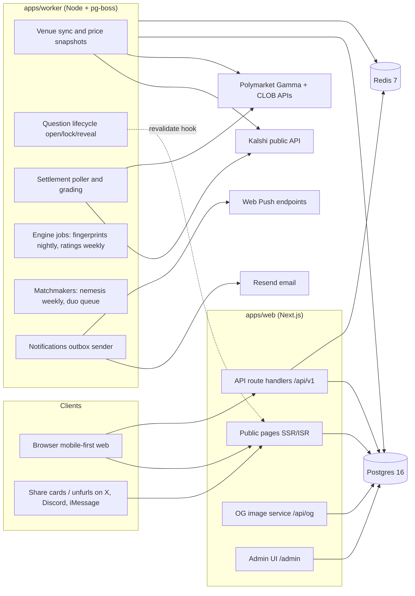
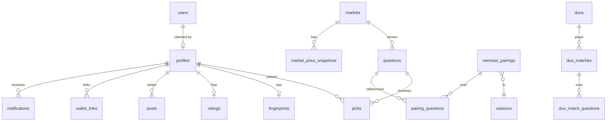
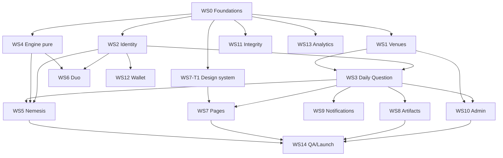

# Receipts — Technical Design Document

**Version:** 1.0 · **Date:** July 18, 2026 · **Status:** Approved for implementation
**Inputs:** `receipts-prd.md` (PRD v0.1), `receipts-principles.md` (principles & decision log)
**Audience:** Implementing agents and engineers. This document is intentionally over-specified so that a task can be implemented **without reading anything beyond the sections its task lists**.
**Review status:** red-teamed pre-publication by two independent adversarial reviews (implementability/consistency + security/abuse/privacy/operations); all findings dispositioned in Appendix E.

---

## 0. How to use this document (read this first)

### 0.1 Purpose and precedence

This document turns the PRD into a buildable system: architecture, data model, algorithms, API contracts, and an exhaustive parallelizable work breakdown (§19).

Precedence when sources conflict:

1. **Invariants (§1.2)** — engineering restatements of the PRD "hard lines". Never violate; a task that seems to require violating one is mis-specified — stop and flag.
2. **This document** — for all implementation mechanics (schemas, endpoints, formulas, defaults).
3. **PRD / principles** — for product intent. If this doc contradicts the PRD on product behavior, flag it; do not silently pick one.
4. **Appendix D (tunable constants)** — the single source of truth for every magic number. Code must read these from `packages/core/src/config.ts`, never hardcode.

### 0.2 Rules for implementing agents

- **Work only your task.** Each task in §19 lists its dependencies, deliverables, spec sections, and acceptance criteria. Read the listed sections plus §0–§5 (shared context); you should not need the whole doc.
- **Contracts live in `packages/core`.** All cross-module types, zod schemas, error codes, and constants are defined there in WS0. Do not add or change anything in `packages/core` without a PR labeled `contract-change` that updates this doc's relevant section in the same PR.
- **Never invent product mechanics.** If a behavior is unspecified, first check Appendix D defaults; if still unspecified, implement the smallest behavior consistent with the invariants and leave a `// SPEC-GAP(<task-id>): <question>` comment plus a note in your PR description.
- **Migration policy (§4.5):** WS0 ships the entire base schema as migration `0001_init`. Later migrations use timestamp-prefixed names (`YYYYMMDDHHMM_description`) and are additive; never edit a merged migration.
- **Branch naming:** `feat/<task-id>-<slug>` (e.g., `feat/ws3-t2-pick-api`). One task per PR unless §19 marks tasks as "bundle OK".
- **Definition of done:** acceptance criteria met, `pnpm verify` (lint + typecheck + unit tests + build) green, new logic covered by the tests named in the task.
- **Mocks unblock you.** Every external dependency (venue APIs, email, the engine) has a mock/fixture defined in WS0/WS1. If your upstream task isn't merged, code against the contract and the mock.

### 0.3 Task ID format

Tasks are `WS<n>-T<m>` (workstream, task). Example: `WS4-T2` = Engine workstream, Glicko-2 implementation. The dependency graph and wave plan are in §19.1–19.2.

### 0.4 Decisions this document makes beyond the PRD

The PRD leaves gaps a build cannot leave open. This doc closes them; the notable ones are listed here so reviewers can challenge them in one place:

| # | Decision | Rationale |
|---|----------|-----------|
| DD-1 | Single global daily schedule in `America/New_York` (ET) at MVP: open 09:00, lock 12:00, reveal target 20:00. | PRD §12 says "start global"; PRD §4.1's "9:00 local-region" is deferred to post-V1.5. |
| DD-2 | Picks are **immutable once placed**, with a 60-second undo (delete) window and no edits ever. | "Receipts over claims" — re-stamping an entry price muddies the artifact. Undo covers mis-taps. |
| DD-3 | The daily streak is a **participation streak** (consecutive daily questions answered). Win streaks are tracked separately as a record. | The streak is the appointment mechanic; freezes (PRD §9) only make sense for participation. |
| DD-4 | Ghost → claimed is a **state transition on the same `profiles` row**, not a data migration. | Picks/streaks/fingerprint survive claiming by construction; merge logic only needed for multi-device edge case (§6.4). |
| DD-5 | Nemesis results update individual Glicko-2; duo matches update **duo team rating only**. Daily accuracy percentile is display-only. | Keeps the rating system interpretable at MVP; PRD §5.2 lists both inputs but doesn't force duo→individual coupling. |
| DD-6 | Tech stack: TypeScript everywhere; Next.js App Router; Postgres + Drizzle; Redis; pg-boss worker (§3). | One language + boring, well-documented tools minimizes coordination cost across parallel agents. |
| DD-7 | Only **binary (yes/no) markets** are eligible for questions at MVP. Multi-outcome events are excluded by the curation tooling. | Every mechanic (sides, crowd split, entry price) assumes two sides. |
| DD-8 | Scoring formulas (percentile, edge, nemesis week, duo score, synergy) are pinned in §8; the PRD only sketches them. | Agents must not each invent math. |
| DD-9 | Narration is a **deterministic template system** (no LLM at runtime) at MVP. | Predictable, testable, cheap; LLM-drafted copy variants can be added to the template table by humans later. |
| DD-10 | Web push ships V1 (opt-in); email from V1 (P0 users are ghost-only — no addresses exist to mail). No SMS ever (no phone numbers, PRD §7). | Reveal is an appointment; push is the appointment channel. |
| DD-11 | 18+ self-attestation moves up-funnel: required at **first pick** (one extra confirm tap), re-affirmed at claim. Spectating (read-only) is not gated. Referral parameters on venue link-outs only for attested sessions. | PRD gates at claim only, but most users never claim; participation and referral monetization are the betting-adjacent surfaces (hard line "adults only"). |
| DD-12 | Deferred PRD items (explicitly, not silently): duo **best-of series at higher tiers** (PRD §4.3) → post-V1.5; contrarianism **direction vs. line movement** (PRD §5.1) → post-V1.5 (price snapshots retained now make it computable later); **predicted-synergy feedback into duo matchmaking** (PRD §5.4 step 3) → post-V1.5 (realized synergy is recorded from day one as the future signal); **season archive pages** (PRD §9) → post-V1.5 (`/q` archive covers questions meanwhile). | Scope control; each has a data path preserved so deferral costs nothing. |

---

## 1. System overview

### 1.1 What we're building

Receipts is a mobile-first web app where users take timestamped, price-stamped positions ("picks") on real prediction-market questions and compete on skill: a synchronized Daily Question against the crowd, a weekly Assigned Nemesis, and an opt-in Duo Queue — all driven by one fingerprint/rating engine. Real prices and settlements come from Kalshi and Polymarket; **no money ever touches this product**.

Three actor types:

- **Spectator** — no account, no cookie. Sees every public page fully rendered.
- **Ghost** — device-scoped identity minted on first pick. Accumulates streaks, picks, fingerprint.
- **Claimed user** — authenticated (email / Google / X). Unlocks nemesis, duo, posting.

### 1.2 Invariants (engineering restatement of the hard lines)

Every PR must preserve these. They are enforced where noted and asserted in tests (WS14-T3).

| ID | Invariant | Primary enforcement |
|----|-----------|---------------------|
| INV-1 | The product never holds money, routes orders, sets odds, or takes positions. There is no code path that creates a financial transaction. No payment SDKs in the dependency tree. | CI dependency denylist; code review |
| INV-2 | We never collect or store credentials for any other platform: no venue API keys (users'), no exchange logins, no private keys, no transaction-signing requests. Wallet linking is a **message signature only** (§12). | Wallet-link flow design; schema has no column for such data |
| INV-3 | In-app competition is denominated only in points/ratings/streaks. No balances, no cash-equivalents, no purchasable competitive advantage. | Schema; product review |
| INV-4 | Identity is minimal: email/OAuth/passkey only. No phone numbers, no government ID, no KYC data — no columns for them. | Schema |
| INV-5 | Competitive records are scored **only** from picks placed in-app on questions served in-app, at in-app timestamps. Imported venue history (wallet linking) may seed the fingerprint and a badge but never affects ratings, streaks, matches, or leaderboards. | Engine reads only from `picks`/`questions` tables |
| INV-6 | Public means public: picks, records, ratings, match history are public by design and the signup copy says so in one sentence. Pseudonymity is first-class and permanent. | Signup copy (WS7-T5); no real-name field exists |
| INV-7 | Exact real-money amounts are never stored or displayed. Imported position sizes are bucketed at ingestion (§12.4); raw amounts are discarded before persistence. | Wallet ingestion code + test |
| INV-8 | All competitive/social pressure targets participation and ego, never stake size. No copy anywhere suggests, tracks, or celebrates real-money amounts. | Copy review checklist (WS14-T3) |
| INV-9 | 18+: self-attestation is required and timestamped **before first participation** (the first pick includes an explicit "I'm 18+" confirm, §6.2 step 0) and re-affirmed at claim. Venue referral parameters are only ever attached for attested sessions (§7.8). Every page footer carries an 18+ notice. | First-pick flow (§6.2), claim flow (§6.3), link-out builder (§7.8) |
| INV-10 | Spectator pages render fully with zero auth and zero cookies, are cacheable, and contain no viewer-specific data in the server-rendered payload. | Page architecture (§10.2) |

### 1.3 Non-goals (MVP → V1.5)

- Native mobile apps (mobile-first web only).
- Multi-outcome markets, order books, or any price display beyond a single yes-probability per market (plus venue divergence flavor).
- Kalshi account linking (deferred; see PRD §6.2 — bizdev action, not engineering).
- Houses (§4.4 of PRD) — stretch; schema leaves room (fingerprint clusters) but no build tasks in scope except where marked `P2`.
- Real-time chat/DMs. Threads are flat comments on artifacts.
- Localization (English only; timezone handling still correct).
- Regional reveal schedules (DD-1).

---

## 2. Architecture

### 2.1 Component diagram



### 2.2 Runtime topology

Two deployable processes plus two stores:

| Process | Runtime | Responsibilities | Scale model |
|---|---|---|---|
| `apps/web` | Next.js (Node runtime for API routes; edge OK for OG images) | All HTTP: public pages, JSON API, admin UI, OG images, oEmbed | Horizontal, stateless |
| `apps/worker` | Long-lived Node process running pg-boss | All scheduled and queued jobs (§7.6, §8, §13). The **only** process that calls venue APIs. | Single instance at MVP (pg-boss gives at-least-once + singleton crons); scale later via job partitioning |
| Postgres 16 | Neon (prod default) / Docker (dev) | System of record + pg-boss job queue | Single primary |
| Redis 7 | Upstash (prod default) / Docker (dev) | Price cache, rate limiting, SIWE nonces, hot counters | Single instance; **all Redis data is reconstructible** — Redis loss must never lose domain data |

Rule: **web never calls venue APIs synchronously in a request path**, with one narrow exception (pick-time price freshness fallback, §6.2 step 4). Spectator traffic is served entirely from our DB/ISR cache (PRD §6.1).

### 2.3 Core data flows (normative sequences)

**Pick flow (ghost, first ever visit):**
1. Browser POSTs `POST /api/v1/questions/:id/picks {side}` with no identity.
2. API mints a ghost profile (§6.1), sets the ghost cookie on the response.
3. API validates question state = `open` and `now < lock_at` (server clock only).
4. API reads price from Redis cache (staleness rules §6.2); stamps `yes_price_at_entry`.
5. Inserts pick (unique on `question_id, profile_id`), increments crowd counters in the same transaction.
6. Returns the created pick + stamped price + crowd split + undo deadline.

**Settlement flow:**
1. Worker `settlement:poll` job asks the venue adapter for resolution of each `locked` question's market (every 5 min).
2. On resolution: one transaction grades all picks (§6.5) — the question's `status` **remains `locked`**; results stay unpublished — and transactionally enqueues a `grade:followup` job that computes percentiles (§8.6) and schedules the reveal honoring `reveal_at` (§6.7).
3. Reveal job fires: marks question `revealed`, enqueues notifications, calls the web revalidation hook for the question/spectator pages.

**Weekly engine flow (ET):** Sunday 22:00 nemesis verdicts (§8.8) → Sunday 23:00 Glicko-2 batch (§8.3) → Monday 03:00 fingerprints rebuild (nightly job, daily) → Monday 09:00 nemesis assignment (§8.4) + "Meet your nemesis" notifications.

### 2.4 Trust boundaries

- Browser input is untrusted: all mutation endpoints validate with zod schemas from `packages/core`.
- Venue API responses are semi-trusted: validated/normalized by adapters; a malformed venue payload must fail the job, not corrupt rows (§7.5).
- Admin UI is behind role checks (§15.1); every admin mutation is audit-logged (§15.5).
- Internal web↔worker calls (revalidation hook) use a shared bearer secret `INTERNAL_API_SECRET` and are IP-unrestricted but unguessable + idempotent.

---

## 3. Tech stack (decided — do not re-litigate per task)

| Concern | Choice | Version pin | Notes |
|---|---|---|---|
| Language | TypeScript, `strict: true` | 5.x | Single language across web/worker/packages |
| Web framework | Next.js App Router | 15.x | SSR + ISR for spectator/SEO, route handlers for API |
| Styling | Tailwind CSS | 4.x | Tokens in §10.4 |
| DB | Postgres | 16 | Neon in prod, Docker locally |
| ORM/migrations | Drizzle ORM + drizzle-kit | latest stable | Schema-as-code in `packages/db` |
| Cache / RL | Redis | 7 | Upstash in prod; ioredis client |
| Job queue + cron | pg-boss | 10.x | Runs on Postgres; no extra infra; singleton cron support |
| Auth | Auth.js (NextAuth) | 5.x | Email magic link (Resend), Google OAuth, X OAuth. Passkeys deferred to V1.5 (flag `passkeys`) |
| Email | Resend | — | Magic links + notifications |
| Validation | zod | 3.x | All API contracts |
| OG/share images | `@vercel/og` (satori) | — | Edge runtime |
| Ethereum sig verification | viem | 2.x | SIWE (EIP-4361), EIP-1271/6492 support |
| Unit tests | Vitest | — | |
| E2E | Playwright | — | Chromium (pre-installed in CI env) |
| Lint/format | ESLint + Prettier | — | Config in `packages/config` |
| Monorepo | pnpm workspaces + Turborepo | — | |
| Errors/observability | Sentry + pino structured logs | — | §16 |
| Analytics | First-party events table (schema §5.6; WS13) | — | No third-party analytics at MVP |
| Hosting (defaults) | Vercel (web) · Fly.io (worker) · Neon (PG) · Upstash (Redis) | — | Swappable; nothing may depend on vendor-specific APIs except deploy config |

**Explicitly rejected:** separate microservices (coordination cost), GraphQL (REST + zod is enough), Prisma (Drizzle chosen; don't mix), LLM-at-runtime narration (DD-9), third-party analytics SDKs at MVP.

---

## 4. Repository layout & conventions

### 4.1 Monorepo tree

```
/
├─ apps/
│  ├─ web/                  # Next.js: pages, API routes, OG, admin
│  │  ├─ app/               # App Router
│  │  ├─ lib/               # web-only helpers (session, ghost cookie)
│  │  └─ e2e/               # Playwright specs
│  └─ worker/               # pg-boss process
│     ├─ src/jobs/          # one file per job (§7.6 registry)
│     └─ src/index.ts       # boot + cron registration
├─ packages/
│  ├─ core/                 # THE CONTRACT HUB (see 4.2)
│  ├─ db/                   # drizzle schema, migrations, repositories, seeds
│  ├─ engine/               # pure functions only: fingerprint, glicko2, matchers, scorers
│  ├─ venues/               # VenueAdapter interface + kalshi/, polymarket/, mock/
│  ├─ ui/                   # design-system React components (§10.4)
│  └─ config/               # shared eslint/tsconfig/prettier
├─ fixtures/                # recorded venue API responses, golden vectors
├─ docker-compose.yml       # pg16 + redis7 for dev
├─ turbo.json / pnpm-workspace.yaml
└─ .github/workflows/ci.yml
```

### 4.2 `packages/core` (the contract hub)

```
packages/core/src/
├─ config.ts        # every constant from Appendix D, typed and exported
├─ errors.ts        # error codes (Appendix C) + ApiError class + envelope helpers
├─ ids.ts           # branded ID types (ProfileId, QuestionId, ...)
├─ enums.ts         # all enums mirrored from DB (§5.1)
├─ schemas/         # zod: one file per API resource, request+response schemas
├─ types/           # domain types (VenueMarket, RevealPayload, FingerprintVector, ...)
└─ flags.ts         # feature flag names + defaults (§4.6)
```

`packages/engine` and `packages/venues` depend on `core`; nothing depends on `apps/*`. `packages/engine` has **zero I/O** — pure functions over plain data, so it is fully parallel-safe and trivially testable.

**Two export surfaces, one package.** `core`'s main `.` entrypoint (the barrel `index.ts`) must be safe to import from a browser bundle — `apps/web`'s client components (`'use client'`) import it directly (e.g. for `SCHEDULE_TZ`, enums, zod schemas), and webpack bundles whatever the barrel transitively pulls in. Anything that needs a Node built-in (`node:crypto`, `node:fs`, ...) or is otherwise server-only by nature — e.g. the §13.2 unsubscribe-token HMAC signing, or the §13.2 email transport (`EmailTransport`/`ResendEmailTransport`/`LoggingEmailTransport`/`defaultEmailTransport`, WS25-T2) — must live in its own file, excluded from the main barrel, and exported only via a dedicated subpath (`@receipts/core/server`, `package.json`'s `exports` field mirrors `@receipts/db`'s `./testing` subpath pattern). Only `apps/worker` and server-only `apps/web` code (route handlers, server components, `apps/web/lib/*` modules never imported by a client component) may import from `@receipts/core/server`.

The email transport is the one `core/server` export shared by *two* consumers: `apps/worker`'s `notify:dispatch` job (real production use since WS9-T1) and, since WS25-T3, `apps/web/auth.ts`'s magic-link `sendVerificationRequest`. It belongs in `packages/core` and not `packages/venues` (the repo's other real/mock-adapter precedent) because `venues` is domain-scoped to prediction-market data sources (Kalshi/Polymarket market data), not a generic email provider — email has no venue-specific shape to share with those adapters, only the "real transport chosen by env-presence, mock/stub transport otherwise" pattern, which prior to WS25-T2 lived only in `apps/worker/src/lib/email-transport.ts` (consolidated into `core/server` and deleted) with a second, independent copy of the same idea (`apps/web/lib/magic-link-mailbox.ts`, gated on `NODE_ENV` rather than API-key presence) living in `apps/web`. WS25-T3 retired that second copy entirely — `auth.ts`'s `sendVerificationRequest` now calls `defaultEmailTransport(logger).send(...)` unconditionally, in every environment, since the shared transport already degrades to `LoggingEmailTransport` when `RESEND_API_KEY` is unset. `LoggingEmailTransport`'s log call takes its logger via an **optional** constructor parameter (default: a no-op) rather than a required one, so `packages/core` never needs to depend on `apps/worker`'s concrete pino instance (or take on a pino dependency of its own) — each caller passes its own logger explicitly (`defaultEmailTransport(logger)`), and callers that only need the read-back mailbox (tests injecting the stub directly) can omit it.

### 4.3 Coding conventions

- Node 22, ESM everywhere. Path aliases via tsconfig `paths` (`@receipts/core` etc.).
- All timestamps in DB are `timestamptz` UTC. All ET-anchored scheduling computes instants via the IANA zone `America/New_York` (DST-correct); never hardcode UTC offsets.
- Prices/probabilities are `numeric(6,5)` in [0,1] in DB, `number` in TS; money **never appears** (INV-1/7).
- IDs: `uuid` v7 (time-ordered) via `uuidv7` package, generated app-side.
- API handlers: parse → authorize → transact → respond; business logic lives in `apps/web/lib` services or `packages/engine`, not inline in route files.
- Logging: pino; never log emails, IPs (raw), cookie values, or signatures (§16.2).

### 4.4 Commit / PR conventions

Conventional commits (`feat:`, `fix:`, `chore:`), task ID in the subject: `feat(ws3-t2): pick create + undo endpoints`. PR description: task ID, spec sections implemented, acceptance-criteria checklist, any `SPEC-GAP` notes.

### 4.5 Migration policy

- `0001_init` (WS0-T3) creates the **entire** §5 schema including tables owned by later workstreams. This removes migration-ordering conflicts between parallel agents.
- Post-`0001` changes: timestamp-named additive migrations. Destructive changes require a `contract-change` PR.
- CI runs `drizzle-kit check` for drift between schema code and migrations on every PR.

### 4.6 Feature flags

Simple server-side flags read from env (`FLAG_<NAME>=true`) with defaults in `core/flags.ts`. UI must render coherently with any flag off (no dead buttons).

| Flag | Default | Gates |
|---|---|---|
| `confidence_slider` | off | Confidence input on picks (PRD §12) |
| `duo_queue` | off until V1.5 | All duo surfaces |
| `wallet_linking` | off until V1 | §12 |
| `web_push` | off until V1 | §13.2 |
| `nemesis` | off until WS5 E2E passes | All nemesis surfaces |
| `divergence_display` | off | Venue spread flavor (§7.7) |
| `houses` | off (P2) | Everything Houses |
| `passkeys` | off | Passkey auth |
| `swipe_ballot` | off | Swipe-ballot UX — full-screen deck home, gesture pick, receipt slip (swipe-ux-plan). Off renders today's tap-button flow byte-identically (INV-10) |

---

## 5. Data model

All tables live in one Postgres schema, defined in `packages/db`. Types below are Postgres types; enums are real PG enums mirrored in `core/enums.ts`. Every table gets `created_at timestamptz not null default now()`; mutable tables also get `updated_at` (app-maintained). Omitted below for brevity.

### 5.1 Enums

| Enum | Values |
|---|---|
| `profile_kind` | `ghost`, `claimed` |
| `profile_status` | `active`, `paused_matchmaking`, `suspended`, `deleted` |
| `venue` | `kalshi`, `polymarket` |
| `market_category` | `sports`, `politics`, `economics`, `culture`, `science`, `other` |
| `market_status` | `open`, `closed`, `resolved`, `voided` |
| `market_side` | `yes`, `no` |
| `question_kind` | `daily`, `nemesis_bonus`, `duo_bonus` (placement does **not** use `questions`; it uses `placement_items`, §5.5) |
| `question_status` | `draft`, `scheduled`, `open`, `locked`, `revealed`, `voided` |
| `pick_result` | `pending`, `win`, `loss`, `void` |
| `pick_source` | `web`, `share_card`, `spectator_page` |
| `pairing_status` | `scheduled`, `active`, `completed`, `cancelled` |
| `duo_status` | `active`, `disbanded` |
| `duo_match_status` | `scheduled`, `active`, `completed`, `cancelled` |
| `queue_status` | `waiting`, `matched`, `cancelled` |
| `post_status` | `visible`, `removed_by_mod`, `removed_by_author` |
| `report_status` | `open`, `actioned`, `dismissed` |
| `wallet_link_status` | `active`, `unlinked` |
| `rematch_status` | `open`, `accepted`, `declined`, `expired` |
| `thread_context` | `question`, `pairing`, `duo_match` (used by posts + reactions) |
| `report_context` | `post`, `pairing`, `duo`, `profile` |
| `report_reason` | `abuse`, `spam`, `cheating`, `other` |
| `notification_status` | `queued`, `sent`, `failed`, `cancelled` |
| `user_role` | `user`, `admin` |
| `season_kind` | `nemesis`, `duo`, `house` |

### 5.2 Identity

#### `profiles` — the public identity (ghosts AND claimed users)

| column | type | constraints | notes |
|---|---|---|---|
| `id` | uuid | PK | uuidv7 |
| `kind` | profile_kind | not null | ghost → claimed transition on claim (DD-4) |
| `status` | profile_status | not null default `active` | `deleted` = soft-deleted/merged (§6.4, §11.4) |
| `handle` | text | not null, unique (case-insensitive index) | e.g. `Fox #4821`; generated per §6.1.2 |
| `slug` | text | not null, unique | URL-safe form of handle (`fox-4821`): lowercase, alnum + `-` only; all profile routes/APIs address by slug (handles contain `#`/space); regenerated on handle change (old slug 404s) |
| `matchmaking_priority` | boolean | not null default false | server-only: set for §8.4 leftovers; cleared after next assignment. Never client-writable |
| `handle_is_generated` | boolean | not null default true | claimed users may set a custom handle once/30d |
| `user_id` | uuid | null, unique, FK → `users.id` | set on claim; null for ghosts |
| `ghost_secret_hash` | text | null | SHA-256 of the cookie secret; null after claim |
| `merged_into_profile_id` | uuid | null, FK → profiles | set when this ghost was merged during claim (§6.4) |
| `claimed_at` | timestamptz | null | |
| `last_seen_at` | timestamptz | not null | touched at most 1/hour per profile |
| `timezone` | text | null | IANA zone from browser; used only for notification quiet hours + nemesis tz preference |
| `age_attested_at` | timestamptz | null | 18+ self-attestation; set at first pick (§6.2 step 0) and re-affirmed at claim (§6.3). Required non-null before any pick exists (INV-9) |
| `bot_score` | real | not null default 0 | 0–1; §14.2 |
| `current_streak` | int | not null default 0 | participation streak (DD-3) |
| `best_streak` | int | not null default 0 | |
| `last_counted_date` | date | null | last question_date counted into streak |
| `freeze_bank` | smallint | not null default 0 | 0..`STREAK_FREEZE_CAP` |
| `current_win_streak` | int | not null default 0 | record only, no freezes |
| `best_win_streak` | int | not null default 0 | |
| `settings` | jsonb | not null default `{}` | zod-validated `ProfileSettings` (§9.4) |

Indexes: unique lower(handle); unique slug; `(kind, status)`; `(bot_score)` partial where `bot_score > 0.5`.

#### `streak_freeze_uses` — durable record of freeze consumption (required for replay, §6.6)

`profile_id FK`, `covered_date date` (the missed day the freeze covered), `used_at timestamptz`. PK `(profile_id, covered_date)`. Written by the streak sweep in the same transaction that decrements `freeze_bank`; read by the streak replay/recompute procedure. Streak state is **never** reconstructed from `analytics_events`.

#### `users` — auth only (Auth.js managed + our columns)

Auth.js standard tables (`users`, `accounts`, `sessions`, `verification_tokens`) via the Drizzle adapter. Our added columns on `users`:

| column | type | notes |
|---|---|---|
| `role` | user_role | default `user`; admins set by seed/ops only |
| `age_attested_at` | timestamptz | required non-null before claim completes (INV-9) |

No name, phone, or address columns exist (INV-4). Email lives here (never on `profiles`) so public queries can't leak it.

### 5.3 Markets & questions

#### `markets` — cached venue markets

| column | type | constraints | notes |
|---|---|---|---|
| `id` | uuid | PK | |
| `venue` | venue | not null | |
| `venue_market_id` | text | not null | unique with venue |
| `title` | text | not null | venue's title, normalized |
| `category` | market_category | not null | mapped per §7.3/7.4 |
| `close_time` | timestamptz | not null | venue trading close |
| `expected_resolve_time` | timestamptz | null | |
| `status` | market_status | not null | |
| `outcome` | market_side | null | set when resolved; voids use `status='voided'` |
| `yes_price` | numeric(6,5) | null | last synced price |
| `yes_price_updated_at` | timestamptz | null | |
| `liquidity_usd` | numeric | null | for curation filters only — never displayed (INV-8) |
| `venue_url` | text | not null | outbound deep link (§7.8) |
| `nemesis_eligible` | boolean | not null default false | curation tag: usable as a nemesis/duo bonus market (§8.8.1) |
| `raw` | jsonb | not null | **trimmed** venue payload — adapters persist only the fields needed for debugging/normalization, never the full response (ToS posture, R2) |

Unique `(venue, venue_market_id)`. Index `(status, close_time)`.

#### `market_price_snapshots`

| column | type | notes |
|---|---|---|
| `id` | bigserial PK | |
| `market_id` | uuid FK | |
| `ts` | timestamptz | |
| `yes_price` | numeric(6,5) | |

Cadence per §7.5. Index `(market_id, ts desc)`. Retention: 90 days then pruned (job `maintenance:prune`).

#### `questions` — a market served in-app (the scoring boundary, INV-5)

| column | type | constraints | notes |
|---|---|---|---|
| `id` | uuid | PK | |
| `kind` | question_kind | not null | |
| `market_id` | uuid | FK → markets, not null | (placement never creates question rows — §5.5 `placement_items`) |
| `question_date` | date | null | required when kind=`daily`; unique partial index on (question_date) where kind='daily' |
| `slug` | text | unique | e.g. `2026-07-19-world-cup-final`; URL identity |
| `headline` | text | not null | curated phrasing ("Will France win the final?") |
| `blurb` | text | null | 1–2 sentence context |
| `yes_label` / `no_label` | text | not null | side display names ("France" / "Brazil") |
| `open_at` / `lock_at` | timestamptz | not null | §6.2 |
| `reveal_at` | timestamptz | not null | target; actual reveal may slip (§6.7) |
| `status` | question_status | not null default `draft` | state machine §5.7 |
| `yes_count` / `no_count` | int | not null default 0 | live counters, tx-maintained |
| `crowd_yes_at_lock` / `crowd_no_at_lock` | int | null | snapshot at lock; contrarian metric + reveal display read THESE |
| `yes_price_at_lock` | numeric(6,5) | null | snapshot at lock |
| `outcome` | market_side | null | copied from market at grading |
| `settled_at` | timestamptz | null | |
| `revealed_at` | timestamptz | null | actual |
| `void_reason` | text | null | |
| `is_volatile` | boolean | not null default false | curation flag: price can move on a live event → strict stamping rules (§6.2 step 4) |
| `event_start_at` | timestamptz | null | start of the underlying live event, if any; curation enforces `lock_at ≤ event_start_at` (§15.2) |
| `created_by_user_id` | uuid | FK → users | admin curator |

Index `(kind, status)`, `(status, lock_at)`, `(status, reveal_at)`.

#### `picks` — the atomic unit of the product

| column | type | constraints | notes |
|---|---|---|---|
| `id` | uuid | PK | |
| `question_id` | uuid | FK, not null | |
| `profile_id` | uuid | FK, not null | |
| `side` | market_side | not null | |
| `yes_price_at_entry` | numeric(6,5) | not null | live yes-price at pick time; implied prob of chosen side = `side='yes' ? p : 1-p` |
| `price_stamped_at` | timestamptz | not null | when the stamped price was fetched from venue (staleness display) |
| `picked_at` | timestamptz | not null default now() | server clock |
| `source` | pick_source | not null default `web` | attribution (§13) |
| `confidence` | smallint | null, check 50–100 | only when flag `confidence_slider` |
| `result` | pick_result | not null default `pending` | |
| `edge` | numeric(7,5) | null | set at grading: `(win?1:0) − p_side_entry` (§8.1) |
| `graded_at` | timestamptz | null | |
| `is_public` | boolean | not null default true | false after account deletion (§11.4) |

Constraints: **unique `(question_id, profile_id)`**; picks are never UPDATEd after creation except by grading (`result`,`edge`,`graded_at`) and deletion flows (`is_public`). Undo = hard DELETE within window (§6.2). Index `(profile_id, picked_at desc)`, `(question_id, result)`.

### 5.4 Engine

#### `fingerprints` (rebuilt nightly, one row per profile; §8.1)

| column | type | notes |
|---|---|---|
| `profile_id` | uuid PK FK | |
| `resolved_pick_count` | int | n used for shrinkage |
| `brier` | real | §8.1; null if n=0 |
| `accuracy` | real | wins / resolved |
| `edge_mean` | real | |
| `chalk` | real | [−1,1] normalized, shrunk |
| `contrarian` | real | [−1,1] normalized, shrunk |
| `timing` | real | [−1,1] normalized, shrunk |
| `category_shares` | jsonb | `{sports:0.4,...}` sums to 1 over picked categories |
| `category_accuracy` | jsonb | per-category accuracy where n≥5, else omitted |
| `calibration` | jsonb | null until `confidence_slider` ships |
| `placement_prior` | jsonb | seeded axes from placement/wallet import; blended per §8.7 |
| `computed_at` | timestamptz | |

#### `ratings`

| column | type | notes |
|---|---|---|
| `profile_id` | uuid PK FK | |
| `glicko_rating` | real | default 1500 |
| `glicko_rd` | real | default 350 |
| `glicko_vol` | real | default 0.06 |
| `games_count` | int | rated games (nemesis weeks) |
| `accuracy_percentile` | real | display-only, nightly, among profiles with ≥10 resolved picks |
| `updated_at` | timestamptz | |

#### `seasons`

`id`, `kind season_kind`, `starts_on date`, `ends_on date`, `name text`. Nemesis seasons = 12 weeks (Appendix D). Seeded by admin.

### 5.5 Modes

#### `nemesis_pairings`

| column | type | notes |
|---|---|---|
| `id` | uuid PK | |
| `season_id` | uuid FK | |
| `week_start` | date | the Monday |
| `profile_a_id` / `profile_b_id` | uuid FK | canonical order: a < b by uuid |
| `status` | pairing_status | |
| `score_a` / `score_b` | smallint | shared-question points (§8.8) |
| `edge_a` / `edge_b` | numeric(8,5) | tiebreak totals |
| `winner_profile_id` | uuid null | null = draw or not finished |
| `verdict` | jsonb | narration data bundle (§13.3), incl. `rating_before` snapshots (§6.5) |
| `is_rematch` | boolean | default false |
| `rating_applied_at` | timestamptz null | idempotency guard: the weekly Glicko batch skips pairings where non-null (§8.3) |

Unique `(season_id, week_start, profile_a_id)` and same for b (one pairing per profile per week; enforce in assignment code + partial unique indexes). Index `(profile_a_id)`, `(profile_b_id)`, `(status, week_start)`.

#### `pairing_questions` — **bonus questions only**

`pairing_id FK`, `question_id FK`, PK (pairing_id, question_id). Holds only the pairing's `nemesis_bonus` questions. The week's daily questions are **derived, never stored**: every daily with `question_date` in `[week_start, week_start+6]` is part of every pairing that week (§8.8). This removes any need for a job that back-fills join rows as dailies get curated.

#### `rematch_requests`

`id`, `requester_profile_id`, `target_profile_id`, `season_id`, `status rematch_status`, `created_at`. Mutual accept → next assignment run pairs them (§8.4 step 0). Any request not mutually accepted by the next `nemesis:assign` run is set `expired` by that run.

#### `duos`

| column | type | notes |
|---|---|---|
| `id` | uuid PK | |
| `profile_a_id` / `profile_b_id` | uuid FK | canonical order a < b |
| `status` | duo_status | |
| `tier` | smallint | 1 = bottom; §8.10 |
| `glicko_rating` / `glicko_rd` / `glicko_vol` | real | team rating, defaults 1500/350/0.06 |
| `matches_played` | int | |
| `joint_hit_rate` | real | §8.9 |
| `synergy` | real | realized − expected; null until ≥ `SYNERGY_MIN_PICKS` graded picks |

Partial unique: a profile may have at most one `active` duo.

#### `duo_queue_entries`

`id`, `profile_id`, `status queue_status`, `enqueued_at`, `matched_duo_id null`. Partial unique `(profile_id) where status='waiting'`.

#### `duo_matches`

`id`, `duo_a_id`, `duo_b_id`, `window_start date`, `window_end date`, `status duo_match_status`, `score_a`, `score_b`, `winner_duo_id null`, `rating_applied_at timestamptz null` (same idempotency guard as pairings), `rating_snapshot jsonb null` (both duos' pre-application ratings, written at rating application — deep-regrade support, §6.5). Plus `duo_match_questions (match_id, question_id)` — **bonus questions only**; the window's dailies are derived from `window_start..window_end` dates (§8.9).

#### `placement_items` — curated historical questions (static content)

`id`, `title`, `category`, `yes_label`, `no_label`, `historical_yes_price numeric(6,5)`, `historical_crowd_yes_pct real`, `outcome market_side`, `resolved_on date`, `active boolean`. Production content (≥15 curated rows) is owned solely by WS4-T8; WS0-T3's seed includes only clearly-marked dev fixtures for these rows.

#### `placement_answers`

`profile_id`, `placement_item_id`, `side`, `answered_at`. PK (profile_id, placement_item_id).

### 5.6 Social, integrity, linking, comms, analytics

#### `posts`

`id`, `context_kind thread_context`, `context_id uuid`, `profile_id FK`, `body text` (≤ `POST_MAX_CHARS`), `status post_status`. Claimed profiles only (enforced in API). Index `(context_kind, context_id, created_at)`.

#### `reactions`

`id`, `context_kind` (same values), `context_id`, `profile_id`, `emoji text` (must be in `REACTION_SET`), unique `(context_kind, context_id, profile_id, emoji)`. Ghosts allowed. Only for `context_kind` in `{question, duo_match}` — `pairing` reactions (§9.2 SW10-T4) use the separate `pairing_reactions` table below, since their semantics differ (claimed-only, one-per-day-replace, not toggle).

#### `pairing_reactions`

(SW10-T4, wiring-gaps doc §4 SW10-T4) `id`, `pairing_id FK`, `profile_id FK`, `emoji text` (must be in `PAIRING_REACTION_SET`, NOT `REACTION_SET` — a separate preset vocabulary, deliberately never merged into the shared enum so it can't leak into `QuestionThread`'s picker), `reaction_date date` (ET calendar day), unique `(pairing_id, profile_id, reaction_date)`. Claimed-participants-only, block-severed (§14.3), enforced server-side (§9.2's `POST /reactions` `pairing` branch) since no other layer covers reactions. A same-day repost REPLACES the row rather than toggling it.

#### `blocks`

`blocker_profile_id`, `blocked_profile_id`, PK (both). Effect: permanent matchmaking exclusion both directions (§8.4/8.5), no thread visibility changes at MVP.

#### `reports`

`id`, `reporter_profile_id`, `reported_profile_id null`, `context_kind report_context`, `context_id`, `reason report_reason`, `note text null`, `status report_status`, `resolved_by_user_id null`, `resolved_at null`.

#### `wallet_links` (§12)

| column | type | notes |
|---|---|---|
| `id` | uuid PK | |
| `profile_id` | uuid FK | partial unique where status='active' |
| `address` | text null | lowercased EOA (0x…); **nulled on unlink/deletion** (§12.5) |
| `address_hash` | text | HMAC-SHA256(address, `WALLET_HASH_SECRET`); survives unlink solely for the relink-cooldown check |
| `proxy_address` | text null | resolved Polymarket proxy (§12.3); nulled on unlink |
| `verified_at` | timestamptz | |
| `status` | wallet_link_status | |
| `enrichment` | jsonb null | bucketed stats only (§12.4); **deleted** (set null) on unlink |
| `unlinked_at` | timestamptz null | |

Unique `(address_hash) where status='active'` — an address links to one profile at a time.

#### `notifications` (outbox pattern)

`id`, `profile_id`, `kind text` (beat catalog key §13.3), `payload jsonb`, `channel enum('email','push')`, `scheduled_at`, `sent_at null`, `status notification_status`, `dedupe_key text unique null` (e.g. `reveal:2026-07-19:profileId`).

#### `push_subscriptions`

`id`, `profile_id`, `endpoint text unique`, `keys jsonb`, `created_at`, `revoked_at null`.

#### `analytics_events` (§13.1)

`id bigserial`, `ts`, `event text`, `profile_id uuid null`, `is_ghost boolean null`, `anon_id text null` (for pre-ghost spectators; client UUID, strict UUID format or dropped), `props jsonb` (≤ `EVENT_PROPS_MAX_BYTES`, oversized events dropped), `ip_hash text null`, `ua_hash text null`. Monthly partitions from day one. No raw IP/UA stored, ever. **IP hashing:** salt is a per-day random value generated into Redis and discarded at rotation — never derived from a persisted secret (an IPv4-space brute force must be impossible once the day ends); `ip_hash`/`ua_hash` are nulled by `maintenance:prune` after 7 days (they exist only for same-day/short-window bot heuristics §14.2).

#### `audit_log`

`id`, `actor_user_id`, `action text`, `target text`, `detail jsonb`, `ts`. Written by every admin mutation (§15.5).

### 5.7 State machines (normative)

**Question:** `draft → scheduled → open → locked → revealed`. `voided` reachable from `scheduled|open|locked` (admin or venue void), and from `revealed` **only** via the admin post-reveal void path within `REGRADE_WINDOW_H` (§15.3 — covers venue resolutions overturned after our reveal, e.g. UMA disputes; effects: picks → `void`, streak replay for participants, deep-regrade of any consuming pairings/matches). Transitions only via worker jobs or admin actions; each transition is a single DB transaction and is idempotent (transition functions check current state first; stale job = no-op). **Effective-state rule:** read paths derive presentation from timestamps, not status alone — a question whose `lock_at` has passed renders as locked even if the lock job hasn't run yet (worker-outage tolerance; the pick API independently enforces `lock_at` via the DB clock, §6.2). A late lock job back-fills the lock snapshot from picks with `picked_at < lock_at` and the price snapshot nearest `lock_at`.

**Pick:** `pending → win|loss|void` (grading only). Row deleted only by undo (§6.2) — never after `lock_at`.

**Profile:** `ghost → claimed` (claim). `active ↔ paused_matchmaking` (user setting or auto-pause §14.3). `→ suspended` (admin). `→ deleted` (user deletion §11.4 or ghost-merge).

**Pairing:** `scheduled → active` (Monday open) `→ completed` (verdict). Mid-week exit (block, pause, suspension, deletion by either side): if **no** shared question has graded yet → `cancelled` (no rating change, no verdict card). If ≥1 shared question has graded → **early conclusion**: the pairing completes immediately, scored per §8.8 on graded questions only, with normal rating application — so a losing player cannot erase a loss by blocking (integrity rule; see §14.3). Admin moderation can convert an early conclusion to a no-fault `cancelled` when the exit was a genuine abuse response.

**Duo match:** `scheduled → active → completed`; mid-window exits follow the same early-conclusion rule as pairings.

### 5.8 ERD (major relations)



---

## 6. Core flows (normative behavior)

### 6.1 Ghost identity

#### 6.1.1 Minting

- A ghost is minted **lazily on the first mutating action** (first pick, reaction, or placement answer) — never on page view (keeps `profiles` clean and spectator pages cookie-free, INV-10).
- Mint = insert `profiles` row (`kind='ghost'`, generated handle) + set cookie.
- Cookie `rcpt_gid`: value `<profileId>.<secret>` where secret = 32 random bytes base64url. Server stores only `HMAC-SHA256(secret, GHOST_COOKIE_SECRET)` in `ghost_secret_hash` (one pinned scheme — never plain sha256; the pepper is effectively non-rotatable and this is documented in `.env.example`). Flags: `HttpOnly; Secure; SameSite=Lax; Path=/; Max-Age=34560000` (400 days).
- Auth resolution order on every request: valid Auth.js session → claimed profile; else valid ghost cookie (id exists, hash matches, status=`active`) → ghost profile; else anonymous.
- Invalid/stale ghost cookie: treat as anonymous and clear it. Never error.
- Rate limit minting: `GHOST_MINT_PER_IP_PER_DAY` (Appendix D, default 10) per IP; over limit → still allow the pick? **No** — return `RATE_LIMITED` (protects pools, §14.1).

#### 6.1.2 Handle generation

`{Animal} #{NNNN}`: animal from a curated 120-word list in `core/handles.ts` (no slurs/brands; reviewed once at WS0), NNNN = 0001–9999 random. Retry on unique collision (max 20 tries, then widen to 5 digits). The URL `slug` is derived deterministically (`fox-4821`). Claimed users may replace with a custom handle: 3–20 chars `[a-zA-Z0-9_]`, case-insensitively unique, screened against a denylist **plus a reserved-terms list** (venue names, `kalshi|polymarket|receipts`, `official|admin|mod|support` and obvious variants — impersonation guard), changeable every `HANDLE_CHANGE_COOLDOWN_DAYS` (violation → `HANDLE_COOLDOWN`).

### 6.2 Placing a pick (the core write path)

`POST /api/v1/questions/:id/picks` — precise algorithm:

0. **Age gate (INV-9):** if the resolved (or about-to-be-minted) profile has `age_attested_at IS NULL`, the request must carry `age_attested: true` (the first-pick UI is a two-part tap: side + "I'm 18+" confirm). Missing → `AGE_ATTESTATION_REQUIRED`. Sets `profiles.age_attested_at`.
1. Parse body `{side: 'yes'|'no', age_attested?, confidence?}` (zod). `confidence` rejected unless flag on. **`source` is never client-supplied** — the server derives it (`web` | `share_card` | `spectator_page`) from the signed landing context: share links carry `?r=<opaque signed token>` minted into card URLs (§10.5), echoed by the client as a header; invalid/absent token → `web`/`spectator_page` by referer path.
2. Resolve identity; if anonymous, mint ghost (§6.1.1) inside the same request.
3. Check `status='open'`. **Clock authority is Postgres:** the insert statement itself guards `WHERE (SELECT lock_at FROM questions WHERE id=?) > now()` so web/worker clock skew cannot admit a late pick. Fail: `QUESTION_LOCKED`.
4. **Price stamp:** read `price:{venue}:{venue_market_id}` from Redis.
   - If cache age ≤ `PRICE_MAX_STALENESS_S` (60s): use it.
   - Else: a **single-flight** synchronous adapter fetch (per-market request coalescing via Redis lock — concurrent pickers await one fetch, never N) with 2s timeout — the sole exception to §2.2's rule.
   - On fetch failure, **non-volatile questions only** may fall back to DB `markets.yes_price` if `yes_price_updated_at` is within `PRICE_FALLBACK_STALENESS_S` (5 min), with `price_stamped_at` = that update time.
   - Questions flagged `is_volatile` (curation, §15.2 — anything that can move on live events) accept **only** prices ≤ `VOLATILE_PRICE_MAX_STALENESS_S` (60s); no DB fallback.
   - All paths exhausted → `PRICE_UNAVAILABLE` (503); the UI says "prices are catching up, try again in a minute".
   - Structural mitigation: curation **requires `lock_at` to precede the start of the underlying live event** for sports/scheduled events (§15.2 validation), so in-play information can never be arbitraged into an entry price.
5. Transaction: a single guarded counter update — `UPDATE questions SET yes_count|no_count = … + 1 WHERE id = ? AND status = 'open' AND lock_at > now() RETURNING id` — is both the status re-check and the serialization point (0 rows → `QUESTION_LOCKED`); then insert the pick. The exclusive row lock the UPDATE takes, held to commit, serializes against the lock job's `FOR UPDATE`, so a pick can never slip between the lock job's status flip and its counter snapshot. **Never** `SELECT … FOR SHARE` followed by a separate counter update: two concurrent pickers would each hold the share lock while waiting to upgrade for the increment — a guaranteed 40P01 deadlock on the very row every daily-question picker contends on (found and reproduced post-launch-audit; the guarded-UPDATE-first shape is the fix). Unique-violation on the insert → roll back the increment with it (savepoint) and return the existing pick with `ALREADY_PICKED` (409, body includes the existing pick — idempotent-friendly).
6. Respond `201` with pick, stamped price, and `undo_until = picked_at + UNDO_WINDOW_S`. **The response never includes crowd counts while the question is `open`** (§9.3 — no probe-by-picking).

**Undo:** `DELETE /api/v1/picks/:id` — allowed iff caller owns pick AND `now() < picked_at + UNDO_WINDOW_S` (60s) AND `now() < lock_at` (both checks evaluated in Postgres, same clock-authority rule). Hard delete + decrement counters in one tx. After undo the user may pick again (either side); nothing crowd-related was revealed, so undo/re-pick carries no information advantage. Fail: `UNDO_EXPIRED`.

**Lock job** (`question:lock`, at `lock_at`): in one transaction, `SELECT ... FOR UPDATE` the question row, set status `locked`, snapshot `crowd_yes_at_lock`, `crowd_no_at_lock` (from the counters, which the row lock has quiesced) and `yes_price_at_lock` (from cache/DB, same staleness rules). The lock-snapshot crowd numbers **exclude picks by profiles with `bot_score ≥ BOT_EXCLUDE_THRESHOLD`** at snapshot time (recomputed via a picks⋈profiles count — the public split and contrarian metric read the snapshot, so same-day bot floods are filtered at the moment it matters). Then trigger page revalidation. Late-arriving pick requests race-safely fail on step 5's guarded counter UPDATE (its `status='open' AND lock_at > now()` predicate re-evaluates against the committed flip and matches 0 rows).

### 6.3 Claiming (ghost → account)

Flow: user hits a claim prompt → Auth.js sign-in (email link / Google / X) → post-auth landing calls `POST /api/v1/claim`.

`POST /api/v1/claim` — requires: valid session AND (age attestation param `age_attested: true` if `users.age_attested_at` is null — set it now; refuse claim without it, INV-9).

**Shared-device guard:** whenever a ghost cookie is present (cases A and C), the claim UI first shows the ghost's handle and record ("You're claiming **Fox #4821** — 3-day streak, 7 picks. That you?") with a "This isn't me" path that clears the cookie and proceeds as case B/D — a signer on a shared device must never silently absorb someone else's ghost.

Cases:
- **A. Session user has no profile; ghost cookie present:** transition the ghost row: `kind='claimed'`, `user_id`, `claimed_at`, `ghost_secret_hash=null`. Clear ghost cookie. All history is retained by construction (DD-4).
- **B. Session user has no profile; no ghost cookie:** create a fresh claimed profile (generated handle), then offer the placement flow (§8.7).
- **C. Session user already has profile P; ghost cookie for ghost G:** **merge** G→P per §6.4, clear cookie.
- **D. Session user already has profile; no cookie:** no-op success.

Claim response includes the profile + which case ran (analytics: measure PRD conversion metric).

The signup screen displays the one-sentence publicness statement (INV-6): copy pinned in §10.6.

### 6.4 Merge rules (case C only)

In one transaction:
1. For each of G's picks: if P has no pick on that question → `UPDATE picks SET profile_id = P` ; if P also picked it → delete G's pick (P's stands; decrement live counters only if question still `open`).
2. Re-parent G's reactions/placement_answers/`streak_freeze_uses` likewise (dedupe by unique keys, P wins).
3. G's posts: ghosts can't post, so none exist.
4. Recompute P's streak fields from merged pick history (§6.6 replay procedure).
5. Mark G: `status='deleted'`, `merged_into_profile_id=P`, `ghost_secret_hash=null`.
6. Enqueue `fingerprint:recompute(P)`.

### 6.5 Grading

Trigger: `settlement:poll` observes the market `resolved` (or admin override §15.3).

Per question, in one transaction: copy `outcome` + `settled_at`; `UPDATE picks SET result = CASE WHEN side=outcome THEN 'win' ELSE 'loss' END, edge = (win?1:0) − p_side_entry, graded_at = now() WHERE question_id=? AND result='pending'`; **and enqueue a `grade:followup(question_id)` job in the same transaction** (pg-boss rides the same Postgres, so job insertion is transactional — a worker crash after commit can never leave a half-processed question; the follow-up simply runs on restart). `grade:followup` (idempotent) then runs: percentile computation (§8.6), reveal scheduling (§6.7), nemesis/duo scoring hooks (§8.8/8.9), and — for non-daily kinds, which publish immediately (§8.8.1) — streak-exempt result publication.

**Publication rule (no pre-reveal leaks):** grading writes `picks.result`/`edge` internally, but every public and viewer-facing surface (profile pages, pick logs, streaks, percentiles, `GET /questions/*`) treats a graded-but-unrevealed **daily** question's picks as `pending` and defers all streak/record mutation to reveal firing (§6.6). Nothing observable changes between settlement and the synchronized reveal.

**Void:** market voided, or admin voids → question `voided`; all picks `result='void'`, `edge=null`. Daily voids do **not** count toward or against streaks (PRD §6.1): the `question_date` is treated as if the user answered (streak preserved for everyone, no increment). Nemesis/duo: voided questions drop out of scoring sets.

**Regrade (admin correction):** admin can flip an outcome within `REGRADE_WINDOW_H` (48h). Regrade re-runs grading + streak replay (§6.6) + percentiles + any pairing/duo scoring that consumed it, and enqueues correction notifications. After ratings were applied, regrade requires the admin **"deep regrade"** path: pre-application rating snapshots (written at application time into `nemesis_pairings.verdict.rating_before` and `duo_matches.rating_snapshot`) for the affected weekly rating period are restored for **all** participants of that period, and the whole period is re-run — Glicko-2 processes a period's games together, so single-game reversal is not attempted.

### 6.6 Streaks (participation, DD-3)

State on `profiles` (`current_streak`, `best_streak`, `last_counted_date`, `freeze_bank`) plus the durable `streak_freeze_uses` table (§5.2) recording exactly which missed dates freezes covered — replay never depends on analytics.

Definitions: a profile "answered day D" iff it has a pick on the daily question with `question_date = D` and that question is not voided. **All streak mutation happens at reveal time or later** (publication rule, §6.5) — never at grading — and daily days are always processed in `question_date` order. Ordering is guaranteed structurally: `reveal:fire` for daily D never fires before D−1's daily is `revealed` or `voided` (with `REVEAL_MAX_DELAY_H` = 12 and the admin void/force-settle escalation, this constraint is satisfiable by construction and asserted by the job).

**The one gap rule** (used by both processing paths): to count day D for a profile whose `last_counted_date = L < D`: walk each date G in (L, D) that had a non-void revealed daily; for each, if `freeze_bank > 0` → decrement and insert `streak_freeze_uses(G)` (queue a `streak_freeze_used` beat), else → `current_streak = 0` and stop walking. Void days are skipped entirely (never consume freezes, never break).

- **Reveal of day D (participants):** for each profile with a graded pick: apply the gap rule up to D, then `current_streak += 1`, `last_counted_date = D`, update `best_streak`. Win streaks update here too: `win → current_win_streak += 1`; `loss → 0`. This is why the reveal moment can show the streak delta live.
- **Voided day D:** for every profile with `last_counted_date = D−1` → `last_counted_date = D`, no increment (PRD §6.1: voids never break or grow streaks); all picks on D already `void`.
- **`streak:sweep` (03:30 ET, next day) — non-participants:** for profiles with `current_streak > 0` and `last_counted_date < D` and no pick on day D (only once D's daily is revealed or voided; otherwise the sweep re-checks next run): apply the gap rule through D. This keeps public profiles truthful even for users who never return.
- **Freeze earn** (`streak:freeze-grant`, Mondays 00:05 ET): +1 if profile answered ≥ `FREEZE_EARN_MIN_DAYS` (5) of the prior 7 daily questions, capped at `STREAK_FREEZE_CAP` (2). Never purchasable (INV-3).
- **Replay procedure** (used by merge, regrade, post-reveal void): rebuild `current_streak`/`best_streak`/`last_counted_date`/win streaks from scratch by replaying all revealed non-void dailies in date order against the profile's pick history, treating dates present in `streak_freeze_uses` as covered (freeze consumption is replayed exactly as recorded, never re-simulated; `freeze_bank` is left as-is).

### 6.7 Settle-on-resolution (was: Reveal orchestration)

> **Amended by the journeys plan (D-J3, `docs/journeys-plan.md` §5 WS19-T1/WS23-T2).** The
> clock-scheduled `reveal:fire` worker and the synchronized "reveal at 20:00 ET" moment are
> **cut**. Settlement follows reality: a daily settles the moment its venue market resolves — any
> time of day — in the **same tick as grading** (`grade:followup` → `settleQuestion`,
> `apps/worker/src/lib/settle-question.ts`), not on a per-question `reveal_at` clock. The
> `revealed`/`revealed_at` column names are **kept** and now mean settled/settled-at (presentation
> reads "SETTLED {time}"). No `reveal:fire` job exists (removed from the §7.6 registry and from
> both the worker's and web's lifecycle enqueuers); the §19.3 WBS "WS3-T4 Reveal orchestration"
> row and the risk/retro entries that mention an "8pm reveal ritual" are superseded historical
> records. The paragraphs below describe the live settle pipeline.

`reveal_at` is retained on the row only as the curator's **target settle hint** (default 20:00 ET) for scheduling/monitoring copy — it no longer gates anything. Settlement fires whenever the venue resolves:

- Graded before it settles: grading writes `picks.result`/`edge` internally, but **all public surfaces and APIs keep the question in `locked` presentation** until the settle transaction runs (the endpoint returns `status:'locked'`; the page shows "settles when it settles", §10.3). The §6.6 publication rule still defers every public streak/record mutation to the settle transaction — nothing observable changes between grading and settle.
- No re-arm, no synchronized wait: `settleQuestion` runs inline in `grade:followup` the moment the market resolves; there is no `REVEAL_REARM_MIN` re-schedule loop and no D−1 ordering gate (the monotonic streak replay tolerates out-of-order settles, audit 9.1). The admin still has void / force-settle paths for stuck markets.
- Settle firing: in one transaction set `status='revealed'`, `revealed_at=now`, apply §6.6 streak increments, detect "called it", complete covered duo matches, and write the WS9-T3 per-outcome beats; post-commit, best-effort revalidate pages and fire the per-settle web-push (first settle of a profile's ET day only; the 21:00 ET `settle:digest` job covers the rest). The reveal API (§9) then returns the full payload. The old general "reveal at 8" push/email beat is gone, replaced by that per-settle push + digest.

**RevealPayload** (type in `core/types`): `{question, outcome, crowd:{yes,no,pct_yes}, viewer?: {pick, result, edge, percentile: number|null, streak:{current,best,delta,freeze_used,broken_run}, badges:['called_it'?], nemesis_flip, duo_tandem}, narrative_line, share:{page_url, og_url, card_urls}}`. The `viewer` block is fetched client-side (§10.2 keeps SSR viewer-free). `percentile` is **nullable by contract** — at P0 (before WS3-T5 ships) it is always null and the UI omits the stat. `streak.broken_run` (SW9-T1, `docs/plans/obituary-handoff.md` §3.2) is the viewer's most recently **completed** (broken) participation run — `{length, started_on, ended_on, last_pick: {pick_id, side_label, entry_cents, question_slug} | null, freezes_survived, longest_odds_cents} | null` — emitted iff this reveal is the viewer's first counted daily since the break (`runs.length > 0 && currentRunStartedOn === question_date` on the through-`question_date` replay); null otherwise. No length threshold server-side (`OBITUARY_MIN_STREAK` is a client presentation rule). `viewer.nemesis_flip` (SW10-T1, `docs/plans/sw-revamp-wiring-gaps.md` §4 SW10-T1) is `{opponent_handle, opponent_side, opponent_side_label, opponent_entry_cents, narration: string|null, you_wins, opponent_wins, week_label, pairing_id, side_profile_ids, today_stamps} | null | undefined` (`.nullish()` — a contract-PR-sequencing field, not a semantic optional/nullable distinction) — non-null iff the viewer has an active nemesis pairing this week AND the opponent has a pick on this exact question. Fires **at reveal**, not pick time (a pick-time trigger would violate §9.3's no-probe-by-picking rule). `you_wins`/`opponent_wins` replay the pairing's scoreboard rows (never `nemesis_pairings.score_a`/`score_b`, which stay 0 until the week concludes); `narration` is one engine-narrated line (`nemesis_lead_taken`/`nemesis_comeback`) or null when no beat's trigger fires. `pairing_id: PairingId|null|undefined`, `side_profile_ids: {a: ProfileId, b: ProfileId}|null|undefined`, and `today_stamps: {a, b: PairingReactionEmoji|null}|null|undefined` (design-diff audit finding, `docs/mockups/swipe-ux.html`'s inline "STAMP REPLY ▾" on the daily reveal card — the shipped app had split the opponent's stamp + narration from the reply affordance across two separate surfaces) are each `.nullish()` per the same contract-PR-sequencing rule as the fields above, and are non-null under the exact same condition as the rest of `nemesis_flip` (there is no independent gate for them). They carry `ReactionStampsPanel`'s three required props (`pairingId`, `sideProfileIds`, `stamps`) verbatim so the reveal card can mount the SAME component `NemesisMatchupCard` uses on `/nemesis`, rather than a second reaction-picker implementation; `today_stamps` is the identical viewer-free per-player shape and the identical `getTodayPairingReactions` read `pairingPublicSchema.today_reactions` already uses (SW10-T4), so the two surfaces can never disagree about today's stamps. `viewer.duo_tandem` (SW10-T3, `docs/plans/sw-revamp-wiring-gaps.md` §4 SW10-T3) is `{partner_handle, partner_side, partner_side_label} | null | undefined` (same `.nullish()` sequencing rule) — non-null iff the viewer has an active duo AND the partner has a pick on this exact question; fires at reveal, same corrected timing as `nemesis_flip`. Independent of `nemesis_flip` — a viewer can be in both a duo and a nemesis pairing at once, so both fields populate together rather than branching between them.

"Called it" badge: `result='win'` AND implied entry prob of chosen side ≤ `LONGSHOT_THRESHOLD` (0.20). Stored in `analytics_events` + derivable; rendered on cards.

---

## 7. Venue integration

### 7.1 Adapter contract (in `packages/venues`)

```ts
export interface VenueAdapter {
  readonly venue: 'kalshi' | 'polymarket';
  listCandidateMarkets(q: {closesWithinH: [number, number]; minLiquidityUsd: number; limit: number}): Promise<NormalizedMarket[]>;
  getMarket(venueMarketId: string): Promise<NormalizedMarket | null>;
  getYesPrice(venueMarketId: string): Promise<{yesPrice: number; ts: Date} | null>;
  getResolution(venueMarketId: string): Promise<{state: 'unresolved'} | {state: 'resolved'; outcome: 'yes'|'no'} | {state: 'voided'}>;
}
```

`NormalizedMarket`: `{venue, venueMarketId, title, category, closeTime, expectedResolveTime?, yesPrice?, liquidityUsd?, venueUrl, raw}`. **Only strictly binary markets are returned**; adapters filter multi-outcome structures (DD-7). Prices are always the probability of YES in [0.01, 0.99] — adapters clamp and reject 0/1 until resolution.

A `MockVenueAdapter` (WS1-T1) with scriptable fixtures ships first; all downstream tasks test against it.

### 7.2 Shared adapter behavior

- All HTTP via a shared client: 5s timeout, 3 retries with jittered exponential backoff (250ms base) on 429/5xx/network, per-venue token-bucket limiter (`VENUE_RATE_LIMIT_RPS`, default 4) — conservative; respect venue-published tiers when confirmed (WS1 task includes verifying current documented limits and recording them in `fixtures/venue-notes.md`).
- Responses validated with zod; validation failure → job error + Sentry, never partial writes.
- Kalshi demo env (`KALSHI_API_BASE` switchable) for development; recorded fixtures under `fixtures/kalshi/*.json`, `fixtures/polymarket/*.json` for tests (no live calls in CI).

### 7.3 Kalshi adapter

- Base: env `KALSHI_API_BASE` (prod: Kalshi trade API v2 public endpoints; demo for dev). Catalog: markets listing filtered server-side where supported, client-side otherwise. Price: midpoint of yes bid/ask when both present, else last price, converted from cents to [0,1]. Resolution: market status `settled`/`finalized` + result side; anything ambiguous → `unresolved` (never guess).
- Category mapping: Kalshi category/series → our `market_category` via a mapping table in the adapter (`category-map.ts`), default `other`. Curators can override per question.
- WebSocket ticker (V1.5, flag-gated): subscribes to active questions' markets during reveal windows for the divergence/live flourish; **not** load-bearing — REST polling is the source of record.

### 7.4 Polymarket adapter

- Catalog: Gamma API (`POLYMARKET_GAMMA_BASE`) filtered to binary markets (`outcomes = ["Yes","No"]`), active, not archived. Price: CLOB midpoint (`POLYMARKET_CLOB_BASE`) for the YES token; fallback Gamma `outcomePrices`. Resolution: market `closed` + resolved outcome from Gamma; disputes/UMA in-flight → `unresolved`.
- On-chain reads are **not** used for market data at MVP (secondary source per PRD; wallet linking §12 uses Polymarket's data API instead).

### 7.5 Sync jobs & failure posture

- `venue:sync-catalog` (hourly): upsert candidate markets (both venues) into `markets` for the curation pool. Missing-from-feed markets that are referenced by questions → keep, flag `stale_in_feed` in `raw`.
- `venue:price-tick`: every 60s for markets referenced by `open` or `locked` questions; hourly for other tracked markets. Writes Redis `price:*` (TTL 300s) + `markets.yes_price` + snapshot rows per cadence: every tick while question open; every 5 min while locked.
- `settlement:poll`: every 5 min for `locked` questions → §6.5.
- Venue outage: jobs fail fast and retry on schedule; picks fall back per §6.2 step 4; a banner flag (`venue_degraded` in Redis, set after 3 consecutive tick failures, cleared on success) lets the UI show "live prices delayed".

### 7.6 Job registry (complete; all times `America/New_York`)

| Job | Schedule | Owner task |
|---|---|---|
| `venue:sync-catalog` | hourly :10 | WS1-T4 |
| `venue:price-tick` | every 60s | WS1-T4 |
| `settlement:poll` | every 5 min | WS1-T5 |
| `grade:followup` | enqueued transactionally by grading (§6.5) | WS3-T3 |
| `question:open` | per-question at `open_at` | WS3-T1 |
| `question:lock` | per-question at `lock_at` | WS3-T1 |
| `notify:pre-lock-reminder` | every 5 min (scans `open` questions inside `PRE_LOCK_REMINDER_LEAD_MIN` of `lock_at`, §13.2) — added WS9-T4, not in the original table | WS9-T4 |
| ~~`reveal:fire`~~ | **removed (D-J3, WS19-T1/WS23-T2, §6.7):** no clock-scheduled reveal — a daily settles inline in `grade:followup` (`settleQuestion`) when its market resolves, which also writes WS9-T3's per-outcome beats | — |
| `settle:digest` | daily 21:00 ET — one summary push for a profile's 2nd+ settles that day (D-J3, replaces the old "reveal at 8" beat) | WS19-T1 |
| `streak:sweep` | daily 03:30 | WS3-T3 |
| `streak:freeze-grant` | Mon 00:05 | WS3-T3 |
| `fingerprint:nightly` | daily 03:00 | WS4-T7 |
| `ratings:weekly` | Sun 23:00 | WS4-T7 |
| `nemesis:conclude` | Sun 22:00 | WS5-T3 |
| `nemesis:lastday` | Sun 09:00 (fires `nemesis_last_day` beats, §13.3) | WS9-T3 |
| `nemesis:assign` | Mon 09:00 | WS5-T1 |
| `wallet:ingest` | enqueued per link (§12.2) | WS12-T2 |
| `duo:matchmaker` | every 30s (queue scan) | WS6-T1 |
| `duo:window-roll` | Tue/Fri 09:00 | WS6-T3 |
| `notify:dispatch` | every 30s (outbox) | WS9-T1 |
| `analytics:rollup` | daily 04:00 | WS13-T2 |
| `maintenance:prune` | daily 04:30 | WS0-T4 |

pg-boss singleton keys prevent double-fire; every job handler is idempotent (state-checked transitions).

### 7.7 Divergence flavor (flag `divergence_display`)

When curators attach a `paired_market_id` (same real-world event on the other venue) to a question, the question page shows both venues' yes-prices and the spread. Pure display; no scoring impact. Schema: `questions.paired_market_id uuid null FK markets`.

### 7.8 Outbound deep links

Every market/question surface renders "Trade this on {Kalshi|Polymarket}" linking `markets.venue_url` with `rel="noopener nofollow"` + referral query params from env (`KALSHI_REF_PARAM`, `POLYMARKET_REF_PARAM`, empty until programs approved). Outbound clicks fire analytics event `venue_outbound_click`. This link is the **only** money-adjacent surface (INV-1); it must never be styled as a CTA of the competitive loop (design rule, §10.6).

---

## 8. Engine specification (`packages/engine` — pure functions)

Every function here takes plain data in, returns plain data out. No DB, no clock reads (time is a parameter). All constants from Appendix D via `core/config.ts`.

### 8.1 Fingerprint metrics (nightly rebuild over all graded picks)

Let a profile's graded, non-void picks be `i = 1..n`, each with: side, `p_i` = implied entry probability of the **chosen** side (`side='yes' ? yes_price_at_entry : 1 − yes_price_at_entry`), win `w_i ∈ {0,1}`, category `c_i`, pick time `t_i`, question window `[open_i, lock_i]`, crowd-at-lock split.

| Metric | Formula | Range | Notes |
|---|---|---|---|
| accuracy | `Σw_i / n` | [0,1] | |
| brier | no confidence: `Σ(1 − w_i)/n` (forecast = 1.0 on chosen side). With `confidence_slider`: forecast `f_i = confidence/100` on chosen side → `Σ(f_i − w_i)² / n` | [0,1] | lower is better |
| edge_mean | `Σ(w_i − p_i)/n` | [−1,1] | "did you beat the price" |
| chalk (raw) | `2·(Σp_i/n) − 1` | [−1,1] | +1 favorite-heavy |
| contrarian (raw) | over picks where lock-crowd n ≥ `CROWD_MIN_N` (20): `2·(minority picks / eligible picks) − 1` where minority = chosen side had < 50% of crowd-at-lock | [−1,1] | 0 if no eligible picks |
| timing (raw) | `2·(Σ clamp((t_i−open_i)/(lock_i−open_i),0,1) / n) − 1` | [−1,1] | +1 deadline locker |
| category_shares | count per category / n | simplex | |
| category_accuracy | accuracy per category, only where category n ≥ 5 | | |

**Shrinkage:** every raw style axis (chalk, contrarian, timing) is multiplied by `n/(n + SHRINK_K)` (SHRINK_K = 10). New users read as neutral, not extreme.

**Prior blending (placement / wallet import, §8.7/§12):** if `placement_prior` exists, blended axis = `(n·shrunk_axis + PRIOR_WEIGHT·prior_axis) / (n + PRIOR_WEIGHT)` with PRIOR_WEIGHT = 5. Priors never touch accuracy/edge/brier (INV-5 — skill comes only from in-app picks).

### 8.2 Style vector & distances

```
v(profile) = [ W_CHALK·chalk, W_CONTRA·contrarian, W_TIMING·timing,
               W_CAT·share_sports, W_CAT·share_politics, W_CAT·share_economics,
               W_CAT·share_culture, W_CAT·share_science, W_CAT·share_other ]
```
Weights (Appendix D): W_CHALK=1.0, W_CONTRA=1.0, W_TIMING=0.5, W_CAT=0.75.

- `styleDistance(a,b) = 1 − cosineSim(v_a, v_b)`; if either ‖v‖ < 1e-6 → distance 0.5 (neutral, prevents div-by-zero).
- `categoryOverlap(a,b) = Σ_c min(share_a[c], share_b[c])` ∈ [0,1].
- `complementarity(a,b) = 0.5·(|chalk_a − chalk_b| / 2) + 0.5·(1 − cosineSim(cat_a, cat_b))` ∈ [0,1] (cat vectors = category_shares; zero-vector guard → term 0.5).

### 8.3 Ratings — Glicko-2

Standard Glicko-2 (Glickman), τ = `GLICKO_TAU` (0.5), defaults 1500/350/0.06, convergence ε = 1e-6. Rating period = one week; batch `ratings:weekly` (Sun 23:00 ET) processes each profile's completed nemesis pairings of the week as games (win 1 / draw 0.5 / loss 0). Profiles with no games that week: RD-only inflation step per the paper. Duo team ratings updated identically per completed duo match (opponent = other duo), in the same batch. **Idempotency & edge rules:** the batch only consumes pairings/matches with `rating_applied_at IS NULL`, writes pre-application snapshots (§6.5 deep-regrade support) and stamps `rating_applied_at` in the same transaction as the rating writes — a retried or double-fired batch is a no-op; pairings/matches where a participant profile is `deleted` are skipped entirely (no rating change for the survivor).

**Golden test vector (must pass, WS4-T2):** player (r=1500, RD=200, σ=0.06, τ=0.5) vs opponents (1400,30,win), (1550,100,loss), (1700,300,loss) → r′ ≈ 1464.06, RD′ ≈ 151.52, σ′ ≈ 0.05999 (tolerances: ±0.01, ±0.01, ±1e-5).

Display percentile (`ratings.accuracy_percentile`): nightly, rank of lifetime accuracy among profiles with ≥10 graded picks; display-only.

### 8.4 Nemesis matchmaking (weekly batch, pure function `matchNemeses(pool, history, constraints)`)

Eligible pool: claimed, `status='active'`, not nemesis-paused, ≥ `NEMESIS_MIN_PICKS` (5) graded picks, `bot_score < BOT_EXCLUDE_THRESHOLD`.

0. **Season check:** the assignment job first validates an active nemesis season covers this week; if the previous season just ended, it auto-creates the next `NEMESIS_SEASON_WEEKS`-week season (and notifies admins) — assignment never silently no-ops on a season boundary. Then **rematches first:** mutually-accepted `rematch_requests` become pairings immediately (marked `is_rematch`), removing both from the pool; all other open requests from the ended cycle are set `expired`.
1. **Candidate edges:** for every pair (a,b): eligible iff `|r_a − r_b| ≤ max(NEMESIS_BAND_BASE (150), 0.5·(RD_a + RD_b))` AND `categoryOverlap ≥ OVERLAP_FLOOR (0.25)` AND not blocked either direction AND not previously paired this season.
2. **Edge score:** `styleDistance(a,b) + TZ_BONUS (0.05)·[|utc_offset_a − utc_offset_b| ≤ TZ_BONUS_MAX_OFFSET_H (3h)] − RD_PENALTY (0.0002)·|r_a − r_b|`.
3. **Matching:** sort edges by score desc; greedily take non-conflicting pairs; then bounded 2-opt improvement (≤ `MATCHER_2OPT_PASSES` (3) passes over pairs: swap partners between two pairings if total score improves). Deterministic given a seeded tiebreak (uuid order).
4. **Leftovers:** unmatched profiles get `profiles.matchmaking_priority = true` (server-only column, §5.2 — never in the user-writable settings blob) → +`PRIORITY_BONUS` (0.1) on all their edges next run, cleared after that run; no filler bots, no repeat exceptions.

Fairness telemetry: the function returns expected win probability per pairing (Glicko expected score); the batch logs distribution — P12 target: 95% of pairings within expected 0.40–0.60.

### 8.5 Duo matchmaking

**Partner matching** (`duo:matchmaker`, 30s tick): for the longest-waiting `waiting` entry, find best `complementarity` among others whose `|r_diff| ≤ DUO_BAND_BASE (150) + DUO_BAND_WIDEN·floor(wait_s/30)` (widen 25/tick, cap `DUO_BAND_CAP` 400), excluding blocked pairs and prior partners (a prior pair is eligible again only once **both** have re-queued after their duo was disbanded — disband itself is always unilateral, §9.2). If found → create duo (team rating = mean of individuals, RD 350), notify both. Eligibility: claimed, active, ≥ `DUO_MIN_PICKS` (10) graded picks, no active duo.

**Windows (fixed calendar):** two windows per week — **Tue–Thu** (dailies of Tue, Wed, Thu) and **Fri–Sun** (dailies of Fri, Sat, Sun); Monday's daily belongs to no duo window. `window_start`/`window_end` are those first/last `question_date`s. `duo:window-roll` (Tue/Fri 09:00) creates the starting window's matches; a match transitions to `completed` by `grade:followup` when its last question grades (or by the next window-roll as a backstop for stragglers, excluding never-graded questions per §8.9).

**Duo-vs-duo:** at window roll, pair duos within a tier by closest team rating (greedy on sorted list); odd duo out sits the window (priority next). Match = the window's 3 daily questions (derived by date, §5.5) + 3 curated `duo_bonus` questions (authoring per §8.8.1).

### 8.6 Daily percentile

Among all graded picks on a question **excluding profiles with `bot_score ≥ BOT_EXCLUDE_THRESHOLD`** (excluded profiles get their own percentile against the full set but never appear in others' denominators): participant score `s = edge` (i.e., `(w?1:0) − p_side`). Percentile of profile x = `(count(s_y < s_x) + 0.5·count(s_y = s_x, y≠x)) / (N−1)` ×100 (N>1; if N=1, percentile = 100). Displayed as "Top X%" where X = 100 − percentile, min display "Top 1%". Wrong pickers naturally land low (negative edge). Cached in Redis (`reveal:{questionId}` hash profileId→percentile, TTL 7 days) — but Redis is a cache, not the source: **on cache miss the API recomputes from `picks` in Postgres** and re-populates (Redis loss never loses reveal data, §2.2).

### 8.7 Placement & cold start

- Placement = 5 items sampled from active `placement_items` (stratified: ≥3 categories). One-tap flow, immediate per-item result (historical outcome + crowd comparison) — a mini reveal-loop tutorial.
- Seeds `fingerprints.placement_prior`: chalk and contrarian computed from the 5 answers against historical price/crowd data with the §8.1 formulas (n=5, no shrinkage — the PRIOR_WEIGHT blend handles moderation). **Timing prior is always null from placement** (`placement_items` have no open/lock window; only wallet import can seed timing) — the §8.1 blend applies per-axis, only to axes the prior actually has. Rating untouched (stays 1500/350 — "high-uncertainty" per PRD).
- Placement answers do **not** count toward the 5/10 mode-eligibility thresholds (those require real graded picks; PRD §5.6 "real picks").
- Wallet import (§12) may write the same prior fields; if both exist, average them. Linking also lets the user **skip** the placement UI (PRD §6.2).

### 8.8 Nemesis week scoring

Shared set = the week's daily questions — **derived by date** (`question_date ∈ [week_start, week_start+6]`), never stored in `pairing_questions` (§5.5) — plus the pairing's 2–3 `nemesis_bonus` questions chosen at assignment: engine picks markets resolving within the week from the pair's top overlapping categories (candidates = `markets.nemesis_eligible = true`, tagged by curators; fallback: skip bonus if none fit — a 0-bonus week is valid).

#### 8.8.1 Bonus question lifecycle (nemesis_bonus and duo_bonus)

Non-daily question rows are created programmatically, one per market, **deduplicated**: if an `open` question of the same kind already exists for the market, the pairing/match reuses it (extra `pairing_questions`/`duo_match_questions` rows, no new question). Authoring defaults: `headline` = market title verbatim; `yes_label`/`no_label` = "Yes"/"No"; `slug` auto-generated; `open_at` = creation time; `lock_at` = the earlier of (market `close_time`, Sunday 12:00 ET for nemesis / `window_end` 12:00 ET for duo); `reveal_at = lock_at` — **bonus questions have no held reveal**: grading publishes immediately via `grade:followup` (the synchronized-reveal machinery in §6.7 applies to `daily` only), and they never touch streaks (§6.6 is daily-only). They are ordinary public questions (spectator page, one-tap pick by anyone, P9/INV-10) — being publicly pickable doesn't affect pairing scoring, which only counts the two members' picks. Curation validations (§15.2) apply, including `is_volatile`/`event_start_at` rules.

Per graded shared question: a player scores 1 point iff their pick is a win **and they actually picked it** (no pick = 0; both may score on the same question). Voided/unresolved-by-verdict-time questions are excluded. At `nemesis:conclude` (Sun 22:00 ET): `score = Σ points`; winner = higher score; tie → higher `Σ edge` over shared picks; `|Δedge| < 1e-4` → draw. Persist scores/winner/verdict; build narration bundle (§13.3); pairing → `completed`. Ratings applied in the Sunday 23:00 batch. Questions still unsettled at conclude are excluded and noted in the verdict payload (`excluded_question_ids`).

### 8.9 Duo scoring & chemistry

Per match question: duo points = number of partners with winning picks (0–2; no pick = 0). Match score = Σ over the 6 questions; winner = higher score; tie → higher Σ edge over the duo's own picks in the match; `|Δedge| < 1e-4` → draw. Applied to duo Glicko in the weekly batch.

Chemistry (on `duos`, updated after each match). Define a **slot** = one (partner, question) pair where that partner placed a pick on a duo-match question and the pick graded `win` or `loss` (missing picks and voids create **no** slot — chemistry measures the accuracy of picks actually made; match scoring, above, is what punishes absence). Then `joint_hit_rate = winning slots / total slots`, `expected = mean(lifetime accuracy_a, accuracy_b)`, `synergy = joint_hit_rate − expected`, displayed once total slots ≥ `SYNERGY_MIN_PICKS` (12). Copy: "You two hit {joint}% together — {better|worse} than either of you alone" only claims "better than either alone" when `joint > max(acc_a, acc_b)`.

### 8.10 Ladder

Tiers 1..`LADDER_TIERS` (5). Tier display names (`Paper → Carbon → Ribbon → Ledger → Archive`) live in `copy.ts` like all strings (§10.6); "Tier 1..5" is primary copy, the name secondary (P11). Promotion: top `LADDER_PROMOTE_PCT` (20%) of duos by match wins then rating within tier at each `DUO_SEASON_WEEKS` (4)-week duo season end; relegation bottom `LADDER_RELEGATE_PCT` (20%). New duos enter tier 1. MVP scale: single global ladder.

### 8.11 House sorting (P2 stretch — spec only)

k-means k=4 over style vectors at season boundaries, assignments frozen mid-season; min data gate: ≥ `HOUSE_MIN_PROFILES` (500) profiles with ≥ 15 picks. No build tasks in current scope.

### 8.12 Weekly category leaderboards

Served by `GET /leaderboards/weekly` (owner: WS3-T7). Window = ISO week Mon–Sun in ET, keyed by daily `question_date` (bonus questions included by their `lock_at` date). One board per `market_category` plus overall. Eligible: claimed profiles, `bot_score < BOT_EXCLUDE_THRESHOLD`, ≥ `LEADERBOARD_MIN_PICKS` (3) picks graded-and-revealed in the window. Rank by (wins desc, Σ edge desc, earliest mean pick time as final tiebreak); top 100 returned. Computed on demand from `picks` with a 300s Redis cache (no snapshot table at MVP); the in-progress week is visible and clearly labeled "live". Only revealed questions count (publication rule §6.5).

---

## 9. API surface (`/api/v1`)

### 9.1 Conventions

- JSON only. Success: resource or `{data, meta?}`. Error envelope: `{error: {code, message, details?}}` — codes in Appendix C; HTTP status per code table.
- Auth: session cookie (Auth.js) or ghost cookie, resolved per §6.1.1. `auth` column below: `none` | `ghost+` (ghost or claimed) | `claimed` | `admin`.
- All mutations: same-origin enforcement (Origin/Sec-Fetch-Site check middleware) + rate limits (§14.1 table). GETs of public resources are cacheable (`Cache-Control: public, s-maxage=30, stale-while-revalidate=300` unless noted).
- Zod request/response schemas in `core/schemas/<resource>.ts` — **the frontend imports these**; that is the web↔API contract.
- Pagination: cursor-based `?cursor=&limit=` (max 50), response `meta.next_cursor`.
- Server time: every JSON response sets header `x-server-time` (ms epoch) — clients compute clock offset for countdowns (§10.3).

### 9.2 Endpoints

| Method & path | Auth | Purpose / notes |
|---|---|---|
| `GET /questions/today` | none | Today's daily question, public shape: state, headline, labels, live price, crowd split (hidden until lock per §9.3), lock/reveal times. Cacheable 10s. |
| `GET /questions/tomorrow` | none | Design-diff audit vs. `docs/mockups/swipe-ux.html` / `docs/swipe-ux-plan.md` §2.5's under-card AC (`questionPeekSchema`, `.nullish()`-free contract-change — a brand-new endpoint, no existing payload to extend): the peeking next-day card behind the committed receipt. `404 NOT_FOUND` whenever there's nothing safe to peek at — curation hasn't reached tomorrow yet (the common case most days), the row is still `draft`, or it's already effectively past `scheduled` — never a broken/empty 200. On success, `{status: 'scheduled', open_at}` ONLY: deliberately narrower than `questionPublicSchema` (no headline, no `yes_price`/crowd/venue — see §2.5's under-card bullet, "headline hidden"; also `questionPublicSchema.yes_price` is populated regardless of status, so reusing that shape here would leak the venue price for a question that hasn't opened). Cacheable 10s, same posture as `GET /questions/today`. |
| `GET /questions/:slug` | none | Same shape, any question by slug. Revealed questions include outcome + final split. |
| `GET /questions/:slug/reveal` | ghost+ | Viewer block of RevealPayload (§6.7). `423 REVEAL_NOT_READY` before reveal. Uncacheable. |
| `POST /questions/:id/picks` | none→mints ghost | §6.2. Body `{side, source?, confidence?}` |
| `DELETE /picks/:id` | ghost+ | Undo, §6.2 |
| `GET /questions/:slug/thread` | none | Posts + reaction counts, paginated. Same shape at `GET /pairings/:id/thread` and `GET /duo-matches/:id/thread` |
| `POST /questions/:id/posts` | claimed | Body `{body}`; also `POST /pairings/:id/posts`, `POST /duo-matches/:id/posts` |
| `POST /reactions` | ghost+ for `question`/`duo_match`; claimed-participant-only for `pairing` | `{context_kind, context_id, emoji}`. `question`/`duo_match`: `REACTION_SET`, toggle semantics (2nd call removes). `pairing` (SW10-T4): `PAIRING_REACTION_SET` (a separate preset vocabulary, §5.6), one stamp per player per ET calendar day, a same-day repost REPLACES it (`state: 'replaced'`); rejects a non-claimed caller, a non-participant, or a blocked pair, all server-side |
| `GET /profiles/:slug` | none | Public profile (addressed by URL slug, §6.1.2): handle, streaks, records, rating + percentile, fingerprint style summary, badges, recent picks (paginated, `is_public` only), nemesis history summary, verified-wallet badge, and a `graveyard` block (SW9-T3 contract-change, `docs/plans/obituary-handoff.md` §4): completed participation runs ≥ `OBITUARY_MIN_STREAK` as bare run **lengths only** — newest-first, capped at `GRAVEYARD_RIP_CAP` — plus the lifetime public called-it count; null when empty. Privacy pin: the block never carries per-run dates or question slugs (either would make participation on specific dates publicly inferable even for `is_public = false` picks). Picks on graded-but-unrevealed dailies present as `pending` (§6.5 publication rule) |
| `GET /profiles/:slug/picks` | none | Full public pick log (receipts culture, INV-6). Public `picked_at` timestamps are truncated to **minute precision** (full precision visible only to the owner — limits sleep/location profiling from the public log; the receipt artifact stays verifiable to the minute) |
| `GET /me` | ghost+ | Own profile incl. settings, eligibility progress (picks toward 5/10), claim state |
| `PATCH /me/settings` | claimed | zod `ProfileSettings` partial (§9.4); the request may also carry `timezone`, which the handler maps to the `profiles.timezone` **column** (it is not a settings key) |
| `PATCH /me/handle` | claimed | Custom handle w/ cooldown (§6.1.2) |
| `POST /claim` | claimed session | §6.3. Body `{age_attested?: true}` |
| `DELETE /me` | claimed | Account deletion §11.4. Body `{confirm: handle}` |
| `GET /placement` | ghost+ | 5 items (no outcomes) |
| `POST /placement/answers` | ghost+ | `{item_id, side}` → per-item result revealed in response |
| `GET /pairings/current` | claimed | My active pairing + scoreboard |
| `GET /pairings/:id` | none | Public matchup page data (both handles, daily-by-daily scoreboard, narration line). Pre-reveal daily results masked per §9.3. Also carries `today_reactions: {a, b} \| null \| undefined` (SW10-T4, `.nullish()` contract-change) — each side's own preset stamp for today, viewer-free and safe on this ISR page; both forced `null` when the pair is blocked (§14.3, enforced in the payload build) |
| `GET /me/nemesis-history` | claimed | Lifetime records vs past nemeses. Each entry also carries `rematch_request: {id, direction: 'outgoing'\|'incoming', status: rematch_status} \| null` — the viewer's most relevant rematch request with that entry's opponent, if any (WS5-T5 contract-change: there's no dedicated discovery endpoint for a rematch request's id, §9.2 previously had none documented — this folds discovery into the endpoint that already renders the per-opponent rematch affordance, rather than minting a new undocumented route) |
| `POST /rematch-requests` | claimed | `{target_profile_id}`; target must be a past nemesis this season (a terminal — `completed`/`cancelled` — pairing this season). Idempotent: a repeat call while an identical request is already `open` returns that same row |
| `POST /rematch-requests/:id/accept` \| `/decline` | claimed | Target-only (the requester already consented by creating the request). Accepting does not pair immediately — the next `nemesis:assign` run (Monday 09:00 ET) does, per §8.4 step 0 |
| `POST /duo/queue` | claimed | Enqueue (eligibility checked) · `DELETE /duo/queue` to leave |
| `GET /duo/current` | claimed | My duo + active match. Also carries `partner_pick_today: {picked, picked_at} \| null \| undefined` (SW10-T3, `.nullish()` contract-PR sequencing) — side-free existence + minute-truncated timing of the partner's pick on today's daily question, for the sealed partner chip (§9.3 stays untouched: never the side) |
| `GET /duos/:id` | none | Public duo page: partners, tier, rating, chemistry, match history |
| `GET /duo/ladder` | none | Tier standings, paginated |
| `POST /duos/:id/disband` | claimed | Member only; partner notified |
| `POST /blocks` | claimed | `{blocked_profile_id}` · `DELETE /blocks/:blocked_profile_id` (composite-key table, no surrogate id — §5.6) |
| `POST /reports` | ghost+ | `{context_kind, context_id, reason, note?}` |
| `POST /wallet/nonce` | claimed | §12.2 → `{message}` (full SIWE message to sign) |
| `POST /wallet/verify` | claimed | `{message, signature}` → link result + enrichment summary |
| `DELETE /wallet` | claimed | Unlink; deletes enrichment (§12.5) |
| `POST /push/subscribe` | claimed | Web-push subscription JSON · `DELETE /push/subscribe` |
| `POST /events` | none | Analytics ingest (§13.1): `{event, props, anon_id?}`; `props` ≤ `EVENT_PROPS_MAX_BYTES` (oversized → dropped silently), `anon_id` strict-UUID or ignored; fire-and-forget, heavily rate-limited (§14.1) |
| `GET /leaderboards/weekly` | none | Weekly category leaderboards per §8.12 |
| `POST /internal/revalidate` | bearer `INTERNAL_API_SECRET` (constant-time compare) | Worker→web ISR revalidation `{paths: string[]}`. Hardened: paths must match an allowlist of route patterns (`/q/*`, `/p/*`, `/vs/*`, `/duos/*`, `/`, `/q`), max 20 paths/call, rate-limited 60/min — a leaked secret must not enable a cache-stampede DoS |

Image/embed endpoints live **outside** `/api/v1` at canonical paths `/api/og/*`, `/api/cards/*`, `/api/oembed` (specs in §10.5) — the §10.5 paths are the only correct ones.

Admin API under `/api/admin/*` is specified in §15.

### 9.3 Information-hiding rules (anti-herding / drama preservation)

- **Crowd split is hidden while a question is `open`** — everywhere, with **no exceptions** (pick responses included; a picker could otherwise probe the split and undo). Both API and pages show "crowd locks in at HH:MM"; the split becomes public at lock (spectators see the split; the reveal adds outcome). Rationale: the live market price is already shown (that's the receipt), but showing the in-app herd pre-lock damages the contrarian metric, the reveal, and invites herding.
- Nemesis opponents' picks on a shared question are masked until that question locks.
- Percentiles/results never leak pre-reveal (§6.7), including via profile pages and streaks (§6.5 publication rule).

### 9.4 `ProfileSettings` (the complete user-writable settings blob)

Zod schema in `core/schemas/settings.ts`; `.strict()` — unknown keys rejected. This is the **entire** shape; server-managed state (e.g. `matchmaking_priority`) lives in columns, never here:

```ts
{
  nemesis_paused: boolean,            // default false — pauses nemesis matchmaking (PRD §4.2 opt-out)
  show_wallet_address: boolean,       // default false — §12.5 separate opt-in
  notifications: {
    email_reveal: boolean,            // default true
    email_nemesis: boolean,           // default true
    email_duo: boolean,               // default true
    email_product: boolean,           // default false — anything non-transactional
    push_reveal: boolean,             // default true (only meaningful once subscribed)
    push_nemesis: boolean,            // default true
    push_duo: boolean,                // default true
  }
}
```

---

## 10. Frontend

### 10.1 Routes

| Route | Render | Data | Notes |
|---|---|---|---|
| `/` | SSR + client hydrate | today's question | State machine UI (§10.3) |
| `/q/[slug]` | **ISR** (revalidate 30s + on-demand) | question public shape | The spectator page (INV-10). Viewer-specific strip hydrates client-side only |
| `/q` (archive) | ISR daily | past questions list | SEO surface ("Will X happen? The crowd said 63%") |
| `/p/[handle]` | ISR 60s | public profile | The creator-wedge page — polish priority (PRD §9) |
| `/vs/[pairingId]` | ISR 30s | public matchup | |
| `/duos/[id]`, `/ladder` | ISR 60s | duo pages | flag `duo_queue` |
| `/sweat` | force-dynamic (SSR) | viewer's open positions | The Sweat room (D-J3, WS19-T2): `pending` picks by settle-time. Viewer-scoped (reads ghost cookie / session), never cached; INV-10 applies to public pages, not this one |
| `/rivals` | force-dynamic (SSR) | nemesis + duo + call-outs | The one Rivals hub (D-J6, WS17-T2 + WS20-T4): segmented Nemesis · Duo, plus call-out surfaces + grudge book. flags `nemesis`, `duo_queue`, `callouts` |
| `/crowd` | force-dynamic (SSR) | weekly leaderboards | The Crowd boards (D-J7, WS22-T2). **Deviation:** §5's WS22-T2 AC sketched ISR 60s; shipped force-dynamic so it builds with no/unmigrated DB in CI and reflects standings seeded after build. INV-10 preserved — viewer-free HTML (`getCrowdBoards(getDb())`), row highlight hydrates client-side |
| `/you` | force-dynamic (SSR) | viewer's record | The signed-in record-first room (D-J7, WS22-T1). Viewer-scoped from cookies; the one page entirely about the viewer, so never ISR-cached (contrast `/p/[slug]`) |
| `/claim` | SSR | — | Auth + Save (D-J8 rename) flow + placement offer |
| `/placement` | client | placement items | |
| `/settings` | client | me | incl. wallet linking, deletion |
| `/rules` | static | — | how scoring works, publicness, 18+ |
| `/admin/*` | SSR, role-gated | §15 | |

The four journeys rooms (`/sweat`, `/rivals`, `/crowd`, `/you`) landed with the journeys plan (`docs/journeys-plan.md` §5) and are amended into this table by WS23-T2. Every ISR page sets full OG/Twitter meta (§10.5). No layout shift on hydration (viewer strips render into reserved slots).

### 10.2 Spectator-page architecture (INV-10)

Server render contains **zero viewer data** — identical HTML for every visitor (cacheable at the CDN). **The CDN/ISR cache key for public routes must ignore all cookies** (a returning ghost's `rcpt_gid` must not fragment the cache — WS8-T3 has an explicit test asserting identical cache behavior with and without the cookie; this is what lets the CDN absorb a viral burst). A client island then: resolves identity via `GET /me` (called only when an identity cookie is present; never blocks paint), renders the viewer strip (your pick / pick buttons / claim prompt), and swaps states on lock/reveal via light polling (30s) of `GET /questions/:slug` — no websockets at MVP. The reveal moment uses the poll + local countdown to `reveal_at`, and at T-0 every client applies a **random 0–20s jitter** before re-fetching (plus jittered retry on 5xx) so the synchronized moment doesn't become a synchronized stampede; the reveal viewer block is served from the Redis percentile/reveal cache with at most one indexed DB read (§8.6), and prod DB access goes through pooled connections (Neon pooler / pgBouncer) sized for the spike (§18, WS14-T2 load-tests exactly this path).

One-tap participation: the pick buttons on a spectator page POST directly (minting a ghost, §6.2) — no interstitials (P9). After pick: inline receipt confirmation + "come back at 8pm ET" + add-to-calendar link.

### 10.3 The states of a question page

| State | Shows | CTA |
|---|---|---|
| `scheduled` | headline, "opens 9:00 ET" countdown | notify-me (claimed) |
| `open` | live yes-price (stamped style), countdown to lock | side buttons (one tap) / your receipt + undo (60s) |
| `locked` | crowd split (now public), your side vs crowd, **"SETTLES WHEN IT SETTLES"** (no reveal countdown) | share your receipt; "see what you're sweating" → `/sweat` |
| `revealed` (settled) | **"SETTLED {time}"** stamp with the real settle instant, outcome stamp, crowd result, viewer result block (client-side), thread | share result card; tomorrow's question teaser |
| `voided` | "voided by venue" explainer, streak-safe note | tomorrow teaser |

> **Amended by the journeys plan (D-J3, `docs/journeys-plan.md` §5 WS19-T2/WS23-T2).** Settlement
> follows reality (§6.7), so the `locked` state no longer counts down to a synchronized reveal — it
> shows **"SETTLES WHEN IT SETTLES · whenever the venue calls it — around {time}"** (copy in
> `sweatCopy`, `apps/web/lib/copy.ts`). The `revealed` state is presented as **settled**, headed by
> a **"SETTLED {time}"** stamp of the actual settle instant (the `revealed`/`revealed_at` DB names
> are kept). The companion **Sweat room** (`/sweat`, §10.1) lists a viewer's open positions by
> settle-time between lock and settle. A pick's result lands whenever its market resolves, any time
> of day — there is no shared appointment.
>
> **`/crowd` render-mode deviation (WS22-T2 → WS23-T2).** §5's WS22-T2 AC specified ISR 60s for
> `/crowd`; it shipped `dynamic = 'force-dynamic'` (SSR per request) instead — a deliberate,
> recorded deviation. The page reads the DB at render, and (a) `next build` would prerender it
> against a missing/unmigrated CI DB, and (b) an ISR snapshot can't reflect standings seeded after
> the build (the WS22-T2 e2e seeds a winner and expects it live). INV-10 is unchanged: the render
> reads no cookies and resolves no viewer identity (`getCrowdBoards(getDb())` takes only a `Db`), so
> the HTML is byte-identical for every viewer and a CDN can still edge-cache it; the row highlight
> hydrates client-side. True ISR (build-empty + on-demand revalidate) is a possible future revisit.

Countdowns use server-time offset from `x-server-time` (§9.1); at T-0 the client re-fetches rather than assuming.

The **settle moment** (was the reveal moment, WS7-T3): a single 1.6–2.0s choreographed sequence (stamp slam of outcome → crowd bar fill → your result flip → streak/percentile count-up), sound optional (off default), fully honoring `prefers-reduced-motion` (instant static layout). Motion budget exists **only** here (PRD §8). It now plays when a viewer opens a question that settled while they were away — a per-pick artifact moment, not a synchronized nightly one.

### 10.4 Design system (`packages/ui`)

Tokens (Tailwind theme):

- **Color:** bg `#0B0B0D` (dark default), surface `#141417`, paper `#F4F1E8` (receipt cards render as light paper on dark bg), ink `#111`, muted `#8B8B93`. Side accents: side-A blue `#3B82F6`, side-B orange `#F97316` (colorblind-safe pair) — **always paired with icons/labels, never color alone**. Win `#2DD4A7`, loss `#F43F5E` used with ✓/✗ glyphs.
- **Type:** UI: Inter. Numerals/prices/timestamps: `IBM Plex Mono` — every number in the product is mono ("printed").
- **Motifs:** `TicketCard` (perforated edge via CSS mask, subtle paper texture), `Stamp` (rotated bordered label: WIN / LOSS / VOID / CALLED IT), `PriceTag` (`¢`-style printed entry price: "YES @ 63¢" — cents formatting of probability, standard prediction-market notation, **not** money display; a11y label "63% implied"), `Barcode` footer strip (decorative barcode motif rendering the page path as text beneath it — no separate short-URL system exists), `CrowdBar`, `StreakFlame` (count in mono), `CountdownTicker`.
- Components must be pure/presentational (props in, DOM out) so OG templates (§10.5) can share layout logic.

Accessibility bar: WCAG AA contrast; all interactive elements keyboard-operable; side buttons have full text labels; reduced-motion honored; touch targets ≥ 44px.

### 10.5 Artifacts: share cards, OG, oEmbed

- **OG images** (`/api/og/...`, edge runtime, satori): templates `question` (pre-lock: headline + live price + "pick your side"), `result` (outcome + crowd), `receipt` (a user's pick: side, entry price, result, streak, handle), `matchup` (nemesis scoreboard), `profile` (record summary), `duo`. 1200×630 only — dimensions are never client parameters. Cache: immutable content-addressed URLs (`?v=` state hash) + `s-maxage=86400`. **Abuse guard:** the server recomputes the current state hash; a request whose `?v=` doesn't match is 302-redirected to the canonical URL (never rendered) — cache-busting can't force unbounded cold renders. Entity must exist (404 otherwise); og/cards routes carry their own IP rate limit (§14.1).
- **Share cards** (`/api/cards/...`): same templates at story 1080×1920 and square 1080×1080, PNG. The share sheet (client) offers: native share (Web Share API w/ file), download, copy link. **Every card renders the page URL + QR** (bottom strip) — doors, not screenshots (P9).
- **Losing artifacts get equal treatment** (P3): `receipt` template has explicit `loss` and `busted-streak` variants (the streak's tombstone: "RIP 11 days"), built in the same task as win variants (WS8-T2 acceptance criteria enforce this).
- **oEmbed:** `GET /api/oembed?url=` returns rich type with the OG image; `<link rel="alternate" type="application/json+oembed">` on all public pages. The `url` parameter is **parsed and pattern-matched only** — it must be same-host and match a known public route pattern (`/q/*`, `/p/*`, `/vs/*`, `/duos/*`) or the request is 404'd; the server never fetches the supplied URL (no SSRF surface).
- QR codes generated server-side (`qrcode` lib) into the card render.
- **Share attribution:** card/page URLs minted by the share sheet carry `?r=<opaque token>` (HMAC-signed with `SHARE_TOKEN_SECRET`) encoding `{artifact_kind, minted_at}`; the pick API uses it to derive `source` server-side (§6.2 step 1). Tokens are attribution-only — no user data, not a session.
- Meta: `og:title` = headline or "{handle}'s receipt", `og:description` = one-line state ("The crowd says 63%. Lock is at noon ET."), `twitter:card=summary_large_image`.

### 10.6 Copy rules (enforced in review)

- The publicness sentence on the Save screen: **"Your picks, results, and rating are public — that's the point. You can stay pseudonymous forever."** (INV-6, pinned copy.)
- **D-J8 "claim" → "Save" rename** (`docs/journeys-plan.md` §5, owner decision 2026-07-21; amended into this doc by WS23-T2): the sign-in ask is the single word **"Save"**, never "claim". The old "claim" nudges were re-pinned off that wording (mechanic unchanged, verb only). The two nudge strings are pinned verbatim (used by §11.3 and §13.3 — no paraphrasing): streak trigger → **"Your streak lives on this device. Save it — free, ten seconds."**; fingerprint trigger → **"Your fingerprint is ready. Save your record to get your nemesis."** The prompt CTA is **"Save"** (`CLAIM_PROMPT_CTA`); the `/claim` screen is a neutral **"SAVE YOUR RECORD"** ticket with no gold on the ask. Ghost-gate CTAs on secondary surfaces follow the same rename — "Save your record to post / to manage settings / to join a duo" (not "Claim your account …"). The `/claim` route path, `CLAIM_*` export names, and `data-testid`s are unchanged (internal identifiers, not user-facing copy).
- No copy anywhere references money amounts, "bets", stake sizes, or venue balances (INV-8; say "pick"/"call", not "bet").
- Venue link-outs are quiet text links, never primary buttons (§7.8).
- All mechanic names are plain words (P11): nemesis, duo, streak, freeze, receipt, called it.
- Every user-facing string lives in `apps/web/lib/copy.ts` (single reviewable file; no scattered literals) including narration templates' rendered strings (§13.3).

---

## 11. Identity, auth & account lifecycle

### 11.1 Auth.js configuration

Providers: Email magic link (Resend, `MAGIC_LINK_TTL_MIN` = 15-min token TTL), Google OAuth, X OAuth (V1 may ship email+Google only if X app approval lags — flag per provider). Session: database sessions (not JWT), 30-day rolling. Cookie: `__Secure-` prefixed, HttpOnly, SameSite=Lax. On sign-in completion, redirect to `/claim` continuation which calls `POST /api/v1/claim` (§6.3).

Account linking: same-email OAuth+magic-link auto-link (Auth.js `allowDangerousEmailAccountLinking` **off**; use verified-email linking only — Google emails are verified; X provides none reliably → X accounts stand alone unless email verified via magic link first). Edge: user with X-only auth loses X access → support path via admin (§15). **X-only accounts are email-less, so §14.4's email dedup can't see them** — they get stricter treatment: halved rate limits for their first 7 days and a higher weighting in the bot/duplicate heuristics (§14.2/§14.4); they also cannot file auto-pause-countable reports (§14.3) until 7 days old like any account.

### 11.2 Session/CSRF hardening

Auth.js CSRF for its own routes; our mutations rely on SameSite=Lax + explicit Origin allow-list middleware (reject cross-origin POSTs with 403 `CSRF_REJECTED`). No CORS allowances on `/api/v1/*` mutations. GET endpoints never mutate.

### 11.3 The claim prompts (conversion mechanics, PRD §3)

Client-side prompt engine (WS7-T5) triggers the claim sheet on: streak reaching 3, 5th pick, viewing a nemesis/duo surface as ghost — using the pinned strings from §10.6 verbatim. Dismissible; re-prompts at most 1/day (localStorage marker); never blocks the pick loop.

### 11.4 Account deletion (`DELETE /me`)

In one transaction: profile `status='deleted'`; handle rewritten to `deleted-{full uuid}` and slug likewise (collision-proof — never a truncated id, whose uuidv7 timestamp prefix collides within seconds); picks `is_public=false` (rows retained — aggregates/crowd counts stay truthful, INV-6 balanced with erasure); posts `removed_by_author`; wallet link → unlink flow (§12.5: enrichment deleted, `address`/`proxy_address` nulled, only `address_hash` kept for cooldown); push subscriptions revoked; notifications cancelled; active pairing/duo → mid-week exit rule (§5.7). Auth.js user row + accounts + sessions **hard-deleted** (email gone). Fingerprint/rating rows deleted. Then asynchronously: `analytics_events` rows for the profile scrubbed (`profile_id`, `ip_hash`, `ua_hash` nulled — no 13-month behavioral trail survives erasure) and a Sentry deletion request issued for events tagged with the profile id (Sentry events are tagged by profile id only, never handle/email — §16.2). Public pages 404 by slug. Irreversible; confirm modal requires typing the handle.

### 11.5 Data lifecycle summary

| Data | Retention |
|---|---|
| Ghost profiles unseen 13 months | pruned (`maintenance:prune`): profile anonymized (handle/slug → `expired-{full uuid}`, `ghost_secret_hash` nulled); picks on revealed questions are **kept** with `is_public=true` (they're part of settled public history and aggregate counts); picks on still-open/scheduled questions are deleted with counter decrements |
| Price snapshots | 90 days |
| Analytics events | 13 months, then aggregate-only |
| Audit log | 24 months |
| Emails | only in `users`; deleted with account |

---

## 12. Wallet linking (Polymarket, V1, flag `wallet_linking`)

### 12.1 Posture

Read-only proof of address control via message signature (SIWE, EIP-4361). No transactions, no approvals, no keys (INV-2). Never required; only benefits: verified badge, stronger initial fingerprint prior, skip placement.

### 12.2 Flow

1. `POST /wallet/nonce` → server builds full EIP-4361 message: domain = app host, address (from client), statement pinned: *"Link this wallet to Receipts to verify your Polymarket record. This signature is proof of ownership only — it cannot move funds or authorize anything."*, chainId 137, nonce = 16 random bytes hex, `SIWE_NONCE_TTL_MIN` (10 min) single-use (Redis `siwe:{nonce}` → profileId).
2. Client requests signature via injected wallet / WalletConnect (`viem` + `@walletconnect/ethereum-provider`; no wallet SDK lock-in).
3. `POST /wallet/verify {message, signature}`: server re-parses message, checks domain/nonce/expiry/address match, verifies via viem `verifyMessage` (handles EOA + EIP-1271/6492 smart wallets against Polygon RPC `POLYGON_RPC_URL`). Consume nonce. Create `wallet_links` row.
4. Enqueue `wallet:ingest` job (§12.4). Respond immediately with `{status:'linked', ingestion:'pending'}`.

### 12.3 Polymarket proxy resolution

Polymarket user funds/positions sit in a proxy contract (Gnosis-Safe-style) owned by the signing EOA. `wallet:ingest` must check activity for **both** the EOA and its derived proxy: derive via the documented Polymarket proxy-factory CREATE2 derivation (factory addresses + init code hash recorded in `packages/venues/polymarket/proxy.ts` — **WS12-T2 includes verifying these against Polymarket docs/contracts at build time**; they change rarely but must not be guessed). If derivation can't be verified during the task, fallback ships: query the data API for the EOA address only, and the badge reads "wallet verified" without imported history. `proxy_address` stored when resolved.

### 12.4 Enrichment ingestion (privacy-critical, INV-7)

Job pulls position/trade history from Polymarket's public data API for {address, proxy_address}. **In-memory transform only** — raw responses are never persisted:

- Style signals: per-position implied entry probability → chalk prior; market categories → category prior; trade timing → timing prior (best-effort; null if unavailable).
- Size **bucketing at ingestion**: each position's notional mapped to bucket `xs|s|m|l|xl` (bounds in Appendix D, used transiently) — only bucket counts persisted internally: `{trades: 142, buckets: {...}, categories: {...}, chalk_prior: 0.18, first_seen: '2024-11'}`. Exact amounts discarded in-memory; a unit test asserts the persisted JSON contains no numeric fields except counts/priors (WS12-T2 AC).
- Writes `fingerprints.placement_prior` (blend per §8.7) + `wallet_links.enrichment`.
- **Public display allowlist (exhaustive — INV-7/8):** the badge, `first_seen` month ("since Nov 2024"), total position count ("142 positions"), and style descriptors derived from priors. **The size-bucket histogram is never serialized to any client or public surface** — a bucket count like `xl: 3` still discloses that a user held ≥$10k positions, which is exactly the wealth signal INV-7 exists to suppress; buckets exist only as internal moderation/quality signals. WS12-T3's AC includes a serialization test walking every profile/wallet API response asserting no `buckets` key. Never sizes, never P&L, never per-position data.

### 12.5 Display & unlink

Default display: badge + allowlisted stats (§12.4); the address itself shown only if `settings.show_wallet_address` (separate opt-in). Unlink (`DELETE /wallet`): status `unlinked`, `enrichment = null` (deleted, per PRD §6.2), `address` and `proxy_address` **nulled** (plaintext address does not survive unlink), `placement_prior` recomputed without wallet contribution (placement answers, if any, remain), badge removed. Only `address_hash` is retained (schema §5.6) to rate-limit re-link churn (`WALLET_RELINK_COOLDOWN_D` 7 days; violation → `WALLET_RELINK_COOLDOWN`).

---

## 13. Notifications & narration

### 13.1 Analytics events (first-party)

`POST /api/v1/events` ingests client events; server code emits server events directly. Canonical event names (typed union in `core/types/analytics.ts`): `spectator_view, ghost_minted, pick_created, pick_undone, share_card_generated, share_completed, spectator_cta_click, claim_prompt_shown, claim_completed, reveal_attended, placement_started, placement_completed, nemesis_viewed, rematch_requested, duo_enqueued, duo_page_viewed, chemistry_viewed, thread_posted, reaction_added, venue_outbound_click, wallet_linked, wallet_unlinked, report_filed, block_created, streak_freeze_used, notification_opened`. Props schemas zod-validated; unknown events dropped. This table powers every §17/PRD-§10 metric (WS13).

### 13.2 Channels

- **Email** (MVP): Resend, one template layout (receipt-styled), per-kind opt-outs in settings, List-Unsubscribe header. Hard cap: ≤ 1 marketing-ish email/day/user; transactional beats (reveal/verdict) exempt but deduped by `dedupe_key`.
- **Web push** (V1, flag): VAPID via `web-push`; service worker `sw.js`; permission requested only after a claim + an explicit "remind me at reveal" tap (never on load).
- Quiet hours: non-reveal notifications deferred to 08:00 local (profile.timezone, default ET) if scheduled 22:00–08:00.

### 13.3 Narration engine (DD-9)

Pure function `narrate(beat, data) → {line, emphasis?}` in `packages/engine/narration.ts`. Beats and their trigger data:

| Beat key | Trigger | Example rendered line |
|---|---|---|
| `nemesis_assigned` | Monday assignment | "Meet {opp}. {opp_style_clause}. You have seven days." |
| `nemesis_lead_taken` | daily grading changes leader | "{leader} takes the lead, {a}–{b}, with {n} questions left." |
| `nemesis_comeback` | trailing player ties/leads after being ≥2 down | "Down two on Thursday. Level on Saturday. {handle} is not done." |
| `nemesis_last_day` | Sunday morning, close score | "{a}–{b}. One day left. {trailer} needs the sweep." |
| `nemesis_verdict_win/loss/draw` | conclude | Loss variant gets equal craft (P3): "It wasn't close. {winner} read the week better, {a}–{b}. Rematch is open." |
| `streak_milestone` | streak hits a `STREAK_MILESTONES` value (3/7/14/30) | "{n} straight days. The printer keeps printing." |
| `streak_busted` | reset from ≥3 | "The {n}-day streak ends here. Frame the receipt." |
| `streak_freeze_used` | freeze auto-consumed (§6.6) | "You missed yesterday. A freeze took the hit — {n} left." |
| `called_it` | longshot win | "{pct}% said no chance. {handle} said otherwise." |
| `duo_formed`, `duo_synergy_up`, `duo_promoted`, `duo_relegated` | duo events | … |
| `claim_nudge_streak`, `claim_nudge_fingerprint` | §11.3 | pinned strings in §10.6 |
| `reveal_reminder` | added WS9-T4: `notify:pre-lock-reminder` (§13.2), a streak holder (`current_streak > 0`, mirrors `streak:sweep`'s own eligibility criterion) hasn't picked today's daily and `lock_at` is within `PRE_LOCK_REMINDER_LEAD_MIN` | "Your {n}-day streak is on the line. Pick before it locks." |

`reveal` (the "Reveal at 8" beat, added WS9-T4, `reveal:fire` per participant — §13.2/§19.3 WS9-T4) is deliberately **not** routed through `narrate()`: it carries no per-user trigger data (every participant gets the same announcement), so it uses the category-level fallback line/subject `notify:dispatch`'s templates already define for the `reveal` category ("Tonight's reveal is in" / "The reveal is ready. Come see how it landed.", `apps/worker/src/lib/notification-email-template.ts`) rather than a beat-specific template that would just duplicate that string.

Style clauses derive from fingerprint deltas (e.g., opp chalk ≪ you → "They chase longshots you'd never touch"). All template strings live in `copy.ts` with slot types; `narrate` is deterministic and unit-tested per beat (each beat: ≥1 win-side and ≥1 loss-side golden string). Notifications = beat + channel + dedupe_key rows in the outbox; `notify:dispatch` sends.

---

## 14. Integrity, rate limiting, moderation

### 14.1 Rate limits (Redis token bucket per key; middleware order: origin check → identity → limiter)

| Action | Key | Limit (constant) |
|---|---|---|
| Ghost mint | IP | 10/day (`RL_GHOST_MINT_IP_DAY`) |
| Pick create | profile | 30/hour (`RL_PICK_PROFILE_H`) |
| Pick create | IP | 120/hour (`RL_PICK_IP_H`) |
| Undo | profile | 10/hour (`RL_UNDO_PROFILE_H`) |
| Reactions | profile | 100/day (`RL_REACT_PROFILE_D`) |
| Posts | profile | 20/day + 5/min (`RL_POST_PROFILE_D`, `RL_POST_PROFILE_MIN`) |
| Reports | profile | 10/day (`RL_REPORT_PROFILE_D`) |
| Claim attempts | IP | 10/hour (`RL_CLAIM_IP_H`) |
| Auth email sends | email+IP | 5/hour (`RL_AUTH_EMAIL_H`) |
| SIWE nonce/verify | profile | 10/hour (`RL_SIWE_PROFILE_H`) |
| `POST /events` | IP | 120/hour (`RL_EVENTS_IP_H`) |
| `/api/og/*` + `/api/cards/*` | IP | 120/min (`RL_IMAGES_IP_MIN`) — cached hits excluded |
| `POST /internal/revalidate` | global | 60/min (`RL_REVALIDATE_MIN`) |
| Any `/api/v1` GET | IP | 600/min backstop (`RL_GET_IP_MIN`) |

429 with `Retry-After`. Every limit above is exported from `core/config.ts` under the parenthesized name (they are enumerated here rather than duplicated in Appendix D — this table **is** their source of truth; Appendix D links here). Enforcement in one shared middleware (WS11-T1). **Redis-down posture is fail-closed:** if the limiter store is unreachable, mutation endpoints fall back to strict in-process limits (25% of table values per instance) rather than unlimited — a Redis restart must not open an abuse window — and the event is alerted (§16.1).

### 14.2 Bot scoring (best-effort, PRD §5.7)

Nightly heuristic updates `profiles.bot_score` from: pick latency uniformity (sub-second picks across days), IP-hash fan-out (many profiles per ip_hash/day from analytics), 24/7 activity spread, UA anomalies. Score ≥ `BOT_EXCLUDE_THRESHOLD` (0.8): excluded from leaderboards + matchmaking pools (silent), surfaced in admin queue for review; never auto-banned. Deliberately not paranoid (PRD §7).

### 14.3 Reports, blocks, auto-pause

- Block: immediate, permanent pairing exclusion both directions; an existing active pairing/duo with the blocked profile follows the **mid-week exit rule** (§5.7): early conclusion with normal scoring if any shared question has graded, else cancellation — blocking is never a way to erase a losing week. Both sides get the neutral notification ("Your match this week ended early."); admin moderation can convert to no-fault cancellation when the block was a genuine abuse response.
- Reports go to the admin queue. **Auto-pause rule:** ≥ `AUTOPAUSE_REPORT_N` (3) distinct **qualified reporters** within 7 days → `status='paused_matchmaking'` pending review (PRD §7); posting also suspended pending review. A qualified reporter is a **claimed** profile, account age ≥ `REPORTER_MIN_ACCOUNT_AGE_D` (7 days), `bot_score < BOT_EXCLUDE_THRESHOLD`. Ghost reports are accepted (content still gets reviewed) but **never count toward auto-pause** — three fresh ghosts must not be able to silence a rival (report-bombing guard). Admin resolves → restore or suspend; reporters whose reports are repeatedly dismissed lose qualified status (flag on profile, admin-visible).
- Post moderation: admin remove (status `removed_by_mod`, body retained for audit, hidden everywhere).

### 14.4 Duplicate accounts

Best-effort only: same verified email family (dots/plus normalization) blocked at auth; ip_hash + device heuristics feed bot_score; no fingerprinting SDKs, no aggressive device IDs (privacy posture, PRD §7).

---

## 15. Admin & ops tooling (`/admin`, role `admin`, audit-logged)

### 15.1 Access

Auth.js session + `users.role='admin'`. Admins are set only via seed/ops SQL (no UI privilege escalation). Every admin mutation writes `audit_log`.

### 15.2 Curation (the daily job, WS10-T2)

- **Market browser:** searchable `markets` pool (synced hourly) with filters (venue, category, close window, liquidity ≥ floor) per PRD §4.1 selection rules; binary-only enforced.
- **Question composer:** pick market → set headline, side labels, blurb, `question_date`, times (defaults: open 09:00 / lock 12:00 / reveal 20:00 ET), `is_volatile` + `event_start_at` where applicable, optional `paired_market_id` (§7.7) → creates `scheduled` question. Validations: market `close_time ≥ lock_at`; expected resolve within 48h of lock; one daily per date; **if `event_start_at` is set, `lock_at ≤ event_start_at`** (no in-play entry, §6.2); sports/live-event markets require `event_start_at` (composer refuses to schedule without it). Also: tag markets `nemesis_eligible` (feeds §8.8.1) / curate the `duo_bonus` pool.
- **Preview:** renders the exact spectator page + OG image before scheduling.

### 15.3 Settlement & void overrides (WS10-T3)

Buttons per question: force-settle (pick outcome; requires typing the outcome; used when poller lags a confirmed real-world result — allowed only ≥ `FORCE_SETTLE_MIN_AFTER_CLOSE_MIN` (30) after venue market close), void (with reason; includes the **post-reveal void** path per §5.7, available within `REGRADE_WINDOW_H` for venue resolutions overturned after our reveal), regrade (§6.5, within 48h; deep-regrade path if ratings already applied). All three enqueue the standard downstream pipeline (`grade:followup`, streak replay) — no bespoke side paths.

### 15.4 Moderation & integrity queues (WS10-T4)

Reports queue (resolve: dismiss / remove content / pause / suspend), bot-flag review list, auto-pause review list. SLA note in runbook: auto-paused users reviewed within 48h.

### 15.5 Ops dashboard (WS10-T5)

Job health (pg-boss states, last success per job from a `job_heartbeats` table), venue adapter status (last successful tick per venue), today's question status timeline, overdue-reveal alert state, quick links to runbooks (`/docs/runbooks/*.md` in-repo: question-day checklist, venue outage, settlement dispute, launch drill).

---

## 16. Observability

### 16.1 Golden signals & alerts

| Alert | Condition | Channel |
|---|---|---|
| Reveal overdue | question past `reveal_at` + 60 min unsettled | admin email + dashboard banner |
| Settlement poller stalled | no successful `settlement:poll` in 15 min | same |
| Price tick stalled | no tick success in 5 min while a question is open | same |
| Pick error rate | >2% 5xx on pick endpoint over 5 min | Sentry alert |
| Job dead-lettered | any pg-boss job exhausted retries | Sentry |

### 16.2 Logging & privacy

pino JSON logs; every request gets `request_id`; log profile IDs freely (pseudonymous), **never** emails, raw IPs, cookie values, signatures, or wallet addresses (log the `wallet_links.id` instead). Sentry PII scrubbing on (no request bodies for auth/wallet routes); Sentry events are tagged with profile **id** only — never handle or email — so §11.4's deletion scrub can target them.

### 16.3 Product metrics (maps to PRD §10)

Daily rollup job → `metric_rollups` table (`date, metric, value, dims jsonb`): activation (spectator_view → pick_created rate), ghost→claim conversion (by prompt trigger), DAU/WAU, daily answer rate (claimed), reveal attendance (reveal_attended within 2h / picks), cards per user-week, K-factor chain (share_completed → spectator_view w/ `source=share_card` → ghost_minted → claim_completed), nemesis completion rate, duo queue depth/rematch rate, chemistry-stat views (`chemistry_viewed` + `duo_page_viewed`), blocked/report rate, bot-flag rate. Reveal attendance window = `REVEAL_ATTENDANCE_WINDOW_H` (2h). Admin metrics page renders the table (WS13-T3).

---

## 17. Testing strategy & CI

### 17.1 Pyramid & required suites

- **Unit (Vitest):** all of `packages/engine` (fingerprint formulas vs hand-computed vectors; Glicko-2 golden vector §8.3; matcher determinism + constraint tests incl. block/repeat/overlap exclusions; scorers incl. tie/void/exclusion branches; narration goldens), venue adapter normalization vs fixtures, streak engine (table-driven: gaps, freezes, voids, merges, recompute), merge rules, bucketing privacy test (§12.4).
- **API/integration (Vitest + test PG/Redis via docker-compose):** every endpoint: auth matrix (none/ghost/claimed/admin), state-machine rejections (`QUESTION_LOCKED`, `UNDO_EXPIRED`, `ALREADY_PICKED` race via parallel inserts), claim cases A–D, deletion cascade, rate-limit 429s, info-hiding rules (§9.3: crowd hidden pre-lock, reveal 423 pre-reveal).
- **E2E (Playwright, against dev stack with MockVenueAdapter):** the golden loop — spectator page → one-tap pick as fresh ghost → lock (time-travel: test hooks advance a fake job clock, §17.2) → reveal renders → share card downloads → claim → profile shows history. Plus: nemesis week simulated end-to-end at 10-user scale; admin curates tomorrow's question.
- **Load (k6, WS14-T2):** spectator page burst (simulating a viral card: 500 rps for 2 min, p95 < 300ms from CDN/ISR), reveal-minute API spike on `/reveal` (must not touch venue APIs at all).

### 17.2 Test infrastructure

- `TEST_CLOCK` support: worker and API read time via `core/clock.ts` (`now()`), overridable in test env only — enables lock/reveal time-travel in E2E.
- Factories in `packages/db/testing` (profile/question/pick builders).
- Venue fixtures recorded once (WS1) and committed; a `RECORD_FIXTURES=1` script refreshes them manually. CI never hits real venues.

### 17.3 CI pipeline (`.github/workflows/ci.yml`, WS0-T5)

PR: install → lint → typecheck → unit → build → drizzle drift check → integration (services via docker) → E2E (chromium) → dependency denylist scan (INV-1: fails on payment/exchange-trading SDK patterns). Main: same + deploy staging. Prod deploys are manual promotions.

---

## 18. Environments & deployment

| Env | Web | Worker | DB | Redis | Venue |
|---|---|---|---|---|---|
| dev (local) | `next dev` | `pnpm --filter worker dev` | docker | docker | Mock adapter default; Kalshi demo optional |
| staging | Vercel preview/staging | Fly.io app (1 machine) | Neon branch | Upstash | Kalshi demo + Polymarket live read-only |
| prod | Vercel | Fly.io (1 machine, auto-restart) | Neon main | Upstash | live |

- Secrets via platform env stores; never in repo; `.env.example` enumerates every var (Appendix B).
- Worker deploy = Docker image (`apps/worker/Dockerfile`); migrations run as a release step (`drizzle-kit migrate`) before web+worker roll; additive-only policy (§4.5) makes order safe.
- Cron lives **only** in pg-boss (worker); no Vercel cron (single scheduler, single truth).
- Backups: Neon PITR (7 days) + nightly logical dump to object storage (`maintenance` doc); Redis is disposable (§2.2).
- Launch-day (Question Zero) posture: ISR + CDN carries spectator load; the only hot write path is pick creation — load test WS14-T2 gates launch.

---

## 19. Work breakdown structure (the parallelization contract)

### 19.1 Reading a task

Each task row: **ID · Title · Phase · Depends on · Spec** (sections to read) **· Deliverables · Acceptance criteria (AC)**. Phases: `P0` = 48-hour build scope · `P1` = V1 (weeks 1–3) · `P1.5` = V1.5 (weeks 4–6) · `P2` = stretch. A task is claimable when all its dependencies are merged to main. "Mock-start OK" = you may begin against contracts/mocks before the dependency merges, but cannot merge first.

### 19.2 Dependency graph & wave plan



**Wave semantics:** a wave is an *eligibility set* — the earliest wave in which a task's cross-workstream dependencies can all be merged. It is **not** a claim of pairwise independence: within a wave, each task's own `Depends` column still governs (e.g., WS4-T3 waits for WS4-T1 inside Wave 2). Where a task shares a wave with a dependency, it is **Mock-start OK** (§19.1): begin against the `packages/core` contracts and mocks, merge after the dependency. Mock-start applies to: WS7-T2 (vs WS3-T2), WS7-T5 (vs WS7-T2), WS8-T1/T3 (vs WS3-T1..T4), WS12-T3 (vs WS7-T4), WS7-T6 (vs WS5-T4), WS5-T5 & WS10-T4 (vs WS11-T3), WS9-T3 (vs WS4-T6).

**Wave 1 (serial, one agent):** WS0 entire.
**Wave 2:** WS1 · WS2 · WS4-T1..T6 (pure engine) · WS7-T1 · WS11-T1 · WS13-T1 · WS10-T1.
**Wave 3:** WS3 · WS7-T2/T4/T5 · WS8 · WS9-T1/T3 · WS10-T2/T3 · WS12 · WS13-T2.
**Wave 4:** WS4-T7/T8 · WS5 · WS7-T3/T6/T8/T9/T10 · WS9-T2/T4 · WS10-T4/T5 · WS11-T2..T4 · WS13-T3.
**Wave 5:** WS6 · WS7-T7 · WS14.

The P0 (48-hour) cut is the subset tagged P0 below, in the same wave order — see §19.5.

### 19.3 Workstreams and tasks

#### WS0 — Foundations (owner: single agent, serial)

| ID | Title | Phase | Depends | Spec | Deliverables & AC |
|---|---|---|---|---|---|
| WS0-T1 | Monorepo scaffold | P0 | — | §3, §4 | pnpm+turbo workspace, tsconfig/eslint/prettier shared config, Vitest+Playwright wired, `pnpm verify` script. AC: fresh clone → `pnpm i && pnpm verify` green; `docker-compose up` starts pg+redis. |
| WS0-T2 | `packages/core` contracts | P0 | WS0-T1 | §4.2, §5.1, §9.1, App. C+D | config.ts (all App. D constants), errors.ts (App. C), enums, branded ids, zod schema stubs for every §9.2 endpoint, flags.ts, clock.ts. AC: every §9.2 endpoint has request+response schema exported; constants unit-snapshot test. |
| WS0-T3 | `packages/db` schema + migrations | P0 | WS0-T2 | §5 entire | Drizzle schema for every §5 table, `0001_init`, seed script (admin user, season, REACTION_SET, sample placement_items), repository helpers, test factories. AC: `drizzle-kit check` clean; migrate on fresh PG; factories build a graded question with 3 picks. |
| WS0-T4 | App skeletons + maintenance | P0 | WS0-T3 | §2.2, §7.6 | `apps/web` boots (health route `/api/health` checks pg+redis), `apps/worker` boots pg-boss with job registry stubs + `maintenance:prune` (§11.5) + `job_heartbeats` writes. AC: both run locally; a demo job executes via cron. |
| WS0-T5 | CI pipeline | P0 | WS0-T4 | §17.3 | ci.yml full pipeline + dependency denylist scan. AC: pipeline green on main; denylist test fails a PR adding `stripe` (proof test then removed). |
| WS0-T6 | Venue contract + fixtures & mock kit | P0 | WS0-T2 | §7.1, §17.2 | **Owns the `VenueAdapter` interface, `NormalizedMarket` types, and the shared adapter contract-test suite** (they are pure contract — WS1 builds real adapters against them); `fixtures/` layout, MockVenueAdapter (scriptable prices/resolutions), TEST_CLOCK plumbing. AC: mock adapter passes the contract suite. |

#### WS1 — Venue integration

| ID | Title | Phase | Depends | Spec | Deliverables & AC |
|---|---|---|---|---|---|
| WS1-T1 | Shared venue HTTP client | P0 | WS0 (interface + contract suite come from WS0-T6) | §7.2 | Retry/limiter/timeout client used by all real adapters. AC: limiter test proves ≤ configured rps; retry/backoff behavior tested against a stub server. |
| WS1-T2 | Kalshi adapter | P0 | WS1-T1 | §7.3 | Catalog/market/price/resolution + category map + recorded fixtures + venue-notes.md (verified rate limits & endpoints). AC: passes contract suite on fixtures; binary-only filter test; cents→[0,1] conversion tests; ambiguous resolution → `unresolved` test. |
| WS1-T3 | Polymarket adapter | P1 | WS1-T1 | §7.4 | Same shape for Gamma+CLOB. AC: same as T2 incl. multi-outcome exclusion test. |
| WS1-T4 | Sync + price tick jobs | P0 | WS1-T2, WS0-T4 | §7.5, §7.6 | `venue:sync-catalog`, `venue:price-tick`, Redis price cache, snapshots, `venue_degraded` flag. AC: integration test — mock venue price change appears in Redis+DB within one tick; 3 failures set degraded flag, success clears. |
| WS1-T5 | Settlement poller | P0 | WS1-T4 | §6.5, §7.5 | `settlement:poll` → grading pipeline hook. AC: mock resolution → question graded, picks win/loss/edge correct (hand-checked vector), idempotent on re-run. |
| WS1-T6 | Kalshi WS ticker | P1.5 | WS1-T4 | §7.3 | Flag-gated live ticker. AC: REST remains source of record (kill WS → no functional loss). |
| WS1-T7 | Divergence pairing | P1.5 | WS1-T3 | §7.7 | `paired_market_id` support + spread computation. AC: spread shown only when both prices < 15 min old. |

#### WS2 — Identity & auth

| ID | Title | Phase | Depends | Spec | Deliverables & AC |
|---|---|---|---|---|---|
| WS2-T1 | Ghost mint + cookie + handles | P0 | WS0 | §6.1 | Middleware identity resolution, mint service, handle generator + denylist. AC: auth matrix test (anon/ghost/claimed resolution); invalid cookie cleared not errored; mint rate limit 429; handle collision retry test. |
| WS2-T2 | Auth.js setup | P1 | WS0 | §11.1–11.2 | Email+Google (+X flagged) providers, DB sessions, origin-check middleware. AC: magic-link e2e (mailbox stub); cross-origin POST → 403; session cookie flags asserted. |
| WS2-T3 | Claim + merge | P1 | WS2-T1, T2 | §6.3–6.4, INV-9 | `/claim` endpoint, cases A–D, shared-device guard, merge tx, attestation gate. AC: table-driven tests for A–D; "This isn't me" path clears cookie and runs case B; merge dedupe test (both picked same question) incl. `streak_freeze_uses`; attestation missing → error; streak replay after merge verified. |
| WS2-T4 | Settings + handle change | P1 | WS2-T3 | §9.2, §6.1.2 | PATCH settings/handle. AC: zod rejects unknown keys; cooldown enforced. |
| WS2-T5 | Account deletion | P1 | WS2-T3 | §11.4 | Full cascade. AC: post-delete — profile 404s, picks hidden, email gone from DB (SQL assert), aggregates unchanged. |

#### WS3 — Daily Question mode

| ID | Title | Phase | Depends | Spec | Deliverables & AC |
|---|---|---|---|---|---|
| WS3-T1 | Question lifecycle + scheduler | P0 | WS0, WS1-T4 | §5.3, §5.7, §6.2 lock | CRUD service, `question:open`/`question:lock` jobs, lock snapshot. AC: state-machine transition tests incl. idempotent double-fire; lock snapshots crowd+price. |
| WS3-T2 | Pick API + undo | P0 | WS3-T1, WS2-T1 | §6.2, §9 | Endpoints + price stamping + counters. AC: race test (parallel same-profile picks → one row + 409); stamp staleness ladder tested (cache→DB→sync→503); undo window + post-lock refusal; counters correct after undo. |
| WS3-T3 | Grading, streaks, freezes | P0 | WS3-T2, WS1-T5 | §6.5–6.6 | Grading tx + transactional `grade:followup`, streak engine (reveal-time processing, gap rule, `streak_freeze_uses` writes, replay procedure), sweep + freeze-grant jobs, publication-rule masking helpers. AC: table-driven streak suite (§17.1 list); void day preserves everyone's streak; freeze consumed exactly once per gap day with a `streak_freeze_uses` row; replay reproduces incremental state on a 30-day fixture; kill-worker-between-grading-and-followup test recovers on restart. |
| WS3-T4 | Reveal orchestration | P0 | WS3-T3 | §6.7 | `reveal:fire` + RevealPayload assembly + revalidation call + 423 gating + daily-ordering assert. AC: pre-reveal API returns 423 even when graded; profile/streak surfaces unchanged pre-reveal (publication rule test); late-settlement re-arm test; payload snapshot test (`percentile: null` accepted). |
| WS3-T5 | Percentiles | P1 | WS3-T3 | §8.6 | Percentile computation in `grade:followup`, Redis cache + Postgres recompute-on-miss. AC: formula golden test (N=1, ties, all-wrong cases); cache-flush then fetch recomputes identically; bot exclusion test. |
| WS3-T6 | Longshot badge | P1 | WS3-T3 | §6.7 | `called_it` detection → payload + event. AC: boundary test at 0.20 exactly (≤). |
| WS3-T7 | Weekly leaderboards | P1 | WS3-T3, WS11-T2 | §8.12 | `GET /leaderboards/weekly` + cache. AC: rank/tiebreak golden test; eligibility gates (claimed, bot, min picks); unrevealed picks excluded. |

#### WS4 — Engine (pure package; tasks parallel after WS0 **up to the intra-WS deps listed below**)

| ID | Title | Phase | Depends | Spec | Deliverables & AC |
|---|---|---|---|---|---|
| WS4-T1 | Fingerprint metrics | P1 | WS0-T2 | §8.1 | All metrics + shrinkage + prior blend, pure. AC: hand-computed vectors for each metric; shrinkage n=0/1/100; CROWD_MIN_N exclusion. |
| WS4-T2 | Glicko-2 | P1 | WS0-T2 | §8.3 | Implementation + inactivity inflation. AC: golden vector passes at stated tolerances; draw + no-game period tests. |
| WS4-T3 | Style distance & complementarity | P1 | WS4-T1 | §8.2 | AC: zero-vector guards; symmetry; hand-checked examples. |
| WS4-T4 | Nemesis matcher | P1 | WS4-T2, T3 | §8.4 | `matchNemeses` pure fn. AC: determinism (same input → same output); constraint tests (band, overlap floor, block, season-repeat, rematch-first, leftover priority); 1k-profile pool < 5s. |
| WS4-T5 | Duo matcher | P1.5 | WS4-T3 | §8.5 | Partner + duo-vs-duo matching. AC: band widening by wait time; prior-partner exclusion; odd-duo-out priority. |
| WS4-T6 | Scorers + narration | P1 | WS4-T1 | §8.8–8.9, §13.3 | Nemesis scorer, duo scorer, synergy, `narrate`. AC: tie/void/exclusion branches; synergy min-picks gate; every beat has win+loss goldens. |
| WS4-T7 | Engine job wiring | P1 | WS4-T1..T6, WS3-T3 | §7.6, §8.3 | `fingerprint:nightly`, `ratings:weekly` (reads pairings/duos, writes ratings). AC: integration — a completed pairing changes both ratings correctly; no-game RD inflation observed. |
| WS4-T8 | Placement flow (API + seed) | P1 | WS4-T1, WS2-T1 | §8.7, §5.5 | placement_items seed (≥15 curated rows), GET/POST endpoints, prior seeding. AC: stratified sampling test; prior blend golden; answers don't count toward eligibility thresholds. |

#### WS5 — Nemesis mode

| ID | Title | Phase | Depends | Spec | Deliverables & AC |
|---|---|---|---|---|---|
| WS5-T1 | Assignment job + pairing lifecycle | P1 | WS4-T4, WS3, WS2-T3 | §8.4, §5.5 | `nemesis:assign` (pool build → matcher → persist → notify), pairing state machine. AC: integration at 50 profiles — valid pairings, no repeats/blocks; paused/ineligible excluded; leftover flagged. |
| WS5-T2 | Bonus question selection | P1 | WS5-T1, WS10-T2 | §8.8 | Engine-picked bonus from `nemesis_eligible` pool. AC: category-overlap-driven selection test; 0-bonus fallback. |
| WS5-T3 | Week scoring + verdicts | P1 | WS5-T1, WS4-T6 | §8.8 | Daily scoring hook + `nemesis:conclude` + verdict bundle. AC: tie→edge→draw cascade; unsettled exclusion recorded; verdict includes rating_before snapshot (§6.5 regrade support). |
| WS5-T4 | Matchup + history APIs | P1 | WS5-T3 | §9.2, §9.3 | `/pairings/*`, history, masking rules. AC: opponent picks masked pre-lock (test); public page data complete for spectators. |
| WS5-T5 | Rematch + pause/block integration | P1 | WS5-T4, WS11-T3 | §8.4 step 0, §14.3 | Rematch endpoints; block → cancel active pairing. AC: mutual-accept → paired next run; block mid-week cancels without rating change. |

#### WS6 — Duo Queue (all P1.5, flag `duo_queue`)

| ID | Title | Depends | Spec | Deliverables & AC |
|---|---|---|---|---|
| WS6-T1 | Queue API + matchmaker job | WS4-T5, WS2-T3 | §8.5 | AC: eligibility gates; single waiting entry per profile; band widening integration test. |
| WS6-T2 | Match lifecycle + scoring + chemistry | WS6-T1, WS4-T6 | §8.9 | AC: 6-question match E2E with mock grading; synergy display gate. |
| WS6-T3 | Ladder + windows | WS6-T2 | §8.10 | `duo:window-roll`, promotion/relegation at duo-season end. AC: 20/20% boundary tests; odd-duo sit-out priority. |
| WS6-T4 | Duo public/self APIs | WS6-T2 | §9.2 | AC: disband consent flow; public duo page data. |

#### WS7 — Frontend (T1 first; then pages parallel; every page task = mobile-first + a11y AC baseline: keyboard nav, AA contrast, reduced-motion)

| ID | Title | Phase | Depends | Spec | Deliverables & AC |
|---|---|---|---|---|---|
| WS7-T1 | Design system | P0 | WS0 | §10.4 | Tokens + TicketCard, Stamp, PriceTag, CrowdBar, CountdownTicker, StreakFlame, Barcode + Storybook (or equivalent gallery route `/dev/ui`). AC: gallery renders all states; a11y lint passes. |
| WS7-T2 | Home + question page | P0 | WS7-T1, WS3-T2 | §10.1–10.3 | All 5 question states, pick/undo interaction, spectator island pattern. AC: E2E pick-as-ghost; SSR HTML identical for anon vs claimed (viewer-free proof, INV-10); countdown uses server offset. |
| WS7-T3 | Reveal experience | P1 | WS7-T2, WS3-T4 | §10.3 | Choreographed sequence + reduced-motion path. AC: sequence ≤2s; reduced-motion renders instantly; works from cold load after reveal. |
| WS7-T4 | Profile page | P1 | WS7-T1, WS2-T3 | §10.1 | The portable track record. AC: renders full pick log paginated; unfurl meta correct; deleted profile 404. |
| WS7-T5 | Claim flow UI + prompt engine | P1 | WS7-T2, WS2-T3 | §11.3, §10.6 | Sheets, triggers, pinned publicness copy. AC: prompts fire on exact triggers, 1/day cap; copy string matches §10.6 verbatim. |
| WS7-T6 | Nemesis UI | P1 | WS7-T1, WS5-T4 | §10.1 | Assignment reveal card, matchup page, history. AC: masking respected; verdict card win AND loss variants. |
| WS7-T7 | Duo UI | P1.5 | WS7-T1, WS6-T4 | §10.1 | Queue, duo page, ladder. |
| WS7-T8 | Threads + reactions UI | P1 | WS7-T2 | §9.2 | AC: ghost sees read + reactions, post box gated with claim prompt. |
| WS7-T9 | Settings UI | P1 | WS7-T5 | §9.2 | Incl. pause nemesis, notifications, deletion (type-handle confirm). |
| WS7-T10 | Placement UI | P1 | WS7-T1, WS4-T8 | §8.7 | 5-tap flow with per-item mini-reveals. |

#### WS8 — Artifacts & distribution

| ID | Title | Phase | Depends | Spec | Deliverables & AC |
|---|---|---|---|---|---|
| WS8-T1 | OG image service | P0 | WS7-T1, WS3-T1..T4 (Mock-start OK) | §10.5 | All 6 templates, edge runtime, content-addressed caching, `?v=` canonicalization redirect. AC: snapshot tests per template per state; <1s render; wrong `?v=` → 302 to canonical, never a render; unknown entity → 404. |
| WS8-T2 | Share cards + share sheet | P0 | WS8-T1 | §10.5 | Story+square PNGs, QR, Web Share/download/copy. AC: **loss + busted-streak variants ship in this task** (P3); QR resolves to page; share_completed event fires. |
| WS8-T3 | Spectator ISR + revalidation | P0 | WS7-T2, WS3-T4 (Mock-start OK) | §10.2, §9.2 internal | ISR config + hardened `/internal/revalidate` (allowlist, cap, rate limit) + CDN headers. AC: lock/reveal transitions visible ≤30s without deploy; **cache-key test: responses byte-identical and equally cached with/without `rcpt_gid` cookie**; out-of-allowlist path rejected; load test script passes locally. |
| WS8-T4 | oEmbed + meta + sitemap | P1.5 | WS8-T1 | §10.5 | oEmbed endpoint (same-host pattern-match only, no fetching). AC: Discord/Slack/X unfurl validation checklist (manual, documented); foreign/internal `url` values → 404 (SSRF test); sitemap lists revealed questions + profiles. |
| WS8-T5 | SEO archive pass | P1.5 | WS8-T4 | §10.1 | `/q` archive, structured data. AC: Lighthouse SEO ≥ 95 on question pages. |

#### WS9 — Notifications & narration wiring

| ID | Title | Phase | Depends | Spec | Deliverables & AC |
|---|---|---|---|---|---|
| WS9-T1 | Outbox + email channel | P1 | WS0, WS2-T2 | §13.2, §5.6 | notifications table flow, `notify:dispatch`, Resend templates, prefs + List-Unsubscribe. AC: dedupe_key prevents double-send; opt-out honored; quiet-hours deferral test. |
| WS9-T2 | Web push | P1 | WS9-T1 | §13.2 | Flagged; SW + VAPID + subscribe endpoints. AC: permission asked only post-claim on explicit tap. |
| WS9-T3 | Beat wiring | P1 | WS9-T1, WS4-T6 (Mock-start OK) | §13.3, §7.6 | Emit beats from reveal/assignment/conclude/streak/duo events; owns the `nemesis:lastday` job (Sun 09:00). AC: each beat fires exactly once per trigger (dedupe tests); no beat ever references a graded-but-unrevealed daily (§6.5). |
| WS9-T4 | Reveal + pre-lock reminders | P1 | WS9-T3 | §13.2 | "Reveal at 8" push/email; pre-lock reminder for streak holders. AC: reveal notification never sent before question `revealed`. |

#### WS10 — Admin & ops

| ID | Title | Phase | Depends | Spec | Deliverables & AC |
|---|---|---|---|---|---|
| WS10-T1 | Admin shell + roles + audit | P0 | none at P0 (auth stopgap below); WS2-T2 at P1 | §15.1, §19.5 | P0 stopgap auth = `ADMIN_STOPGAP_TOKEN` bearer (32+ random bytes) **plus IP allowlist** — never "basic auth with a guessable password"; replaced by Auth.js role auth in P1 (same routes). AC: non-admin/no-token 404s; every mutation writes audit_log (middleware test). |
| WS10-T2 | Curation tooling | P0 | WS10-T1, WS1-T4 | §15.2 | Market browser + composer + preview + validations. AC: cannot schedule market closing before lock; two dailies same date rejected; preview matches spectator render. |
| WS10-T3 | Settlement/void/regrade | P0 | WS10-T2, WS3-T3 | §15.3, §6.5 | AC: force-settle runs standard pipeline; regrade reverses streaks/percentiles correctly (test with before/after assertions); deep-regrade restores rating_before. |
| WS10-T4 | Moderation queues | P1 | WS10-T1, WS11-T3 | §15.4 | AC: auto-pause appears in queue; resolve actions update statuses + audit. |
| WS10-T5 | Ops dashboard | P1 | WS10-T1 | §15.5, §16.1 | AC: job heartbeat staleness visibly flagged; overdue-reveal banner. |

#### WS11 — Integrity

| ID | Title | Phase | Depends | Spec | Deliverables & AC |
|---|---|---|---|---|---|
| WS11-T1 | Rate limiter middleware | P0 | WS0 | §14.1 | Token bucket + table + headers. AC: per-key isolation; Retry-After; backstop GET limit doesn't hit ISR pages. |
| WS11-T2 | Bot scoring | P1 | WS13-T1 | §14.2 | Nightly job. AC: synthetic bot pattern scores ≥0.8, human pattern ≤0.3 (fixture-driven); leaderboard exclusion. |
| WS11-T3 | Reports/blocks + auto-pause | P1 | WS2-T3 | §14.3 | Endpoints + rule. AC: 3-distinct-reporter pause; block cancels active pairing; neutral notification copy. |
| WS11-T4 | Duplicate-account heuristics | P1.5 | WS11-T2 | §14.4 | Email normalization at auth + signals. AC: `a.b+c@gmail` variants blocked from second account. |

#### WS12 — Wallet linking (P1, flag `wallet_linking`)

| ID | Title | Depends | Spec | Deliverables & AC |
|---|---|---|---|---|
| WS12-T1 | SIWE endpoints | WS2-T3 | §12.2 | Nonce, verify (EOA + 1271/6492), link row. AC: replayed nonce rejected; wrong-domain message rejected; address case-insensitivity; already-linked-elsewhere conflict error. |
| WS12-T2 | Ingestion + proxy + bucketing | WS12-T1, WS4-T1 | §12.3–12.4 | `wallet:ingest` job. AC: **privacy test — persisted enrichment contains no raw amounts** (schema-walk assert); proxy derivation verified against 2 known real address pairs recorded in fixtures; graceful fallback path. |
| WS12-T3 | Badge + settings + unlink | WS12-T2, WS7-T4 (Mock-start OK) | §12.4–12.5 | Profile badge, address opt-in toggle, unlink w/ enrichment deletion + address nulling + prior recompute. AC: unlink deletes enrichment and nulls address/proxy (SQL assert); relink cooldown; **serialization test: no API response anywhere contains a `buckets` key** (§12.4 allowlist). |

#### WS13 — Analytics & metrics

| ID | Title | Phase | Depends | Spec | Deliverables & AC |
|---|---|---|---|---|---|
| WS13-T1 | Event capture | P0 | WS0 | §13.1, §5.6 | `/events` endpoint, server-emit helper, typed catalog, partitioned table, ip/ua hashing. AC: unknown event dropped; no raw IP in DB (assert); partitions auto-created. |
| WS13-T2 | Rollups | P1 | WS13-T1 | §16.3 | `analytics:rollup` job → metric_rollups incl. K-factor chain. AC: golden test from fixture events. |
| WS13-T3 | Metrics page | P1 | WS13-T2, WS10-T1 | §16.3 | Admin dashboard of PRD §10 metrics. AC: renders all §16.3 metrics with 7/28-day views. |

#### WS14 — QA, hardening, launch

| ID | Title | Phase | Depends | Spec | Deliverables & AC |
|---|---|---|---|---|---|
| WS14-T1 | E2E golden-loop suite | P0 | WS7-T2, WS8-T2 | §17.1 | The full loop spec + nemesis sim (P1). AC: runs in CI < 10 min, flake rate <1% over 20 runs. |
| WS14-T2 | Load tests | P0 | WS8-T3 | §17.1, §10.2 | k6 scripts + thresholds, including a **reveal-minute concurrency scenario against `GET /me` + `GET /questions/:slug/reveal`** at 500 concurrent clients with jitter disabled (worst case) — DB connection pool must hold. AC: stated p95s met against staging; reveal path provably venue-API-free (network capture); pool exhaustion never returns 5xx to >0.5% of the spike. |
| WS14-T3 | Invariant & copy audit | P1 | most | §1.2, §10.6 | Checklist run: INV-1..10 each with evidence; copy scan for money words (`bet|stake|wager|\$`) in copy.ts with allowlist. AC: signed checklist committed to `/docs/audits/`. |
| WS14-T4 | Launch runbook + Question Zero drill | P0 | WS10-T1..T3, WS14-T2 | §15.5, §18 | Runbooks + full dress rehearsal on staging (curate → open → lock → settle via mock → reveal → cards), including a worker-kill-at-lock recovery exercise (§5.7 effective-state rule). AC: drill executed, timing log attached; rollback steps documented. |

### 19.4 Cross-cutting rules for all tasks

1. Never write to another workstream's tables outside the service interfaces named in the spec (e.g., only WS3's grading path updates `picks.result`).
2. Anything user-visible behind the correct flag (§4.6) until its workstream's E2E passes.
3. New copy → `copy.ts` only (WS14-T3 will scan).
4. Every job idempotent + heartbeat-writing (§15.5).
5. If your task needs a contract addition (new schema/endpoint/constant), make the `contract-change` PR against `packages/core` **first**; it's small and unblocks others.

### 19.5 Phase gates

- **P0 / 48-hour build:** all tasks tagged P0. Manual settlement allowed via WS10-T3 (poller can ship stubbed if time-boxed out — admin force-settle is the backstop). Admin auth at P0 is the WS10-T1 stopgap (strong random bearer token + IP allowlist — settlement/void mutations are the highest-leverage surface on launch day and are never behind weak auth; all launch-day overrides audit-logged). Public users are ghosts-only at P0 (claiming is P1 — matches PRD §11); RevealPayload `percentile` is null at P0 (WS3-T5 is P1).
- **Gate P0→launch:** WS14-T2 thresholds + WS14-T4 drill complete.
- **Gate P1:** claim conversion loop live (WS2-T3, WS7-T5), nemesis assigned Monday after ≥1 week of data, WS14-T3 audit signed.
- **Gate P1.5:** duo behind flag until one internal ladder window completes cleanly.

---

## 20. Risks & open questions

| # | Risk / question | Stance in this doc | Trigger to revisit |
|---|---|---|---|
| R1 | Venue API terms/rate limits differ from assumptions (public access narrows) | Conservative limiter + aggressive caching + adapters isolate blast radius; WS1-T2/T3 verify current docs and record findings | Any 401/403 pattern or ToS conflict → escalate to owner; product runs degraded on cache |
| R2 | Kalshi/Polymarket ToS re: displaying their data with referral programs | Bizdev action item (PRD §12); engineering keeps venue attribution + link-outs prominent | Before public launch |
| R3 | Settlement disputes/late resolutions break the 8pm reveal ritual | §6.7 re-arm + admin force-settle + void path; curation rule prefers markets with crisp resolution sources | >2 late reveals/week |
| R4 | Bot farms on ghost picks (leaderboard/matchmaking poisoning) | §14 limits + bot_score exclusion; leaderboards claimed-only | Bot-flag rate > 5% |
| R5 | Polymarket proxy derivation drifts (contract migration) | Fallback path ships (§12.3); badge degrades gracefully | Ingestion failure rate alert |
| R6 | Glicko-2 on weekly nemesis results is low-signal early (few games) | Accepted: RD stays honest about uncertainty; percentile display carries UX weight meanwhile | Season 2 tuning |
| R7 | Single global reveal excludes timezones (PRD open question) | DD-1 global; schema keeps per-question times so regional variants need no migration | Post-V1.5 with attendance data by tz |
| R8 | Confidence slider (PRD open question) | Schema + flag exist (`confidence`, `confidence_slider`); no UI until prototyped | Product call |
| R9 | Trademark/name "Receipts" (PRD §12) | No engineering dependency on the name outside `copy.ts` + env APP_NAME | Before public launch |
| R10 | pg-boss single worker is a SPOF | Auto-restart + idempotent jobs + heartbeat alerting + the §5.7 effective-state rule (lock/reveal presentation degrades gracefully if the worker dies at the appointed moment; pick cutoff is DB-clock-enforced regardless) | DAU > 50k or job latency SLOs missed |
| R11 | Betting-adjacent content shown to un-attested visitors; some jurisdictions regulate odds display to minors | DD-11: attestation gated at first pick (participation + referral monetization attested-only); every page footers 18+; per-route `noindex` and a geo-restriction hook are cheap to add at the edge if counsel requires | Counsel review before public launch |

---

## Appendix A — Glossary

| Term | Meaning |
|---|---|
| Ghost | Device-scoped unauthenticated profile (cookie-bound) |
| Claiming | Converting a ghost to an authenticated account (same profile row) |
| Pick | A side taken on a question, stamped with entry price + timestamp |
| Entry price | Venue yes-price at pick time (`yes_price_at_entry`) |
| Edge | `(win ? 1 : 0) − implied entry probability of chosen side` |
| Chalk | Tendency to pick favorites (high implied probability sides) |
| Question | A market served in-app with open/lock/reveal times — the only scoring surface |
| Fingerprint | Nightly per-profile style/skill vector (§8.1) |
| Pairing | One nemesis week between two profiles |
| Duo | A persistent 2-player team with its own rating |
| Beat | A narration trigger point (§13.3) |
| Freeze | Earned token that preserves a participation streak for one missed day |

## Appendix B — Environment variables (complete; `.env.example` mirrors this)

`DATABASE_URL`, `REDIS_URL`, `APP_NAME`, `NEXT_PUBLIC_APP_URL`, `AUTH_SECRET`, `AUTH_GOOGLE_ID/SECRET`, `AUTH_TWITTER_ID/SECRET`, `RESEND_API_KEY`, `EMAIL_FROM`, `GHOST_COOKIE_SECRET` (HMAC key for hashing ghost cookie secrets at rest, §6.1.1 — effectively non-rotatable; rotating it logs out every ghost), `INTERNAL_API_SECRET`, `ADMIN_STOPGAP_TOKEN` + `ADMIN_STOPGAP_IP_ALLOWLIST` (P0 only, removed at P1 — §19.5), `WALLET_HASH_SECRET` (HMAC key for `wallet_links.address_hash`), `SHARE_TOKEN_SECRET` (signs `?r=` attribution tokens, §10.5), `UNSUB_TOKEN_SECRET` (HMAC key signing one-click unsubscribe tokens, §13.2 — added WS9-T1; read by both `apps/worker`, which signs the link at send time, and `apps/web`, which verifies it on click, since `PATCH /me/settings` requires a claimed session a mail client's one-click link can't supply), `KALSHI_API_BASE`, `POLYMARKET_GAMMA_BASE`, `POLYMARKET_CLOB_BASE`, `POLYMARKET_DATA_BASE`, `POLYGON_RPC_URL`, `KALSHI_REF_PARAM`, `POLYMARKET_REF_PARAM`, `VAPID_PUBLIC_KEY/PRIVATE_KEY`, `SENTRY_DSN`, `FLAG_*` (per §4.6), `ADMIN_SEED_EMAIL` (dev/staging only). Note: the analytics IP-hash salt is **not** an env secret — it is a per-day random value generated into Redis and discarded on rotation (§5.6), precisely so no persisted secret can ever reverse the IPv4 space.

## Appendix C — Error codes

| Code | HTTP | Meaning |
|---|---|---|
| `VALIDATION_FAILED` | 400 | zod parse failure (details included) |
| `UNAUTHENTICATED` | 401 | No usable identity for a ghost+/claimed route |
| `FORBIDDEN` | 403 | Authenticated but not allowed (incl. role) |
| `CSRF_REJECTED` | 403 | Cross-origin mutation |
| `NOT_FOUND` | 404 | |
| `ALREADY_PICKED` | 409 | Duplicate pick (body carries existing pick) |
| `CLAIM_CONFLICT` | 409 | Claim-time conflicts (e.g. handle taken) |
| `WALLET_ALREADY_LINKED` | 409 | Address actively linked to another profile (distinct code, not a `CLAIM_CONFLICT` variant) |
| `QUESTION_LOCKED` | 422 | Pick/undo after lock or before open |
| `UNDO_EXPIRED` | 422 | Undo window passed |
| `HANDLE_COOLDOWN` | 422 | Handle change within `HANDLE_CHANGE_COOLDOWN_DAYS` |
| `WALLET_RELINK_COOLDOWN` | 422 | Re-link within `WALLET_RELINK_COOLDOWN_D` |
| `ELIGIBILITY_NOT_MET` | 422 | Nemesis/duo thresholds not reached |
| `AGE_ATTESTATION_REQUIRED` | 422 | Claim without attestation |
| `NONCE_EXPIRED` / `SIGNATURE_INVALID` | 422 | SIWE failures |
| `REVEAL_NOT_READY` | 423 | Reveal payload requested pre-reveal |
| `RATE_LIMITED` | 429 | With `Retry-After` |
| `PRICE_UNAVAILABLE` | 503 | §6.2 step 4 exhausted |
| `INTERNAL` | 500 | Generic (Sentry-logged) |

## Appendix D — Tunable constants (source of truth: `core/config.ts`)

| Constant | Default | Used in |
|---|---|---|
| `DAILY_OPEN_LOCAL` / `DAILY_LOCK_LOCAL` / `DAILY_REVEAL_LOCAL` | 09:00 / 12:00 / 20:00 (`America/New_York`) | §6.2, DD-1 |
| `UNDO_WINDOW_S` | 60 | §6.2 |
| `PRICE_MAX_STALENESS_S` / `PRICE_FALLBACK_STALENESS_S` / `VOLATILE_PRICE_MAX_STALENESS_S` | 60 / 300 / 60 | §6.2 |
| `LONGSHOT_THRESHOLD` | 0.20 | §6.7 |
| `STREAK_FREEZE_CAP` | 2 | §6.6 |
| `FREEZE_EARN_MIN_DAYS` | 5 of 7 | §6.6 |
| `REGRADE_WINDOW_H` | 48 | §6.5 |
| `REVEAL_MAX_DELAY_H` / `REVEAL_REARM_MIN` | 12 / 30 | §6.7 |
| `STREAK_MILESTONES` | [3, 7, 14, 30] | §13.3 |
| `CROWD_MIN_N` | 20 | §8.1 |
| `SHRINK_K` | 10 | §8.1 |
| `PRIOR_WEIGHT` | 5 | §8.1 |
| `W_CHALK / W_CONTRA / W_TIMING / W_CAT` | 1.0 / 1.0 / 0.5 / 0.75 | §8.2 |
| `GLICKO_TAU` | 0.5 | §8.3 |
| `ACCURACY_PERCENTILE_MIN_PICKS` | 10 — added WS4-T7, not in the original table | §8.3 |
| `NEMESIS_MIN_PICKS` / `DUO_MIN_PICKS` | 5 / 10 | §8.4/8.5 |
| `NEMESIS_BAND_BASE` / `DUO_BAND_BASE` | 150 / 150 | §8.4/8.5 |
| `DUO_BAND_WIDEN` / `DUO_BAND_CAP` | 25 per 30s tick / 400 | §8.5 |
| `OVERLAP_FLOOR` | 0.25 | §8.4 |
| `TZ_BONUS` / `TZ_BONUS_MAX_OFFSET_H` / `RD_PENALTY` / `PRIORITY_BONUS` | 0.05 / 3 / 0.0002 / 0.1 | §8.4 |
| `MATCHER_2OPT_PASSES` | 3 | §8.4 |
| `SYNERGY_MIN_PICKS` | 12 | §8.9 |
| `LADDER_TIERS` / `LADDER_PROMOTE_PCT` / `LADDER_RELEGATE_PCT` | 5 / 20% / 20% | §8.10 |
| `LEADERBOARD_MIN_PICKS` | 3 | §8.12 |
| `NEMESIS_SEASON_WEEKS` / `DUO_SEASON_WEEKS` | 12 / 4 | §5.4/8.10 |
| `POST_MAX_CHARS` | 500 | §5.6 |
| `REACTION_SET` | 🔥 💀 🧾 🫡 | §5.6 |
| `PAIRING_REACTION_SET` | "Sweating?" "Lucky" "Called it" "Respect" | §5.6, SW10-T4 |
| `HANDLE_CHANGE_COOLDOWN_DAYS` | 30 | §6.1.2 |
| `GHOST_MINT_PER_IP_PER_DAY` | 10 | §6.1.1 |
| `BOT_EXCLUDE_THRESHOLD` | 0.8 | §14.2 |
| `AUTOPAUSE_REPORT_N` / `REPORTER_MIN_ACCOUNT_AGE_D` | 3 (distinct qualified, 7d) / 7 | §14.3 |
| `EVENT_PROPS_MAX_BYTES` | 2048 | §13.1 |
| `REVEAL_ATTENDANCE_WINDOW_H` | 2 | §16.3 |
| `FORCE_SETTLE_MIN_AFTER_CLOSE_MIN` | 30 | §15.3 |
| `SIWE_NONCE_TTL_MIN` / `MAGIC_LINK_TTL_MIN` | 10 / 15 | §12.2 / §11.1 |
| `WALLET_RELINK_COOLDOWN_D` | 7 | §12.5 |
| `RL_*` (all rate limits) | see the §14.1 table — that table is their source of truth | §14.1 |
| `WALLET_SIZE_BUCKETS` | xs<$10, s<$100, m<$1k, l<$10k, xl≥$10k (bounds used transiently at ingestion only; INV-7) | §12.4 |
| `VENUE_RATE_LIMIT_RPS` | 4 per venue | §7.2 |
| `QUIET_HOURS_START_LOCAL` / `QUIET_HOURS_END_LOCAL` | 22:00 / 08:00 (profile.timezone, default `SCHEDULE_TZ`) — added WS9-T1, not in the original table | §13.2 |
| `MARKETING_EMAIL_DAILY_CAP` | 1 per profile per local day (reveal/nemesis/duo exempt) — added WS9-T1, not in the original table | §13.2 |
| `PRE_LOCK_REMINDER_LEAD_MIN` | 60 minutes before `lock_at` — added WS9-T4, not in the original table | §13.2 |
| `HOUSE_MIN_PROFILES` | 500 | §8.11 |
| `OG_CACHE_S_MAXAGE_S` | 86400 | §10.5 (WS8-T1 contract-change) |
| `PUBLIC_GET_S_MAXAGE_S` / `PUBLIC_GET_SWR_S` | 30 / 300 | §9.1 (WS8-T1 contract-change; names the §9.1 convention text's literal values) |
| `ISR_REVALIDATE_QUESTION_S` | 30 | §10.1 (WS8-T3 contract-change) |
| `ISR_REVALIDATE_ARCHIVE_S` | 86400 | §10.1 (`/q` archive, "ISR daily") |
| `ISR_REVALIDATE_PROFILE_S` | 60 | §10.1 (`/p/[handle]`) |
| `ISR_REVALIDATE_PAIRING_S` | 30 | §10.1 (`/vs/[pairingId]`) |
| `ISR_REVALIDATE_DUO_S` | 60 | §10.1 (`/duos/[id]`, `/ladder`) |
| `GRAVEYARD_RIP_CAP` | 12 | §9.2 (`ProfilePublic.graveyard`, lengths-only privacy pin — added SW9-T3, not in the original table) |

## Appendix E — Red-team resolution log

Two independent adversarial reviews ran against the draft (2026-07-18): **RT-A** (implementability/consistency, 42 findings) and **RT-B** (security/abuse/privacy/operations, 33 findings). Every finding was dispositioned; the material ones and their resolutions (all already incorporated above):

| Finding | Resolution (section) |
|---|---|
| RT-B: ghost report-bombing could auto-pause/silence any user for the cost of 3 cookies | Auto-pause now counts only **qualified reporters** (claimed, ≥7-day-old, non-bot); ghost reports reviewed but never auto-pause (§14.3) |
| RT-B: blocking your nemesis mid-week erased a loss with no rating hit | Mid-week exits now **conclude early with normal scoring** once any shared question has graded; admin can convert to no-fault for genuine abuse (§5.7, §14.3) |
| RT-B: 15-min stale-price fallback enabled edge arbitrage during live events (incl. Question Zero) | Curation requires `lock_at ≤ event_start_at` for live events (no in-play entry); `is_volatile` questions accept only ≤60s-fresh prices; fallback tightened to 5 min for others; single-flight fetch coalescing (§6.2, §15.2) |
| RT-B: no 18+ gate on the entire ghost funnel; referral params served to un-attested users | Attestation at **first pick** (DD-11, INV-9, §6.2 step 0); referral params attested-only (§7.8→INV-9); geo/noindex hook noted (R11) |
| RT-B: wallet size-bucket histogram persisted/displayable (wealth signal) | Exhaustive public display allowlist; `buckets` never serialized to any client; serialization test in WS12-T3 (§12.4) |
| RT-B: pick response leaked hidden pre-lock crowd split (probe via undo) | Crowd split now hidden pre-lock with **no exceptions** (§6.2 step 6, §9.3) |
| RT-B: same-day ghost floods poison crowd split/percentiles before nightly bot scoring | Lock snapshot and percentile denominators exclude bot-scored profiles; mint limit 30→10/IP/day (§6.2 lock job, §8.6) |
| RT-B: revalidate endpoint / OG renders / oEmbed as DoS/SSRF surfaces | Path allowlist + cap + rate limit on revalidate; `?v=` canonicalization redirect + entity 404 + IP limits on images; oEmbed pattern-match-only, never fetches (§9.2, §10.5, §14.1) |
| RT-B: Redis loss reset all rate limits (abuse window); percentiles unrecoverable | Fail-closed in-process limits on limiter outage (§14.1); percentiles recompute from Postgres on cache miss (§8.6) |
| RT-B: daily-salted IP hash reversible (2³² IPv4 space) and kept 13 months; deletion left analytics/Sentry trails; wallet address survived deletion | Per-day random salt discarded on rotation, hashes nulled after 7 days (§5.6); deletion scrubs analytics rows + Sentry by profile-id tag; address nulled, only HMAC hash kept for cooldown (§11.4, §12.5) |
| RT-B: reveal thundering-herd (`/me` + `/reveal` + cookie-fragmented CDN cache); worker SPOF at lock/reveal | T-0 jitter, cache-served viewer block, pooled connections, dedicated load-test scenario (§10.2, WS14-T2); CDN cache key ignores cookies with an explicit test (WS8-T3); effective-state rule + late-lock backfill (§5.7) |
| RT-A: duo chemistry/tie-break had two conflicting definitions each | Single pinned definitions: slot-based denominator; edge tie-break with draw threshold (§8.9) |
| RT-A: freeze consumption recorded only in analytics — merge/regrade recompute would corrupt streaks | New durable `streak_freeze_uses` table; replay reads domain rows only (§5.2, §6.6) |
| RT-A: nothing attached daily questions to pairings/duo matches (rows don't exist at assignment time); `nemesis_eligible` had no storage; bonus-question lifecycle unspecified | Dailies **derived by date**, join tables hold bonuses only (§5.5, §8.8); `markets.nemesis_eligible` column (§5.3); full bonus lifecycle §8.8.1 |
| RT-A: early settlement leaked results via public streaks/pick logs before the synchronized reveal; out-of-order day grading corrupted streaks | Publication rule: all public mutation deferred to reveal; reveals process in date order by construction; gap rule + replay procedure (§6.5–6.7) |
| RT-A: grading's post-tx steps unreachable after a crash; weekly Glicko batch not idempotent; deep regrade unimplementable for duos | Transactionally-enqueued `grade:followup` (§6.5); `rating_applied_at` guards + snapshots on pairings **and** duo matches; deep regrade = whole-period replay (§8.3, §6.5) |
| RT-A: leaderboards endpoint had no spec/owner; ProfileSettings section didn't exist; `priority_next_week` lived in user-writable settings | §8.12 + WS3-T7; §9.4 full schema; server-only `profiles.matchmaking_priority` column (§5.2) |
| RT-A: WBS wave/dependency contradictions; P0 tasks depending on P1 deliverables; mock/adapter-contract ownership split across WS0/WS1 | Wave semantics + explicit Mock-start list (§19.2); task-level dep pins; nullable P0 percentile; venue contract + mock moved wholly into WS0-T6 |
| RT-A: `revealed→voided` missing (UMA overturns); deletion/prune handle rewrites collided on unique index; `DELETE /blocks/:id` referenced a nonexistent column; placement timing prior uncomputable | Post-reveal void transition (§5.7, §15.3); full-uuid anonymized handles (§11.4–11.5); delete-by-`blocked_profile_id` (§9.2); timing prior null from placement (§8.7) |
| RT-A/RT-B minors (~35): missing enums/constants/error codes, broken cross-references, ghost-hash scheme ambiguity, shared-device claim-jacking, handle impersonation, X-only sybils, spoofable `source`, clock authority, rematch expiry, duo windows/disband semantics, season rollover, dropped-PRD-item bookkeeping, copy pinning | All applied in place: §5.1, §6.1–6.3, §8.4–8.5, §9.2, §10.5–10.6, §11.1, §13, App. B–D; deferrals recorded as DD-12 |

Residual accepted risks are tracked in §20 (R1–R11).

---

*End of design document. Amendments follow the decision-log convention of `receipts-principles.md`: append, date, and state which section changed and why.*

## Amendments

- **Jul 22, 2026 — §4.2, new `@receipts/core/server` export: email transport (WS25-T2).** Moved `EmailTransport`/`ResendEmailTransport`/`LoggingEmailTransport`/`defaultEmailTransport` from `apps/worker/src/lib/email-transport.ts` into `packages/core/src/email-transport.ts`, re-exported via `packages/core/src/server.ts`. Reason: `apps/web/auth.ts`'s magic-link `sendVerificationRequest` (WS25-T3) needs the same Resend-backed transport `notify:dispatch` already uses; duplicating it into `apps/web` (the originally-proposed fix, see `docs/auth-login-fix-plan.md` revision history) would have created two independently-drifting copies of the same Resend call shape. Chosen over `packages/venues` because that package is domain-scoped to prediction-market data (Kalshi/Polymarket), not a generic email provider. `LoggingEmailTransport`'s logger is now an optional constructor parameter (default: no-op) instead of importing `apps/worker`'s concrete pino instance, so `packages/core` takes on no new dependency and none of `apps/worker`'s existing zero-arg call sites needed to change. No `package.json` `exports` change (the subpath already compiles to one flat `dist/server.js`).
- **Jul 22, 2026 — §11.1, real magic-link delivery wired (WS25-T3).** `apps/web/auth.ts`'s `sendVerificationRequest` previously threw unconditionally under `NODE_ENV=production`, so every real user hit Auth.js's generic `/api/auth/error?error=Configuration` page when trying to sign in by email — the bug this whole WS25 effort exists to fix. It now calls the shared transport (`defaultEmailTransport(logger).send(...)` from `@receipts/core/server`, WS25-T2) unconditionally, in every environment; the transport's own `RESEND_API_KEY`-presence gate is what actually selects real-vs-stub, so the `NODE_ENV` branch was removed rather than kept alongside it. `apps/web/lib/magic-link-mailbox.ts` (its own, independent, `NODE_ENV`-gated stub-and-mailbox implementation) is deleted. Note this is not a like-for-like replacement of its read-back capability: `magic-link-mailbox.ts`'s `Map` was a module-level singleton any code in the process could query via `getLastMagicLink`, whereas `defaultEmailTransport()` constructs a fresh, uncaptured `LoggingEmailTransport` per call — `auth.ts`'s magic links have no read-back path today (see the caveat on `LoggingEmailTransport` itself, `packages/core/src/email-transport.ts`). Nothing in the repo currently depends on that capability for this caller, but a future task adding it (e.g. WS25-T5's planned coverage) will need to thread an injectable transport through `sendVerificationRequest`, not assume this class alone reproduces it. New `apps/web/lib/auth-email-template.ts` renders the actual sign-in email (subject/html/text), matching `apps/worker/src/lib/notification-email-template.ts`'s receipt-styled layout, minus the List-Unsubscribe header (there's no "opt out of signing in").
- **Jul 22, 2026 — §11.1, graceful failure for `sendVerificationRequest` (WS25-T4).** Empirically confirmed (against the real `@auth/core` library — `apps/web/test/auth-error-routing.test.ts`, added because `@auth/core` has no dependency on `next`/`next/server`, unlike `next-auth` itself) that Auth.js's top-level request handler routes any thrown error that ISN'T an `@auth/core` `AuthError` subclass to its generic `/api/auth/error?error=Configuration` page — regardless of *which* internal step threw. This included the pre-WS25-T4 §14.1 rate-limit throw (`enforceAuthEmailSendLimit`'s `ApiError`), despite that function's own doc comment claiming "Auth.js surfaces the throw as its standard EmailSignin error redirect" — the new test disproves that claim; it was never true. `sendVerificationRequest` now wraps the rate-limit check, the transport's own synchronous misconfiguration throw (`RESEND_API_KEY` set, `EMAIL_FROM` missing), and the real send call in one try/catch, re-throwing any failure as `EmailSignInError` (`@auth/core/errors`, added as a new direct `apps/web` dependency pinned to `next-auth@5.0.0-beta.31`'s own `@auth/core` version — its published `.d.ts` only declares the plain `Error(message, options)` constructor shape, not the richer runtime one, so the original error is threaded through via `{ cause: err }`). `EmailSignInError`'s `kind: "signIn"` routes the user back to the sign-in page instead of the dead-end error page, for all three failure modes alike.
- **Jul 22, 2026 — §11.1, regression coverage for the full sign-in path (WS25-T5).** `sendVerificationRequest`'s entire body (rate limit, WS25-T3's transport send, WS25-T4's error wrapping) is extracted from `auth.ts` into `apps/web/lib/auth-magic-link-send.ts` (`sendMagicLinkEmail`), which `auth.ts` now calls as a thin pass-through — a behavior-preserving refactor whose sole purpose is testability: the extracted function has no `next-auth` dependency, so it's importable under vitest, unlike `auth.ts` itself. New `apps/web/test/auth-magic-link-send.test.ts` sets `RESEND_API_KEY`/`EMAIL_FROM` and mocks `fetch` to exercise the REAL `ResendEmailTransport` path (not just the always-available logging stub) through this exact handler — the first test in the repo to do so; every prior test covered either a piece in isolation (`packages/core`'s own transport unit tests) or a hand-built fake provider (`auth-error-routing.test.ts`, which only asserts Auth.js's redirect routing, not this repo's actual transport wiring). This doesn't resolve the WS25-T3 amendment's noted read-back-capability gap in `LoggingEmailTransport` (`sendMagicLinkEmail` still calls `defaultEmailTransport(logger)` internally rather than accepting an injected transport) — coverage here comes from mocking `fetch` directly, a different route to the same testability goal, not from closing that gap. `apps/web/e2e/auth-provider-config.spec.ts` and `apps/worker`'s full notification-dispatch integration suite (the real production consumer WS25-T2 migrated) are both confirmed still green.
- **Jul 22, 2026 — §11.1, branded error page for sign-in failures (WS25-T6).** Design-diff follow-up discovered while a real user hit an unexplained sign-in failure after WS25-T4/T5 shipped: `auth.ts` had no `pages.error`/`pages.signIn` configured, so ANY failure that reaches Auth.js's top-level error routing landed on an Auth.js-owned page instead of this app's UI — the same class of bug WS25 fixed on the *send* side (T1–T5), just on the *verify* side. `auth.ts` now sets `pages: { error: '/claim', signIn: '/claim' }` — **both keys are required**, not just `error`: `@auth/core`'s `Auth()` picks the redirect destination from the thrown error's own `kind` (`(isAuthError && error.kind) || "error"`), and `Verification` (an expired/already-used magic-link token) has `kind: "error"` while `EmailSignInError` (WS25-T4's rate-limit/transport-failure wrapper) and every OAuth callback error class extend `SignInError`, whose `kind` is `"signIn"` — an earlier revision of this fix set only `pages.error`, which independent review caught empirically (via `@auth/core`'s real `Auth()` function, not just reading the source) as leaving `EmailSignInError` still falling through to Auth.js's own default `/api/auth/signin`, unbranded. `/claim`'s server component reads `?error=...` and passes it to `ClaimEntry` as a new `authError` prop, which skips the ghost-confirmation ceremony (the visitor already went through it once to get this far) and shows a clear retry message — `Verification` gets specific "link expired or already used" copy, everything else shares one generic retry message rather than exposing internal Auth.js error codes. `CLAIM_SIGNIN_LINK_EXPIRED`/`CLAIM_SIGNIN_ERROR` added to `lib/copy.ts`. New coverage: `apps/web/test/auth-error-routing.test.ts` proves both `kind` values now route to `/claim` against the real `@auth/core` library (not the app's own `auth.ts`, which can't be imported under vitest); `claim-flow.spec.ts` e2e covers `/claim?error=Verification`, `/claim?error=Configuration`, and the no-param case, since `ClaimEntry` is an effect-driven client component with no RTL/jsdom harness in this repo. Also verified live against a real running server: exhausting the §14.1 rate limit now redirects to `/claim?error=Configuration` instead of the pre-fix `/api/auth/signin?error=Configuration`.
