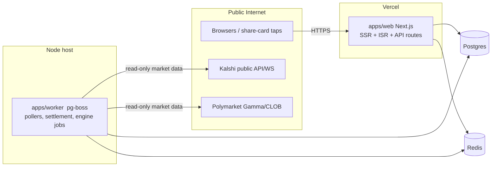
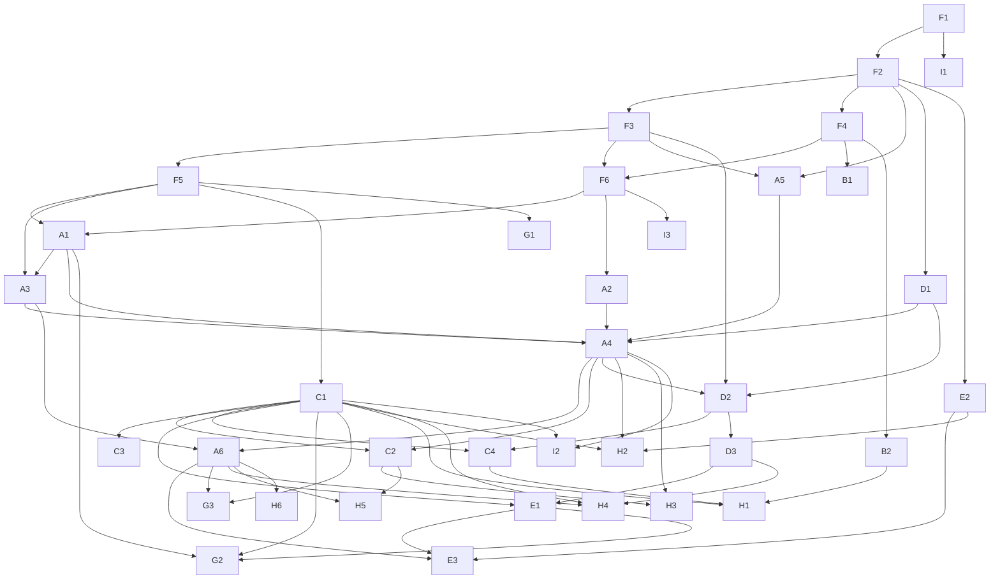

# Receipts — Technical Design Document

**Version:** 1.1 (post-red-team) · **Date:** July 18, 2026 · **Status:** Ready for implementation
**Sources of truth:** `receipts-prd.md` (v0.1), `receipts-principles.md`
**Audience:** implementing agents and engineers. This document is deliberately over-specified so that an implementer can build any single work item **without reading the PRD, the principles doc, or any other work item's code**. Where the PRD was ambiguous, this document makes a binding decision and records it in §14. Version 1.1 incorporates the resolutions of a three-lens red-team review; §17 summarizes what changed.

---

## 0. How to use this document

1. **Building the hackathon MVP?** Go straight to **§16** — it is a self-contained build plan with its own task breakdown. Sections §1.3 (invariants) and §2 (constants) still bind you.
2. Building the full product: find your task in the **Work Breakdown Structure (§12)**. Each task lists the exact spec sections it implements, the directories it may touch, its dependencies, and its acceptance criteria.
3. Read the **Invariants (§1.3)** and the **Constants Registry (§2)** in full before writing any code. They apply to every task.
4. All cross-cutting contracts (types, zod schemas, DB schema, adapter interfaces, serializers) live in shared artifacts built in Phase 0 tasks (`F1`–`F6`). **Never redefine a shared type locally; import it.** If a contract seems wrong, stop and flag it — do not fork it.
5. Stay inside your task's **file-ownership boundary (§13.2)**. If you must touch another workstream's files, that is a dependency error — flag it rather than editing.
6. Phase tags: **[P0]** foundation needed by everything; **[V1]** weeks 1–3; **[V1.5]** weeks 4–6; **[S]** stretch. The hackathon MVP (§16) is a separate, smaller plan whose code grows into this architecture.

---

## 1. Scope, non-goals, and invariants

### 1.1 What we are building

A mobile-first web application ("Receipts") that layers social competition on top of regulated prediction markets (Kalshi, Polymarket). Users take timestamped, price-stamped positions ("picks") on real markets and compete on prediction skill via three modes sharing one engine:

- **Daily Question** — one market/day, synchronized lock and reveal, streaks, share cards. [P0/V1]
- **Assigned Nemesis** — weekly matched 1v1 rivalry between strangers. [V1]
- **Duo Queue** — opt-in ranked 2v2 with matched strangers and a ladder. [V1.5]
- **Houses** — style-based permanent teams. [S] (design included; ships only per PRD §4.4 ship rule)

Non-logged-in users are first-class ("ghosts"); all artifacts have public spectator pages; signup is framed as *claiming* accrued value.

### 1.2 Non-goals (do not build, even partially)

- Any payment, deposit, balance, wallet-custody, order-routing, or trading functionality. There is no money anywhere in this codebase.
- Any collection or storage of third-party credentials: no Kalshi API keys from users, no exchange logins, no wallet private keys, no wallet transaction-approval flows.
- Native mobile apps. (Responsive web + PWA manifest only.)
- Odds-making or grading against our own opinions. Venue resolution feeds are the only ground truth; the manual override tool (§5.5) exists solely to mirror a venue's void/resolution when feeds fail, never to overrule them.
- KYC, phone verification, or government ID of any kind.
- Purchasable advantages of any kind (no store, no premium tier in scope).

### 1.3 System invariants (binding on every task)

| ID | Invariant |
|----|-----------|
| **INV-1** | No code path moves, holds, or references user money. No payment SDK appears in any lockfile. Real-money activity exists only as outbound `<a href>` links to venue pages (§5.7). |
| **INV-2** | No third-party credentials are ever accepted, transmitted, or stored. Wallet linking is exactly one flow: verify a signed nonce message (SIWE pattern, §7.13). The words "API key", "private key", "seed phrase" must never appear in any user-facing input. |
| **INV-3** | A pick is immutable after creation. Its identity fields (`question_id`, `user_id`, `side`, `entry_price`, `entry_price_at`, `picked_at`) are never updated. Only settlement-derived fields (`result`, `settled_at`) may be written, by the grading function. **Sole exception:** the claim-merge transaction (§7.1.3) may re-point `user_id` from a ghost row to the claimed row it merges into; nothing else may. |
| **INV-4** | Ratings, fingerprints, streaks, and match scores are computed **only** from picks created in-app on in-app questions. Imported wallet history (§7.13) may seed the *initial* fingerprint style axes and grant a badge; it never affects competitive scoring. |
| **INV-5** | Spectator/public pages never call venue APIs at request time. They render exclusively from our database/cache. Only worker jobs (§9) talk to venues. |
| **INV-6** | Public API responses and public pages never include: email addresses, auth identifiers, IP addresses, device fingerprints, wallet addresses (unless that user opted in via `wallet_links.show_address` — the one sanctioned conditional field), or any `settings` content. A single serializer per entity (§8.1) enforces this; handlers must use it. Serializers are also **status-conditional**: fields listed in §8.1 as gated (crowd splits, outcomes, results) must be omitted until the gating status is reached — the field-allowlist test alone is insufficient (§11). |
| **INV-7** | No dollar/share amounts from imported wallet data are ever written to our database, logs, or analytics — not even bucketed. The import reads only category, side, and position-count signals (§7.13.2, D-23). |
| **INV-8** | All competitive/social copy pressures participation and pride, never money. No template, notification, or UI string may reference real-money amounts, suggest trading, or celebrate stake size. (Outbound "Trade this on [venue]" links are the sole, neutral exception — a link, not a nudge.) |
| **INV-9** | Every timestamp is stored as UTC (`timestamptz`). Product-schedule times are defined in ET (`America/New_York`) and converted at the scheduling layer only. No naive datetimes. |
| **INV-10** | All user-facing surfaces work with zero friends and zero prior context: no feature may require inviting, knowing, or arriving with another specific person. |
| **INV-11** | State-changing endpoints validate input with the shared zod schemas and are rate-limited (§7.15). This includes `POST /api/events`. No handler parses raw JSON ad hoc. |
| **INV-12** | 18+ attestation is required at claim time and blocking (§7.1.5). Ghosts are not age-gated (no data collected), but claiming is, and every page footer carries the 18+ notice. |

---

## 2. Constants registry

Every magic number in the product lives here and in code at `packages/shared/src/constants.ts` as a single exported `CONSTANTS` object. **Do not inline these values anywhere else.** Changing a constant is a one-line change + this table.

| Key | Value | Meaning |
|-----|-------|---------|
| `QUESTION_OPEN_TIME_ET` | `09:00` | Daily Question opens (ET, single global schedule — D-13) |
| `QUESTION_LOCK_TIME_ET` | `12:00` | Picks lock (ET); a question also locks early if its market closes or settles first (§5.2) |
| `REVEAL_TARGET_TIME_ET` | `21:00` | Reveal fires at this time if grading completed earlier; otherwise within 5 min of grading (§5.6) |
| `LONGSHOT_THRESHOLD` | `0.20` | Entry price ≤ this mints a "Called it" card on a win |
| `CLAIM_PROMPT_STREAK` | `3` | Streak length that triggers the claim prompt |
| `CLAIM_PROMPT_PICKS` | `5` | Pick count that triggers the claim prompt |
| `NEMESIS_MIN_PICKS` | `5` | Resolved competitive picks required for nemesis eligibility |
| `DUO_MIN_PICKS` | `10` | Resolved competitive picks required for duo eligibility |
| `PLACEMENT_QUESTION_COUNT` | `5` | Historical questions in the placement flow |
| `GLICKO_DEFAULTS` | `rating 1500, RD 350, vol 0.06` | New-player Glicko-2 state |
| `GLICKO_TAU` | `0.5` | Glicko-2 system constant |
| `GLICKO_PERIOD_DAYS` | `7` | Rating period; idle players get step-6 RD inflation per period, capped at 350 (§7.9.4) |
| `RATING_BAND_BASE` | `200` | Max rating gap for matchmaking: `max(200, RD_a + RD_b)` |
| `CATEGORY_OVERLAP_FLOOR` | `0.15` | Min cosine similarity of category-volume vectors for nemesis pairing |
| `NEMESIS_BONUS_MARKETS` | `3` | Bonus markets per nemesis week |
| `NEMESIS_CLOSE_DEADLINE_ET` | `Tue 12:00` | Hard deadline: still-unresolved questions are excluded from the week's verdict after this (§7.11.4) |
| `DUO_MATCH_QUESTIONS` | `6` | Shared markets per duo match (2/day × 3 days) |
| `DUO_MATCH_DAYS` | `3` | Duo match duration |
| `LADDER_TIERS` | `bronze, silver, gold, platinum, diamond` | Duo ladder tiers, lowest→highest (lowercase = the DB enum values; UI capitalizes for display) |
| `LADDER_PROMOTE_PCT` / `LADDER_RELEGATE_PCT` | `0.20` / `0.20` | Weekly movement per tier: `max(1, floor(pct × n))` duos when the tier has ≥ 2 duos, else no movement; bronze never relegates, diamond never promotes |
| `STREAK_FREEZE_EARN_DAYS` | `7` | Consecutive participation days to earn one freeze |
| `STREAK_FREEZE_CAP` | `2` | Max banked freezes |
| `PRICE_POLL_OPEN_WINDOW_SEC` | `30` | Poll cadence for markets of open questions |
| `PRICE_POLL_REVEAL_WINDOW_SEC` | `5` | Poll/WS cadence during a market's reveal window (defined in §9, price-poller row) |
| `PRICE_MAX_STALENESS_SEC` | `300` | Hard gate: if the cached price is older than this, `POST /api/picks` rejects with 503 (fail closed, §5.3) |
| `PRICE_STALENESS_WARN_SEC` | `120` | Softer threshold: UI shows the "as of" timestamp prominently |
| `SPECTATOR_REVALIDATE_SEC` | `30` | ISR/CDN revalidation for public pages while a question is open/revealing; `3600` otherwise |
| `GHOST_MINT_LIMIT_PER_IP_DAY` | `20` | Ghost creations per IP per rolling 24h |
| `PICK_RATE_LIMIT` | `10/min per principal` | Pick attempts (placement flow needs >1/min) |
| `WRITE_RATE_LIMIT_DEFAULT` | `30/min per principal` | Default for other mutating endpoints |
| `AUTH_RATE_LIMIT` | `5/min per IP` | Login/claim attempts |
| `EVENTS_RATE_LIMIT` | `60/min per IP` | `POST /api/events` relay; payload ≤ 1 KB, allowlisted names + per-name props schemas (§7.17) |
| `REPORT_AUTO_PAUSE_THRESHOLD` | `3` | Distinct **qualifying** reporters (§7.15) in 30 days that auto-pause future matchmaking pending review |
| `FINGERPRINT_ACTIVE_WINDOW_DAYS` | `90` | Trailing window for fingerprint normalization cohort |
| `FINGERPRINT_MIN_RESOLVED` | `5` | Min resolved picks to be in the normalization cohort |
| `PERCENTILE_WINDOW_DAYS` | `30` | Trailing window for displayed accuracy percentile |
| `SIWE_NONCE_TTL_SEC` | `300` | Wallet-link nonce validity |
| `SESSION_MAX_AGE_DAYS` | `90` | Auth session lifetime |
| `GHOST_COOKIE_MAX_AGE_DAYS` | `400` | Ghost cookie lifetime (browser max) |

---

## 3. Architecture overview

### 3.1 Stack (binding choices)

| Layer | Choice | Notes |
|-------|--------|-------|
| Language | TypeScript 5.x, `strict: true` everywhere | Single language across app, worker, packages |
| Web app | Next.js 15 (App Router), React 19 | SSR + ISR for spectator pages; route handlers for API |
| Styling | Tailwind CSS v4 + CSS variables for design tokens (§10.1) | No component library; bespoke ticket components |
| Database | PostgreSQL 16 | Single primary; no sharding at this scale |
| ORM / migrations | Drizzle ORM + drizzle-kit migrations | Schema lives in `packages/db` |
| Cache / rate limits | Redis (Upstash-compatible API) | Nonces, rate-limit counters; Postgres is the source of truth for all product data |
| Background jobs | `pg-boss` (Postgres-backed queue + cron) in a dedicated `apps/worker` Node process | At-least-once semantics — all handlers idempotent; batch jobs run as pg-boss **singleton** jobs (one concurrent instance per job name) (§9) |
| Auth | Auth.js v5: email magic link + Google OAuth [V1]; X OAuth + passkeys behind flags [V1.5] | DB session strategy (not JWT) so sessions are revocable |
| Ghost identity | Signed `httpOnly` cookie (HMAC-SHA256, server secret) carrying ghost UUID | §7.1.2 |
| OG/share images | `@vercel/og` (satori) route handlers | §7.8 |
| Wallet verify | `viem` — `verifyMessage` only; no wallet-connect transaction capability is ever imported | §7.13 |
| Validation | `zod` schemas in `packages/shared`, used by both client and server | INV-11 |
| Testing | Vitest (unit/integration), Playwright (e2e) | §11 |
| Error tracking | Sentry (server + client) | DSN via env |
| Hosting | Vercel (web) + any Node host for worker (Railway/Fly) + managed Postgres/Redis | §12 workstream I |

### 3.2 Monorepo layout

pnpm workspaces + turborepo. **This tree is the file-ownership map — see §13.2.**

```
receipts/
├── apps/
│   ├── web/                      # Next.js app (all UI + API route handlers)
│   │   ├── src/app/              # routes (see §8.3 for the route map)
│   │   ├── src/components/       # UI components (cards/ is subdivided per §7.8)
│   │   ├── src/server/           # server-only helpers: auth, serializers, rate-limit
│   │   └── src/lib/              # client-safe helpers
│   └── worker/                   # pg-boss job runner
│       └── src/jobs/             # one file per job (§9); index.ts is append-only (§13.2)
├── packages/
│   ├── shared/                   # zod schemas, types, CONSTANTS, pure utils. Zero runtime deps besides zod.
│   ├── db/                       # drizzle schema, migrations, query helpers, gradeQuestion
│   ├── engine/                   # PURE functions only: glicko2, scoring, streaks, fingerprint, matchmaking, market-select, narration. No I/O, no DB imports.
│   └── venues/                   # VenueAdapter interface + kalshi/, polymarket/, fake/ implementations. May use fetch; never imports db.
├── e2e/                          # Playwright tests
└── turbo.json, pnpm-workspace.yaml, .github/workflows/ci.yml
```

Dependency rule (enforced by convention + lint): `shared ← db ← (web, worker)`, `shared ← engine ← (web, worker)`, `shared ← venues ← worker` (web never imports `venues` — INV-5; the admin panel's catalog search reads the `market_catalog` mirror table refreshed by a worker job, §5.2). `engine` and `venues` never import `db`. The web app may **enqueue** pg-boss jobs through `packages/db` (pg-boss lives in the same Postgres); it never executes them.

### 3.3 Runtime topology



The web app **never** talks to venues (INV-5). The worker **only reads** public market data from venues — there is no authenticated venue call anywhere in the system.

---

## 4. Domain model and database schema

Schema lives in `packages/db/src/schema/*.ts` (Drizzle). Implement exactly, including indexes and `ON DELETE` rules. All `id` columns are `uuid` defaulting to `gen_random_uuid()` unless noted. All tables get `created_at timestamptz default now()`.

**Global `ON DELETE` policy for `users` FKs:** `reactions`, `ghost_devices`, `user_stats`, `fingerprints`, `ratings`, `notifications`, `push_subscriptions`, `duo_queue` → `CASCADE`. `picks`, `posts`, `nemesis_pairings`, `duos`, `wallet_links`, `blocks`, `reports` → `RESTRICT` (handled explicitly by the deletion/merge flows, §4.10/§7.1.3). `events.principal_id` has **no FK** (analytics survive user deletion; it is an opaque uuid).

### 4.1 Identity

**Design decision (D-1):** ghosts and claimed users share one `users` table. A ghost is a `users` row with `kind='ghost'`. **Claiming upgrades the same row in place** (`ghost → pending → claimed`), so picks, streaks, and fingerprints never migrate between rows. Direct signups with no prior ghost mint a ghost row at the start of the claim flow and immediately promote it — one code path (§7.1.3).

```
users
  id            uuid PK
  kind          enum('ghost','pending','claimed') not null   -- 'pending' = authed but 18+ attestation not yet completed (§7.1.3)
  handle        text unique not null           -- generated "fox-4821" style; claimed users may customize once [V1]
  handle_customized  boolean default false
  email         citext unique null             -- pending/claimed only; NEVER serialized publicly (INV-6)
  tz            text null                      -- IANA tz, set from browser on first visit
  status        enum('active','paused_matchmaking','suspended','deleted') default 'active'
  age_attested_at   timestamptz null           -- set at claim (INV-12)
  claimed_at    timestamptz null
  deleted_at    timestamptz null
  bot_suspect   boolean default false          -- set by integrity heuristics (§7.15); excluded from leaderboards, percentiles, and lock-split snapshots
  settings      jsonb default '{}'             -- notification prefs, pseudonym prefs
  INDEX (kind), INDEX (status), INDEX (bot_suspect) WHERE bot_suspect
```

Auth.js tables (`accounts`, `sessions`, `verification_tokens`) are generated by the Auth.js Drizzle adapter in `packages/db/src/schema/auth.ts`, keyed to `users.id`.

```
ghost_devices                                   -- integrity signal only (§7.15)
  id uuid PK, user_id uuid FK->users CASCADE, ip_hash text, ua_hash text, first_seen timestamptz, last_seen timestamptz
  INDEX (ip_hash)
```

`ip_hash`/`ua_hash` are HMAC-SHA256 with a server secret — raw IP/UA are never stored (INV-6 spirit).

### 4.2 Markets and questions

```
market_catalog                                  -- venue catalog mirror for admin curation search (catalog-refresh job, §5.2)
  venue enum('kalshi','polymarket','fake'), venue_market_id text, title text, category text,
  yes_label text, no_label text, close_time timestamptz null, price_yes numeric(6,5) null,
  liquidity_usd numeric null, url text, refreshed_at timestamptz
  PK (venue, venue_market_id)

markets                                         -- venue markets we have adopted into questions
  id            uuid PK
  venue         enum('kalshi','polymarket','fake')  not null
  venue_market_id  text not null
  title         text not null
  category      enum('sports','politics','econ','culture','science','other') not null
  yes_label     text not null
  no_label      text not null
  url           text not null                   -- outbound deep link to the venue's market page, copied from the catalog at curation (web never touches venue APIs — INV-5)
  close_time    timestamptz null                -- venue trading close
  status        enum('active','settled','voided') default 'active'
  outcome       enum('yes','no','void') null    -- set by gradeQuestion (or admin override through it) only
  settled_at    timestamptz null
  last_price_yes  numeric(6,5) null             -- probability of YES, 0..1, from our poller
  price_updated_at timestamptz null
  raw           jsonb                           -- last raw venue payload, for debugging
  UNIQUE (venue, venue_market_id)
  INDEX (status), INDEX (category)

market_prices                                   -- append-only price history (reveal charts, audit)
  id bigserial PK, market_id uuid FK, price_yes numeric(6,5), observed_at timestamptz
  INDEX (market_id, observed_at)

questions                                       -- an instance of a market served in-app
  id            uuid PK
  market_id     uuid FK->markets not null
  kind          enum('daily','nemesis_bonus','duo','placement') not null
  question_date date null                       -- set for kind='daily'; unique per date
  opens_at      timestamptz not null
  locks_at      timestamptz not null            -- scheduled lock; actual lock may be earlier (market close / early settlement, §5.2)
  status        enum('draft','open','locked','graded','revealed','voided') default 'draft'
  locked_at     timestamptz null                -- actual lock moment
  graded_at     timestamptz null
  reveal_at     timestamptz null                -- scheduled reveal, set by gradeQuestion (§5.6)
  revealed_at   timestamptz null
  crowd_yes     integer default 0               -- live counters, maintained transactionally with pick insert/merge
  crowd_no      integer default 0
  crowd_yes_at_lock integer null                -- immutable lock snapshot, EXCLUDING bot_suspect users (§7.15); feeds contrarianism, reveal bars, and all D-16 displays
  crowd_no_at_lock  integer null
  price_yes_at_lock numeric(6,5) null           -- immutable price snapshots (this is where "keep lock/settle snapshots" lives — the retention job may prune market_prices freely)
  price_yes_at_settle numeric(6,5) null
  headline      text not null                   -- editorial phrasing of the question
  UNIQUE (question_date) WHERE kind='daily'
  INDEX (status, locks_at), INDEX (kind)

question_participants                           -- rows exist ONLY for kind IN ('nemesis_bonus','duo'); daily/placement have none
  question_id uuid FK->questions, user_id uuid FK->users, PK (question_id, user_id)
```

**Question state machine** (all transitions performed by `question-lifecycle` or `gradeQuestion` (§5.5); the admin override flows through `gradeQuestion`):

```
draft → open        (at opens_at, only if a fresh price exists)
open → locked       (at earliest of: locks_at; market close_time; resolution observed while open — §5.2/§5.5)
locked → graded     (gradeQuestion: outcome known, picks graded, stats recomputed; results still HIDDEN)
graded → revealed   (at reveal_at — the synchronized moment; results become visible)
draft|open|locked → voided   (venue voids the market; automatic, with a Sentry alert on every void — D-17a)
```

`markets.status` has no `closed` state: trading close is captured by the question locking early; the market row moves `active → settled|voided` only.

### 4.3 Picks (the atomic unit — INV-3)

```
picks
  id            uuid PK
  question_id   uuid FK->questions not null
  user_id       uuid FK->users not null
  side          enum('yes','no') not null
  entry_price   numeric(6,5) not null           -- probability of the CHOSEN side at pick time (if side='no', 1 - last_price_yes)
  entry_price_at  timestamptz not null          -- price_updated_at of the quote used (staleness transparency)
  picked_at     timestamptz not null default now()
  result        enum('pending','win','loss','void') default 'pending'
  settled_at    timestamptz null
  UNIQUE (question_id, user_id)
  INDEX (user_id, picked_at), INDEX (question_id)
```

Pick creation is a single transaction: insert pick + increment `questions.crowd_yes/no`. Rejected when: question not `open`; `now() >= locks_at`; the question has `question_participants` rows and the principal is not among them (privacy of nemesis/duo questions); `kind='placement'` (placement picks go through the placement API only, §5.4); cached price older than `PRICE_MAX_STALENESS_SEC` (503); or a pick already exists (unique constraint is the final arbiter under concurrency; handler maps the violation to HTTP 409 returning the existing pick — with no crowd split pre-lock, D-16).

### 4.4 Streaks and records

```
user_stats                                      -- one row per user; written ONLY by gradeQuestion, reveal-fanout, and claim-merge, each of which RECOMPUTES from pick history (never blind increments — idempotent and order-safe by construction)
  user_id       uuid PK FK->users CASCADE
  participation_streak   integer default 0      -- consecutive daily-question days with a pick (D-4); voided and question-less dates are skipped (D-5)
  best_participation_streak integer default 0
  win_streak    integer default 0               -- recomputed by question_date order (not settlement order) — safe under out-of-order settlement
  best_win_streak integer default 0
  last_daily_pick_date  date null
  freezes_available     integer default 0       -- cap CONSTANTS.STREAK_FREEZE_CAP
  freeze_progress_days  integer default 0
  picks_total   integer default 0
  picks_resolved integer default 0
  wins          integer default 0
  edge_sum      numeric(12,6) default 0         -- Σ (result_value − entry_price) over resolved, non-void competitive picks
  category_stats jsonb default '{}'             -- {category: {picks, wins}}
  updated_at    timestamptz
```

### 4.5 Engine outputs

```
fingerprints                                    -- exactly ONE row per user, UPSERTED nightly
  user_id       uuid PK FK->users CASCADE
  computed_at   timestamptz
  n_resolved    integer                         -- resolved competitive picks (placement excluded)
  accuracy      numeric(6,5) null               -- NULL when n_resolved = 0 (display "—"); never fabricate 0
  edge          numeric(8,6) null               -- NULL when n_resolved = 0
  chalk_affinity numeric(6,5) null              -- style axes: computed from styleInputPicks (competitive + placement, §5.4); NULL only if no style inputs at all
  contrarianism numeric(6,5) null
  category_profile jsonb                        -- {category: share_of_volume} normalized to sum 1
  category_accuracy jsonb                       -- {category: accuracy} (only categories with ≥3 resolved competitive)
  timing        numeric(6,5) null
  calibration   jsonb null                      -- reserved for confidence slider [flagged off]
  style_vector  jsonb                           -- z-scored [chalk, contrarian, timing, cat_sports, cat_politics, cat_econ, cat_culture] (§7.9.3)
  provisional   boolean default true            -- true until n_resolved ≥ NEMESIS_MIN_PICKS

ratings
  user_id uuid PK FK->users CASCADE
  rating numeric(8,4) default 1500, rd numeric(8,4) default 350, vol numeric(8,6) default 0.06
  updated_at timestamptz
  percentile_30d numeric(6,5) null              -- display-only (§7.9.4); not used in matchmaking
```

### 4.6 Nemesis

```
nemesis_seasons
  id uuid PK, name text, starts_on date, ends_on date       -- a season = a quarter; repeats forbidden within a season

nemesis_pairings
  id uuid PK
  season_id uuid FK->nemesis_seasons
  week_start date not null                       -- the Monday
  user_a uuid FK->users, user_b uuid FK->users   -- store with user_a < user_b (uuid ordering)
  status enum('active','completed','cancelled') default 'active'
  score_a integer default 0, score_b integer default 0
  edge_a numeric(10,6) default 0, edge_b numeric(10,6) default 0   -- tiebreak accumulator
  winner enum('a','b','tie') null
  is_rematch boolean default false
  INDEX (season_id, user_a, user_b)

nemesis_members                                  -- hard one-pairing-per-user-per-week guarantee (retry-safe under at-least-once jobs)
  week_start date, user_id uuid FK->users, pairing_id uuid FK->nemesis_pairings
  PK (week_start, user_id)                       -- written in the same transaction as the pairing insert

nemesis_bonus_questions
  pairing_id uuid FK->nemesis_pairings, question_id uuid FK->questions, PK (pairing_id, question_id)

rematch_requests
  id uuid PK, requester uuid FK->users, target uuid FK->users, season_id uuid FK, status enum('pending','accepted','declined') default 'pending'
  UNIQUE (requester, target, season_id)
  -- Semantics (D-25): ONE row with status='accepted' encodes mutual consent (requester asked, target accepted). No reciprocal row is required.
```

### 4.7 Duo

```
duos
  id uuid PK
  user_a uuid FK->users, user_b uuid FK->users   -- user_a < user_b
  status enum('active','dissolved') default 'active'
  formed_at timestamptz
  rating numeric(8,4) default 1500, rd numeric(8,4) default 350, vol numeric(8,6) default 0.06
  tier enum('bronze','silver','gold','platinum','diamond') default 'bronze'
  matches_played integer default 0
  joint_correct integer default 0, joint_total integer default 0   -- chemistry numerator/denominator (§7.12.4)
  UNIQUE (user_a, user_b) WHERE status='active'

duo_members                                      -- hard one-active-duo-per-user guarantee
  user_id uuid PK FK->users, duo_id uuid FK->duos
  -- row exists only while the duo is active; deleted on dissolve, in the same transaction

duo_queue
  user_id uuid PK FK->users CASCADE, enqueued_at timestamptz, preferences jsonb default '{}'

duo_matches
  id uuid PK
  duo_x uuid FK->duos, duo_y uuid FK->duos
  window_start date, window_end date
  status enum('scheduled','active','completed','cancelled') default 'scheduled'
  score_x integer default 0, score_y integer default 0
  edge_x numeric(10,6) default 0, edge_y numeric(10,6) default 0
  winner enum('x','y','tie') null
  INDEX (status, window_start)
  UNIQUE (duo_x) WHERE status IN ('scheduled','active')   -- one live match per duo
  UNIQUE (duo_y) WHERE status IN ('scheduled','active')

duo_match_questions
  match_id uuid FK->duo_matches, question_id uuid FK->questions, PK (match_id, question_id)
```

### 4.8 Wallet linking (§7.13)

```
wallet_links
  id uuid PK
  user_id uuid FK->users
  address text not null                          -- checksummed 0x…; public on-chain data, but display gated
  chain enum('polygon') default 'polygon'
  verified_at timestamptz not null
  show_address boolean default false             -- separate opt-in (PRD §6.2)
  import_status enum('pending','done','failed') default 'pending'
  UNIQUE (user_id, address), UNIQUE (address)    -- one account per wallet

wallet_import_stats                              -- derived enrichment; deleted on unlink. NO size data of any kind (INV-7, D-23)
  wallet_link_id uuid PK FK->wallet_links ON DELETE CASCADE
  category_profile jsonb, chalk_affinity numeric(6,5), n_positions integer
  computed_at timestamptz
```

### 4.9 Community, safety, sharing, ops

```
threads    id uuid PK, subject_type enum('question','nemesis_pairing','duo_match'), subject_id uuid, UNIQUE(subject_type, subject_id)
posts      id uuid PK, thread_id uuid FK, user_id uuid FK, body text (≤ 1000 chars), status enum('visible','removed') default 'visible', INDEX (thread_id, created_at)
           -- posting on nemesis_pairing/duo_match threads is restricted to that match's participants (§7.14); daily-question threads accept any claimed user
reactions  user_id uuid FK CASCADE, subject_type enum('post','pick','reveal'), subject_id uuid, emoji enum('fire','skull','trophy','clown'), PK (user_id, subject_type, subject_id)
           -- one reaction per subject per user. POST with the same emoji removes it (toggle off); a different emoji REPLACES the row. subject_id for 'reveal' = the question id.
blocks     blocker uuid FK, blocked uuid FK, PK (blocker, blocked)
reports    id uuid PK, reporter uuid FK, reported uuid FK, context enum('nemesis','duo','thread'), subject_id uuid null, reason text, status enum('open','actioned','dismissed') default 'open'
flags      key text PK, enabled boolean, payload jsonb default '{}'    -- feature flags (§7.16)
admin_audit id uuid PK, actor text, action text, subject jsonb, at timestamptz
events     id bigserial PK, name text, principal_id uuid null (no FK), anon_id text null, props jsonb, at timestamptz, INDEX (name, at)   -- product metrics (§7.17)
notifications id uuid PK, user_id uuid FK CASCADE, kind text, payload jsonb, read_at timestamptz null, sent_at timestamptz null, INDEX (user_id, created_at)
push_subscriptions user_id uuid FK CASCADE, endpoint text, keys jsonb, PK (user_id, endpoint)
```

### 4.10 Account deletion semantics (D-8)

"Delete my account" (claimed) or "forget this device" (ghost, client-side clear):

1. `users.status='deleted'`, `deleted_at=now()`, `email=null`, auth rows deleted, `handle` replaced with `deleted-{shortid}`.
2. Wallet links and `wallet_import_stats` hard-deleted.
3. Picks are **retained but anonymized**: they remain in crowd counters and aggregate stats (already anonymous), but all public serializers omit deleted users, and profile/leaderboard/matchup pages 404 or show "account deleted".
4. Active nemesis pairings/duos are cancelled (`nemesis_members`/`duo_members` rows removed); the counterpart gets a neutral "your opponent left" note (no drama templates on deletion).
5. Posts flip to `status='removed'`.

Orphaned-ghost pruning (`data-retention`, §9) deletes ghosts with zero picks after 30 days; the CASCADE rules (§4 header) make this a plain `DELETE`. A still-live `receipts_ghost` cookie whose uuid no longer resolves is treated as absent — `getPrincipal` clears it and a fresh ghost mints on the next participating tap (§7.1.2).

---

## 5. Core loop subsystems

### 5.1 Venue integration layer (`packages/venues`)

One interface, three implementations. **Only `apps/worker` may instantiate adapters** (INV-5).

```ts
// packages/venues/src/types.ts  (built in F4; do not modify in feature tasks)
export interface VenueAdapter {
  readonly venue: 'kalshi' | 'polymarket' | 'fake';
  /** List candidate markets for curation. Filters are best-effort; caller re-filters. */
  listMarkets(opts: { closesWithinHours?: number; categories?: Category[] }): Promise<VenueMarket[]>;
  /** Fetch one market's current state. */
  getMarket(venueMarketId: string): Promise<VenueMarket | null>;
  /** Current YES probability, 0..1. */
  getPrice(venueMarketId: string): Promise<{ priceYes: number; observedAt: Date } | null>;
  /** Resolution if settled. `void` for cancelled/invalid markets; null while unresolved or disputed. */
  getResolution(venueMarketId: string): Promise<{ outcome: 'yes' | 'no' | 'void'; settledAt: Date } | null>;
  /** Optional streaming; poller falls back to getPrice at the reveal cadence when absent. */
  subscribePrices?(venueMarketId: string, cb: (p: { priceYes: number; observedAt: Date }) => void): () => void;
}

export interface VenueMarket {
  venueMarketId: string; title: string; category: Category | null;
  yesLabel: string; noLabel: string; closeTime: Date | null;
  priceYes: number | null; liquidityUsd: number | null;   // liquidity used ONLY for curation filtering; never stored per-user
  url: string;                                            // outbound deep link to the venue's market page
}
```

- **Kalshi adapter:** public REST (`/trade-api/v2/markets`, `/markets/{ticker}`), no auth. Prices from `yes_bid/yes_ask` midpoint ÷ 100. WebSocket ticker feed for `subscribePrices` where available. Token-bucket client capped at 5 req/s; poller batches. Demo environment via `KALSHI_BASE_URL` env in development.
- **Polymarket adapter:** Gamma API for catalog/metadata, CLOB midpoint for price. `outcome` mapped from resolution payload; disputed/unresolved → `null` (not `void`).
- **Fake adapter:** deterministic in-memory markets with scriptable price walks and settlement. Used by all tests, local dev, and e2e. Implements the full interface including `subscribePrices`.
- Category mapping from venue taxonomies to our `Category` enum lives in each adapter (`mapCategory`), defaulting to `'other'`.
- All adapter fetches go through a shared `fetchWithRetry` (3 tries, exponential backoff 1s/2s/4s, 10s timeout) and never throw raw — they return `null`/empty and log.

### 5.2 Daily Question lifecycle

**Catalog mirror.** The `catalog-refresh` job (§9) calls `listMarkets` on each adapter every 30 minutes and upserts `market_catalog`. The admin panel's curation search queries this table only (keeps INV-5 intact; web never imports adapters). A "refresh now" button in the admin panel enqueues the job via pg-boss.

**Curation [P0: manual].** Admin picks a market from the mirror: sets `headline`, `yes_label`/`no_label`, `question_date`, creating the `markets` row (copying `url` and metadata from the catalog) and a `draft` question with `opens_at = question_date 09:00 ET`, `locks_at = question_date 12:00 ET`. The admin UI warns when `close_time < locks_at` (the question would lock early). Curation rules (PRD §4.1) are a checklist in the admin UI at MVP; [V1.5] adds `candidate-scanner` suggestions.

**Lifecycle job** (`question-lifecycle`, every minute, singleton, §9), each transition under `SELECT … FOR UPDATE` on the question row:
- `draft → open` at `opens_at` — only if `markets.last_price_yes` is fresh (≤ `PRICE_MAX_STALENESS_SEC`); otherwise stay draft and alert (a question must never open unpriced).
- `open → locked` at the earliest of `locks_at` or the market's `close_time`. Locking writes `locked_at` and the **immutable lock snapshot**: `price_yes_at_lock` plus `crowd_yes_at_lock`/`crowd_no_at_lock` computed by counting picks joined to `users` where `bot_suspect = false` (§7.15) — the snapshot, not the live counters, feeds contrarianism, reveal bars, and all D-16 displays.
- `graded → revealed` at `reveal_at` (§5.6), then enqueue `reveal-fanout`.

**Voiding:** when `getResolution` returns `void`, `gradeQuestion` sets market `voided`, question `voided`, all picks `result='void'`, and fires a Sentry alert (every void is operator-reviewed after the fact, D-17a). Streaks treat the date as nonexistent (D-5; §5.8). Days with **no** daily question at all are treated identically — skipped, never streak-breaking.

### 5.3 Picks and entry-price stamping

`POST /api/picks` (§8.2) — the most important handler in the product:

1. Resolve principal: session user, else ghost cookie, else **mint a ghost inline** (the one-tap spectator conversion; §7.1.2) — all within this request.
2. Validate per §4.3: open, pre-lock, participant-authorized, non-placement, no duplicate.
3. Read the current price **from our `markets` row** (`last_price_yes`, `price_updated_at`) — never from the venue at request time (INV-5). If `side='no'`, `entry_price = 1 − last_price_yes`. Reject 503 if the price is null **or older than `PRICE_MAX_STALENESS_SEC`** (fail closed: a stale stamp is a gameable stamp — residual ≤30s window accepted per D-21).
4. Insert pick + bump crowd counters in one transaction. Unique violation → 409 with the existing pick.
5. Return the created pick + **total participant count only** (`crowd_yes + crowd_no` as one number). The split is never returned pre-lock, including on the 409 path (D-16).

Rate limit: `PICK_RATE_LIMIT`. Emit `pick_created` event.

### 5.4 Placement flow (`kind='placement'`) [V1]

Five historical questions (real past markets with known outcomes, hand-loaded as fixtures with `question_date=null`). Placement picks are created through `POST /api/placement/pick` only, and are **graded synchronously at insert**: the fixture's known outcome sets `result` in the same transaction (`settled_at = picked_at`). Placement never touches `settlement-watcher`.

Placement picks never count toward: streaks, displayed pick totals, eligibility thresholds, leaderboards, percentiles, or ratings. Two sanctioned query helpers in `packages/db` are the **only** ways to fetch picks for engine consumption (D-18):
- `resolvedCompetitivePicks(userId)` — `kind IN ('daily','nemesis_bonus','duo')`, resolved, non-void. Feeds all skill metrics, eligibility, and scoring.
- `styleInputPicks(userId)` — the above **plus** `kind='placement'`. Feeds only the fingerprint style axes (chalk, contrarianism, timing, category_profile), which is how placement "seeds a provisional fingerprint".

Placement sets Glicko at defaults with maximum RD — placement informs style, never skill rating. Placement fixtures are served only through the placement API; `GET /api/questions/{id}` returns 404 for `kind='placement'` (they contain recorded outcomes, §8.2).

### 5.5 Settlement and grading

Two cooperating pieces, built around one idempotent function:

**`gradeQuestion(questionId)`** — shared function in `packages/db/src/grade.ts`, called by the watcher and by the admin override. One transaction, `SELECT … FOR UPDATE` on the question row:

1. If question status is not `open` or `locked` → no-op return. Idempotency is keyed on **question status**, not pick states — and because every step below commits atomically with the status flip, a crash retries the whole function safely (no partial-completion no-op hole).
2. If status is `open` (resolution arrived mid-window): perform the lock transition first (snapshot per §5.2) — early settlement must never leave a window selling known winners.
3. Write market `settled` + `outcome` + `price_yes_at_settle`; set every pick on the question to `win`/`loss`/`void` (`result_value = 1` if `pick.side = outcome`, else `0`).
4. **Recompute** `user_stats` for every affected user from full pick history (wins, edge_sum, picks_resolved, category_stats, win-streak by `question_date` order per §5.8) — recomputation, never incremental updates, so retries and out-of-order settlements are harmless.
5. Set question `graded`, `graded_at = now()`, and `reveal_at` per §5.6.
6. Commit; then emit `question_settled` event.

**`settlement-watcher`** (every 2 min, singleton): for each question in `open` or `locked` whose market is unresolved, call `adapter.getResolution`; on a non-null result, call `gradeQuestion`. Scanning `open` questions closes the early-settlement hole: a market that resolves at 10:30 locks-and-grades immediately instead of selling known winners until noon.

**Manual override (admin, [P0]):** the admin panel sets the market's outcome (`yes`/`no`/`void`) **and then calls the same `gradeQuestion`** — the override is a resolution source, not a separate pipeline, so grading, stats, and reveal scheduling work identically when the feed is down. Two-step confirmation (type the outcome to confirm), the venue's live page linked beside the control (the operator mirrors venue truth, §1.2 — the link + audit trail is the safeguard, an accepted procedural control), an `admin_audit` row, and a Sentry info event on every manual override.

### 5.6 The reveal

**Timing (D-7):** `gradeQuestion` sets `reveal_at = max(graded_at, question_date 21:00 ET)`. The lifecycle job flips `graded → revealed` at `reveal_at` and enqueues `reveal-fanout`. So: settle early → grade silently, reveal at 21:00 sharp; settle late → reveal within minutes of grading. The question page shows a countdown to `reveal_at` once graded.

**Result secrecy until reveal:** while a question is `graded`, every serializer continues to hide `market.outcome`, `pick.result`, and win/loss-derived deltas — from the picker themself too (the ceremony is synchronized for everyone). `user_stats` changes land at grading but are not surfaced until reveal-fanout refreshes caches. The status-conditional serializer rules in §8.1 are the enforcement point; §11 requires a status-matrix test.

The reveal experience (client): outcome stamp animation → your result → crowd split bars (lock snapshot) → your percentile → streak update. Motion budget is spent here and only here (PRD §8). Spectators see everything except the personal panels.

**Daily percentile (D-9):** displayed as "You beat X% of today's pickers." Ranking among the day's non-`bot_suspect` pickers: winners above losers; within winners, lower `entry_price` ranks higher; within losers, higher `entry_price` ranks higher. `X = (count ranked strictly below you) / (total − 1)`; single-picker days show the crowd split instead. Computed at reveal-fanout; derived, not stored.

### 5.7 Outbound venue links

Every question/market surface renders "Trade this on Kalshi →" / "Trade this on Polymarket →" using `markets.url` + referral params from env (`KALSHI_REF_PARAM`, `POLYMARKET_REF_PARAM`, empty until programs approved). Plain link, `rel="noopener"`, neutral styling — never a CTA button, never in notification copy (INV-8).

### 5.8 Streaks, freezes, records

Definitions (D-4, D-5):

- **Participation streak:** consecutive daily `question_date`s with a pick, where voided dates and dates with no daily question **do not exist** (they neither break nor extend). Evaluated inside `reveal-fanout` for each daily question in `question_date` order — never by wall-clock cron — so a question voided in the evening can never have already broken anyone's streak (there is no noon reset job to roll back). At reveal of date D: pickers extend (and accrue freeze progress); users with `participation_streak > 0` or `freezes_available > 0` who didn't pick either consume a freeze (streak preserved, notify) or reset to 0. Voided questions skip the roll entirely.
- **Win streak:** recomputed from the user's resolved daily picks ordered by `question_date` (voids skipped) inside the `user_stats` recompute (§5.5 step 4) — immune to out-of-order settlement.
- **Freeze accrual:** every `STREAK_FREEZE_EARN_DAYS` consecutive participation days adds one freeze up to `STREAK_FREEZE_CAP`. Never purchasable (hard line).
- Records surfaced on profile: best streaks, lifetime accuracy, lifetime edge, per-category accuracy, "Called it" count (wins with `entry_price ≤ LONGSHOT_THRESHOLD`).

---

## 6. (reserved)

Section intentionally unused — numbering aligns subsystem specs under §7 with the WBS references in §12.

## 7. Feature subsystems

### 7.1 Identity: ghosts, claiming, auth

#### 7.1.1 Principal resolution (server helper, `apps/web/src/server/principal.ts`)

Order: (1) Auth.js session → pending/claimed user; (2) valid `receipts_ghost` cookie whose uuid resolves to a live ghost row → ghost user; (3) none. A cookie with a bad HMAC **or** a uuid that no longer resolves (pruned ghost) is cleared and treated as absent — never a 500. A single `getPrincipal(req)` helper is the only sanctioned entry point; every handler uses it.

#### 7.1.2 Ghost minting

- Cookie `receipts_ghost` = `{uuid}.{hmac}` (HMAC-SHA256, `GHOST_COOKIE_SECRET`), `httpOnly`, `Secure`, `SameSite=Lax`, max-age 400 days.
- Minting inserts a `users(kind='ghost')` row with a generated handle: `{animal}-{4 digits}` from a 256-animal wordlist; retry on collision. Also upserts `ghost_devices` with hashed IP/UA.
- Mint happens lazily: on first pick, first reaction, or explicit "pick your side" tap — never on passive page view (spectator pages stay cookie-free and cacheable, PRD §3).
- The first-ever pick confirmation includes one line: *"Picks and records are public on Receipts."* — the publicness disclosure reaches ghosts, not just claimers (D-26).
- Rate limit `GHOST_MINT_LIMIT_PER_IP_DAY` per hashed IP (Redis counter). Over limit → 429 with friendly copy; existing ghosts unaffected.
- localStorage mirror of the ghost token for cookie-loss resilience; client re-sends it via header `x-receipts-ghost` and the server re-sets the cookie if valid. Accepted trade-off (logged): the mirror makes the token XSS-readable, but it authorizes only ghost-scope actions (picks/reactions on a pseudonymous identity); claimed accounts authenticate via httpOnly session cookies only and never use this header.

#### 7.1.3 Claiming

One code path for everyone (D-1):

1. **Start:** `POST /api/claim/start`. If no ghost cookie exists (direct signup), mint a ghost first — the rest of the flow is identical.
2. **Auth:** Auth.js sign-in (email magic link / Google). On the callback:
   - **New identity** (no existing user for this email/OAuth account): promote the ghost row to `kind='pending'`, attach email/account rows. A session IS issued for the pending user, but middleware confines pending sessions to exactly three surfaces: `POST /api/claim/attest`, `GET /api/me`, and sign-out. Everything else returns 403 `claim_incomplete`.
   - **Existing identity** (returning user on a new device that has a ghost): keep the existing claimed account and **merge the ghost into it** (below); the session is issued for the existing claimed user.
3. **Attest:** the claim screen shows an unchecked-by-default "I am 18 or older" checkbox plus the publicness sentence — *"Your picks, record, and rating are public. You can stay pseudonymous forever."* `POST /api/claim/attest` (pending session required) sets `kind='claimed'`, `claimed_at`, `age_attested_at`. Without it the account stays `pending` and unusable (INV-12; no deadlock: the pending session exists precisely to call this endpoint).

**Ghost→claimed merge** (single transaction, `apps/web/src/server/claim-merge.ts`, `admin_audit` row on completion):

1. For each question answered by **both** identities: keep the claimed account's pick; `DELETE` the ghost's pick and decrement that question's **live** `crowd_yes/no` counter (lock snapshots are immutable and unaffected — they were computed from whoever existed at lock).
2. Re-point the ghost's remaining picks to the claimed `user_id` (the sanctioned INV-3 exception).
3. Re-point the ghost's `reactions` (delete rows that would violate the PK against existing claimed reactions). `posts` cannot exist for ghosts (posting is claimed-only).
4. Delete the ghost's `user_stats`, `fingerprints`, `ratings` rows (CASCADE handles the rest on row deletion).
5. Recompute the claimed user's `user_stats` from full pick history.
6. Delete the ghost `users` row.

Claim prompts (UI): shown at `CLAIM_PROMPT_STREAK` and `CLAIM_PROMPT_PICKS` per PRD copy; dismissible; never blocks the daily loop.

#### 7.1.4 Sessions & handles

DB sessions, 90-day max age, rolling. Claimed users may customize their handle **once** ([V1], 3–20 chars, `[a-z0-9-]`, uniqueness enforced, profanity denylist in `packages/shared/src/handle-denylist.ts`). The single allowed change updates in place; the old handle 404s (acceptable at this scale, D-10).

#### 7.1.5 Age gate

Attestation per §7.1.3 is blocking. Footer of every page (including spectator pages): "18+ · Receipts never handles money." Pre-claim exposure posture is logged as D-22.

### 7.8 Share artifacts, spectator pages, OG/embeds

*(Numbered to match WBS references; §7.2–7.7 are covered in §5 above.)*

- **Public pages (no auth, no cookie required to render):** `/q/{questionId}` (question/reveal), `/u/{handle}` (profile/track record), `/vs/{pairingId}` (nemesis matchup), `/duo/{duoId}` (duo page), `/ladder` (duo ladder), `/leaderboard/{category?}`. All are ISR pages revalidating per `SPECTATOR_REVALIDATE_SEC`, rendering purely from DB (INV-5), containing zero principal-specific markup at the server layer (personal panels hydrate client-side from `/api/me/*` so pages stay CDN-cacheable).
- **Every public page has one-tap participation** (P2/P9): open questions → "pick your side" buttons (mints ghost); revealed questions → "play tomorrow's question" CTA; matchup/profile pages → "start your streak" CTA.
- **OG images:** `/q/{id}/og.png`, `/u/{handle}/og.png`, `/vs/{id}/og.png`, `/pick/{pickId}/card.png` via satori. Ticket-styled per §10.1: monospace numerals, perforation edge, stamp motif, side + entry price + result/live probability + streak + handle + QR (to the live page). Rendered at 1200×630 (OG) and 1080×1920 (story) via `?format=story`. **Status gating (D-16):** `/pick/{pickId}/card.png` returns 404 until the pick's question is `locked` (side/entry visible from lock), and result stamps render only from `revealed`. OG images use the same serializers as pages — they can never leak more than the page does.
- **Card taxonomy** — each is a satori template; the cards directory is subdivided by owner (§13.2): `cards/daily/` (A6): daily win, daily loss, busted streak, "Called it"; `cards/claim/` (C1): claim-your-ghost; `cards/profile/` (C2): profile track-record; `cards/nemesis/` (E3): assignment, verdict-winner, verdict-loser; `cards/duo/` (H4): chemistry, match result. Loser cards must be visually equal-or-better than winner cards (P3) — a review checklist item on every card PR.
- **Share flow:** native Web Share API with card image + URL; fallback copy-link + download card. Emits `card_shared` event with card type.
- **oEmbed** endpoint `/api/oembed?url=` returning rich type for question/profile URLs [V1.5]; standard OG/Twitter meta on all public pages [P0].
- **SEO:** question pages indexable with `headline`, crowd split (post-lock), and outcome (post-reveal) in SSR HTML; sitemap of questions/profiles [V1.5].

### 7.9 The engine — fingerprints, ratings, percentiles (`packages/engine`)

All engine code is **pure**: `(inputs) → outputs`, no I/O. The worker loads inputs via `packages/db` helpers and persists outputs. Every algorithm is unit-testable with golden fixtures (§11).

#### 7.9.1 Inputs

`resolvedCompetitivePicks(userId)` for skill axes and eligibility; `styleInputPicks(userId)` (adds placement) for style axes (§5.4). Both joined with question + market metadata: side, entry_price, result, category, picked_at, opens_at, locks_at, lock-snapshot crowd split.

#### 7.9.2 Fingerprint axes (exact formulas)

Let `P` = the relevant pick set per §7.9.1; `n = |P|`; `r_i ∈ {0,1}` result value; `p_i` entry price (chosen side); `c_i` category; `m_i = 1` if the pick was on the minority side of the lock-snapshot crowd split (`crowd_*_at_lock`, bot-excluded), `0.5` if exactly split or the snapshot has < 2 pickers, else `0`.

Skill axes over competitive picks (all `NULL` when `n_resolved = 0` — never fabricate zeros):
- `accuracy = Σ r_i / n`
- `edge = Σ (r_i − p_i) / n`  (positive = beat the price)

Style axes over style-input picks (placement included):
- `chalk_affinity = Σ p_i / n`
- `contrarianism = Σ m_i / n`
- `category_profile[c] = |{i : c_i = c}| / n`
- `category_accuracy[c]` = accuracy within c, competitive picks only, only where count ≥ 3
- `timing = Σ clamp((picked_at_i − opens_at_i)/(locks_at_i − opens_at_i), 0, 1) / n`
- **Brier note (D-6):** with one-tap binary picks (no confidence), Brier degenerates to `1 − accuracy`. We store `accuracy` and reserve true Brier/calibration for the flagged confidence slider. The PRD's "Brier score" requirement is satisfied by this documented degeneracy.

#### 7.9.3 Style vector & normalization

`style_vector = z-scores of [chalk_affinity, contrarianism, timing, category_profile.sports, .politics, .econ, .culture]` computed against the **active cohort** (users with ≥ `FINGERPRINT_MIN_RESOLVED` resolved competitive picks in the last `FINGERPRINT_ACTIVE_WINDOW_DAYS`). The nightly job computes cohort means/stddevs once, then all vectors. Stddev of 0 (degenerate axis) → z-score 0 for everyone on that axis. Style distance `d(u,v) = 1 − cos(su, sv)`; if either vector is all-zeros, define `d = 1` (neutral-maximal, keeps them matchable).

#### 7.9.4 Ratings

- **Glicko-2** implementation in `packages/engine/src/glicko2.ts` per Glickman's paper, `τ = GLICKO_TAU`. Must match the published worked example to 4 decimal places (golden test). **Rating period = `GLICKO_PERIOD_DAYS` (one week):** the nightly job applies the paper's step-6 RD inflation (capped at 350) for any rated player with no results in the elapsed period — a returning player after months away correctly re-enters with high uncertainty, which the matchmaking band respects.
- **Inputs:** completed nemesis weeks (win/loss/tie, §7.11.4) update **individual** ratings; completed duo matches update the duo's **team** rating only (D-11 — duo performance feeds individual fingerprints but not individual Glicko).
- **Percentile (display only):** `percentile_30d` = trailing-30-day daily accuracy percentile among the active, non-`bot_suspect` cohort (min 5 resolved picks in window). Never used in matchmaking.
- Ratings and the full pick log are public (PRD §5.2); the profile page links "full record" to a paginated pick history.

### 7.10 (reserved — merged into 7.9)

### 7.11 Assigned Nemesis

#### 7.11.1 Eligibility & pool

Claimed users, `status='active'`, ≥ `NEMESIS_MIN_PICKS` resolved competitive picks, nemesis participation not paused, not auto-paused. Pool snapshots Monday 08:00 ET.

#### 7.11.2 Matching algorithm (`packages/engine/src/matchmaking/nemesis.ts` — pure)

```
Input: candidates[{userId, rating, rd, styleVector, categoryProfile, tz, pastOpponents(seasonSet), blockedSet}]
1. Edges: for every unordered pair (u,v) where
     |rating_u − rating_v| ≤ max(RATING_BAND_BASE, rd_u + rd_v)          # fair fights (P12)
     cosineSim(categoryProfile_u, categoryProfile_v) ≥ CATEGORY_OVERLAP_FLOOR
     v ∉ pastOpponents_u (this season)  AND  no block either direction
   weight(u,v) = styleDistance(u,v) + 0.1 · tzAffinity(u,v)              # tzAffinity ∈ {0,1}: same reveal-friendly offset bucket
2. Greedy max-weight matching: sort edges desc, take if both unmatched.
3. Improvement pass (×3): for random matched pairs (a-b, c-d), swap to (a-c, b-d) or (a-d, b-c) if total weight strictly increases and constraints hold.
4. Mutual rematches (a rematch_requests row with status='accepted', D-25) are forced pairs, removed from the pool first.
5. Unmatched leftovers (odd pool, constraint islands): pair best-effort ignoring the category floor (keep the rating band — never relax fairness, P12); if still unmatched, the user gets a "bye week" notification and a priority flag for next week.
Output: pairings[{userA, userB, isRematch}]
```

Determinism: the function takes an injected `seed` for the improvement pass so tests are reproducible.

#### 7.11.3 Week structure

`nemesis-assign` job Monday 09:00 ET (singleton): create pairings + `nemesis_members` rows in one transaction per pairing (the PK on `nemesis_members` makes partial-failure retries safe — a user can never end up in two pairings). Then create `NEMESIS_BONUS_MARKETS` bonus questions per pairing, selected by `packages/engine/src/market-select.ts` (pure function, owned by D3: given catalog candidates + both users' category profiles, pick markets from the intersection of top categories — engine-picked per D-12). **Selection filter:** bonus markets must have non-null `close_time ≤ Sunday 20:00 ET` of the match week (guarantees lockability and near-certain resolution before the close deadline). Bonus questions are `kind='nemesis_bonus'` with `question_participants` rows for the two players; `locks_at = min(market close_time, Friday 12:00 ET)`; hidden from non-participants until lock (§8.2), shown on the public matchup page after lock. Assignment notifications + "Meet your nemesis" cards fan out at 09:00 ET.

#### 7.11.4 Scoring

Scored questions = that week's daily questions (Mon–Sun) + the pairing's bonus questions, counting only questions **both** players answered and that resolved non-void. Per question: correct = 1 point. Week winner = higher total; tie → higher summed edge `Σ(r_i − p_i)`; still tie → `tie` (Glicko draw).

**Closing:** `nemesis-close` runs every 30 min starting Sunday 21:30 ET. A pairing finalizes when **all** its scored questions have reached `revealed`/`voided` — late-settling Sunday markets are waited for, not dropped. Hard deadline `NEMESIS_CLOSE_DEADLINE_ET` (Tue 12:00): anything still unresolved is excluded (logged + `admin_audit`). On finalize: write verdict, update both Glicko ratings, fan out verdict cards — **the loser's card gets the narrative lead** (P3).

#### 7.11.5 Narration (D-14: deterministic templates at V1; no LLM dependency)

`packages/engine/src/narration/` — pure functions `(pairingContext) → {headline, body}` selecting from a template table keyed by trigger conditions, evaluated in priority order (first match wins): `sweep_in_progress` (3–0+), `comeback_live` (was down 2, now tied), `last_chance` (final scored question, trailing by 1), `streak_extends` (same winner 3+ weeks via history), `first_blood`, `default_scoreline`. Templates use only data fields (names, scores, categories, streaks) with mustache-style slots; the copy bank lives beside the logic with ≥3 variants per trigger (rotated by pairing-id hash, not RNG). All copy obeys INV-8. An LLM-narration flag (`flags.llm_narration`) exists but defaults off and always falls back to templates on any error. **All notification copy product-wide comes from this layer** (§7.18).

#### 7.11.6 Lifecycle & safety

- **Settings pause:** takes effect next Monday; the current week completes.
- **Auto-pause from reports (§7.15):** affects **future assignment only** — an active pairing continues unless a report/block comes from the current counterpart.
- **Block, or report by the current counterpart:** immediately cancels the pairing (`status='cancelled'`, `nemesis_members` rows removed, no verdict, no rating change) and permanently forbids re-pairing.
- History page: lifetime record vs. each past nemesis; rematch requests per §4.6/D-25.

### 7.12 Duo Queue

#### 7.12.1 Queueing & partner matching

`POST /api/duo/queue` (eligible: claimed, ≥ `DUO_MIN_PICKS`, no `duo_members` row, not auto-paused). `duo-pair` job every 15 min (singleton): candidates from `duo_queue`, paired by rating band (same rule as nemesis) + **complementarity weight** `w = 0.6 · (1 − cosineSim(categoryProfile_a, categoryProfile_b)) + 0.4 · |chalk_a − chalk_b|` — absolute chalk *difference*, so a favorite-lover pairs with a longshot-chaser and two identical mid-chalk users score 0 on that term — plus realized-synergy feedback weight `0.2 ·` (mean past synergy with similar partners, when available). Greedy + improvement identical to §7.11.2 (shared helper `weightedPairing()` in the engine). Duo creation inserts `duos` + both `duo_members` rows in one transaction (the `duo_members` PK makes double-pairing impossible under concurrent job runs). Either member may dissolve between matches (`status='dissolved'`, member rows deleted; both may re-queue).

#### 7.12.2 Duo matches

`duo-schedule` job Mondays & Thursdays 09:00 ET (singleton): active duos not in a live match (enforced by the partial unique indexes on `duo_matches`) are matched duo-vs-duo on **team rating** (band rule), then `DUO_MATCH_QUESTIONS` shared questions are created (`kind='duo'`, 2/day over 3 days, selected via `market-select.ts` from the union of all four players' top categories; same `close_time` filter rule as §7.11.3, bounded by the window end). `question_participants` = the four players. Per question the duo scores the **sum of its two members' correct picks** (0–2; a missed pick scores 0). Match winner = higher total; tie → summed edge; still tie → draw. **Closing:** `duo-close` runs every 30 min after each window ends and finalizes a match when all its questions are revealed/voided (same deadline pattern as §7.11.4: window end + 36h hard deadline), then updates both duos' Glicko team ratings and fans out result cards.

#### 7.12.3 Ladder

Weekly window closes Sunday 21:30 ET: within each tier, rank duos by rating; movement per the `LADDER_PROMOTE_PCT`/`LADDER_RELEGATE_PCT` rule in §2 (`max(1, floor(pct × n))`, no movement in tiers with < 2 duos; bronze can't relegate; diamond can't promote; rating ties broken by RD ascending then duo id). `/ladder` public page shows tiers and movement arrows.

#### 7.12.4 Chemistry

`synergy = joint_accuracy − expected_accuracy`, where `joint_accuracy = joint_correct / joint_total` over duo-match questions. **Denominator rule:** `joint_total` counts 2 per resolved non-void match question regardless of whether members actually picked (a missed pick is an incorrect attempt — consistent with match scoring). `expected_accuracy = (accuracy_a + accuracy_b) / 2` from current fingerprints (if either is NULL, chemistry displays "forming" and no synergy number). Displayed as "You two hit {joint}% together — {sign} than expected." Written back to the duo row and fed into partner-matching per §7.12.1.

### 7.13 Wallet linking (Polymarket, read-only) [V1]

#### 7.13.1 Flow (SIWE pattern)

1. `POST /api/wallet/nonce` → server mints `{nonce, expiresAt}` in Redis (`SIWE_NONCE_TTL_SEC`), returns EIP-4361 message text: domain, address placeholder, statement *"Prove you control this wallet to link it to Receipts. This signature cannot move funds or approve anything."*, nonce, issuedAt.
2. Client obtains signature via injected wallet (`personal_sign` only — **no transaction methods are ever requested; no allowances, no approvals**).
3. `POST /api/wallet/verify {message, signature}` → server: parse EIP-4361, check domain + nonce (single-use: delete on read) + expiry, `viem.verifyMessage`. On success: insert `wallet_links`, enqueue `wallet-import`.
4. Failure modes: expired nonce → 410; wrong domain → 400; **any uniqueness conflict → a single generic 409 "This wallet can't be linked to this account"** — the response never distinguishes "already linked elsewhere," so the endpoint can't be used to probe which wallets have Receipts accounts (D-27).

#### 7.13.2 What the import reads

`wallet-import` job reads the address's public Polymarket position history (Gamma/data API + on-chain fallback). It computes **only**: category profile, chalk affinity, and position count. Position/dollar sizes are never read into any persisted or logged value — not even bucketed (INV-7, D-23; the PRD's size-bucket idea is dropped: a stored size histogram is one UI decision away from violating "never pressure the wallet").

#### 7.13.3 What linking does and does not do

- Does: "Verified Polymarket record" badge on profile; seeds the fingerprint **style axes**; lets the user **skip placement**; address shown only if `show_address` opted in (rendered as `0x1234…abcd` short form via the `linkedWallet` conditional serializer field, §8.1).
- Does not: affect ratings (D-19 — the PRD's "fingerprint/rating" seeding is deliberately narrowed to fingerprint-only; INV-4 keeps competitive rating clean), streaks, eligibility thresholds beyond skipping placement, or any competitive scoring. Never reads or displays position sizes.
- Unlink (`DELETE /api/wallet/{id}`): hard-deletes link + import stats; that night's fingerprint rebuild drops the enrichment.

### 7.14 Community: threads, reactions

- Every question, nemesis pairing, and duo match auto-creates a thread on first post attempt.
- **Read:** everyone (public pages). **React:** ghosts + claimed (4-emoji set; semantics per §4.9). **Post:** claimed only; on `nemesis_pairing`/`duo_match` threads, **participants of that match only** (spectators read the drama; they don't brigade it — D-28). Daily-question threads accept any claimed user. Posts ≤ 1000 chars, plain text + auto-linked URLs (`rel="nofollow noopener"`), no images at V1.
- Moderation: post author or admin can remove; blocked users' posts are hidden from each other; report flow per §7.15. A minimal profanity/URL-spam heuristic gate (shared denylist) runs pre-insert; failures return a soft "try rephrasing" message.

### 7.15 Trust, safety, integrity

- **Rate limiting:** Redis token buckets keyed `{route}:{principalId|ipHash}` per the constants table. The limiter library and wrapper live in `apps/web/src/server/rate-limit.ts` (built by F5, tuned by G1); **each route's owner applies the wrapper in their own handler** (INV-11) — G owns the library, not the call sites.
- **Bot heuristics on ghosts:** ghost mint limit per IP; ghosts with > 3 ghost siblings on the same `ip_hash` in 24h get `users.bot_suspect = true` (scored, not blocked, at MVP). `bot_suspect` users are excluded from: leaderboards, daily percentile denominators (§5.6), the lock-time crowd snapshot (§5.2) — so sybil ghosts cannot skew the displayed split, anyone's percentile, or the contrarianism baseline. Live pre-lock participant counts may include them (cosmetic only). Flag clearable in admin review. No CAPTCHA at MVP; flag `captcha_on_mint` reserved.
- **Stale-price integrity:** the `PRICE_MAX_STALENESS_SEC` gate (§5.3) bounds price-sniping to the poll cadence (≤ ~30s during open windows). Residual latency arbitrage inside one poll interval is accepted (D-21): stakes are points, the entry stamp is honest about its "as of" time, and tightening further would trade the one-tap loop for defense against a non-monetary exploit. Revisit if leaderboard abuse is observed.
- **Blocks:** either party in any pairing context; effects per §7.11.6 / §7.12; also hides thread content both ways.
- **Reports:** a report **qualifies** toward auto-pause only if the reporter has a relationship with the target: a current or past pairing, a shared duo/match, or replies in the same thread. `REPORT_AUTO_PAUSE_THRESHOLD` distinct qualifying reporters in 30 days → `status='paused_matchmaking'` (future assignment only, §7.11.6) + urgent admin review item. Non-qualifying reports still land in the review queue but never auto-pause — mass-reporting by strangers can't sideline a rival (D-29). Admin resolves to reinstate or suspend.
- **Rating integrity:** deliberate tanking (throwing nemesis weeks to farm weaker bands) is not blocked mechanically at this scale; it is monitored — an admin metrics view flags users whose win rate against band is > 2σ anomalous — and handled by review. Duo-partner griefing is bounded by design (individual Glicko is nemesis-only, D-11) and resolved socially (dissolve + re-queue); repeat-reported griefers hit the standard report path. Both logged as accepted risks with monitoring (D-30).
- **One account per person:** policy, enforced best-effort: same normalized email local-part, same wallet (hard: `UNIQUE(address)`), heavy `ip_hash` overlap; surfaced in admin, human-decided. Never auto-ban.
- **External trades never score (PRD §5.7):** guaranteed structurally — scoring reads only `picks` (INV-4); wallet imports write only `wallet_import_stats`.

### 7.16 Feature flags

`flags` table read through a 30s in-memory cache (`apps/web/src/server/flags.ts`, worker equivalent). Flags at launch: `confidence_slider` (off, D-15), `llm_narration` (off), `captcha_on_mint` (off), `houses` (off), `x_oauth` (off), `passkeys` (off), `duo_queue` (off until V1.5). Public pages must render correctly with every flag off.

### 7.17 Analytics & metrics (PRD §10)

`events` table via a single `track(name, principalId|anonId, props)` helper (fire-and-forget, never blocks a request). Event names are a closed set in `packages/shared/src/events.ts`, **each with its own zod props schema**: `spectator_view`, `ghost_minted`, `pick_created`, `claim_prompt_shown`, `claim_completed`, `reveal_attended`, `card_shared`, `card_view` (with `ref`), `nemesis_week_completed`, `duo_match_completed`, `report_filed`, `bot_suspect`. `POST /api/events` (the client relay) accepts only allowlisted names, validates props against the per-name schema (unknown keys stripped — no free-form PII accumulation), caps payloads at 1 KB, and rate-limits at `EVENTS_RATE_LIMIT`. Funnel dashboards are SQL views in `packages/db/src/views/metrics.ts`: activation rate, ghost→claim conversion per prompt, DAU/WAU, reveal attendance, K-factor chain (`card_view → ghost_minted(ref) → claim_completed`), completion rates, and the rating-anomaly view (§7.15). No third-party analytics at MVP.

### 7.18 Notifications

Channels: web push (VAPID, opt-in prompt only after first claimed reveal) + transactional email (claim receipts, weekly nemesis verdict digest). **All copy comes from the narration/template layer (§7.11.5)** — every notification is a narrative beat tied to an artifact URL; no ad-hoc strings. Kinds: `reveal_ready`, `lock_reminder` (opt-in), `nemesis_assigned`, `nemesis_verdict`, `duo_partner_found`, `duo_match_result`, `streak_freeze_used`, `claim_nudge` (max 1/week). Quiet hours: no push 23:00–08:00 in the user's `tz` (queued until morning); `reveal_ready` exempt only if the user enabled "wake me for reveals".

### 7.19 Houses [S — design only; do not build without the `houses` flag decision]

k-means (k=4) over style vectors at season boundaries (`packages/engine/src/houses.ts`, seeded/deterministic k-means++ so re-runs are stable); members re-sorted only at season start. House season score = Σ member edge with per-member contribution cap = P90 of member edge contributions. Consensus votes only for flagged "big events". Ships only when ≥ 60% of active users have non-provisional fingerprints (the PRD's ship rule, quantified).

---

## 8. API contract

### 8.1 Conventions and serializers

- All handlers in `apps/web/src/app/api/**` (route handlers). JSON in/out; zod schemas from `packages/shared/src/api/*` validate both directions.
- Errors: `{ error: { code: string, message: string } }` with proper HTTP status; codes in `packages/shared/src/api/errors.ts`.
- **Serializers** (`apps/web/src/server/serialize.ts`, ALL built by F5 with the exact field lists below — feature tasks consume, never edit; changes go through a `contract-change` PR, §13.2). Public serializers are allowlists (explicit field picks), never spreads (INV-6), and **status-conditional** where marked:

| Serializer | Fields (exhaustive) |
|---|---|
| `publicUser` | `handle`, `kind`, `createdAt`, `stats: {accuracy, edge, participationStreak, bestParticipationStreak, winStreak, bestWinStreak, calledItCount, categoryStats}`, `badges[]`, `linkedWallet: {shortAddress}` **only when** that user's `wallet_links.show_address = true` (the sole conditional identity field, INV-6) |
| `publicQuestion` | `id`, `kind`, `headline`, `yesLabel`, `noLabel`, `category`, `status`, `opensAt`, `locksAt`, `revealAt` (when graded+), `venueUrl`, `participantCount` (always); `priceYes` + `priceAsOf` (while open); `crowdYesAtLock`, `crowdNoAtLock`, `priceYesAtLock` (**only when locked/graded/revealed**); `outcome`, `priceYesAtSettle`, `revealedAt` (**only when revealed** — never while merely graded, §5.6) |
| `publicPick` | `handle`, `side`, `entryPrice`, `pickedAt` (**only when its question is locked+**; pre-lock, public surfaces show nothing per D-16); `result` (**only when revealed**) |
| `publicPairing` | pairing id, both `publicUser` handles, `weekStart`, `status`, per-question rows (post-lock only), `scoreA/B` (post-lock questions only), narration beat, `winner` (when completed) |
| `publicDuo` | duo id, both handles, `tier`, `rating` (rounded int), `chemistry` (or "forming"), `matchesPlayed` |
| `meUser` | everything in `publicUser` + `email`, `kind`/claim state, `settings`, `freezesAvailable`, eligibility progress, active prompts (own-data endpoint; never cached publicly) |
| `mePick` | `questionId`, `side`, `entryPrice`, `entryPriceAt`, `pickedAt`, `result` (**only when the question is revealed** — the picker waits for the ceremony too, §5.6) |

- Auth annotations below: **pub** (none), **ghost+** (ghost or claimed; mints ghost where noted), **user** (claimed), **pending** (a `kind='pending'` session, §7.1.3), **admin** (claimed + `ADMIN_USER_IDS` env allowlist), **internal** (shared-secret header).

### 8.2 Routes

| Method & path | Auth | Purpose / notes |
|---|---|---|
| `GET /api/questions/today` | pub | Today's daily question via `publicQuestion` (split gated to post-lock by the serializer) |
| `GET /api/questions/{id}` | pub* | `publicQuestion`. *404 for `kind='placement'` (recorded outcomes); for `nemesis_bonus`/`duo` questions pre-lock, 404 unless the principal is a `question_participants` member (privacy of match markets); post-lock they are public |
| `POST /api/picks` | ghost+ (mints) | §5.3. Body `{questionId, side}` |
| `GET /api/me` | ghost+/pending | `meUser` |
| `GET /api/me/picks?cursor` | ghost+ | Own pick history via `mePick` |
| `GET /api/me/reveal/{questionId}` | ghost+ | Personal reveal payload: result, percentile, streak delta — 404 until the question is `revealed` (§5.6) |
| `POST /api/claim/start` | ghost+ (mints) | Begin claim (§7.1.3) |
| `POST /api/claim/attest` | pending | 18+ attestation + publicness ack; promotes `pending → claimed` (§7.1.3 — pending sessions exist precisely for this call) |
| `GET /api/profiles/{handle}` | pub | `publicUser` + paginated `publicPick` log |
| `GET /api/leaderboard?category&window` | pub | Weekly category leaderboards (non-`bot_suspect`, non-deleted) |
| `POST /api/placement/start` · `POST /api/placement/pick` | ghost+ | Placement flow (§5.4) |
| `GET /api/nemesis/current` | user | Own pairing, scores, narration beat |
| `GET /api/nemesis/history` | user | Past pairings + lifetime records |
| `POST /api/nemesis/pause` · `POST /api/nemesis/resume` | user | Takes effect next assignment |
| `POST /api/rematch` | user | Body `{targetHandle}`; §4.6/D-25 |
| `GET /api/vs/{pairingId}` | pub | `publicPairing` (post-lock data only) |
| `POST /api/duo/queue` · `DELETE /api/duo/queue` | user | Join/leave queue (flag `duo_queue`) |
| `GET /api/duo/current` | user | Duo, match, chemistry |
| `POST /api/duo/dissolve` | user | Between matches only |
| `GET /api/duo/{duoId}` · `GET /api/ladder` | pub | `publicDuo` + ladder |
| `POST /api/wallet/nonce` · `POST /api/wallet/verify` · `DELETE /api/wallet/{id}` | user | §7.13 (generic 409 rule, D-27) |
| `GET /api/threads/{type}/{subjectId}` | pub | Thread + posts |
| `POST /api/posts` | user | `{threadSubjectType, subjectId, body}`; participant-scoped on match threads (§7.14) |
| `POST /api/reactions` | ghost+ | `{subjectType, subjectId, emoji}` (toggle/replace per §4.9) |
| `POST /api/blocks` · `POST /api/reports` | user | §7.15 |
| `POST /api/push/subscribe` · `DELETE /api/push/subscribe` | user | Web push |
| `GET /api/oembed` | pub | [V1.5] |
| `POST /api/events` | pub | Client `track()` relay — allowlisted names, per-name props schemas, 1 KB cap, `EVENTS_RATE_LIMIT` (§7.17) |
| `POST /api/internal/revalidate` | internal | ISR revalidation, called by reveal-fanout with `REVALIDATE_SECRET` (owned by F5) |
| `GET/POST /api/admin/*` | admin | §8.4 |

**D-16 (information hygiene):** while a question is `open`, the crowd split and individual picks are hidden from all public surfaces (only the total "N players in" shows). Both are revealed at lock, from the immutable bot-excluded lock snapshot. Rationale: pre-lock splits let late pickers free-ride the crowd and corrupt `contrarianism` (measured against the split at lock). Nemesis/duo opponents' picks are likewise hidden until lock, and match questions themselves are participant-only pre-lock.

### 8.3 Page routes (`apps/web/src/app`)

`/` (today's question — the app), `/q/[id]`, `/u/[handle]`, `/vs/[id]`, `/duo/[id]`, `/ladder`, `/leaderboard`, `/nemesis` (own), `/duo` (own), `/claim`, `/settings`, `/placement`, `/about`, `/admin/*`. OG image routes per §7.8 (`/u/[handle]/og.png` belongs to workstream C with the profile page; `/q/*` and `/pick/*` image routes to A).

### 8.4 Admin panel (`/admin`, allowlisted)

Server-rendered, no public caching, `noindex`. The shared `/admin` layout + `ADMIN_USER_IDS` gate is built by **A1** and consumed by later admin pages. Surfaces and owners: question curation from the catalog mirror + question calendar + manual settlement override (§5.5) — A1; report review queue + user lookup/status changes + bot-suspect review + flags editor — G2; metrics — I2.

---

## 9. Background jobs (`apps/worker`)

All jobs are pg-boss scheduled or enqueued; **every handler must be idempotent** (at-least-once delivery). Batch jobs are pg-boss **singleton** jobs (one live instance per name) and additionally use keyed upserts / `FOR UPDATE SKIP LOCKED` where rows are contended. Cron in ET via explicit tz conversion (INV-9). Registration: each job file default-exports `{name, schedule, handler}`; `apps/worker/src/jobs/index.ts` imports them one line per job — an **append-only** file any task may add exactly its own line to (§13.2).

| Job | Schedule | Spec |
|---|---|---|
| `question-lifecycle` | * * * * * (every min, singleton) | §5.2 transitions incl. `graded → revealed`; enqueues `reveal-fanout` |
| `price-poller` | every minute (singleton) | Self-ticking: the 60s invocation loops internally at `PRICE_POLL_OPEN_WINDOW_SEC` (open markets) or `PRICE_POLL_REVEAL_WINDOW_SEC` / WS (markets in their **reveal window** = from `min(close_time, locks_at)` until their question leaves `locked`). Updates `markets.last_price_yes` + appends `market_prices` for markets bound to non-terminal questions only |
| `settlement-watcher` | every 2 min (singleton) | §5.5 — scans `open` + `locked`, calls `gradeQuestion` |
| `reveal-fanout` | enqueued per reveal | Percentiles (§5.6), streak roll (§5.8), notifications, `POST /api/internal/revalidate` |
| `fingerprint-rebuild` | daily 03:00 ET (singleton) | §7.9: cohort stats → all fingerprints (upsert) → `percentile_30d` → weekly Glicko RD inflation (§7.9.4) |
| `nemesis-assign` | Mon 09:00 ET (singleton) | §7.11.3 |
| `nemesis-close` | every 30 min from Sun 21:30 ET until all pairings closed (singleton) | §7.11.4 incl. Tue-noon deadline |
| `duo-pair` | every 15 min (flag `duo_queue`, singleton) | §7.12.1 |
| `duo-schedule` | Mon & Thu 09:00 ET (singleton) | §7.12.2 |
| `duo-close` | every 30 min while any match window has ended unfinalized (singleton) | §7.12.2; ladder movement Sundays |
| `catalog-refresh` | every 30 min + on-demand (admin button) | §5.2 mirror upsert |
| `wallet-import` | enqueued | §7.13.2 |
| `notification-sender` | every min | Drains `notifications` respecting quiet hours |
| `candidate-scanner` | daily 07:00 ET [V1.5] | Suggest curation candidates per PRD §4.1 rules |
| `data-retention` | daily 04:00 ET | Prune `market_prices` > 90 days (lock/settle snapshots live on `questions` — §4.2 — so pruning is unconditional), `events` > 180 days, orphaned ghosts per §4.10 |

Failure policy: retry 5× with exponential backoff; on final failure write Sentry + `admin_audit`. `settlement-watcher` failures page the operator (Sentry alert rule) — settlement is the product's heartbeat.

---

## 10. Frontend spec

### 10.1 Design system ("the receipt")

Tokens in `apps/web/src/app/globals.css` as CSS variables; Tailwind maps to them.

- **Type:** UI text — `Inter`; all numerals, prices, timestamps, handles on tickets — `IBM Plex Mono` (tabular). Entry prices always rendered as cents-style: `¢63` (= 0.63 probability) with a printed-stamp look.
- **Color:** dark default (`--bg: #0d0e12`). Side accents: YES `--side-a: #4cc9f0` (cyan), NO `--side-b: #f4a261` (amber) — **colorblind-safe pair; never red/green; every side indicator also carries an icon/label** (PRD §8). Result stamps: WIN = outlined stamp + check icon; LOSS = filled stamp + slash icon. Light theme [V1.5].
- **Motifs:** ticket cards with perforated edges (CSS mask), stamp rotation ±2°, dotted tear lines between sections, receipt-paper texture on share cards only.
- **Motion:** one budget — the reveal sequence (stamp slam → bars → percentile count-up; ~2.5s total, skippable, `prefers-reduced-motion` honored: instant states, no sequence). Everything else: 100ms fades max. Optional reveal sound, default off.
- **Layout:** mobile-first, max-w 480px content column; desktop centers the column with spectator context (crowd, thread) in a side rail ≥ 1024px.

### 10.2 Key screens

1. **Today (`/`):** question ticket (headline, live price "as of", side buttons), state-aware: open (pick), picked (your stamped ticket + countdown), locked (crowd split from lock snapshot + countdown), graded (countdown to reveal — no results), revealed (reveal sequence → result ticket + share). Ghost minting is invisible — tap side, get ticket. First-ever pick shows the publicness line (§7.1.2).
2. **Reveal sequence:** client component driven by `/api/me/reveal/{id}`; spectator variant omits personal panels.
3. **Profile (`/u/[handle]`):** track-record header (accuracy, edge, streaks, badges), category chart, paginated pick log (each row: date, question, side, entry ¢, result stamp — status-gated per §8.1). This page is the creator wedge (PRD §9) — polish priority equal to Today.
4. **Claim flow:** asset-framed modal → Auth.js → attestation + publicness sentence (§7.1.3) → success card.
5. **Nemesis (`/nemesis`, `/vs/[id]`):** matchup header (two tickets face-off), score strip, narration beat, this week's questions with both players' stamped picks (post-lock), history.
6. **Duo (`/duo`, `/ladder`):** partner card, chemistry stat, match set grid, ladder table.
7. **Placement (`/placement`):** 5-card swipe/tap quiz with "the crowd said / the market said" reveals between cards.
8. **Settings:** handle (once), notifications, nemesis pause, wallet link/unlink + `show_address`, delete account.

### 10.3 Client architecture

React Server Components for public data; client components for pick interactions, reveal, and personal panels (hydrating from `/api/me/*` so public HTML stays cacheable, §7.8). State: TanStack Query, no global store. Countdown timers derive from server timestamps (never client clock alone; render server `now` delta).

---

## 11. Testing strategy

| Layer | Tool | Requirements |
|---|---|---|
| Engine unit | Vitest | Glicko-2 golden test vs. Glickman worked example (4 d.p.) + RD-inflation-period test; fingerprint formulas vs. hand-computed fixtures incl. n=0 → NULLs and placement-style-only users; matchmaking: determinism under fixed seed, constraint satisfaction (no rating-band violation, no repeat, no blocked pair — property-tested with fast-check), odd-pool/bye path, forced-rematch path; duo complementarity fixture (opposite-chalk pair outscores identical mid-chalk pair); narration: every trigger reachable, money-regex guard (`\$|USD|dollar|bet more`) across ALL templates and notification copy (INV-8) |
| DB/integration | Vitest + testcontainers Postgres | Pick uniqueness under concurrent inserts (10 parallel same-user picks → 1 row); `gradeQuestion` idempotency (run twice → identical state; kill-mid-transaction → clean retry); early-settlement path (`open` → graded, no post-resolution picks accepted); claim-merge (conflict rule, counter decrement, FK cleanup, stats recompute); `nemesis_members`/`duo_members` double-pairing rejection under concurrent job runs; deletion semantics (§4.10); streak fixtures across void days, question-less days, and out-of-order settlement |
| API contract | Vitest, route handlers invoked directly | Every route: schema validation of request+response, auth matrix (pub/ghost/pending/user/admin × each route → expected status incl. pending-session confinement §7.1.3 and participant-gating on `GET /api/questions/{id}`), serializer allowlist snapshot (no key outside allowlist — INV-6), **and the serializer status-matrix test: every gated field × every question status → present/absent exactly per §8.1** |
| Venue adapters | Vitest + recorded fixtures | Each adapter parses recorded real payloads; FakeVenue conformance suite runs against all three adapters (live ones skipped offline) |
| E2E | Playwright + FakeVenue | Golden path: spectator page → one-tap pick (ghost minted, publicness line shown) → lock → early-and-normal settle (fake) → graded (no leak visible anywhere, incl. own pick history) → reveal → share card renders → claim (attest gate) → profile shows record. Second path: two users through a full nemesis week (time-warped via test clock §11.1) incl. a late-settling Sunday market |
| Visual | Playwright screenshots | Card taxonomy snapshots (incl. loser cards), reveal states, `prefers-reduced-motion` |

### 11.1 Test clock

All time reads go through `packages/shared/src/clock.ts` (`clock.now()`); worker and web accept `FAKE_CLOCK_ISO` env only when `NODE_ENV=test`. Never call `Date.now()`/`new Date()` directly in domain code (lint rule).

### 11.2 CI (`.github/workflows/ci.yml`)

pnpm install → typecheck → lint (incl. custom rules: no `Date.now()` in domain code, no `packages/venues` import in web, serializer usage) → unit → integration (testcontainers) → build → e2e (FakeVenue). All required for merge.

---

## 12. Work Breakdown Structure (full product)

*(The hackathon MVP has its own, smaller task list in §16.6 — do not mix the two.)*

### 12.0 Reading a task card

`ID · Title · [Phase] · Deps → · Owns (paths) · Implements (spec §§)` then acceptance criteria (AC). "Deps" are hard: do not start until they're merged. The §12.10 graph and §12.11 waves are generated from these cards and must match them exactly — if you find a mismatch, the cards win and the mismatch is a bug to flag.

### 12.1 Phase 0 — Foundation (serial spine; everything depends on these)

**F1 · Repo scaffold & CI** · [P0] · Deps: none · Owns: repo root, `turbo.json`, `.github/`, package configs
Monorepo per §3.2, pnpm + turborepo, TS strict, ESLint (custom rules §11.2 as stubs), Prettier, Vitest + Playwright wiring, CI green on empty packages. AC: `pnpm build && pnpm test` passes; CI runs on PR.

**F2 · Shared package** · [P0] · Deps: F1 · Owns: `packages/shared`
`CONSTANTS` (§2, exact values incl. lowercase tier names), `Category`/enums, zod API schemas for **every** §8.2 route (later-phase routes included — the contract ships complete so no downstream task invents shapes), error codes, event names + per-name props schemas, `clock.ts`, `time.ts` ET helpers, handle wordlist + denylist. AC: exported types compile; constants reviewed against §2 line by line.

**F3 · DB schema & migrations** · [P0] · Deps: F2 · Owns: `packages/db` (schema, migrations, helpers, `grade.ts` stub)
Full schema §4 (all phases' tables + ON DELETE policy + membership tables + partial uniques), drizzle-kit migrations, `resolvedCompetitivePicks` + `styleInputPicks` helpers, seed script (dev users, FakeVenue markets, one open question). AC: migrations apply from zero; helpers filter placement/void correctly (test); seed produces a playable local state.

**F4 · Venue adapter interface + FakeVenue** · [P0] · Deps: F2 · Owns: `packages/venues` (types + `fake/`)
§5.1 interface + FakeVenue with scriptable prices/settlement + conformance suite. AC: conformance passes; a scripted market can open→move→settle-early in a test.

**F5 · Web app shell & server plumbing** · [P0] · Deps: F2, F3 · Owns: exactly `apps/web` app shell, `globals.css` tokens, `src/server/{principal,serialize,rate-limit,flags,track}.ts`, `/api/internal/revalidate`, `/api/events`, `/api/me`
Next.js app, design tokens (§10.1), `getPrincipal` + ghost mint (§7.1.2 incl. pruned-cookie handling), rate-limit wrapper, **all seven serializers with the exact §8.1 field lists and status gates**, flags reader, `track()` + the events relay route, internal revalidate route. AC: ghost mints with valid HMAC cookie; rate limiter enforces in test; serializer allowlist + status-matrix tests green; events relay validates per-name schemas.

**F6 · Worker shell** · [P0] · Deps: F3, F4 · Owns: `apps/worker` scaffold, `jobs/index.ts` (append-only convention), singleton/idempotency helpers, Sentry
pg-boss boot, ET-cron helper, self-ticking-job helper (for `price-poller`), job registry with no-op handlers. AC: worker boots; schedules fire in test with fake clock; two concurrent singleton instances → one runs.

### 12.2 Workstream A — Daily loop

**A1 · Question lifecycle + admin shell + curation** · [P0] · Deps: F5, F6 · Owns: `jobs/{question-lifecycle,catalog-refresh}.ts`, `/admin` layout + gate, `/admin/questions/*` · Implements §5.2, §8.4 (A1 surfaces), §5.5 (manual override UI calling `gradeQuestion`)
AC: draft→open (price-gated) →locked (incl. early lock at close_time) transitions fire on schedule (fake clock); lock snapshot excludes `bot_suspect`; admin creates a question from the catalog mirror and manually settles it through `gradeQuestion` with audit row + typed confirmation.

**A2 · Price poller** · [P0] · Deps: F6 · Owns: `jobs/price-poller.ts` · Implements §9 poller row
AC: self-ticking cadence switches between open/reveal windows per the §9 definition; updates only markets of non-terminal questions; no venue import in web bundle (lint test).

**A5 · Streaks & stats library** · [P0] · Deps: F2, F3 · Owns: `packages/engine/src/streaks.ts`, the `user_stats` recompute helper in `packages/db` · Implements §5.8, §4.4, D-4/D-5
Pure streak/stat computation (participation + win streak by `question_date`, freeze accrual/consumption, recompute-from-history), exposed as the single helper `recomputeUserStats(userId)` that `gradeQuestion`, reveal-fanout, and claim-merge call. AC: fixture calendar tests across void days, question-less days, out-of-order settlement, freeze cap.

**A3 · Picks endpoint + Today page** · [P0] · Deps: F5, A1 · Owns: `POST /api/picks`, `GET /api/questions/*`, `GET /api/me/picks`, `/` page + ticket components · Implements §5.3, §10.2.1, D-16, §8.2 question-authz rules
AC: one-tap pick mints ghost and stamps entry price from DB; 409 double-pick; 503 on missing/stale price (`PRICE_MAX_STALENESS_SEC`); pre-lock split hidden incl. 409 path; participant-gating on restricted questions; placement 404; concurrent-pick test green; publicness line on first pick.

**A4 · Grading + settlement + reveal** · [P0] · Deps: A1, A2, A3, A5, D1 · Owns: `packages/db/src/grade.ts` (full implementation), `jobs/{settlement-watcher,reveal-fanout}.ts`, `/api/me/reveal/*`, reveal client sequence · Implements §5.5, §5.6, D-7, D-9
AC: FakeVenue settle → `gradeQuestion` idempotency + kill-retry tests; early-settlement (open→graded) path; reveal timing both branches (21:00 hold + late settle); graded-state leak test (own history + profiles show nothing); percentile matches D-9 fixture incl. bot exclusion; streak roll invoked via A5 helper; reduced-motion path.

**A6 · Spectator pages + OG cards (daily set)** · [P0] · Deps: A3, A4 · Owns: `/q/[id]`, `/q/*` + `/pick/*` OG routes, `components/cards/daily/*`, share flow · Implements §7.8 (daily scope)
AC: `/q/{id}` renders cookie-free and ISR-cached; card snapshots (win/loss/busted/Called-it); loser-card checklist; pick card 404s pre-lock; QR resolves; OG meta unfurls (manual check).

### 12.3 Workstream B — Venue adapters

**B1 · Kalshi adapter** · [P0] · Deps: F4 · Owns: `packages/venues/src/kalshi/`
AC: conformance suite; recorded-fixture parse tests; rate-limit client capped; demo-env switch via env.

**B2 · Polymarket adapter** · [V1] · Deps: F4 · Owns: `packages/venues/src/polymarket/`
AC: conformance suite; fixture tests; resolution mapping incl. disputed→null.

### 12.4 Workstream C — Identity & claiming [V1]

**C1 · Auth + claim flow** · [V1] · Deps: F5 · Owns: auth config, `/claim`, claim-merge, attest route, pending-session middleware, `components/cards/claim/*` · Implements §7.1.3–7.1.5, D-1
AC: ghost→pending→claimed path incl. session confinement matrix; direct-signup (no ghost) path; merge test (conflict rule, counter decrement, FK cleanup, `recomputeUserStats`); attestation blocks; publicness sentence present; auth rate limit; claim-your-ghost card snapshot.

**C2 · Profiles & pick log** · [V1] · Deps: C1, A4 · Owns: `/u/[handle]`, `/u/[handle]/og.png`, `/api/profiles/*`, `components/cards/profile/*`
AC: public profile renders full record without auth with status-gated result stamps; deleted users 404; profile OG card snapshot.

**C3 · Settings & deletion** · [V1] · Deps: C1 · Owns: `/settings`, deletion flow · Implements §4.10
AC: deletion semantics test (all 5 steps + membership-row cleanup); notification prefs persist.

**C4 · Placement flow** · [V1] · Deps: C1, D2 · Owns: `/placement`, placement APIs, placement fixtures · Implements §5.4
AC: placement picks graded at insert; excluded from streaks/eligibility/leaderboards (helper test); style axes seeded via `styleInputPicks` into the D2 pipeline; questions API 404s placement ids.

### 12.5 Workstream D — Engine

**D1 · Glicko-2 + scoring primitives** · [P0 (lib only)] · Deps: F2 · Owns: `packages/engine/src/{glicko2,scoring}.ts`
AC: golden test 4 d.p.; RD-inflation period function; edge/accuracy fixtures.

**D2 · Fingerprint pipeline** · [V1] · Deps: D1, F3, A4 · Owns: `packages/engine/src/fingerprint.ts`, `jobs/fingerprint-rebuild.ts`
AC: formulas match §7.9.2 fixtures incl. NULL rules; z-scoring cohort + degenerate axis; percentile_30d bot-excluded; upsert idempotent; weekly RD inflation applied.

**D3 · Matchmaking + market-select libraries** · [V1] · Deps: D2 · Owns: `packages/engine/src/matchmaking/`, `packages/engine/src/market-select.ts`
AC: property tests per §11; seed-determinism; bye path; forced rematch; duo complementarity fixture; market-select respects the close_time filter rules (§7.11.3/§7.12.2).

### 12.6 Workstream E — Nemesis [V1]

**E1 · Assignment + week engine** · [V1] · Deps: D3, C1 · Owns: `jobs/{nemesis-assign,nemesis-close}.ts`, pairing/member/bonus-question writes · Implements §7.11.1–7.11.4
AC: full simulated week (fake clock) with a late-settling Sunday market (close waits, then finalizes); Tue-deadline exclusion logged; both-answered-only rule; tiebreaks; `nemesis_members` retry-safety; cancelled pairing → no rating change.

**E2 · Narration library** · [V1] · Deps: F2 · Owns: `packages/engine/src/narration/`
AC: trigger priority tests; ≥3 variants each; money-regex guard; deterministic rotation; notification copy templates for every §7.18 kind.

**E3 · Nemesis UI + cards** · [V1] · Deps: E1, E2, A6 · Owns: `/nemesis`, `/vs/[id]`, `/vs/*` OG route, `components/cards/nemesis/*`, nemesis notification fanout
AC: matchup page public with post-lock gating (D-16); loser-led verdict card; pause/block flows incl. §7.11.6 matrix (settings-pause vs auto-pause vs counterpart-block).

### 12.7 Workstream G — Safety & community

**G1 · Rate limiting + bot heuristics** · [P0 minimal] · Deps: F5 · Owns: rate-limit library tuning, ghost heuristics job/logic, `bot_suspect` flagging · Implements §7.15
AC: limits per constants table (tests); sibling-ghost flagging fixture; flagged users excluded from lock snapshot + percentile fixtures (with A4's tests).

**G2 · Blocks, reports, admin review** · [V1] · Deps: C1, E1, A1 · Owns: block/report APIs, qualifying-reporter logic, auto-pause, `/admin/{reports,users,flags}` · Implements §7.15, §8.4 (G2 surfaces)
AC: qualifying-relationship rule test (stranger mass-report → no pause); threshold auto-pause = future-only; counterpart-report cancels pairing; permanent no-repair; flags editor writes `flags`.

**G3 · Threads & reactions** · [V1] · Deps: C1, A6 · Owns: thread/post/reaction APIs + UI · Implements §7.14, §4.9 reaction semantics
AC: ghost can react not post; participant-scoping on match threads; toggle/replace semantics; block-hiding both ways; denylist gate.

### 12.8 Workstream H — Wallet, growth, duo

**H1 · Wallet linking** · [V1] · Deps: C1, B2, C4 · Owns: wallet APIs, `jobs/wallet-import.ts`, badge UI · Implements §7.13
AC: SIWE happy/expired/wrong-domain paths; generic-409 test (D-27); **no size values anywhere** (schema + code review AC, INV-7); unlink cascade; placement skip (needs C4's flow to skip).

**H2 · Notifications** · [V1] · Deps: C1, A4, E2 · Owns: push subscribe, `jobs/notification-sender.ts`, email templates (rendering E2 copy) · Implements §7.18
AC: quiet-hours queue test; all copy sourced from narration layer (no literals — lint/test); unsubscribe honored.

**H3 · Leaderboards & records** · [V1] · Deps: A4, C2 · Owns: `/leaderboard`, weekly category boards, Called-it badges
AC: `bot_suspect` + deleted excluded; window math fixture.

**H4 · Duo queue end-to-end** · [V1.5] · Deps: D3, C1, A6 · Owns: all §7.12 jobs/APIs/UI + `components/cards/duo/*` behind `duo_queue` flag
AC: simulated full match (fake clock) incl. late-settling final question; chemistry fixture (missed-pick denominator rule); ladder movement fixture incl. small-tier rules; dissolve/re-queue; `duo_members` concurrency test.

**H5 · Embeds/SEO/oEmbed** · [V1.5] · Deps: A6, C2 · Owns: oEmbed route, sitemaps, meta polish
AC: oEmbed validates; sitemap lists questions/profiles; unfurl matrix (X/Discord/Slack) manual check.

**H6 · Referral params + campaign page** · [V1] · Deps: A6 · Owns: env-driven ref params (§5.7), campaign landing polish (see §16.1 — the campaign page is the Question Zero spectator page with campaign OG art)
AC: outbound links carry params when set; campaign question page serves from ISR with no per-request DB reads beyond fill.

### 12.9 Workstream I — Ops

**I1 · Deploy pipeline & environments** · [P0] · Deps: F1 · Owns: Vercel + worker host config, env docs (§13.4), Sentry projects, alert rule *definitions*
AC: staging + prod deploy; env vars documented; alert rules defined in config. (The settlement-alert *drill* is an A4 acceptance criterion once the watcher exists — I1 only ships the rule.)

**I2 · Metrics views & ops dashboard** · [V1] · Deps: A4, C1 · Owns: `packages/db/src/views/metrics.ts`, `/admin/metrics`
AC: each PRD §10 metric has a view + rendering; K-factor chain fixture; rating-anomaly view (§7.15).

**I3 · Data retention job** · [V1] · Deps: F6 · Owns: `jobs/data-retention.ts`
AC: prunes per §9 row; ghost-prune respects zero-picks rule; snapshot columns on `questions` untouched by construction (test).

### 12.10 Dependency graph (generated from the cards above — matches exactly)



### 12.11 Maximum-parallelism schedule (every task's deps land in a strictly earlier wave)

- **Wave 0 (serial-ish):** F1 → F2 → {F3, F4} → {F5, F6}. F2 is the contract bottleneck — land it carefully.
- **Wave 1 (11 agents):** A1, A2, A5, B1, B2, C1, D1, E2, G1, I1, I3.
- **Wave 2:** A3, C3.
- **Wave 3:** A4. *(The product core; deliberately alone — everything downstream reads its outputs.)*
- **Wave 4:** A6, C2, D2, H2, I2.
- **Wave 5:** C4, D3, G3, H3, H5, H6.
- **Wave 6:** E1, H1, H4.
- **Wave 7:** E3, G2.

---

## 13. Cross-cutting engineering standards

### 13.1 Definition of Done (every task)

1. Implements every "AC" bullet with tests as specified.
2. No invariant (§1.3) violated — self-review against the table; the serializer (allowlist + status-matrix), lint, and money-regex gates pass.
3. New constants added to §2's file, not inlined.
4. Public strings reviewed against P11 (plain language) and INV-8 (no money pressure).
5. Types imported from `packages/shared`; no `any` in exported signatures.
6. Idempotency for any job/handler that can retry.

### 13.2 File-ownership matrix (conflict avoidance)

| Workstream | Exclusive paths |
|---|---|
| F | repo root; `packages/shared`; `packages/db/src/schema` + migrations; the specific `apps/web/src/server` files and routes listed in F5's card; `apps/worker` scaffold + `jobs/index.ts` structure |
| A | `jobs/{question-lifecycle,catalog-refresh,price-poller,settlement-watcher,reveal-fanout}.ts`; `packages/db/src/grade.ts`; `packages/engine/src/streaks.ts`; daily-loop routes/pages; `/admin` layout + `/admin/questions`; `components/cards/daily`; `/q/*` + `/pick/*` OG routes |
| B | `packages/venues/src/{kalshi,polymarket}` |
| C | auth config; `/claim`; `/settings`; `/placement`; `/u/*` (incl. its OG route); claim-merge; pending middleware; `components/cards/{claim,profile}` |
| D | `packages/engine/src/{glicko2,scoring,fingerprint,matchmaking,market-select}*`; `jobs/fingerprint-rebuild.ts` |
| E | `packages/engine/src/narration`; `jobs/{nemesis-assign,nemesis-close}.ts`; `/nemesis`, `/vs/*` (incl. OG); `components/cards/nemesis` |
| G | rate-limit library internals + heuristics; safety APIs; threads; `/admin/{reports,users,flags}` |
| H | wallet; notifications (`jobs/{notification-sender,wallet-import}.ts`); leaderboard; duo (jobs/APIs/UI/cards); embeds; campaign |
| I | deploy config; metrics views; `jobs/data-retention.ts`; `/admin/metrics` |

Shared contract files (`serialize.ts`, `constants.ts`, schema, zod API schemas): change only via a small dedicated PR flagged `contract-change`, never inside a feature PR. **Exception:** `apps/worker/src/jobs/index.ts` is append-only — any task may add exactly its own job's import line (adjacent-line merges are trivial); nothing may reorder or remove lines outside a `contract-change` PR. Rate-limit **call sites** belong to each route's owner; the library belongs to F5/G1.

### 13.3 Coding standards

TS strict; no `any` at boundaries; zod at every I/O edge; errors as typed results in engine code (no throws for expected states); SQL via Drizzle only (no string SQL outside migrations); UTC everywhere with ET conversion helpers (`packages/shared/src/time.ts`); feature-flag every V1.5+ surface.

### 13.4 Environment variables (complete set)

`DATABASE_URL`, `REDIS_URL`, `AUTH_SECRET`, `AUTH_GOOGLE_ID/SECRET`, `AUTH_EMAIL_SERVER/FROM`, `GHOST_COOKIE_SECRET`, `IP_HASH_SECRET`, `REVALIDATE_SECRET`, `SENTRY_DSN`, `KALSHI_BASE_URL`, `POLYMARKET_GAMMA_URL`, `POLYMARKET_CLOB_URL`, `KALSHI_REF_PARAM`, `POLYMARKET_REF_PARAM`, `VAPID_PUBLIC/PRIVATE`, `ADMIN_USER_IDS`, `FAKE_CLOCK_ISO` (test only), `APP_BASE_URL`. Secrets server-side only; the client bundle may reference only `NEXT_PUBLIC_APP_BASE_URL` and `NEXT_PUBLIC_VAPID_PUBLIC`.

---

## 14. Decision log (design-level; extends the PRD's log)

| ID | Decision | Rationale |
|---|---|---|
| D-1 | Ghost and claimed users share one row; claiming promotes in place (`ghost → pending → claimed`); direct signups mint-then-promote | Eliminates data-migration bugs; makes "claiming" literally true; one code path |
| D-2 | pg-boss over Redis queues | One less stateful dependency for correctness-critical jobs; Redis stays cache-only |
| D-3 | DB sessions over JWT | Revocability for safety actions |
| D-4 | Streak = participation streak (display primary); win streak tracked separately | Claim prompts count answering days; loss-friendly (P3): losing never breaks your streak |
| D-5 | Voided days and question-less days are skipped, not broken/extended; streak evaluation happens at reveal-fanout in question_date order, never by wall-clock cron | PRD §6.1 "streaks unaffected", made precise and made safe against evening voids |
| D-6 | Brier degenerates to accuracy for one-tap picks; store accuracy, reserve Brier for confidence flag | Mathematical honesty; open question resolved as "flag, default off" (D-15) |
| D-7 | Grade silently on settlement; reveal at `max(graded_at, 21:00 ET)`; results hidden (from everyone, including the picker) while `graded` | Preserves the synchronized moment (P8) without lying about settlement time (P4) |
| D-8 | Deletion anonymizes but retains aggregate contributions | Crowd counters are anonymous; removing them would rewrite history others competed against |
| D-9 | Daily percentile = rank by (win, then entry-price hardness), bot-suspect excluded | Meaningful for a binary outcome; rewards conviction; sybils can't skew it |
| D-10 | One handle change, no redirect history | Scale-appropriate; revisit if creator wedge grows |
| D-11 | Duo results update team rating only; individual Glicko is nemesis-only | Keeps individual rating interpretable; bounds duo-partner griefing |
| D-12 | Nemesis bonus markets are engine-picked (`market-select`), close_time ≤ Sunday 20:00 ET | PRD's own default (player-picking requires energy, violates P1); the filter guarantees gradeable weeks |
| D-13 | Single global schedule (ET) at launch | PRD's own default ("start global; revisit with data") |
| D-14 | Narration is deterministic templates at V1; LLM behind a default-off flag; ALL notification copy flows through the template layer | Reliability, cost, tone-safety (INV-8 provable by test) |
| D-15 | Confidence slider ships behind default-off flag; schema fields reserved | Zero friction added to the one-tap loop meanwhile |
| D-16 | Crowd split and picks hidden until lock (bot-excluded lock snapshot is the display source); match questions participant-only pre-lock; pick cards 404 pre-lock | Protects contrarianism integrity and prevents crowd-following; post-lock transparency preserves receipts culture |
| D-17 | Kalshi user linking not built in any form | No consumer OAuth exists; API keys are trading-powered and forbidden (INV-2). Revisit only on a partner read-only path |
| D-17a | Venue-reported voids apply automatically; every void fires an operator alert | Venue truth is ground truth (P4); the alert is the human check without stalling the pipeline |
| D-18 | Placement picks live on `kind='placement'` questions, graded at insert, excluded via the two sanctioned helpers (`resolvedCompetitivePicks` / `styleInputPicks`) | One mechanism, one filter point, testable; resolves the graded-placement and fingerprint-input contradictions |
| D-19 | Wallet linking seeds fingerprint style only — never rating | Narrows PRD §6.2's "fingerprint/rating" on purpose: INV-4 keeps competitive ratings derived from in-app picks only |
| D-20 | Cross-venue "divergence flavor" (PRD §6.1) deferred past V1.5 | Requires a cross-venue event-linking model not otherwise needed; logged so the omission is a decision, not a drop |
| D-21 | Price staleness: hard 300s gate, 30s poll cadence; residual ≤30s latency arbitrage accepted | Stakes are points; the stamp is honest about its "as of" time; tighter defenses would tax the one-tap loop. Revisit on observed abuse |
| D-22 | Pre-claim surfaces carry the 18+ footer but no attestation; attestation binds at claim | Per PRD §7 (no data collected from ghosts). The growth funnel's exposure of unknown-age visitors to betting-adjacent content is acknowledged; mitigations are the footer, INV-8's no-money-pressure copy rule, and the marketing-channel policy (a hard line outside app code) |
| D-23 | Wallet import reads no size data at all (PRD's "bucketed sizes" dropped) | A stored size histogram is one UI decision from violating P10/INV-8; category+chalk+count give the fingerprint value without the risk |
| D-24 | Duo matches are single sets at all tiers for V1.5 (PRD's "best-of at higher tiers" deferred) | Ladder integrity doesn't need it at launch scale; revisit with tier data |
| D-25 | A single `rematch_requests` row with status='accepted' = mutual consent | Requester asked; target accepted; two-row reciprocity adds nothing |
| D-26 | Publicness disclosure shown at first pick (ghosts), not only at claim | "Public means public, stated plainly" must reach the ghost majority, not just claimers |
| D-27 | Wallet-link conflicts return one generic 409 | Prevents wallet→account enumeration/deanonymization |
| D-28 | Match threads are participant-post-only; spectators read | Blocks drive-by brigading of stranger matchups; keeps P2 (spectators convert by picking, not posting) |
| D-29 | Only relationship-qualified reports count toward auto-pause | Blocks mass-report weaponization while keeping genuine counterpart safety fast |
| D-30 | Rating-tanking and duo-griefing are monitored (anomaly view), not mechanically blocked | Points-stakes + review-queue scale; mechanical defenses punish honest slumps. Revisit with data |

---

## 15. Glossary (P11 — plain words)

| Term | Meaning |
|---|---|
| Pick | Your side on a question, stamped with the market price when you took it |
| Ghost | A player who hasn't signed up yet (device-only identity) |
| Claiming | Signing up, which keeps everything your ghost earned |
| Entry price | The market's probability for your side at the moment you picked |
| Edge | How much you beat the entry price by, on average |
| Streak | Consecutive days you've answered the Daily Question |
| Freeze | An earned pass that protects your streak for one missed day |
| Nemesis | The rival the app assigns you each week |
| Duo | The partner the app matches you with for 2v2 |
| Chemistry | How much better (or worse) a duo does than its members' solo records predict |
| House | A permanent team of players with a similar style (stretch feature) |
| Called it | A win on a pick whose entry price was 20% or less |

---

## 16. Hackathon MVP — self-contained build plan

**Goal:** a working, demoable, end-to-end Receipts by the end of the hackathon: a stranger can tap a share link, pick a side on a real market with a stamped entry price, watch a synchronized reveal with the crowd, share a designed ticket card, claim their ghost, see their public track record, and get assigned a nemesis. Everything in this section is buildable by agents **from this section alone plus §1.3, §2, §8.1's field lists, and the referenced behavior sections** — no other context needed.

The MVP deliberately keeps the full design's *behavior* (state machines, secrecy rules, formulas) and throws out its *infrastructure*. What you cut is servers, queues, and process; what you never cut is the invariants.

### 16.1 The demo narrative (build for this exact flow)

1. Open the spectator page for **Question Zero** (the flagship daily question — e.g. "Will [World Cup final outcome] happen?") on a phone, logged out, no cookies. The page renders instantly: headline ticket, live price "as of 12s ago", "N players in", "Trade this on Kalshi →" link.
2. Tap **YES** → a ghost is minted invisibly; a stamped ticket slides in: `YES @ ¢63 · fox-4821 · 11:41:07 ET` plus the one-line "Picks and records are public on Receipts."
3. Admin (second laptop) advances the demo: lock the question, then settle it via the manual override. (For rehearsal, the FakeVenue script does this on a timer.)
4. At reveal: the full sequence — stamp slam, crowd split bars, "You beat 71% of today's pickers", streak `1`.
5. Tap **Share** → a designed ticket card (story + OG sizes) whose QR/link goes back to step 1 for the next stranger.
6. Tap the claim prompt → Google sign-in → 18+ checkbox + publicness sentence → the same handle/streak/history now claimed; `/u/fox-4821` shows the public track record with the result stamped.
7. Admin taps **"Assign nemeses now"** → both demo accounts get "Meet your nemesis" cards with template narration ("Two strangers. Same market. Only one gets the receipt."), and `/vs/{id}` shows the head-to-head matchup page.
8. The loser's card is shown last — it is the best-looking artifact in the demo (P3).

### 16.2 Scope

**In:** Daily Question end-to-end (ghost one-tap pick → entry-price stamp → lock → settle → synchronized reveal → percentile → streak), spectator pages, share cards + OG images (win/loss/busted/Called-it/claim/nemesis), claiming (Google OAuth), public profiles/track records, nemesis-lite (assignment, matchup page, verdict, template narration), manual + polled settlement, admin panel (curate/lock/settle/assign), Kalshi live prices + FakeVenue for rehearsal.

**Out (explicitly — do not build):** Duo Queue, ladder, Houses, placement flow, wallet linking, threads/posts/reactions, web push, email (beyond OAuth), Glicko (accuracy stands in), fingerprint pipeline (inline style stats stand in), oEmbed/sitemaps, blocks/reports UI (a kill-switch admin action suffices), Polymarket adapter, streak freezes, leaderboards, `market_catalog` mirror (admin pastes a Kalshi ticker directly), Redis, pg-boss, the worker process, the monorepo.

**Still absolutely binding:** every invariant in §1.3 (especially INV-1/2/6/7/8), the §2 constants that apply (import the same names), D-16 secrecy (split hidden pre-lock; results hidden until reveal — including from the picker), the manual-override-mirrors-venue-truth rule (§5.5), and the 18+ attestation gate (INV-12).

### 16.3 Architecture (minimal on purpose)

- **One Next.js 15 app. No monorepo, no worker.** Internal folders mirror the package boundaries so later extraction is mechanical: `src/shared/` (constants, zod schemas, clock), `src/db/` (Drizzle schema + `grade.ts`), `src/engine/` (scoring, streaks, narration, nemesis-lite matcher — pure functions), `src/venues/` (kalshi + fake adapters; imported **only** by cron/admin server code, never by page components — INV-5 holds by convention + one lint rule).
- **Postgres only** (one managed instance, e.g. Neon). No Redis: rate limits are a fixed-window counter table in Postgres (`rate_limits(key, window_start, count)` — crude is fine); the DB's unique constraints already carry the correctness-critical integrity (one pick per user per question).
- **No job queue.** A single idempotent sweep endpoint `GET /api/cron/tick` (secret header) runs, in order: poll prices for markets of non-terminal questions → open/lock due questions (with lock snapshot) → check resolutions → `gradeQuestion` → flip due reveals. Trigger it three ways: Vercel Cron every minute, an admin "tick now" button, and the FakeVenue rehearsal script. Because every step is status-keyed exactly as in §5.5, overlapping ticks are harmless.
- **Auth:** Auth.js, Google provider only. Pending→attest flow exactly per §7.1.3 (it is the fix for a real deadlock — do not shortcut it). Claim-merge: implement only the simple path (new identity → promote in place); if the identity already exists, keep the ghost separate and show "sign out to claim on this device" (returning-user merge is post-hackathon).
- **Reveal sync:** clients on `/q/[id]` poll `GET /api/questions/{id}` every 5s while status ∈ {locked, graded} (no WebSockets); the reveal fires within one poll of the flip — synchronized enough for a room and for Twitter.
- **OG cards:** `@vercel/og` route handlers, same card taxonomy minus duo.
- **Deploy:** Vercel + Neon. Env: `DATABASE_URL`, `AUTH_SECRET`, `AUTH_GOOGLE_ID/SECRET`, `GHOST_COOKIE_SECRET`, `CRON_SECRET`, `ADMIN_USER_IDS`, `KALSHI_BASE_URL`, `APP_BASE_URL`.

### 16.4 Data model (subset — same column definitions as §4, so the schema grows forward without rework)

Tables kept, unchanged from §4: `users` (ghost/pending/claimed + `bot_suspect`), `markets` (incl. `url`), `market_prices`, `questions` (incl. `graded` status, `reveal_at`, lock-snapshot columns), `picks`, `user_stats`, `nemesis_pairings` + `nemesis_members`, Auth.js tables, `admin_audit`, `events`, `rate_limits` (MVP-only table). Everything else deferred. `questions.kind` keeps its enum but only `'daily'` and `'nemesis_bonus'` are produced.

### 16.5 Behavior spec (deltas from the full design; where silent, §5 applies verbatim)

| Area | MVP rule |
|---|---|
| Curation | Admin pastes a Kalshi ticker (or picks a FakeVenue fixture); server fetches it once server-side from the admin action (admin/cron code may use adapters), creates market + draft question. Manual open/lock/settle buttons exist beside the scheduled times — the demo must never wait for a clock |
| Prices | Cron tick polls Kalshi (public REST, midpoint). `PRICE_MAX_STALENESS_SEC` gate on picks applies (§5.3). With 1-min cron the "as of" label matters — render it honestly |
| Grading | `gradeQuestion` exactly per §5.5 (status-keyed single transaction, stats recompute from history, `reveal_at = max(now, 21:00 ET)` — **plus an admin "reveal now" button** that sets `reveal_at = now()` for the demo) |
| Secrecy | D-16 + §5.6 verbatim: split hidden pre-lock; outcome/results hidden until `revealed`, including in `/api/me/*` |
| Percentile | D-9 formula verbatim (it's 15 lines) |
| Streaks | Participation + win streak per §5.8, recompute-from-history; **no freezes** |
| Nemesis-lite | Eligible: claimed, ≥ 3 resolved picks (demo-friendly), or explicitly admin-paired. Matcher (pure fn): band by trailing accuracy ±0.15 (fair fights, P12), then maximize `|chalk_a − chalk_b|` where chalk = mean entry price; greedy. Triggered by admin button, not cron. Match = the next 3 daily questions both answer; verdict by correct-count then summed edge; verdict cards + narration. No Glicko, no seasons, no rematch, no bonus markets (`nemesis_bonus` enum reserved but unused unless time allows) |
| Narration | Template layer per §7.11.5 with 3 triggers: `assigned`, `last_chance`, `verdict` (winner + loser variants). Money-regex test still required (INV-8) |
| Integrity | Ghost mint IP cap (Postgres counter), one-pick uniqueness, `bot_suspect` manual admin toggle (excluded from lock snapshot + percentile). Nothing fancier |
| Admin | `/admin`: create/open/lock/settle/reveal question (typed-confirmation on settle, venue link beside it, audit row), assign nemeses, toggle bot_suspect, tick now |

### 16.6 MVP task breakdown (agent-ready)

Format: `ID · Title · Deps · Owns`. ACs reference §16.5 rows; "verbatim §x" means implement that section exactly.

- **M0 · App scaffold** · none · repo root, folder skeleton, Tailwind tokens (§10.1), CI (typecheck+vitest). AC: deploys "hello ticket" to Vercel.
- **M1 · Schema + seed** · M0 · `src/db/*`. §16.4 tables with §4 column definitions; seed script: demo users, one FakeVenue market, one draft question. AC: migrations from zero; seeded question playable locally.
- **M2 · Venue adapters** · M0 · `src/venues/*`. Kalshi (REST subset: getMarket/getPrice/getResolution) + FakeVenue with scriptable timeline (open→drift→settle on a schedule for rehearsal). AC: fixture-parsed Kalshi payloads; FakeVenue script drives a full question lifecycle in a test.
- **M3 · Cron tick + lifecycle + gradeQuestion** · M1, M2 · `/api/cron/tick`, `src/db/grade.ts`. §16.3 sweep; §5.2 transitions incl. early lock + lock snapshot; §5.5 verbatim; §5.6 reveal timing + "reveal now". AC: idempotency (double-tick = no-op), early-settlement path, fake-clock lifecycle test.
- **M4 · Ghost + pick + Today page** · M1, M3 · principal helper, `POST /api/picks`, `GET /api/questions/*`, `/` + `/q/[id]` shells. §7.1.2 mint (incl. publicness line), §5.3 verbatim (staleness gate, 409, count-not-split), 5s status polling. AC: one-tap pick from a cookie-less browser; concurrency test; D-16 checks.
- **M5 · Reveal + percentile + streaks** · M3, M4 · reveal sequence component, `/api/me/reveal/*`, `recomputeUserStats`. §5.6/§5.8/D-9 verbatim (minus freezes); reduced-motion path. AC: percentile fixture; graded-state leak test; streak fixture across a void.
- **M6 · Cards + OG + share** · M4, M5 · card components (daily win/loss/busted/Called-it/claim/nemesis-assign/nemesis-verdict ×2), OG routes, share flow. §7.8 rules: pick card 404 pre-lock; loser-card quality bar; QR to live page. AC: snapshot per card; unfurl check.
- **M7 · Claim flow** · M1, M4 · Auth.js config, `/claim`, pending middleware, attest route. §7.1.3 simple path (promote in place; returning-identity → friendly dead-end). AC: pending-session confinement test; attest gate blocks; ghost's picks/streak survive claiming.
- **M8 · Profile** · M5, M7 · `/u/[handle]` + profile OG. Track-record header, pick log with status-gated stamps (§8.1 `publicUser`/`publicPick` field lists verbatim). AC: renders logged-out; no leak fields (allowlist test).
- **M9 · Nemesis-lite** · M7, M8, M10 · matcher (pure), admin assign action, `/vs/[id]`, `/nemesis`, verdict logic. §16.5 row verbatim. AC: matcher fairness property test (accuracy band respected); simulated 3-question match produces verdict + both cards; matchup page public with post-lock gating.
- **M10 · Narration templates** · M0 · `src/engine/narration.ts`. 3 triggers, ≥2 variants each, deterministic rotation. AC: trigger tests + money-regex guard.
- **M11 · Admin panel** · M3 · `/admin` (gate via `ADMIN_USER_IDS`). §16.5 admin row: all buttons with typed-confirm on settle + audit rows. AC: full demo flow drivable from the panel against FakeVenue.
- **M12 · Demo hardening + rehearsal script** · M6, M9, M11 · FakeVenue rehearsal timeline, seed of "Question Zero", a `DEMO.md` runbook of §16.1 step-by-step, Vercel cron config. AC: two full rehearsal runs of §16.1 from clean DB, one on FakeVenue and one against Kalshi demo env.

**Parallel schedule:** Wave 0: M0 → Wave 1: M1, M2, M10 → Wave 2: M3, M7 → Wave 3: M4 → Wave 4: M5 → Wave 5: M6, M8 → Wave 6: M9, M11 → Wave 7: M12. (M11's UI shell can start in Wave 3 against stubbed actions if hands are free; its AC completes after M9.)

### 16.7 MVP definition of done

1. The §16.1 narrative runs end-to-end twice from a clean database (FakeVenue + Kalshi demo env) without touching a code editor.
2. Every §1.3 invariant self-review passes; the allowlist, status-matrix (locked/graded/revealed), and money-regex tests are green.
3. Loser artifacts reviewed side-by-side with winner artifacts and judged equal or better (P3).
4. The app never asks for, hints at, or celebrates money; the only venue touchpoint is the outbound link (INV-1/8).
5. A stranger handed a share-card URL on their own phone reaches a stamped pick in ≤ 2 taps.

---

## 17. Appendix — red-team review: what changed in v1.1

Three independent reviews (technical correctness & edge cases; parallel-implementability; safety/privacy/PRD-fidelity) produced 79 findings against v1.0. All were addressed; the load-bearing resolutions:

| Theme | Resolution (where) |
|---|---|
| Settlement idempotency & partial-failure drift | Single status-keyed `gradeQuestion` transaction; stats recomputed from history, never incremented (§5.5, §4.4) |
| Claim/attestation deadlock | `pending` user kind + confined session; attest route promotes (§7.1.3, §8.2) |
| Results leaking before the synchronized reveal | New `graded` status; status-conditional serializers with exact field gates + required status-matrix test (§4.2, §5.6, §8.1, §11) |
| Early settlement / market closes before lock | Watcher scans `open`; `gradeQuestion` locks first; lifecycle locks at `close_time` (§5.2, §5.5) |
| Placement picks ungradeable / fingerprint contradiction | Graded at insert; `resolvedCompetitivePicks` vs `styleInputPicks` split (§5.4, D-18) |
| Manual override didn't trigger grading | Override calls `gradeQuestion` — one pipeline (§5.5) |
| Missing venue URL for outbound links; admin catalog search vs INV-5 | `markets.url` column; `market_catalog` mirror + `catalog-refresh` job (§4.2, §5.2) |
| Private-question access (nemesis/duo/placement) | `question_participants` gating on picks and reads; placement 404 (§4.2, §8.2) |
| Nemesis/duo closing before late Sunday settlements | Close jobs wait for all questions, hard Tue-noon deadline (§7.11.4, §7.12.2, §2) |
| Streak resets vs evening voids; win-streak settlement order | Streak roll moved into reveal-fanout by question_date; recompute-from-history (§5.8, D-5) |
| Claim-merge under-specified (counters, FKs, conflicts) | Full 6-step merge spec + ON DELETE policy + INV-3 exception (§7.1.3, §4 header, INV-3) |
| Double-pairing / double-duo races | `nemesis_members` / `duo_members` PK tables + singleton jobs (§4.6, §4.7, §9) |
| Duo complementarity formula wrong; chemistry denominator ambiguous | `|chalk_a − chalk_b|`; missed pick counts in denominator (§7.12.1, §7.12.4) |
| Glicko missing idle RD inflation | Weekly rating period + step-6 inflation (§7.9.4, §2) |
| Sybil ghosts skewing crowd/percentile/contrarianism | `bot_suspect` excluded from lock snapshots + percentiles, not just leaderboards (§5.2, §5.6, §7.15) |
| Stale-price sniping | Hard 300s staleness gate; residual risk logged (§5.3, D-21) |
| Report weaponization | Relationship-qualified reporters only; auto-pause is future-only (§7.15, §7.11.6, D-29) |
| Wallet size buckets vs "never pressure the wallet" | Size data dropped entirely (INV-7, D-23); enumeration-safe generic 409 (D-27) |
| Thread brigading | Match threads participant-post-only (§7.14, D-28) |
| Publicness disclosure never reached ghosts | Shown at first pick (§7.1.2, D-26) |
| WBS wave/dependency contradictions; ownership collisions; unowned routes/cards/serializers | Cards, graph, and waves rebuilt to strict earlier-wave rule; F5 owns all serializers with pinned field lists; cards directory subdivided; every §8.2 route and admin surface has an owner; job registry append-only (§12, §13.2, §8.1) |
| Two conflicting "48-hour build" definitions | Replaced by the self-contained MVP plan (§16) |
| Silent PRD divergences (divergence flavor, best-of series, wallet-seeds-rating) | Logged as D-19, D-20, D-24 |

Accepted risks (logged, monitored, not mechanically prevented): ≤30s price-latency arbitrage (D-21), rating-tanking and duo-griefing (D-30), pre-claim under-18 exposure posture (D-22), ghost-token localStorage mirror (§7.1.2).
